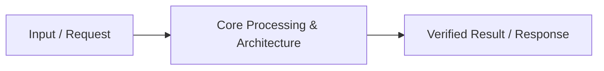

# 📹 What is an API? ｜ Introduction to APIs

<div className="video-card" style={{border: '1px solid #30363d', borderRadius: '8px', padding: '16px', marginBottom: '24px', background: 'rgba(56, 139, 253, 0.05)'}}>
  <div style={{display: 'flex', gap: '16px', flexWrap: 'wrap'}}>
    <div><strong>Instructor:</strong> Nitish Singh (CampusX)</div>
    <div><strong>Duration:</strong> 46m 37s</div>
    <div><strong>Playlist:</strong> FastAPI for ML & GenAI</div>
    <div><strong>Watch Link:</strong> <a href="https://www.youtube.com/watch?v=WJKsPchji0Q" target="_blank" rel="noopener noreferrer">YouTube Lecture ↗</a></div>
  </div>
</div>

## 📌 Executive Summary & Learning Objectives

This lecture covers **What is an API? ｜ Introduction to APIs**, focusing on production implementations, edge cases, and industry standards:
- Core intuition, architecture, and underlying mechanisms.
- Key differences between theoretical research implementations and scalable enterprise patterns.
- Concrete Python walkthroughs, error recovery, and performance optimization.

---

## 🏗️ Architecture & Conceptual Workflow



---

## 📖 Core Concepts & Technical Deep Dive

### 1. Architectural Foundations
In modern production AI engineering, **What is an API? ｜ Introduction to APIs** is essential for ensuring reliability, low latency, and deterministic outcomes. As AI systems evolve from naive prompt-in / completion-out scripts into distributed systems, engineers must handle:
- **State management & consistency:** Ensuring intermediate states and tool invocations are tracked.
- **Error boundaries & recovery:** Graceful degradation when external LLMs or vector stores encounter rate limits or network partitions.
- **Resource utilization & cost efficiency:** Caching common queries and reducing unnecessary foundation model token expenditure.

### 2. Operational Considerations
- **Latency Optimization:** Pre-computing embeddings, utilizing asynchronous non-blocking event loops, and streaming tokens via Server-Sent Events (SSE).
- **Security & Sandboxing:** Validating inputs before ingestion, sanitizing LLM outputs, and isolating tool execution environments.

---

## 💻 Production Implementation Walkthrough

```python
# Production Implementation Blueprint
def run_production_pipeline():
    print("Executing production pipeline...")

if __name__ == "__main__":
    run_production_pipeline()
```

---

## 💡 Production Best Practices & Tips

:::tip Production Deployment Guideline
When deploying What is an API? ｜ Introduction to APIs in enterprise environments, always configure automated retries with exponential backoff and telemetry tracing (such as OpenTelemetry or LangSmith).
:::

:::warning Common Failure Modes
Watch out for state contamination across concurrent requests. Ensure each session or user interaction uses an isolated thread ID or execution context.
:::

---

## 🎯 Key Takeaways & Quick Reference

| Dimension | Production Standard | Pitfall to Avoid |
| :--- | :--- | :--- |
| **Execution** | Async / Non-blocking with timeouts | Synchronous blocking calls in event loops |
| **Data Validation** | Strict Pydantic v2 schemas | Untyped dictionary access |
| **Monitoring** | Distributed tracing & latency percentiles | Relying only on standard console logs |

## ⏱️ Lecture Timeline & Key Topics

| Timestamp | Key Topic / Concept Discussed |
| :--- | :--- |
| **00:00:00** | Hi Guys, My name is Nitesh and welcome... |
| **00:11:20** | to the API and the API returns its data to the... |
| **00:23:24** | next.  So the... |
| **00:35:21** | One we will create for the... |
| **00:46:33** | ?  So see you in the next video.   Bye.... |


---

---

## 📜 Complete Lecture Transcript (English)

> **Language:** English | **Source:** `01 - What is an API？ ｜ Introduction to APIs ｜ FAST API for Machine Learning ｜ CampusX.en.srt` | **Total Segments:** 24 | **Word Count:** ~7,790 words

<details>
<summary><b>Click to expand full chronological transcript (24 timestamped intervals)</b></summary>

#### ⏱️ [00:00 ➔ 00:02]

Hi Guys, My name is Nitesh and welcome to my YouTube channel.  Now I am very happy to tell you that I am going to start a new playlist on this channel and the topic of this playlist will be API.  Now I know it might be coming to your mind that why are you suddenly going to read Hamster API.  So I do one thing.  First in this video I give you a detailed answer as to why I am going to start a new playlist on the Mainst API. So my vision for this channel is very simple. I want to create content on this channel around everything you need to learn and conquer AI.  Like to master AI, you should probably learn machine learning first.  So I've created a playlist on machine learning. You might want to learn deep learning.  So I have created a playlist around that as well. I have created a playlist around NLP. So I can proudly say that if there are 100 topics that need to be mastered to learn AI, then probably 50 of those topics will be found on our channel.  With the advent of generative AI, that task has become a bit difficult because new topics are being added on a daily basis. But still I would say that we have covered roughly 50% of the curriculum on this channel. But there are still certain areas, certain topics which are very important but we have never covered them on this channel and one of those topics is Fast API.  Now for those who don't know, let me give them a small introduction about what Fast API is and why I am calling it Socent.  So in AI you do model building. You build AI models.  You build machine learning models.  You build deep learning models.  You build generative AI models. At some point, when you start feeling that yes, now my model is giving good results and now we can present it to the customer.  So what you do is you create a website or

#### ⏱️ [00:02 ➔ 00:04]

a mobile app through which you present your model to the world.  Now, to run this website or mobile app that you have created behind the scenes, you have to create something which we call API.  Ok?  If you are from a software background then you probably already know what an API is. But in a nutshell, if you ever want to bring any machine learning model to the world, then in most likely 99% chances you will create an API of that ML model and then the same API will power your website and the same API will also power your Android app or iPhone app. Now the interesting thing is that if you go to 10 companies and ask them this question that in which framework have you built the APIs of your ML models?  So there is a good chance that nine out of 10 companies will tell you fast API in their answer. Because Fast API is a framework that helps you build highly scalable robust industry grade APIs. And in the world of ML, in the world of AI, people have adopted fast APIs very well.  Most of the companies out there whose ML products you see in the market, their API, the API of their model, is written in Fast API. So if you are a student who wants to make a career in the AI ​​space and you feel that someday in the future you will present one of your models to the world by creating its API, then it is very important for you to learn fast API. And that's why I thought of creating this playlist.  Because when I went to YouTube I saw a lot of playlists.  Lots of videos have appeared on the latest API.  But that was mostly from the software perspective.  I want to create a playlist where I cover the fundamentals of Fast APIs. But at the same time, let me show you how to do all this from the perspective of ML,

#### ⏱️ [00:04 ➔ 00:06]

and that's what we're going to do in this particular playlist.  So, I really hope you understand why I'm going to start a new playlist over the Mainst API. Ok ?  Now let's talk about what exactly we will cover in this playlist.  So I have divided this entire playlist into three parts.  Let me tell you about all three parts one by one.  So in the first part, we will cover the fundamentals of fast API. We will not talk about machine learning here. We will try to understand Fast API as a framework. So what I have planned here is that we will take a small project and with the help of that project we will learn different fundamentals of Host API.  Ok?  So this is where we will spend the most time.  Because I want your fundamentals to become strong.  Once you have strengthened your fundamentals, we will move to the second part where we will connect fast APIs and ML.  So first of all we will take a machine learning model which is already created and is performing well.  It must be giving good results and then we will build API for that using fast API and here in this entire process we will use all those principles, all those fundamentals which we have learned in Part One. Ok?  And the goal will be to somehow bring our ML model, which is working well in our Jupyter Notebook, to the world.  Be able to convert it into a fully functional API. If possible, I will also show you how to connect that API with a website here. Ok?  So, this is the second part.  Then comes part three where we will deploy this ready-made ML API using a service like AWS. Ok?  So, here I will teach you how to write industry grade code.  Here I will teach you how to Dockerize your application.

#### ⏱️ [00:06 ➔ 00:08]

And finally, I'll also show you how to take your Dockerized API application and deploy it on a service like AWS. So in a nutshell, this is the curriculum that I have followed. So you must already be understanding that we are not going too deep.  In the ecosystem of fast APIs. We are first learning the fundamentals well by staying on the surface and then we are using those fundamentals in the domain of machine learning and finally deploying it.  So if you follow this playlist end to end, it will help you in developing any kind of AI model.  Machine learning model, deep learning model, generative AI model, it does n't matter.  You can easily create APIs with the help of Fast API and deploy them on a cloud service.  Ok?  So, that is my goal with this playlist.  Now there may be one or two more questions in your mind. I try to answer them too. One question that may arise in your mind is how many videos will this entire playlist contain, how many videos will be there in this playlist and for how many days will this entire playlist last ?  Meaning when will it be completed.  So roughly, as per the estimate that I have in my mind, there will be around 15 videos in this playlist and I will cover this particular playlist a little fast and I will try to cover this playlist with in 21 days, 21 to 25 days.  So basically my target is to complete this playlist within this month.  Ok?  So I would recommend that if you start this playlist, please watch it all the way through.  I will try to be consistent and I want the same from your side that you also watch all the videos consistently and follow if possible.  Ok?  Now let's talk about today's video. I had two goals with today's video.  The first goal was to let you know that I have planned a playlist like this. I had to give you its details. But at the same time I don't want to waste this video.

#### ⏱️ [00:08 ➔ 00:10]

My plan is to start this playlist in this video itself.  So what we will do is that in today's video we will start this playlist with a very important topic. We will first understand what APIs are?  Ok?  Because whatever we do in Fast API is all related to API.  So first of all it is important that you have clarity on what an API is?  So first of all I will explain to you from the software perspective what are APIs?  What is its meaning? And then I'll explain to you from an ML perspective how APIs fit into the ML ecosystem and why they're so important.  Ok?  So now let's start the video.  So guys, let us now try to understand what exactly an API is?  First, I'll show you a definition.  After that I will explain to you what API is. So here I have written a definition. APIs are mechanisms that enable software components such as the front end and back end of an application to communicate with each other using a defined set of rules, protocols, and data formats.  In very simple words, you can imagine API as a connector.  A connector that connects two softwares. A very common example is API usage. You can pick any website.  So, as you know, in a website, there is a front end with which the user interacts, there are like forms etc. where you type comments, scroll through videos. This has become the front end component of the website.  And apart from that, there is a back end component of the website.  Where the entire behind the scenes business logic is written that if the user has asked to search, then which algorithm will we use to search or how will we interact with the database?  So all this is written in the back end.  So these are two different components of a website. So what can you do using the API

#### ⏱️ [00:10 ➔ 00:12]

?  You can connect these two components together. For example, let's take an example, suppose you went to Yumi's website and there you wanted to see courses related to AI agents, then what you will do is go to the front end, go to the search bar at the top of the website and search for AI agents, you will press enter, now what will happen at this point is that the request that you have made that you want to see the courses of AI agents, that request will be raised and will go to the API. What will the API do?  It will pick up that request and give it to the back end of Udeemmi.  Now the Udem back end will start its work.  It will go to its database and search for the courses that are based on AI agents. And then it will return the result and give it to the API and the API will bring back the same result in a certain data format and give it to our front end and the front end will then display it in front of the user. So here you can see how the API is solving this whole thing.  Ok ?  So here you are following some protocols. As this website is running, the http protocol comes into the picture here.  Here certain types of data formats come into the picture. Like when the back end returns its data to the API and the API returns its data to the front end.  So this data that is returned comes in a very specific format which we call JSON.  We will read about it further.  But you understand the flow.  So in simple words API is nothing but a connector between two pieces of software.  If you want to understand this through an analogy, then there is a very good analogy. Imagine any restaurant where you go and sit at a table as a customer and then you order food. Now the food is prepared in the kitchen and then it is brought fresh to your table. Now in this entire flow, you, the customer, should imagine yourself as the front end

#### ⏱️ [00:12 ➔ 00:14]

and the kitchen where the chef is cooking should be imagined as the back end. So I guess you can understand who is doing the API work in this entire process?  I think you guessed it right. Ah our waiter is working as an API. Because waiter is that component which is connecting our customer to our kitchen as well as our chef. So what do I do as a customer ? I will tell the waiter whatever I want to eat.  The waiter will take my request.  I will go to the kitchen and tell the chef.  The chef will do his job.  He will cook the food and that food will be given back to a waiter and the waiter will bring that food and place it on my table. Right?  So the flow here is exactly the same as it is in any of your websites.  Ok?  Here also, you can consider your menu card as a set of instructions or a protocol that you can order all these things in this restaurant and it will cost this much and it will take this much time to cook. So this became a kind of protocol which is valid in this entire system.  Ok? Then when the waiter brings the food, it will be decorated on the plate in a certain manner. Right?  So you can assume that the data is coming back in a certain type of data format. Ok?  So this is a very good analogy.  Personally, the first time I started reading APIs was around 10 years ago.  So I had read this analogy and I wanted to present this analogy before you.  So by now I hope you have understood what APIs are?  Now I feel that personally I am a firm believer that if you ever want to learn something then you should always learn why that thing exists?  Like we're just trying to learn what an API is? So I would like to also teach you why do APIs exist?

#### ⏱️ [00:14 ➔ 00:16]

What was the problem that led to the invention of API? So let us try to understand it once with the help of a very good example.  So guys, let's talk about the pre-API era.  Let's talk about a time when APIs didn't exist and a specific example. So let's talk about IRCTC the Railways.  Suppose we work for IRCTC. And currently there are no railway bookings in IRCTC. What can you do there?  You can go and find out which trains run between any two stations on a particular date. Ok?  So we have a very basic website whose very simple purpose is to give you information about which trains run between two stations. And now let's try to think a little, how will we create this website without API?  So let's think step by step.  So first of all obviously you must have a database. Where you will put all this information that these are the two stations and these are all the trains between them. Ok?  So all your information is contained into this database.  Now obviously you will need a back end system to access this database and extract results from it. So it is possible that you can write a code with the help of Python or Java in which a function is created called fetch trains. If you give two stations and a date to that function, then what that function will do is it will go to the database and search which trains run between these two stations on this particular date and it will fetch that information. You have written this function in your back end. Ok?  So the communication between your database and your back end is currently sorted.  Now obviously one last component is left in this website and that

#### ⏱️ [00:16 ➔ 00:18]

last component is how will your user interact with your website?  So there should be some kind of front end.  So what have you done?  A front end has been created.   I have created a small web page.  Where you have given a form to the user.  So there are different fields in the form. In the first field he will enter the name of the first station. Enter the name of the second station in the second field.  Will enter the date in the third field.  Will click on submit.  What is the specialty of this front end ?  That this front end is connected to your back end. Which means that when you press the submit button on the front end, that HTTP request will be generated and go directly to your back end.  will call your fetchTrans function. Your fetch train function will begin its execution.  In that process it will go to the database.   It will fetch the information and bring it back and give it to the front end.  And this is how the entire website will work.  Now here you will notice one thing that we have not used API. Still our back end and front end are able to communicate with each other. Now I know, you might be curious as to how this happened ?  We read a while ago that APIs are needed to communicate between the back end and the front end. But in this case, without API, how are the back end and front end able to communicate ?  So let me answer this to you, what happens is that when you create a website without API, you develop the entire website as a single application. What it means is that you have a single folder, a single directory and within that you have written the code for your front end and also the code for your back end.  And since all this is coming inside one application, your front end and back end are very tightly coupled.  And that is why they can communicate with each other without needing an API.  And this is the architecture where you are

#### ⏱️ [00:18 ➔ 00:20]

developing your back end also within the same directory within the same folder structure.  You are also developing your front end. It has got a very famous name. We call this monolithic architecture.  And before the advent of APIs, websites were developed with the help of monolithic architecture. Earlier, front end and back end were not two separate pieces of software.  They were part of the same software.  And we used to call this architecture monolithic architecture.  The most important feature here is that your back end and front end are very tightly coupled.  So this means that if there is any problem or any changes in any one component then it will affect your entire application. This is the biggest characteristic of monolithic architecture.  So I hope you first understood how websites were built in the pre API era. The Answer is Using Monolithic Architecture.  Now comes the question that what is the problem in monolithic architecture due to which there is a need for API. I mean this website is working right. Even today if you create a website using monolithic architecture, it will work fine.  There is no problem in that. That will work.  So what problem did you face that made you need an API ?  If any of you have done web development using PAP in the past or handled HTML files using Flask, then you will have a good idea of ​​what I am talking about. But okay, let's understand what monolithic architecture is.  Now let me tell you what problems arose in monolithic architecture.  Now the biggest thing that comes against monolithic architecture is its tightly coupled nature.   Let me explain it to you with a simple scenario. Suppose we have created our IRCTC website and have created it using monolithic architecture and the website is also working properly.  But suddenly what happened was that we were approached by some companies

#### ⏱️ [00:20 ➔ 00:22]

like Make My Trip, Yaat and Zeeo, all these companies are travel based applications.  And it also provides the same kind of features to the user.  So these companies said that look, users also come to us and ask which train will run between two stations on a particular date. But we do not have this information. This information is exclusively with IRCTC.  Because obviously it is a government based information.  So Make My Trip Travel Echo comes to IRCTC and asks them to give us access to this information. We will pay you some money on request basis.  Ok?  So now the guys at IRCTC started thinking that yes, this can be a very good business model.  We are already providing this information to our users and if other websites also need it, we will provide this information and in return we can earn money.  Right?  Now the only problem is how will we implement this thing? Technically speaking, we have to give MakeMyTrip Travel and Ekago access to the information stored in our database. Right?  Make My Trip is also a software.  Travel is also a software. Ekgo is also a software.  And now we want these three softwares to be able to access the information inside our database.  But I guess you understand that you cannot give direct access to your database to any company.  What if tomorrow they messed up something in our database. So the next option is what if we give them access to our back end. So if you remember, in our back end we had created a function called Fetch Trains, which if you give the name of two stations and a date, it will turn around and tell you which trains are running between those two stations on that date.  What if the Make My Trip software somehow interacts with this back end component.

#### ⏱️ [00:22 ➔ 00:24]

Meaning, what Make My Trip should do from here is send the names of two stations and a date.  The back end receives it and sends the response back to MakeMyTrip and MakeMyTrip shows that data to its user.  This can be a possible solution and you can do the same thing with travel also.  You can do the same thing with Ekgo also.  The only problem is that since your back end is not an independent application in itself.  It's a small part of your entire application and that part is tightly coupled with the rest of the components. That is why you cannot use this technique also.  Which means that you cannot share the information stored in your database with any third party in any way.  This information will be shared only within your own application, the monolithic application you have created.  Just think for yourself how big a restriction this is.   A company like IRCTC can earn a lot of money, but you are not able to earn that money from these different websites. Because your website is not allowing you.  And this is precisely the problem that we are talking about. This solves the exact problem with the API.  How about seeing next.  So the first step you take to solve this problem is that you stop using monolithic architecture and you decouple your applications. Which means you build your back end separately and your front end separately.  Which basically means that your back end will be a different software application and your front end will be a different software application.  So what will essentially happen is that your database will still exist.  All the information is right there.  But now you have a separate software application that you are using only for back end handling.

#### ⏱️ [00:24 ➔ 00:26]

So here that function is still written called Fetch Trains, to which if you give the name of two trains, name of two stations and a date, then it can go and fetch that information from your database. Right?  But this is an independent application now.  It is not connected to the front end.  Ok?  Now what you do is you put a layer of API in front of this back end application.  Ok? Now what is an API?  API is basically a set of end points.  Ok?  You can understand it like this that these are also some functions. But these are some special type of functions which are publicly visible to everyone on the internet and anyone can access them. Ok?  So here, let's say you created an end point by saying By the Name of Trence. So this train is nothing but a function but a special function which is available and present on the internet which means that anyone can access it by hitting its URL. Now what code did you write inside this function ?  You have written this code inside this function that as soon as someone hits this URL irctc.com then what will we do behind the scenes?  This will call the fetch train function of the back end.  Ok ?  So understand the complete flow that someone came, he hit this URL and on this URL he provided the name and date of his station. What did this function do? This function was called behind the scenes.  Now when this function is called, this function will search for information from the database and we will provide this information back to this API and what this API will do is it will send this information back to the source, so now what is the benefit that this software of yours, Make My Trip or

#### ⏱️ [00:26 ➔ 00:28]

Yatra or any other, what will it do, it will hit your API at this particular endpoint, okay, and will provide the same information. Two stations, one date.  Now this API will return it to you and hit your back end function.  The function on the back end will hit the database.  The data will be returned from the database.  Following the same path you will reach back to MakeMyTrip or Ekgo. So if you pay attention to this entire process, you have done only two things differently.  First, you decouple your back end. Detached from your front end.  Ok?  And what did you do second? With the help of this API, you made your backend publicly visible on the internet.  So, now anyone who wants to access your backend can access your backend through this route.  They cannot access your back end directly. Because your backend is not directly available on the internet.  But with the help of this API, with the help of the endpoints of this API, your back end is available on the internet. Ok?  Now here you can apply many types of constraints.  Here you can apply many types of constraints. No one should be able to send malicious information from here. You can check this in this API.  So you can apply such constraints with the help of API. So that nothing can affect your back end. Right?  So I hope you understand the big picture.  Now what is interesting is that your own front end has now become a separate independent application.  So if it also wants to communicate with your back end, it will also use the same route.  Your front end will hit this API first. Then this API will talk to the back end.  The back end will talk to the database.  Then this information will come back and reach the front end. So here your front end is not special.  Your front end will also get the same treatment that MakeMyTrip Yatra and Ekgo are getting.  But the benefit of implementing this whole thing is that now the

#### ⏱️ [00:28 ➔ 00:30]

knowledge and information that you have inside your database is available for everyone. And what can IRCTC do now?  One can easily provide the information of his database to others and in turn generate revenue.  So I hope you understand the big picture of how APIs are exactly coming into the picture and what problems they are solving.  Now let me tell you that apart from solving this problem, API solved another very big problem.  They discuss next.  Now before discussing the second problem, I want to focus a little more on one thing. So let's go back to our definition that we saw a while ago. So a while ago we saw the definition that APIs are mechanisms that enable two software components such as the front end and back end of an application to communicate with each other using a defined set of rules, protocols and data formats. Now I guess you must have understood first of all how API is working as a connector by connecting two pieces of software, one software is our IRCTC back end and the other software is our Make My Trip or Yaat or so you have understood how it is working as a connector, there were a couple of things written in the definition that this entire communication between these two softwares using API happens by following some protocols.  So here also if you notice, since I am communicating with this API like make my trip and Ekago, I am doing all this communication over the internet. So the name of the protocol we are following here is http.  One more thing I would like to tell you is that when you send a request from here to the API, the API goes and asks the back end.  The back end goes and queries the database.  When this information comes in, when the API returns the information to MakeMyTrip, this information is

#### ⏱️ [00:30 ➔ 00:32]

provided in a specific format and this data format is called JSON.  Ok?  So JSON is a special data format which you can call a universal format.  Any language can understand, process and use it.  Now let us understand why we return response in JSON. So it may be that your client applications are like Make My Trip, Yatra and Exgo here.  It may be made in different programming languages.  It could be that Make My Trip is built in Java, Yaat is built in Python, Zeeo is built in PHP. So obviously the response you have to send back from the API will have to be sent in a format that can be understood by Java, Python and PAP. And that is why we have to choose a universal data format. And that data format is JSON.  Ok?  Now you can give the JSON data to Java, Python and even Pap.  All of these languages ​​are capable of understanding JSON as well as interacting with JSON.  Ok ?  So that is why whenever you get a response from the API, it will be in JSON format. Later, when we build applications in Fast API, I will show you that when we return the response, that response will be in JSON format.  Now Jason is not a big deal.  Well if you don't know json. If you've coded in Python and you've looked at dictionaries, JSON is very, very similar.  It looks exactly the same. I'll show you later on in the code what the JSON format is. Ok?  So these are the two-three things I wanted to show you.  First of all I wanted to remind you that an API really acts as a connector between two pieces of software.  The communication of the second API takes place using some protocols. In our case it is HTTP and the third data

#### ⏱️ [00:32 ➔ 00:34]

format we are using to return the response is JSON which is a universal data format which can be understood by any programming language. The client can be created in any language, it does not matter, JSON will be understood by everyone. Now let's talk about that second problem.  Let's go back a little.  At the time of 2008-10-12, the smartphone revolution suddenly came.  So before 2008 no one had a smartphone and by 2012 everyone had a smartphone and there were different categories in smartphones also. Some people had Android phones, some people had iPhones.  So gradually companies started realizing that just one website will not suffice. To increase the business opportunity, maybe we should create an Android app along with the website and also create an iPhone app. Right?  What this will do is that we will be able to provide seamless connectivity to our users and they will be able to access our application using any of these three platforms. And you can see this thing in today's date, in 2025, if you pick up any application, most likely you will see the website of that application, you will also see the Android app, you will also see the iPhone app. Right?  So, this idea is very good from the companies' point of view.  The only problem is that its execution is very difficult.  Now the problem is that to create an Android app you have to use completely different text tags. Ok?  You use Java's text tag. Similarly, completely different text tags are used to create iPhone apps. There you use Swift programming language.  So as a company, it is a big headache for me that I have only one application but I have to create three versions of it.  Which means that for one application I have to create three applications. My website will be a monolithic application.  There will be

#### ⏱️ [00:34 ➔ 00:36]

a monolithic application of my Android app, there will be a monolithic application of my iPhone app.  Now there are a lot of problems in maintaining three applications.  The first problem is that these three applications are independent of each other. Vi means if something happens through your website then you will have to update that thing immediately for Android as well as for iPhone.  Right?  If I go and comment on someone's photo using a website.  So that comment should be visible in Android phones also. And those comments should also appear in your iPhone app.  Right?  So basically you have to do the same work at all three places. Secondly, you will need three teams to maintain three applications, which will incur additional expenses.  So there were a lot of problems in maintaining three different monolithic applications.  So what was the solution to this that people thought what if we dump the monolithic architecture and use API based architecture.  And what we should do is rather than having three databases let's have one single database.  And let's have one single back end to interact with the database.  And then we bring this back end to the internet with the help of API.  Now what will happen is we will create three different front ends. We will create the front end of our website. One we will create for the front end of our Android app and one we will create for the front end of our iOS app.  And what these three front ends will do is that whenever they need a back end, they will talk to our back end through this API and our back end will talk to the database.  Ok?  So now suddenly the entire architecture has become very simplified.  Right? You have only one database, one back end, and that is connected to all three of your front ends via an API. Right?  So now you don't need to write a separate back end. For all three applications.  You do

#### ⏱️ [00:36 ➔ 00:38]

n't need to maintain a separate database. With just one database, one back end for all three applications, you are able to handle multiple front ends.  And all this became possible because of the API architecture. Ok?  Because of this decoupling we did between the back end and the front end, you can now see this convenience.   In fact, if you go to any big company today, you will see that they use exactly this architecture. You talk about Google, you talk about Uber, you talk about Zomato.  All these companies have a single database which is connected to a back end and that back end is accessible through an API to n number of front ends.  Ok?  So I hope I was able to explain this second and bigger problem to you. So in whatever discussion we have done till now in Nutshell, we have tried to understand what API is. Why is API necessary?  Tried to understand this. Tried to understand what problems the API is solving.  And we did this entire discussion from the perspective of software.  So now that we have good command over the concept of API.  Now let's talk a little bit about the ML domain, how this principal API functions in the domain of ML (DL) generative AI. Now, in the perspective of machine learning, only one thing is different and that is that the most important thing in the software is the database where all the information is stored.  The most important thing from the perspective of MLDL is the machine learning model.  Ok? So basically you train a model on a lot of data and when you feel that yes now the model has been trained properly and is giving good results then you want to present it to the world, then around that you build the application, so to understand this ML perspective, what we will do is that again we will take an example

#### ⏱️ [00:38 ➔ 00:40]

and let's take the example of chatbot or chat GPT.  Ok?  Because right now, according to me, the most famous AI product in the world is ChartGPT.  So Chart GPT was created by Open AI and what powers Chart GPT behind the scenes are GPT models which is basically an LLM. Ok?  So what Open AI would have done is that they would have first trained their GPT model on a lot of data.  And when they felt that yes, now it is giving the right results, then they must have thought that now we can monetize this model.  You can earn money with its help.  And what's the easiest way to do that is we're going to expose this model to the world in a website form. People will go to that website and ask their questions and we will give those questions to our model.  Our model will return a reply that we will show to the user. Ok?  So basically the idea of ​​Chart GPT must have come from here.  So now let us try to understand once.  How such ML based applications were created in earlier times.  So what happened was that an ML model was trained.  It has become ML, DL or in today's date it has become generative AI.  There is no difference. You train an ML model.  Once it's trained, you store it somewhere in a binary file format.  Ok?  So this is basically a file. This is not a database.  This is a file. Now what is the speciality of this file?  That you can load it into any programming language and interact with it. So what you can do is you can actually build a back end which basically means that you will have some functions which will take data from the user and load this model and send it to it and this model will make predictions and will give the result of that prediction back to the back end.  Ok?  So you've built a back end. A where you created a function by saying slash predict.  By saying not slash just predict, you created a function.  Now obviously you will need one more thing and that is you will need a front end with which your user can interact.

#### ⏱️ [00:40 ➔ 00:42]

So the user will come to the front end and type the question as the chart comes in gpt. Clicks on submit.  We will pick up the user's query as soon as he clicks on submit.  Will send it to the back end.  The back end has the Predict function. That query will be passed to the predict function.   The predict function will load the ML model and ask it a question: what should be the answer to this query?  The ML model based on its training will give you an answer which will be received by the back end and we will send that answer back to the front end. Now again, what used to happen earlier was that we used to develop this entire flow in a single application.  Meaning you used to create your back end inside a folder.  Used to build our front end inside the same folder. Your ML model also resided in it. Ok?  So again we used to have monolithic architecture from the perspective of ML also all the development is happening inside a single file.  The back end and front end are tightly coupled and you cannot interact separately with your back end.  So now here also you will have to face the same kind of problems. Right?  Think about what could happen from the perspective of Open AI and from the perspective of GPT. When Chart GPT was launched, you must have seen how popular it became. So don't you think, at that time there would have been many companies who would have thought, what if I had access to this model.  For example, there are many companies that use automated chatbots to talk to their customers. Like SWGI happened, Zomato happened.  Now at that time their chatbots were not that good.  So their response was not that good.   The user experience of customers was poor. So Zomato must have thought after seeing the chat GPT that it would be great if I could somehow talk to this model. How much could my chatbot improve? Or there might be e-commerce companies like Amazon who might think, what if we can use this model and summarize all our reviews and

#### ⏱️ [00:42 ➔ 00:44]

show a summarized view to the user. So how much can the user experience be improved or there will be many other companies who will be thinking that what if we use this model and create a rack based system using the GPD model and can do question answering on our documents. But the problem is that since our application is following monolithic architecture. So we cannot give these external applications direct access to our model or our back end.  Right?  Because it is not possible.  So what we do here is that we bring the same API architecture. Where we layer an API just in front of our model and our back end. Ok?  And now what happens is that these are your external applications.  If there is a chatbot or any e-commerce company or someone wants to make a rack based application, then what will he do? Rather than directly interacting with the model and the back end, it will directly interact with the API.  Ok?  Again, the API will have endpoints that are publicly available on the Internet.  Anyone will hit those APIs and those APIs will turn around and hit your back end.  In the back end you have written functions that can talk to this model.  The model will give its prediction. We will send that prediction back to the API and the API will return the response in JSON format which you can display on your website, chatbot or your rack system.  So overall nothing changes, the only difference is that instead of a database, there is an ML model sitting here from which we have to get predictions and we do not want to give direct access to people to interact with this model or to interact with our back end service. And this is where API comes into the picture.  So the ML perspective is exactly the same as what you saw in software. I hope you can see this thing.  So everything is exactly the same here too.  Here also the communication is

#### ⏱️ [00:44 ➔ 00:46]

following HTTP.  Here also your data format for exchange is JSON. And here also you solve another big problem like you did at the time of software.  Let's talk about Amazon.  Ok?  What did Amazon do?  After a lot of hard work, a machine learning model was built which will work as a recommender system. Basically based on a product he will recommend more products to you.  Now what you have to do here is that you have to give the power of this recommender system, this model, to your website, to your Android app and also to your iOS app.  But again here if you make three separate apps and follow monolithic architecture then you can imagine you will have to do three times the work.  Versus if you use API architecture here also. So what you can do is you have an ML model with a back end to interact with it and you layer an API on top of it.  Now what you can do is make the front end of your website different.  Make your Android app's front end stand out.  Make your iOS front end different.  What will happen now?  Requests from these three different front ends will go to the API.  The API will transfer that request to the back end.  The back end will talk to Palt's ML model.  The ML model will give you recommendations. We will send it back in JSON format to wherever the query came from.  Wherever that query came from. So here also we are working in the same way as in software and this is the architecture followed in the industry today.  Whenever someone has to deploy an ML based application.  So I hope I was able to explain to you what APIs are ?  Why are they useful?  What problem does it solve? What is its role in end subsample ML?  The role in ML is exactly similar.  The only difference here is that instead of a database, we have a machine learning model.  Otherwise, from an architectural point of view, everything is exactly the same.

#### ⏱️ [00:46 ➔ 00:46]

So I hope you liked this first video of this series.  Even two you will know about API.  Maybe you got a little extra perspective. If you liked this video then please like it.  If you have not subscribed to this channel , please do subscribe.  See you in the next video where we will discuss what is Fast API and what are the benefits of Fast API ?  And not only that, we will learn how to setup Fast API and we will build our first API in the next video.  Ok ?  So see you in the next video.   Bye.

</details>
