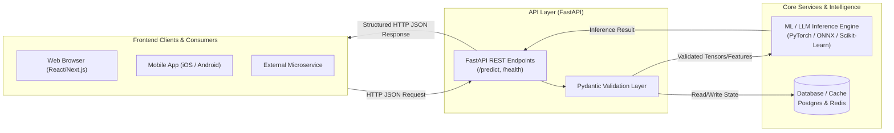

# 📹 What is an API? Introduction to APIs for AI & ML

<div className="video-card" style={{border: '1px solid #30363d', borderRadius: '8px', padding: '16px', marginBottom: '24px', background: 'rgba(56, 139, 253, 0.05)'}}>
  <div style={{display: 'flex', gap: '16px', flexWrap: 'wrap'}}>
    <div><strong>Instructor:</strong> Nitish Singh (CampusX)</div>
    <div><strong>Duration:</strong> 14m 20s</div>
    <div><strong>Course:</strong> Module 1 - Production Backend & Docker</div>
    <div><strong>Watch Link:</strong> <a href="https://www.youtube.com/watch?v=WJKsPchji0Q" target="_blank" rel="noopener noreferrer">YouTube Lecture ↗</a></div>
  </div>
</div>


## 📌 Executive Summary

An **API (Application Programming Interface)** acts as a standardized contract and communication bridge that allows two distinct software systems to exchange data and trigger actions without knowing the internal implementation details of each other.

For **AI and Machine Learning Engineers**, developing a high-accuracy model in a Jupyter Notebook is only half the battle. A model stored in memory or saved as a `.pkl` / `.onnx` weight file is useless to end-users until it is wrapped inside a robust, production-grade web API that frontend web clients, mobile apps, and distributed services can query concurrently.

---

## 🏗️ Architecture: Client-Server & API Integration



---

## 📖 Core Concepts & Technical Deep Dive

### 1. Library API vs. Web API
Not all APIs communicate over the internet:
- **Library / Internal API:** Standard programming interfaces exposed within a language runtime. For example, when calling `numpy.mean(data)` or `torch.cuda.is_available()`, you are consuming Python APIs exposed by those libraries.
- **Web API (HTTP API):** Operates over standard networking protocols (HTTP/HTTPS). Systems written in completely different programming languages (e.g., a Swift iOS app and a Python PyTorch backend) can seamlessly communicate by sending and receiving standardized JSON payloads over TCP/IP.

### 2. The Restaurant Waiter Analogy
A classic mental model for Web APIs:
- **The Client (Customer):** Browses the menu and places an order.
- **The API (The Waiter):** Receives the structured request from the customer, validates it, carries it to the kitchen, and delivers the prepared response back to the customer.
- **The Server / ML Model (The Kitchen):** Processes the raw ingredients (features, tokens) and produces the meal (prediction, generated text).

### 3. Why Machine Learning Engineers Must Master Web APIs
1. **Decoupled Architecture:** Frontends change frequently, while core ML models and inference pipelines change independently.
2. **Language Agnostic Interoperability:** Your mobile app can be in Dart/Flutter, your web UI in TypeScript, and your model backend in Python.
3. **Horizontal Scalability:** You can scale inference workers behind a load balancer independently from web servers.
4. **Security & Governance:** Protect proprietary model weights, enforce API key authentication, and rate-limit abusive traffic.

---

## 💻 Practical Code: Consuming Web APIs in Python

Below is an example of consuming an inference API programmatically using modern asynchronous Python:

```python
import httpx
import asyncio

async def query_model_endpoint(features: dict) -> dict:
    url = "https://api.example.com/v1/predict"
    headers = {"Authorization": "Bearer YOUR_SECRET_KEY"}
    
    async with httpx.AsyncClient(timeout=10.0) as client:
        response = await client.post(url, json=features, headers=headers)
        response.raise_for_status()
        return response.json()

# Example usage
sample_input = {
    "age": 42,
    "income": 85000,
    "credit_score": 720
}

# Run async query
# result = asyncio.run(query_model_endpoint(sample_input))
```

---

## 💡 Production Best Practices & Tips

:::tip Contract First Design
Always define your API input and output schemas before writing inference code. In FastAPI, defining Pydantic models first guarantees automatic OpenAPI specification generation and client code generation.
:::

:::warning Avoid Serving Directly from Notebooks
Never use temporary tunnel tools (like ngrok on Colab) for production workloads. Always package your FastAPI application in a container with a production ASGI server like Uvicorn or Gunicorn.
:::

---

## 🎯 Key Takeaways & Cheat Sheet

| Term | Definition | Importance in AI Engineering |
| :--- | :--- | :--- |
| **API** | Application Programming Interface | Standard interface connecting clients to models |
| **JSON** | JavaScript Object Notation | Universal data format for model inputs & outputs |
| **REST** | Representational State Transfer | Stateless architectural style used by 90%+ of AI services |
| **Endpoint** | A specific URL where an API receives requests | E.g., `POST /v1/chat/completions` |

