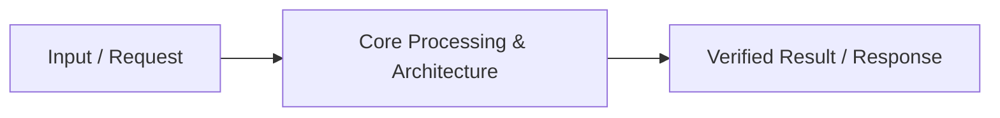

# 📹 FastAPI Philosophy ｜ How to setup FastAPI ｜ Installation and Code Demo

<div className="video-card" style={{border: '1px solid #30363d', borderRadius: '8px', padding: '16px', marginBottom: '24px', background: 'rgba(56, 139, 253, 0.05)'}}>
  <div style={{display: 'flex', gap: '16px', flexWrap: 'wrap'}}>
    <div><strong>Instructor:</strong> Nitish Singh (CampusX)</div>
    <div><strong>Duration:</strong> 42m 7s</div>
    <div><strong>Playlist:</strong> FastAPI for ML & GenAI</div>
    <div><strong>Watch Link:</strong> <a href="https://www.youtube.com/watch?v=lXx-_1r0Uss" target="_blank" rel="noopener noreferrer">YouTube Lecture ↗</a></div>
  </div>
</div>

## 📌 Executive Summary & Learning Objectives

This lecture covers **FastAPI Philosophy ｜ How to setup FastAPI ｜ Installation and Code Demo**, focusing on production implementations, edge cases, and industry standards:
- Core intuition, architecture, and underlying mechanisms.
- Key differences between theoretical research implementations and scalable enterprise patterns.
- Concrete Python walkthroughs, error recovery, and performance optimization.

---

## 🏗️ Architecture & Conceptual Workflow



---

## 📖 Core Concepts & Technical Deep Dive

### 1. Architectural Foundations
In modern production AI engineering, **FastAPI Philosophy ｜ How to setup FastAPI ｜ Installation and Code Demo** is essential for ensuring reliability, low latency, and deterministic outcomes. As AI systems evolve from naive prompt-in / completion-out scripts into distributed systems, engineers must handle:
- **State management & consistency:** Ensuring intermediate states and tool invocations are tracked.
- **Error boundaries & recovery:** Graceful degradation when external LLMs or vector stores encounter rate limits or network partitions.
- **Resource utilization & cost efficiency:** Caching common queries and reducing unnecessary foundation model token expenditure.

### 2. Operational Considerations
- **Latency Optimization:** Pre-computing embeddings, utilizing asynchronous non-blocking event loops, and streaming tokens via Server-Sent Events (SSE).
- **Security & Sandboxing:** Validating inputs before ingestion, sanitizing LLM outputs, and isolating tool execution environments.

---

## 💻 Production Implementation Walkthrough

```python
# Production Implementation Blueprint
def run_production_pipeline():
    print("Executing production pipeline...")

if __name__ == "__main__":
    run_production_pipeline()
```

---

## 💡 Production Best Practices & Tips

:::tip Production Deployment Guideline
When deploying FastAPI Philosophy ｜ How to setup FastAPI ｜ Installation and Code Demo in enterprise environments, always configure automated retries with exponential backoff and telemetry tracing (such as OpenTelemetry or LangSmith).
:::

:::warning Common Failure Modes
Watch out for state contamination across concurrent requests. Ensure each session or user interaction uses an isolated thread ID or execution context.
:::

---

## 🎯 Key Takeaways & Quick Reference

| Dimension | Production Standard | Pitfall to Avoid |
| :--- | :--- | :--- |
| **Execution** | Async / Non-blocking with timeouts | Synchronous blocking calls in event loops |
| **Data Validation** | Strict Pydantic v2 schemas | Untyped dictionary access |
| **Monitoring** | Distributed tracing & latency percentiles | Relying only on standard console logs |

## ⏱️ Lecture Timeline & Key Topics

| Timestamp | Key Topic / Concept Discussed |
| :--- | :--- |
| **00:00:00** | हाय गाइस, माय नेम इज रितेश एंड यू वेलकम... |
| **00:10:37** | एचटीटीपी रिक्वेस्ट प्रिपेयर करेगा। जहां... |
| **00:21:14** | आर बोथ Python वेब सर्वर्स बट दे केटर टू... |
| **00:31:36** | था परफॉर्मेंस, सेकंड था अ डेवलपमेंट... |
| **00:42:05** | में। बाय।... |


---

---

## 📜 Complete Lecture Transcript (Hindi / Hinglish)

> **Language:** Hindi / Hinglish | **Source:** `02 - FastAPI Philosophy ｜ How to setup FastAPI ｜ Installation and Code Demo ｜ Video 2 ｜ CampusX.hi.srt` | **Total Segments:** 22 | **Word Count:** ~7,481 words

<details>
<summary><b>Click to expand full chronological transcript (22 timestamped intervals)</b></summary>

#### ⏱️ [00:00 ➔ 00:02]

हाय गाइस, माय नेम इज रितेश एंड यू वेलकम टू माय YouTube चैनल। सो अगर आप लोगों ने मेरा लास्ट वीडियो देखा होगा तो आपको पता होगा कि वहां पर हमने डिस्कस किया था कि हम लोग एक नया प्लेलिस्ट स्टार्ट करने वाले हैं इस चैनल पे ऑन द टॉपिक ऑफस्ट एपीआई। उस वीडियो में मैंने आपको ये भी बताया था कि क्यों फास्ट एपीआई सीखना बहुत जरूरी है। अगर आप डेटा साइंस पढ़ रहे हो, एआई पढ़ रहे हो, एमएल पढ़ रहे हो। साथ ही साथ मैंने आपको एपीआई के बारे में भी एक इंट्रोडक्शन दिया था कि एपीआई होते क्या है? उनकी जरूरत क्यों पड़ी? ये सारा डिस्कशन हमने लास्ट वीडियो में किया था। अब आज का जो वीडियो है उसको हम ठीक उसी पॉइंट पर स्टार्ट करेंगे जहां पर हमने लास्ट वीडियो को छोड़ा था। आज के वीडियो में हम दो चीजें करने वाले हैं। फर्स्ट पार्ट में मैं आपको फास्ट एपीआई का एक डीप इंट्रोडक्शन दूंगा जहां पे मैं आपको समझाऊंगा कि फास्ट एपीआई होता क्या है? उसके स्ट्रेंथ्स क्या है? और क्यों आपको फास्ट एपीआई यूज़ करना चाहिए इंस्टेड ऑफ़ सम अदर फ्रेमवर्क लाइक फ्लास्क। ठीक है? और फिर सेकंड पार्ट में हम थोड़ा प्रैक्टिकली चीजें करके देखेंगे। सबसे पहले हम लोग फास्ट एपीआई को सेटअप करेंगे हमारी मशीन पे और हम अपना फर्स्ट एपीआई आज लिखेंगे। सो इतना हमें आज के वीडियो में कवर करना है। सो नाउ लेट्स स्टार्ट द वीडियो। तो चलो गाइस एक बार डिस्कस करते हैं कि फास्ट एपीआई होता क्या है? सो यहां पर मैंने एक वन लाइन डेफिनेशन लिखी है। एक बार इसको पढ़ते हैं और फिर इसके बारे में एक डिटेल्ड डिस्कशन करते हैं। सोस्ट एपीआई इज अ मॉडर्न हाई परफॉर्मेंस वेब फ्रेमवर्क फॉर बिल्डिंग एपीआई विद Python। ठीक है? बहुत ही सिंपल लाइन है बट पूरा एसेंस कैप्चर कर रही हैस्ट एपीआई का। फास्ट एपीआई सच में एक Python फ्रेमवर्क है जिसकी हेल्प से आप बहुत हाई परफॉर्मिंग इंडस्ट्री ग्रेड एपीआई बिल्ड कर सकते हो Python में। ठीक है? अब इंटरनली अगर आप बात करो कि फास्ट एपीआई बना कैसे है? तोस्ट एपीआई Python के दो बहुत फेमस लाइब्रेरीज़ के ऊपर बना हुआ है। उन दो लाइब्रेरीज़ का नाम है स्टारलेट एंड Piddantic। इसका मतलब यह है कि जो क्रिएटर थेस्ट एपीआई के उन्होंने इन दो लाइब्रेरीज को उठाया और इनको यूज करके उन्होंनेस्ट एपीआई को बिल्ड किया। ठीक है? तो एक बार

#### ⏱️ [00:02 ➔ 00:04]

समझते हैं कि एपीआई के अंदर स्टारलेट का क्या रोल है और pाइडेंटिक का क्या रोल है। पहले बात करते हैं स्टारलेट की। सो होता क्या है कि जब आप एपीआई बिल्ड करते हो तो एपीआई का काम क्या होता है कि एपीआई http रिक्वेस्ट रिसीव करता है क्लाइंट से यूजर से और उस http रिक्वेस्ट के ऊपर वो कुछ प्रोसेसिंग परफॉर्म करता है और फिर पलट के एक रिस्पांस जनरेट करता है जो कि वापस http के फॉर्म में आपके क्लाइंट के पास जाता है। राइट? तो स्टारलेट इज़ दैट लाइब्रेरी इनस्ट एपीआई।स्ट फास्ट एपीआई में स्टारलेट वो कंपोनेंट है जो यह पूरा काम करके दे रहा है। जब आप एक फास्ट एपीआई में एपीआई बनाते हो तो जो एचटीटीp रिक्वेस्ट आता है एपीआई के पास यह स्टारलेट के थ्रू रिसीव होता है और फिर जब वापस रिस्पांस जाता है तो वो भी स्टारलेट ही बना के भेजता है। सो यहां पे देखो लिखा हुआ है स्टारलेट मैनेजेस हाउ योर एपीआई रिसीव्स रिक्वेस्ट्स एंड सेंड बैक रिस्पांससेस। ठीक है? तो आई होप आपको स्टारलेट कैसे यूज़ हो रहा है फास्ट एपीआई में वो समझ में आ गया। अब बात करते हैं पाइडेंटिक की। सो pाइडेंटिक का आई गेस आपने पहले भी नाम सुना होगा। पाइडेंटिक इज अ डेटा वैलिडेशन लाइब्रेरी। यह आपको टेस्ट करके देता है कि जो डेटा आपके पास आ रहा है वो सही फॉर्मेट में है या नहीं। बिकॉज़ Python में बाय डिफॉल्ट आपका टाइप चेकिंग टाइप हिंटिंग नहीं होता। तो पाइडेंटिक की हेल्प से आप ये अचीव कर सकते हो Python में। अब ये बहुत यूज़फुल है एपीआईस बनाने के प्रोसेस में। बिकॉज़ सोच के देखो। आप जब एपीआईस बनाते हो तो आप चाहते हो कि आपका एपीआई कोई क्लाइंट यूज करे। कोई दूसरा सॉफ्टवेयर उस एपीआई को कॉल करें। अब मान लो आपने एक एपीआई बनाया जो दो स्टेशंस का नाम लेता है और एक डेट लेता है और आपको बता देता है कि उन दो स्टेशंस के बीच में उस पर्टिकुलर डेट पे कितनी ट्रेंस चल रही हैं। कौन-कौन सी ट्रेंस चल रही हैं। बट यहां पर डोंट यू थिंक एपीआई बनाने के प्रोसेस में आपको यह भी मेक श्योर करना पड़ेगा कि जो ट्रेन जो स्टेशन का नाम मुझे

#### ⏱️ [00:04 ➔ 00:06]

दिया जा रहा है वो स्ट्रिंग फॉर्मेट में है कि नहीं ये आपको चेक करना पड़ेगा। क्या वो हमारे गिवन लिस्ट ऑफ स्टेशंस में है या नहीं ये आपको चेक करना पड़ेगा। तो इस तरह का डेटा वैलिडेशन आपको खुद से करना पड़ता है जब आप एपीआईस बना रहे होते हो। बट अगर आप पाइडेंटिक यूज़ करो तो यह सारा काम बिहाइंड द सीनंस पाइडेंटिक आपके लिए कर देता है। तो बेसिकली एपीआई बनाने के प्रोसेस में जो पूरा का पूरा डेटा वैलिडेशन रिलेटेड काम है फास्ट एपीआई के अंदर वो काम पाइडेंटिक आपको करके देता है। यहां पे देखो लिखा हुआ है पाइडेंटिक इज़ यूज्ड टू चेक इफ द डेटा कमिंग इंटू योर एपीआई इज़ करेक्ट एंड इन द राइट फॉर्मेट। ठीक है? तो आई होप आपको रफली एक बड़ा पिक्चर समझ में आया कि फास्ट एपीआई इज अ वेब फ्रेमवर्क जिसकी हेल्प से आप पython में एपीआईस बना सकते हो औरस्ट एपीआई इंटरनल दो पython लाइब्रेरीज के ऊपर बना हुआ है। फर्स्ट इज़ स्टारलेट जिसकी हेल्प से आप http रिक्वेस्ट प्रोसेस करते हो और सेकंड pाइडेंटिक जिसकी हेल्प से आप डेटा वैलिडेशन परफॉर्म करते हो। ठीक है? अब मैं आपको बताता हूं कि फास्ट एपीआई की कोर फिलॉसफी क्या है? अब एक बार डिस्कस करते हैं कि फास्ट एपीआई को बनाने के पीछे क्या ऑब्जेक्टिव था। ऑब्वियसली फास्ट एपीआई के पहले भी फ्रेमवर्क्स एक्सिस्ट करते थे जिनकी हेल्प से आप Python में एपीआई बना सकते थे। फिर क्यों फास्ट एपीआई के क्रिएटर्स को ऐसा लगा कि उनको एक नया फ्रेमवर्क बनाना चाहिए। सो, इसके पीछे दो प्राइमरी रीज़ंस हैं। पहला रीजन यह है कि जो पुराने फ्रेमवर्क्स हैं जिनकी हेल्प से आप एपीआई बना सकते हो Python में उन फ्रेमवर्क्स में परफॉर्मेंस का इशू था। वि मींस कि उन एपीआईस का जो रिस्पांस टाइम होता था वो थोड़ा स्लो होता था और उसकी वजह से जो एप्लीकेशनेशंस आप बनाते थे उनको यूज करके वो थोड़ा स्लो चलते थे और लेटेंसी इशूज़ होते थे और यह एक इंडस्ट्री ग्रेड एप्लीकेशन के लिए सही बात नहीं है। सेकंड जो प्रॉब्लम थी वो यह थी कि पुराने फ्रेमवर्क्स को यूज़ करके जब आप एपीआई का

#### ⏱️ [00:06 ➔ 00:08]

कोड लिखते थे तो वो कोड लिखने में आपको काफी मेहनत करनी पड़ती थी। लाइक बहुत सारा बोईलर प्लेट कोड होता था और बहुत सारा अननेसेसरी कोड आपको लिखना पड़ता था इन ऑर्डर टू रन योर एपीआई इफेक्टिवली। तो फास्ट एपीआई को बनाने के पीछे यही दो कोर फिलॉसफीज़ हैं।स्ट एपीआई की पहली कोर फिलॉसफी है कि फास्ट एपीआई में बनाई गई एपीआईस फास्ट टू रन होंगी। मतलब दे विल बी वेरी फास्ट। दे विल बी एबल टू हैंडल कॉनकरेंट यूज़र्स एंड देयर विल बी वेरी लेस लेटेंसी। ठीक है? एंड द सेकंड कोर फिलॉसफी ऑफ़ फास्ट एपीआई इज कि फास्ट एपीआई में बनाई हुई एपीआई विल बी फास्ट टू कोड। मतलब वो बनाने का जो प्रोसेस है एपीआई को वो बहुत फास्ट होगा। बहुत कम लाइंस ऑफ कोड में बहुत अच्छे तरीके से एपीआई को बिल्ड कर पाओगे। तो ये जो दो चीजें हैं, यही दो आपकी कोर फिलॉसोफीज़ हैं फास्ट एपीआई की। एंड दैट इज़ व्हाई जो क्रिएटर्स हैं, उन्होंने इस लाइब्रेरी इस फ्रेमवर्क का नाम एपीआई रखा। ये जो नाम में फास्ट है वो इसीलिए है बिकॉज़ फास्ट एपीआई में बनाई हुई एपीआई फास्ट होती हैं टू रन एंड उनको बनाने का जो प्रोसेस होता है कोड करने का जो प्रोसेस होता है वो भी बहुत फास्ट होता है। ठीक है? तो अब मैं क्या करूंगा? मैं इन दोनों को फिलॉसोफीस के बारे में एक-एक करके डिस्कस करूंगा। पहले मैं आपको एग्जैक्टली थोड़ा सा एक डीप टाइप दूंगा कि कैसे फास्ट एपीआई में बनी हुई एपीआईस फास्ट होती है रन करने में और फिर मैं आपको समझाऊंगा कि कैसे कोड करना भी फास्ट होता है फास्ट एपीआई में। ठीक है? तो, लेट्स स्टार्ट विद द फर्स्ट कोर फिलॉसफी। अब यह फास्ट टू रन वाली फिलॉसफी समझने के लिए पहले हमें थोड़ा सा बिहाइंड द सीन समझना पड़ेगा कि एक एपीआई काम कैसे करती है। ठीक है? तो एक एग्जांपल सेटअप लेते हैं। मान लो हम एक मशीन लर्निंग मॉडल के लिए एपीआई बिल्ड कर रहे हैं। और इस एपीआई में हमने एक प्रेडिक्ट बोल करके स्लैश

#### ⏱️ [00:08 ➔ 00:10]

प्रेडिक्ट बोल करके एंड पॉइंट बनाया है। अगर आप इस एंड पॉइंट पे दो इनपुट्स देते हो। फीचर वन का कुछ वैल्यू और फीचर टू का कुछ वैल्यू तो यह एंड पॉइंट आपको पलट करके एक प्रेडिक्शन देगा। ठीक है? तो, हमने क्या किया? हमने यह एपीआई का एंड पॉइंट बनाया और इसको उठा के एडब्ल्यूएस के ऊपर डिप्लॉय कर दिया। ठीक है? अब यहां पे आपको एक चीज समझनी पड़ेगी कि जब हम यह बोलते हैं कि हमने किसी एपीआई को उठा के एडब्ल्यूएस जैसी क्लाउड सर्विस पे डिप्लॉय कर दिया तो इसका मतलब क्या होता है? इसका मतलब यह होता है कि आप एसेंशियली दो चीजें एडब्ल्यूएस के ऊपर भेज रहे हो। पहला है आपके एपीआई का कोड जहां पर आपने यह लिखा हुआ है कि यह दो फीचर वैल्यू्यूज आपको मिलेंगी। आप मॉडल को लोड करोगे। उसको कॉल करके प्रेडिक्शन जनरेट करोगे और रिस्पांस रिटर्न करोगे। ये सारा कोड एपीआई के कोड में लिखा हुआ है। ठीक है? द सेकंड कंपोनेंट ऑफ एन एपीआई इज़ द वेब सर्वर। तो एपीआई के साथ-साथ आपके पास एक वेब सर्वर भी होता है। तो यह वेब सर्वर का काम क्या है? कि ये एडब्ल्यूएस की जो मशीनंस हैं जिसके ऊपर हमारा कोड रन कर रहा है उन मशीनंस के पोर्ट्स की हेल्प से हमेशा यह सुनने की कोशिश करता है कि क्या कोई नया http रिक्वेस्ट उसके पास आ रहा है कि नहीं। ठीक है? तो कभी भी किसी भी एपीआई में दो इंपॉर्टेंट कंपोनेंट्स हैं। पहला द कोड ऑफ द एपीआई जिसकी हेल्प से आप जो भी बिनेस लॉजिक है उसको इंप्लीमेंट करते हो। एंड सेकंड इज द वेब सर्वर जिसकी हेल्प से आप किसी भी क्लाइंट का इनकमिंग एचटीटीपी रिक्वेस्ट प्रोसेस कर पाते हो। तो अब इस सिनेरियो में एक बार समझते हैं कि पूरा का पूरा जो फ्लो ऑफ इंफॉर्मेशनेशन है वो कैसे काम कर रहा है। ठीक है? तो हमने हमारी एपीआई को एडब्ल्यूएस पे डिप्लॉय कर दिया। हमारा कोड एडब्ल्यूएस पे है। हमारा वेब सर्वर एडब्ल्यूएस के ऊपर रन कर रहा है। अब मान

#### ⏱️ [00:10 ➔ 00:12]

लेते हैं कि कोई बंदा आया और उसने हमारे इस एंड पॉइंट को हिट किया। ठीक है? तो उसने फीचर वन की ये वैल्यू डिसाइड की। फीचर टू की ये वैल्यू डिसाइड की और ये वैल्यूस को उसने भेज दिया एपीआई के पास। तो बिहाइंड द सीन क्या होगा सबसे पहले कि उस बंदे की मशीन से जो रिक्वेस्ट निकलेगी उसको आप एक http रिक्वेस्ट का फॉर्म दोगे। ठीक है? तो होगा क्या कि बिहाइंड द सीन्स उसका जो ब्राउज़र है या फिर अगर वो पोस्टमैन जैसा सॉफ्टवेयर यूज़ कर रहा है तो वो ब्राउज़र वाला सॉफ्टवेयर क्या करेगा? एक एचटीटीपी रिक्वेस्ट प्रिपेयर करेगा। जहां पे अपार्ट फ्रॉम फीचर वैल्यूज़ और भी कुछ इंपॉर्टेंट इंफॉर्मेशन हमारे पास भेजा जाएगा एपीआई के पास। जैसे कि जो रिक्वेस्ट है उसका नेचर है कि वो पोस्ट है। सेकंड हम इस एपीआई को हिट करना चाहते हैं। इस एंड पॉइंट को हिट करना चाहते हैं। दिस इज अ http रिक्वेस्ट। आपका होस्ट का यूआरएल, कंटेंट का टाइप, कंटेंट का लेंथ ये सारा इंफॉर्मेशन पैक इन किया जाएगा। और ये एचटीटीपी रिक्वेस्ट फाइनली कहां पहुंचेगी? हमारे वेब सर्वर के पास। ठीक है? अब हमारे वेब सर्वर का काम क्या है? कि वह इस रिक्वेस्ट को हमारे एपीआई के कोड के पास भेजेगा। ठीक है? और फिर हमारा एपीआई का कोड क्या करेगा? इसमें से फीचर वाली वैल्यूज़ को एक्सट्रैक्ट करके प्रेडिक्शन जनरेट करेगा। बट देयर इज़ वन प्रॉब्लम। द प्रॉब्लम इज़ दिस कि ये जो रिक्वेस्ट है, यह एक http रिक्वेस्ट है। ठीक है? और इस रिक्वेस्ट को Python नहीं समझ सकता। और अनफॉर्चूनेटली हमारा जो एपीआई का कोड है वह Python में लिखा हुआ है। वि मींस कि हमें बीच में एक ट्रांसलेटर की जरूरत पड़ेगी जो कि क्या करेगा जो कि इस http रिक्वेस्ट को इस फॉर्म में कन्वर्ट करेगा। ठीक है? सो यहां से जो इंफॉर्मेशनेशन काम का है उसको आप पython अंडरस्टैंडेबल फॉर्मेट में कन्वर्ट करोगे। सो दैट Python

#### ⏱️ [00:12 ➔ 00:14]

का ये फंक्शन या ये एंड पॉइंट इस इंफॉर्मेशन को प्रोसेस कर पाए। तो यह काम करने के लिए हमारे पास एक चीज होती है बीच में जिसको हम एसजीआई बोलते हैं। एसजीआई का फुल फॉर्म होता है सर्वर गेटवे इंटरफेस। यह कंपोनेंट का बस इतना ही काम है कि यह आपके वेब सर्वर और आपके एपीआई कोड के बीच में टू वे कम्युनिकेशन इस्टैब्लिश करता है। ठीक है? तो हुआ क्या पूरे प्रोसेस में कि क्लाइंट ने एक http रिक्वेस्ट भेजा जो हमारे वेब सर्वर ने रिसीव किया। अब ये रिक्वेस्ट को हम डायरेक्टली एपीआई के पास ना भेज के पहले एसजीआई के पास भेज रहे हैं। एसजीआई ने क्या किया? इस डेटा फॉर्मेट से इस डेटा फॉर्मेट में चीजों को कन्वर्ट किया। सो दैट Python समझ पाए। अब ये चीज हम अपने Python कोड के पास भेज रहे हैं। अब Python का जो कोड है वो इन फीचर वैल्यूज़ को लेगा और अपने फंक्शन के अंदर भेजेगा। फंक्शन अपना काम स्टार्ट करना शुरू करेगा। वो एमएल मॉडल को कॉल करेगा, प्रिडिक्ट फंक्शन को कॉल करेगा और एक रिजल्ट जनरेट करेगा। मान लो यह रिजल्ट हमारे पास ये आया। दिस इज द प्रेडिक्शन आउटपुट। ठीक है? अभी भी काम पूरा नहीं हुआ है। अब हमें क्या करना है? इस प्रेडिक्शन को वापस क्लाइंट के पास भेजना है। बट अगेन यहां पे ये जो आउटपुट आया है, यह Python अंडरस्टैंडेबल आउटपुट है। http इसको नहीं समझ सकता। तो यहां पे फिर से एसजीआई बीच में आएगा और वो क्या करेगा? इस Python फॉर्मेट को वापस HTTP रिक्वेस्ट में कन्वर्ट करेगा और अब आपका आउटपुट ऐसा दिखाई दे रहा है। आपको एक 200 hटीtp स्टेटस कोड मिला। वि मींस सारा काम सही से हो गया। कंटेंट टाइप आपने बताया और आपने बहुत अच्छे से पूरा का पूरा इंफॉर्मेशन पैकेज करके वापस भेज दिया अपने वेब सर्वर के पास और वेब सर्वर वापस इस रिक्वेस्ट को भेज देगा क्लाइंट के पास। सो दिस इज हाउ द एंटायर एपीआई इंफॉर्मेशन फ्लो वर्क्स। ठीक है?

#### ⏱️ [00:14 ➔ 00:16]

वेब सर्वर एसजीआई एपीआई कोड। आई होप आपको यह बात समझ में आ गई। अब मैं आपको दिखाता हूं कि यह एग्जैक्ट फ्लो फ्लास्क जैसी सर्विस कैसे यूज़ करती है। फ्लास्क एक बहुत फेमस फ्रेमवर्क है जिसकी हेल्प से आप वेबसाइट्स, एपीआईस बना सकते हो Python में और यह एक बहुत पुराना फ्रेमवर्क है। तो, हम क्या करेंगे? हम पहले फ्लास्क को स्टडी करेंगे और फिर फ्लास्क को कंपेयर करेंगे। एपीआई से टू रियली अंडरस्टैंड किस्ट एपीआई आपको क्या बेनिफिट्स प्रोवाइड कर रहा है। सो फ्लास्क के केस में यह जो पूरा का पूरा फ्लो मैंने अभी आपको बताया वो होता तो एग्जैक्टली सेम है। बस जो कंपोनेंट्स होते हैं वो मैं आपके साथ डिस्कस करता हूं। सो यहां पर सबसे पहले जो आप एसजीआई यूज़ करते हो सर्वर गेटवे इंटरफ़ेस वो होता है डब्ल्यूएसजीआई। ठीक है? डब्ल्यूएसजीआई का फुल फॉर्म होता है वेब सर्वर गेटवे इंटरफ़ेस। अगर आप एक बार Google करोगे तो आपको बताया जाएगा कि डब्ल्यूएसजीआई स्टैंड्स फॉर वेब सर्वर गेटवे इंटरफ़ेस अ स्पेसिफिकेशन दैट स्टैंडर्डाइजेस हाउ वेब सर्वर्स एंड Python वेब एप्लीकेशनेशंस और फ्रेमवर्क्स कम्युनिकेट। एग्जैक्टली वही बात जो मैंने आपको बताई। ठीक है? तो एक्चुअली यहां पर मैं आपको बता ही देता हूं कि एसजीआईस दो तरीके के होते हैं। एक होता है डब्ल्यूएसजीआई जो फ्लास्क के अंदर आपको देखने को मिलेगा और एक होता है एएसजीआई जो आपको फास्ट एपीआई के अंदर देखने को मिलेगा। ठीक है? तो फ्लास्क में डब्ल्यूएसजीआई प्रोटोकॉल यूज़ हो रहा है टू कम्युनिकेट बिटवीन द वेब सर्वर एंड द एपीआई कोड। द बिगेस्ट प्रॉब्लम विद डब्ल्यूएसजीआई इज ये कम्युनिकेशन तो सही से करके देता है बट द बिगेस्ट डिसएडवांटेज ऑफ डब्ल्यूएसजीआई इज़ कि ये सिंक्रोनस नेचर का होता है। ठीक है? एंड इट फॉलोस अ ब्लॉकिंग आर्किटेक्चर एंड दिस कैन लीड टू स्लोअर रिक्वेस्ट प्रोसेसिंग एंड स्केलेबिलिटी चैलेंजेस। सो बेसिक फंडा क्या है कि यह जो डब्ल्यूएसजीआई प्रोटोकॉल है जो हम फ्लास्क में फॉलो कर रहे हैं यह सिंक्रोनस नेचर फॉलो कर रहा है। व्हिच मींस कि आप एक बार में एक ही रिक्वेस्ट

#### ⏱️ [00:16 ➔ 00:18]

प्रोसेस कर सकते हो। ठीक है? तो मान लो आपके पास पांच क्लाइंट्स हैं। सबने इस वेब सर्वर पे अपना-अपना एचटीटीपी रिक्वेस्ट भेजा। अब आपको क्या करना है? इस डब्ल्यूएसजीआई के हेल्प से इन सारे रिक्वेस्ट को पython अंडरस्टैंडेबल कोड में कन्वर्ट करना है। बट यह सारा काम पैरेलली नहीं हो सकता है। आप वन यूजर एट अ टाइम करोगे तो ये सिंक्रोनस होता है। एंड देयर इज़ अ ब्लॉकिंग नेचर। ब्लॉकिंग नेचर का मतलब जब एक रिक्वेस्ट प्रोसेस हो रहा है, कन्वर्ट हो रहा है, ट्रांसलेट हो रहा है, तो उस टाइम पे दूसरा वाला जो रिक्वेस्ट है वो वेट करेगा। बिकॉज़ जो आपके रिसोर्सेज हैं वो ब्लॉक्ड हैं। ठीक है? तो आई होप आपको सबसे पहली चीज समझ में आ गई कि फ्लास्क में जो एसजीआई आप यूज कर रहे हो दैट इज डब्ल्यूएसजीआई व्हिच इज ऑफ सिंक्रोनस नेचर। ठीक है? अब यहां पर एक चीज आपको और समझनी है कि ये जो एसजीआई है या फिर डब्ल्यूएसजीआई है दीज़ आर प्रोटोकॉल्स। प्रोटोकॉल्स एज इन सेट ऑफ रूल्स कि कैसे आप एक फॉर्मेट की चीज को दूसरे फॉर्मेट में कन्वर्ट कर रहे हो। बट इस प्रोटोकॉल को इंप्लीमेंट करने के लिए आपको किसी लाइब्रेरी की जरूरत होती है। ठीक है? तो फ्लास्क के केस में हम जो लाइब्रेरी यूज करते हैं वो है वर्क। आई डोंट नो इसको कैसे प्रोनाउंस करते हैं। अ सो वर्कzuक इज अ कॉम्प्रिहेंसिव डब्ल्यूएसजीआई वेब एप्लीकेशन लाइब्रेरी। ठीक है? तो फ्लास्क डब्ल्यूएसजीआई इंप्लीमेंट करने के लिए वर्क ज़Uक यूज़ कर रहा है। इनफैक्ट कभी आप फ्लास्क इंस्टॉल करोगे तो आपको दिखाई भी देगा कि बिहाइंड द सींस ये पर्टिकुलर लाइब्रेरी भी इंस्टॉल हो रही होती है। ठीक है? अ एक चीज और यहां पे जो वेब सर्वर आप यूज़ करते हो फ्लास्क में ये वेब सर्वर का नाम होता है G यूनिकॉर्न। ठीक है? और इसके बारे में भी अगर आप एक बार सर्च करो तो यहां पे देखो आपको लिखा हुआ मिलेगा कि जी यूनिकॉर्न इज अ डब्ल्यूएसजीआई एचtटीp सर्वर स्पेसिफिकली डिज़ फॉर Python वेब एप्लीकेशनेशंस नोन फॉर इट्स एफिशिएंसी एंड स्केलेबिलिटी। यह सर्वर सही से काम करता है। बट इसमें भी सेम प्रॉब्लम है। इसका डिसएडवांटेज ये है

#### ⏱️ [00:18 ➔ 00:20]

कि अगेन बिकॉज़ ये WSI पे बेस्ड है। तो इट मींस ये सिंक्रोनस तरीके से प्रोसेसिंग करेगा। जिसकी वजह से इस सर्वर में थोड़े लेटेंसी इशूज़ होते हैं। अगेन इफ यू गो एंड सर्च यू विल फाइंड आउट कि थोड़े परफॉर्मेंस इशूज़ रहते हैं इस सर्वर में इंक्लूडिंग आईओ वेट टाइम्स एंड हाई लेटेंसी। ठीक है? तो कभी भी बहुत स्केलेबल एपीआई अगर आप बनाना चाहते हो तो जी यूनिकॉर्न थोड़ा सा स्ट्रगल करता है। ठीक है? तो अभी तक का सेटअप आपको समझ में आ रहा है फ्लास्क में। द सर्वर दैट वी आर यूजिंग इज़ जी यूनिकॉर्न। द एसजीआई प्रोटोकॉल दैट वी आर यूजिंग इज डब्ल्यूएसजीआई एंड डब्ल्यूएसजीआई को इंप्लीमेंट करने के लिए जो लाइब्रेरी फ्लास्क यूज़ कर रहा है उसका नाम है वर्क। ठीक है? और एपीआई कोड की अगर आप बात करो तो यहां पर जो कोड आप लिखते हो ये भी सिंक्रोनस नेचर का होता है। ठीक है? बेसिकली सिंपल पाइथन कोड होता है जो एक बार में एक ही रिक्वेस्ट प्रोसेस कर सकता है। ठीक है? तो आई होप आपको फ्लास्क का सेटअप समझ में आ गया। और ऑन द होल आपको फ्लास्क की बुराई भी समझ में आ गई कि मोस्टली जो पूरा का पूरा रिक्वेस्ट प्रोसेसिंग है वो सिंक्रोनस इन नेचर है। तो मल्टीपल ककरेंट रिक्वेस्ट आप प्रोसेस नहीं कर सकते। अब एक काम करते हैं इस पूरे सेटअप को कंपेयर करते हैंस्ट एपीआई के साथ कि फास्ट एपीआई इस पूरी चीज में क्या डिफरेंटली कर रहा है। सोस्ट एपीआई तीन एस्पेक्ट्स में फ्लास्क से डिफरेंट है। सो पहला एस्पेक्ट यह है कि यहां पे आप जो एसजीआई प्रोटोकॉल यूज़ कर रहे हो सर्वर गेटवे इंटरफ़ेस प्रोटोकॉल वो डब्ल्यूएसजीआई ना हो करके एएसजीआई है। ठीक है? एएसजीआई का फुल फॉर्म होता है असिंक्रोनस सर्वर गेटवे इंटरफेस। सो अगेन अगर आप Google करोगे तो आपको यहां पे दिखाई देगा मैंने सर्च किया एएसजीआई वर्सेस डब्ल्यूएसजीआई। तो यहां पे लिखा हुआ है डब्ल्यूएसजीआई इज़ एन ओल्डर सिंक्रोनस इंटरफ़ेस फॉर Python वेब एप्लीकेशनेशंस। व्हाइल एसजीआई इज़ अ न्यू ईयर अ सिंक्रोनस इंटरफ़ेस दैट्स बेटर सूटेड फॉर मॉडर्न वेब एप्लीकेशनेशंस लाइक दोज़ यूज़िंग वेब सॉकेट्स और रियल टाइम फीचर्स। ठीक है? तो द बिगेस्ट फीचर दैट

#### ⏱️ [00:20 ➔ 00:22]

एएसजीआई हैस इज कि इट कैन डू कॉनकरेंट प्रोसेसिंग। एक साथ मल्टीपल रिक्वेस्ट प्रोसेस कर सकते हो आप एएसजीआई की हेल्प से। ठीक है? अ सेकंड जो डिफरेंट है डिफरेंस है सेकंड नहीं बोलूंगा एग्जैक्टली फर्स्ट वाले का ही पार्ट है कि यहां पर आप जो लाइब्रेरी यूज़ करते हो टू इंप्लीमेंट एएसजीआई उसका नाम है स्टारलेट जो मैंने आपको थोड़ी देर पहले स्लाइड में भी दिखाया था। दिस इज़ द लाइब्रेरी। ठीक है? द लिटिल एएसजीआई फ्रेमवर्क दैट शाइन। सो एएस स्टारलेट इज दैट लाइब्रेरी जो एएसजीआई को इंप्लीमेंट कर रहा है फास्ट एपीआई के अंदर। और ऑब्वियसली अ दिस इज़ अ सिंक्रोनस इट कैन हैंडल मल्टीपल कॉनकरेंट रिक्वेस्ट्स। ठीक है? अ सेकंड पॉइंट ऑफ़ डिफरेंस बिटवीन फ्लास्क एंड फ़ास्ट एपीआई इज़ कि यहां पे जो वेब सर्वर आप यूज़ करते हो फ़ास्ट एपीआई में उसका नाम है यूवीकॉन। ठीक है? फ्लास्क में इट वास जी यूनिकॉर्न यहां पे यू आर यूजिंग यूवीकॉर्न अगेन यूवीकॉर्न की खास बात क्या है कि इट इज़ असिंक्रोनस लाइक इट कैन हैंडल मल्टीपल पैरेलल रिक्वेस्ट यहां पे देखो मैंने फिर से सर्च किया यूवीकॉन वर्सेस gun एंड यहां पे लिखा हुआ है यूवीकॉन एंड जी यूनिकॉर्न आर बोथ Python वेब सर्वर्स बट दे केटर टू डिफरेंट यूज़ केसेस यूवीकॉन इज़ अ हाई परफॉर्मेंस एएसजीआई सर्वर नॉट WSGI व्हाइल G यूनिकॉर्न इज़ अ मैच्योर डब्ल्यूएसजीआई सर्वर और बेसिक डिफरेंस इज़ कि यूवीकॉन इज़ जनरली प्रेफर्ड फॉर इट्स हाई परफॉर्मेंस एंड असिंक्रोनस कैपेबिलिटीज़। आई होप आपको समझ में आ गया। तो दिस इज़ द सेकंड पॉइंट ऑफ़ डिफरेंस। एंड फाइनली द थर्ड पॉइंट ऑफ़ डिफरेंस इज़ किस्ट एपीआई सपोर्ट्स अ सिंक एंड अ वेट फीचर ऑफ़ Python. अब आई डोंट नो आपने यह पर्टिकुलर फीचर कभी पढ़ा है या यूज़ किया है कि नहीं Python में। बट Python में आप अ सिंक अवेट अ का फीचर इंप्लीमेंट

#### ⏱️ [00:22 ➔ 00:24]

करके अ पैरेलल प्रोसेसिंग करवा सकते हो। ठीक है? सो होता क्या है कि मान लो आपका एक रिक्वेस्ट आया जो आपके एंड पॉइंट ने रिसीव किया। अब यहां पर आपको प्रेडिक्शन करने के लिए क्या करना था कि एमएल मॉडल से प्रेडिक्शन को मांगना था। आप ML मॉडल को इनपुट भेज रहे थे। ML मॉडल पलट के आपको आउटपुट दे रहा था। तो आप थोड़ी देर के लिए मान लेते हैं कि एमएल मॉडल अपना प्रेडिक्शन जनरेट करने में थोड़ा टाइम लगाता है। ठीक है? तो अगर आप यहां पे नॉर्मल कोड लिखोगे तो होगा क्या कि आपका रिक्वेस्ट आया आपकी एपीआई के पास। आपके एपीआई ने उस रिक्वेस्ट को भेजा एमएल मॉडल के पास। एमएल मॉडल अपना काम कर रहा है अभी। तो इस स्टेज में क्या होगा कि नॉर्मल कोड वाला जो एपीआई है वो वहीं पर रुक जाएगा। वो कोई और रिक्वेस्ट प्रोसेस नहीं करेगा। जब तक एमएल मॉडल का रिस्पांस वापस नहीं आता तब तक आपका एपीआई इज सर्विंग नो अदर रिक्वेस्ट। ठीक है? फिर एमएल मॉडल का रिस्पांस आया तो आपने पलट करके रिस्पांस कंप्लीट किया। फिर नेक्स्ट रिस्पांस को लिया। बट अगर आप असिंक अवेट यूज़ कर रहे हो तो इसमें क्या हो रहा है कि आपने प्रेडिक्शन करते टाइम यहां पे अवेट को कॉल किया। व्हिच बेसिकली मींस कि ये पर्टिकुलर ऑपरेशन करते टाइम अगर ज्यादा टाइम लग रहा है तो इस टाइम इंटरवल में भी आप क्या कर सकते हो? दूसरे रिक्वेस्ट को जाके हैंडल कर सकते हो। ठीक है? तो इसी फीचर को बोला जाता है असिंक अवेट। तो बिकॉज़ ऑफ दिस फीचर ये जो पूरा का पूरा पाइपलाइन आपको दिखाई दे रहा है, यह असिंक्रोनस बन जाता है। जहां पर आप एक साथ मल्टीपल रिक्वेस्ट कॉनकरेंट रिक्वेस्ट प्रोसेस कर पा रहे हो। ठीक है? एंड दिस इज़ द मेन रीज़न व्हाई फास्ट एपीआई इज़ फास्ट टू रन। यही हम डिस्कस करने आए थे कि क्यों फास्ट एपीआई इज फास्ट टू रन? क्यों फास्ट एपीआई में बनी हुई एपीआईस परफॉर्मेंस अच्छा होता है उनका। वो फास्ट रन करती हैं? इट्स मोस्टली बिकॉज़ ऑफ़ दिस। बिकॉज़ यहां पे जो सारे कंपोनेंट्स यूज़ हो रहे हैं दे आर असिंक्रोनस इन नेचर। द वेब सर्वर UVN इज़ अ सिंक्रोनस इन नेचर। द एसजीआई फ्रेमवर्क

#### ⏱️ [00:24 ➔ 00:26]

दैट यू आर यूज़िंग एएसजीआई इज़ अ सिंक्रोनस। अह Starlet हेल्प्स इन अ सिंक्रोनस एएसजीआई। एंड द एपीआई कोड दैट यू कैन राइट दैट आल्सो सपोर्ट्स अ मल्टी थ्रेडिंग का कांसेप्ट। ठीक है? मल्टी प्रोसेसिंग का कांसेप्ट। सो आई होप आपको मैं थोड़ा लंबा रास्ता लेके मैंने समझाने की कोशिश की बट समझा पाया कि कैसे एक ट्रेडिशनल फ्रेमवर्क जैसे कि फ्लास्क है उसके कंपैरिजन में कैसे फास्ट एपीआई परफॉर्म्स बेटर इन टर्म्स ऑफ़ परफॉर्मेंस। अब अगर आप एक कंप्लीट बिगिनर हो और अगर आपको यह पूरा टेक्निकल डिस्कशन समझ में नहीं आया तो मैं आपको एक सिंपल एनालॉजी के थ्रू समझाता हूं कि कैसे फास्ट एपीआई इज़ बेटर। सो इफ यू रिमेंबर लास्ट वीडियो में मैंने आपको एक एग्जांपल दिया था एपीआई समझाने के लिए कि कैसे आप एपीआई को एक रेस्टोरेंट के एग्जांपल से समझ सकते हो। जहां पर जो कस्टमर है वो आपका क्लाइंट है जो आर्डर प्लेस कर रहा है। आपका जो किचन है वो आपका बैक एंड लॉजिक है जो खाना बना करके कस्टमर को खिला रहा है और इन दोनों के बीच का कम्युनिकेशन का वेटर कर रहा है। राइट? वेटर आके ऑर्डर ले रहा है। किचन में बता रहा है। किचन से खाना लेकर के वापस कस्टमर को सर्व कर रहा है। आई होप आपको यह एग्जांपल याद है। तो अगर आप फ्लास्क की बात करो तो फ्लास्क को आप एक ऐसे वेटर की तरह समझ सकते हो जो कस्टमर से आर्डर लेके किचन में जाता है और ऑर्डर किचन में देता है और फिर वहीं पर खड़ा हो जाता है। जब तक ऑर्डर बनता नहीं है तब तक वह किसी और कस्टमर से जाके ऑर्डर नहीं लेता। ठीक है? तो पूरा फ्लो ऐसा है कि कस्टमर ने फ्लास्क एज इन वेटर को अपना आर्डर दिया। वेटर किचन में गया। वहां पर जाकर उसने शेफ को बताया यह बनाना है और वहीं बैठ गया। शेफ ने टाइम लगा के खाना बनाया। खाना बना के वेटर को दिया। वेटर ने खाना ला के कस्टमर को दिया। एक रिक्वेस्ट कंप्लीट हुई। अब वह दूसरे कस्टमर के पास गया और उसने यह सेम प्रोसेस कंटिन्यू किया। ऑब्वियसली इसमें आप समझ पा

#### ⏱️ [00:26 ➔ 00:28]

रहे हो कि टाइम वेस्टेज हो रहा है। फास्ट एपीआई को आप एक ऐसे वेटर की तरह समझ सकते हो जो कस्टमर के पास आता है, रिक्वेस्ट लेता है, ऑर्डर लेता है, किचन में जाता है, ऑर्डर देता है और उसको यह पता है कि अभी ऑर्डर बनने में टाइम लगेगा। तो, इस पूरे प्रोसेस में मैं क्या कर सकता हूं? मैं दूसरे कस्टमर का जाके ऑर्डर उठा सकता हूं और वह जाके दूसरे कस्टमर का ऑर्डर उठा के लाता है। उसको भी किचन में देता है। इसी बीच फर्स्ट वाला ऑर्डर बन चुका होता है। तो फर्स्ट वाला ऑर्डर उठाता है और फर्स्ट कस्टमर को लाके उसके टेबल पे दे देता है। और वह इस तरीके से पूरा काम करते रहता है इन असिंक्रोनस फैशन। ठीक है? तो दिस इज़ द मेन डिफरेंस बिटवीन फ्लास्क एंड फ़स्ट एपीआई। एंड दिस इज़ द रीज़न व्हाई फ़स्ट एपीआई इज़ फास्ट टू रन। ठीक है? सो आई होप इस एनालॉजी से आप एटलीस्ट अच्छे से समझ पा रहे होंगे। अब बात करते हैंस्ट एपीआई की दूसरी कोर फिलॉसफी के बारे में दैटस्ट एपीआई इज रियली फास्ट टू कोड। तो जैसा कि मैंने आपको बताया इस फिलॉसफी का मतलब यह है कि जिन लोगों ने फास्ट एपीआई को क्रिएट किया है उन लोगों ने मेक श्योर किया है कि जभी भी कोई फास्ट एपीआई को यूज़ करके एपीआई बिल्ड करेगा तो उसको बहुत ज्यादा कोड लिखना नहीं पड़ेगा। बहुत कम कोड में ही विल बी एबल टू अचीव अ लॉट। ठीक है? तो यहां पर मैं तीन एस्पेक्ट्स आपके साथ डिस्कस करूंगा। हालांकि इससे ज्यादा एस्पेक्ट्स हैं। बट ये तीन सबसे मेन एस्पेक्ट्स हैं जिसकी वजह से फास्ट एपीआई में कोड करने का प्रोसेस बहुत फास्ट हो जाता है। सबसे पहला और सबसे इंपॉर्टेंट एस्पेक्ट है कि फास्ट एपीआई आपको ऑटोमेटिक इनपुट वैलिडेशन प्रोवाइड करता है। ठीक है? इसका मतलब क्या है? Python में बाय डिफॉल्ट आप टाइप चेकक्स नहीं लगा सकते। मतलब Python में जो वेरिएबल्स होते हैं, वह डायनेमिकली क्रिएट होते हैं और उनकी वैल्यूज़ भी आप ड्यूरिंग रन टाइम चेंज कर सकते हो। मतलब एक वेरिएबल A है मान लो तो उसका वैल्यू टू भी हो सकता है। उसका वैल्यू कोई स्ट्रिंग भी हो सकता है। देयर इज़ नो वन स्टॉपिंग इट। हालांकि ये फीचर अच्छा है बट अगर आप एक इंडस्ट्री ग्रेड

#### ⏱️ [00:28 ➔ 00:30]

एंटरप्राइज लेवल एप्लीकेशन बना रहे हो तो वहां पर यू वुड लाइक कि टाइप रिलेटेड एरर्स ना जनरेट हो। इसके लिएस्ट एपीआई में बाय डिफॉल्ट पाइडेंटिक का सपोर्ट है। व्हिच मींस कि आप कभी भी कोई भी फंक्शन जब लिखोगेस्ट एपीआई में कोई भी एंड पॉइंट जब आप बनाओगे तो आप वहां पे स्पेसिफाई कर सकते हो कि ये जो इनपुट मेरे फंक्शन को मिल रहा है मेरे एंड पॉइंट को मिल रहा है वो कौन से डेटा टाइप का है। ठीक है? और यह जो इंटीग्रेशन है फास्ट एपीआई और पाइडेंटिक का वो बहुत टाइटली कपल्ड है। ठीक है? तो आपको बहुत ज्यादा कोड लिखने की जरूरत नहीं है। बिहाइंड द सीन्स काफी कुछ अस्ट एपीआई खुद हैंडल कर लेता है। अभी ये एक ऐसा एस्पेक्ट है जिसके बारे में मैं अगर बोलूंगा तो शायद उतना आपको समझ में नहीं आएगा। बट गोइंग फॉरवर्ड आगे के वीडियोस में मैं आपको दिखाऊंगा कि कैसे आप पidेंटिक की हेल्प से ऑटोमेटिक इनपुट वैलिडेशन कर सकते हो। ठीक है? तो सुपर हेल्पफुल फीचर। अगला एक बहुत इंटरेस्टिंग फीचर है कि फास्ट एपीआई में जब आप एपीआई डेवलप करते हो तो साथ ही साथ आपको ऑटो जनरेटेड डॉक्यूमेंटेशन भी मिल जाता है। ठीक है? सो आई गेस अगर आपने कभी भी सॉफ्टवेयर में काम किया होगा तो आपको पता होगा कि जभी भी आप कोई सॉफ्टवेयर बिल्ड करते हो तो सॉफ्टवेयर बिल्ड करना इज़ जस्ट वन एस्पेक्ट। द सेकंड आस्पेक्ट इज कि आपको उसके अराउंड एक बहुत सॉलिड डॉक्यूमेंटेशन बिल्ड करना पड़ता है। सो दैट आपके सॉफ्टवेयर के जो यूज़र्स हैं वो उस डॉक्यूमेंटेशन को पढ़ के आपका सॉफ्टवेयर बेटर यूज कर पाएं। तो सिमिलरली जब आप एपीआईस बिल्ड करते हो तो एपीआईस में मल्टीपल एंड पॉइंट्स होते हैं। ठीक है? एक एंड पॉइंट है ट्रेंस को सर्च करने का। एक एंड पॉइंट है ट्रेन का रनिंग स्टेटस निकालने का। राइट? तो ये सारे के सारे अलग एंड पॉइंट्स हैं। तो अब आपको डॉक्यूमेंटेशन लिखना पड़ेगा कि हर एंड पॉइंट का पर्पस क्या है? हर एंड पॉइंट किस फॉर्मेट में डेटा एक्सपेक्ट कर रहा है? हर एंड पॉइंट कौन सा डेटा रिटर्न कर रहा है? तो ये डॉक्यूमेंटेशन बनाना खुद में थोड़ा मुश्किल काम होता है। बट फास्ट एपीआई में क्या फायदा है कि जैसे-जैसे आप कोड लिखते जाते हो ऑटोमेटिकली आपका डॉक्यूमेंटेशन

#### ⏱️ [00:30 ➔ 00:32]

बनता चला जाता है। तो ये एक बहुत इंपॉर्टेंट फीचर है और यह मैं आपको आगे इस वीडियो में दिखाऊंगा कि ये जो ऑटो जनरेटेड डॉक्यूमेंटेशन है यह दिखता कैसा है। एंड द बेस्ट पार्ट इज़ नॉट ओनली आप यहां पे जाकर के एपीआई के बारे में समझ सकते हो। बट एट द सेम टाइम आप एपीआई के साथ इंटरेक्ट भी कर सकते हो। एंड दैट इज व्हाई मैंने यहां पे लिखा है कि ये एक इंटरेक्टिव डॉक्यूमेंटेशन होता है। ठीक है? तो दिस इज़ पॉइंट नंबर टू। एंड पॉइंट नंबर थ्री इज़ किस्ट एपीआई इज अ मॉडर्न फ्रेमवर्क व्हिच मींस कि यहां पे आपको बहुत सारे मॉडर्न लाइब्रेरीज़ एंड फ्रेमवर्क्स के साथ बहुत सीमलेस इंटीग्रेशन देखने को मिलेगा। मतलब अगर आप मशीन लर्निंग डीप लर्निंग के लिए एपीआईस बना रहे हो तो मशीन लर्निंग डीप लर्निंग की जितनी भी प्रॉमिनेंट लाइब्रेरीज हैं उनके साथ फास्ट एपीआई कंपैटिबल है। आप सकेट लर्न की बात करो आप टेंसर फ्लो की बात करो आप पटच की बात करो ये सारी लाइब्रेरीज आपके फास्ट एपीआई के साथ कंपैटिबल है। आप लॉग इन वगैरह डिजाइन कर रहे हो तो ओथ का आपको इंटीग्रेशन मिलता है। आप डेटाबेस के साथ काम कर रहे हो तो आपको सीक्वल एल्कमी का इंटीग्रेशन मिलता है। अगर आप अह डिप्लॉय करना चाहते हो अपने प्रोजेक्ट को तो आपको डायरेक्टली कुबर्टनिटीज़ और डॉकर का इंटीग्रेशन मिलता है। तो यह बहुत सारे जो मॉडर्न एप्लीकेशनेशंस हैं और जो लाइब्रेरीज़ हैं वो बहुत टाइटली कपल्ड हैं। बहुत अच्छे से सीमलेस इंटीग्रेशन आपको मिलेगा फास्ट एपीआई के साथ उन सारी लाइब्रेरीज़ का। तो ये तीन मेजर रीज़ंस हैं जिसकी वजह से आज की डेट में फास्ट एपीआई में कोड करना इज़ वेरी फास्ट। ठीक है? तो आई होप मैं आपको फास्ट एपीआई की कोर फिलॉसोफीस समझा पाया। पहला था परफॉर्मेंस, सेकंड था अ डेवलपमेंट स्पीड। इन दोनों में फास्ट एपीआई शाइन करता है। सो अब हमें काफी आईडिया हो गयास्ट एपीआई का। अब एक काम करते हैं। सबसे पहले सीखते हैं कि आप फास्ट एपीआई को इंस्टॉल कैसे कर सकते हो और हम एक हेलो वर्ल्ड एपीआई बनाते हैं। तो, सेटअप के लिए हम सबसे पहले क्या करेंगे कि एक नया फोल्डर बना लेंगे अपने डिजायर्ड लोकेशन पे। जैसे कि मैं डेस्कटॉप पर बना रहा हूं।

#### ⏱️ [00:32 ➔ 00:34]

लेट्स कॉल दिस एपीआई ट्यूटोरियल्स। उसके बाद आप क्या करोगे कि आप वीएस कोड ओपन करोगे और वीएस कोड में आप उस फोल्डर को ओपन कर लोगे। अब यहां पे हम सबसे पहले क्या करेंगे? कुछ चीजों को इंस्टॉल करेंगे। सो आई विल ओपन द टर्मिनल। सो सबसे पहले हम क्या करेंगे? एक वर्चुअल एनवायरमेंट क्रिएट करेंगे। सो उसका कमांड होता है Python - VNV और आपके वर्चुअल एनवायरमेंट का नाम। लेट्स कॉल दिस माय ईएनवी। सो हमारा वर्चुअल एनवायरमेंट क्रिएट हो गया है। अब हम क्या करेंगे? इस वर्चुअल एनवायरमेंट को एक्टिवेट करेंगे। सो उसके लिए हमारा कमांड होगा माय ईएनवी स्क्रिप्ट्स एक्टिवेट। एंड यू कैन सी हमारा वर्चुअल एनवायरमेंट एक्टिवेट हो गया। ठीक है? अब हमें क्या करना है? इस वर्चुअल एनवायरमेंट के अंदर कुछ लाइब्रेरीज़ इंस्टॉल करनी है। तो हमें सबसे पहले इंस्टॉल करना है ऑब्वियसलीस्ट एपीआई को यूवीकॉन को जो कि हमारा सर्वर रहने वाला है और साथ ही साथ PDT को एंड यू कैन सी इंस्टॉलेशन स्टार्ट हो गया है। यहां पे आप नोटिस करोगे स्टारलेट भी इंस्टॉल हो रहा है क्योंकि वो ऑटोमेटिकली फास्ट एपीआई के अंदर आता है। ठीक है? सो हमने अ सारी लाइब्रेरीज़ इंस्टॉल कर ली। ठीक है? अब हम क्या करेंगे? हम एक छोटी सी एपीआई बिल्ड करेंगे और उसको रन करके देखेंगे। सो कोड लिखने के लिए सबसे पहले हम लोग एक नई फाइल बनाएंगे। अ लेट्स कॉल दिस फाइल मेन डॉटpy। ठीक है? अब यहां पे आप सबसे पहले क्या करोगे? आपस्ट एपीआई के अंदर सेस्ट एपीआई क्लास को इंपोर्ट करोगे। सो फ़स्ट एपीआई इंपोर्ट एपीआई। ठीक है? अब देखो सिंस हम लोग एक हेलो वर्ल्ड एपीआई बना रहे हैं। तो बहुत ज्यादा हम लोग यहां कवर नहीं करने वाले। मैं बस आपको एक छोटा सा एंड पॉइंट बना के दिखाऊंगा जिसको अगर कोई हिट करेगा तो उसको हेलो दिखाई देगा। दैट्स इट वेरी सिंपल। ठीक है? सो इसके लिए आपको क्या

#### ⏱️ [00:34 ➔ 00:36]

करना पड़ता है? सबसे पहले आपको एक ऐप बनाना पड़ता है। ऐप ऑब्जेक्ट बनाना पड़ता है जो फास्ट एपीआई का ऑब्जेक्ट होता है। अब यहां पर आप क्या करते हो? आप अपना एंड पॉइंट डिफाइन करते हो। ठीक है? तो अगर आपने थोड़ा फ्लास्क में कोड कर रखा है पहले तो आपको बहुत फमिलियर लगेगा सब कुछ। अदरवाइज आई विल एक्सप्लेन। सो सबसे पहले आपको क्या करना पड़ता है? अपने एंड पॉइंट के लिए एक राउट डिफाइन करना पड़ता है। सो आप लिखते हो @ ऐप डॉट गेट। ठीक है? अब यहां पे ये गेट सिग्निफाई कर रहा है कि हमारा जो रिक्वेस्ट आएगा वो एक गेट रिक्वेस्ट होगा। ठीक है? अभी हमने गेट पोस्ट इनके बारे में डिस्कशन नहीं किया है। आगे हम करेंगे। बेसिकली अभी आप यह समझ लो कि कभी भी अगर आप किसी सर्वर से डेटा फच करके देखना चाहते हो तो आप एक गेट रिक्वेस्ट करते हो। अगर आप सर्वर पे कुछ डेटा भेजना चाहते हो तो आप पोस्ट रिक्वेस्ट करते हो। ठीक है? तो हम अभी हमारे एपीआई से कुछ डेटा ला के देखना चाहते हैं। तो दैट इज व्हाई वी आर डूइंग अ गेट रिक्वेस्ट। ठीक है? अब यहां पे हमें अपना अ यूआरएल डिफाइन करना है, पाथ डिफाइन करना है या फिर आप बोल सकते हो राउट डिफाइन करना है। तो हमारा फिलहाल राउट होगा स्लैश व्हिच बेसिकली मींस कि हमारी वेबसाइट स्लैश कोई अगर यह लिखेगा तो वो इस एपीआई पे हिट करेगा। मान लो हमारी वेबसाइट का नाम है campus x.in अगर ये डिप्लॉय हो जाती तो तो कोई भी अगर cps x.in पे एंटर मारता ब्राउज़र में तो वो हमारी इस एपीआई पे आके हिट करेगा। ठीक है? तो अब आपको क्या करना है? आपने पाथ डिफाइन कर लिया। अब आप क्या करोगे? इस एंड पॉइंट के लिए एक मेथड बनाओगे। एक फंक्शन बनाओगे। सो इस फंक्शन का नाम हम रख रहे हैं हेलो। ठीक है? और इस हेलो को कुछ भी इनपुट की जरूरत नहीं है। बट जैसे ही ये मेथड एग्जीक्यूट होगा, यह आपको पलट के रिटर्न करेगा एक डिक्शनरी जिसमें लिखा होगा मैसेज हेलो या हेलो वर्ल्ड। ठीक है? एंड दैट्स इट गाइस। दिस इज़ आवर फर्स्ट हेलो वर्ल्ड एपीआई। एक बार मैं आपको फिर से बताता हूं हमने यहां पर क्या-क्या किया। हमनेस्ट एपीआई को इंपोर्ट

#### ⏱️ [00:36 ➔ 00:38]

किया। उसका एक ऑब्जेक्ट बनाया ऐप नाम से। यहां पर हमने एक डेकोरेटर की हेल्प से एक राउट क्रिएट किया स्लैश। ठीक है? हमारा होम राउट और ये राउट गेट मेथड को लिसन कर रहा है। और इसके अंदर हमने एक फंक्शन बनाया जिसको एग्जीक्यूट करने से आपको पलट करके एक डिक्शनरी मिलेगी अ जो मैसेज का वैल्यू हेलो वर्ल्ड आपको देगी। ठीक है? एंड दैट्स इट। अब आपको बस क्या करना है? इस कोड को रन कर देना है। अब इस कोड को रन करने के लिए आप क्या करोगे? आप यूवीकॉन की हेल्प लोगे। तो आप लिखोगे यह कमांड यूवीकॉन स्पेस मेन आपकी फाइल का नाम कोलोन उसके अंदर आपका फास्ट एपीआई ऑब्जेक्ट का नाम ऐप और उसके बाद स्पेस डाल के आप माइनस माइनस रीलोड लिखोगे। यह माइनस माइनस रीलोड क्यों किया है मैं आपको थोड़ी देर में बताता हूं। बट फिलहाल आप यह कमांड रन करोगे। जैसे यह कमांड आप रन करोगे बिहाइंड द सीन्स एक यूवीकॉन सर्वर स्टार्ट हो जाएगा और वह http पे http पे रिक्वेस्ट सुनने लग जाएगा। सो लेट्स हिट एंटर एंड यू कैन सी यूवीकॉन रनिंग ऑन ये यूआरएल पे हमारास्ट एपीआई का ऐप चल रहा है। सो लेट्स क्लिक ऑन द लिंक एंड यू कैन सी गाइस यह रहा हमारा रिस्पांस। सो बेसिकली अगर आप यह यूआरएल हिट कर रहे हो तो आप यहीं पर आ जा रहे हो। ठीक है? तो यह स्लैश का होना या ना होना फिलहाल बराबर होता है। इन दोनों का मतलब है आप होम यूआरएल पे हिट कर रहे हो। ठीक है? तो यू कैन सी हमारा जो फर्स्ट एपीआई हमने बिल्ड किया वो सही से काम कर रहा है। हमारी मशीन पे। ऑब्वियसली ये डिप्लॉयड नहीं है। यह हमारी मशीन पे काम कर रहा है। ठीक है? अब एक काम करते हैं। एक छोटा सा इंप्रूवमेंट लाते हैं। अभी हमने एक सिंगल एंड पॉइंट बनाया। एक और एंड पॉइंट बना के देखते हैं। अ लेट्स से ये हमारा एंड पॉइंट है अबाउट बोल के। जहां पे हम कैमपस x के बारे में कुछ इंफॉर्मेशन दे रहे हैं। सो लेट्स क्रिएट वन मोर गेट रिक्वेस्ट और हमारा राउट इस बार होगा

#### ⏱️ [00:38 ➔ 00:40]

स्लैश अबाउट। इसका मतलब जभी भी कोई हमारा वेबसाइट का यूआरएल स्लैश अबाउट लिख करके एंटर मारेगा वो इस पर्टिकुलर एंड पॉइंट पे रीडायरेक्ट हो जाएगा। और इसके अंदर हमने जो फंक्शन लिखा उसका नाम है अबाउट। इसको भी कुछ इनपुट नहीं चाहिए। और यह सिंपली आपको रिटर्न करेगा। अगेन एक डिक्शनरी जिसमें की होगा मैसेज और यहां पर लिखा होगा कैमपस एक्स इज एन एजुकेशन प्लेटफार्म वेयर यू कैन लर्न एi ठीक है अब देखो जैसे ही मैंने सेव किया आप नोटिस करोगे कि यहां पे कुछ इंफॉर्मेशनेशन ऑटोमेटिकली आ गया। सो हुआ क्या कि बिकॉज़ हमने यहां पर यूवीकॉन को स्टार्ट करते टाइम माइनस माइनस रीलोड लिखा था। दैट इज व्हाई हुआ क्या कि जैसे ही हमने कोड में कुछ चेंजेस किए तो हमारे सर्वर ने उसको अपडेट कर लिया। अब मुझे मैनुअली जाकर के यहां पे रीलोड करने की जरूरत नहीं है। वो चेंजेस ऑटोमेटिकली अपडेट हो गए। सो अब मैं क्या करूंगा? यहां पे आऊंगा। स्लैश अबाउट लिखूंगा और एंटर मारूंगा एंड यू कैन सी अब हम अपने सेकंड एंड पॉइंट पे आ गए। अगर आपको अपना होम वाला एंड पॉइंट चाहिए। आपको सिंपली ये अबाउट हटाना है। एंटर मारना है। ये रहा आपका फर्स्ट एंड पॉइंट और ये रहा आपका सेकंड एंड पॉइंट। ठीक है? एंड दिस इज़ हाउ यू क्रिएट डिफरेंट-डिफरेंट एंड पॉइंट्स। ठीक है? सो, आप अलग-अलग राउट्स डिफाइन करते हो। हर राउट के अंदर आप फंक्शन बनाते हो और उस फंक्शन के अंदर आप अपना लॉजिक लिखते हो। ठीक है? तो, आई होप आपको रफली थोड़ा सा समझ में आया कि यह पूरी चीज काम कैसे कर रही है। अब मैं दिखाता हूं आपको एक बहुत इंटरेस्टिंग चीज। अगर आप अपनेस्ट एपीआई ऐप के यूआरएल में जाकर के स्लश डॉक्स लिखोगे और एंटर मारोगे तो फिर आपको दिखाई देगा आपका ऑटो जनरेटेड डॉक्यूमेंटेशन। मैंने आपको थोड़ी देर पहले बताया था कि एपीआई का एक बहुत बेहतरीन फीचर क्या होता है कि जैसे-जैसे आप अपना एपीआई डेवलप करते जाते हो बिहाइंड द

#### ⏱️ [00:40 ➔ 00:42]

सीन्सस्ट एपीआई आपके लिए डॉक्यूमेंटेशन बनाते जाता है। ठीक है? तो इस पॉइंट पे यू कैन सी जैसे ही आप इस पेज को लोड कर रहे हो आपका यूआरएल स्लश डॉक्स ऑटोमेटिकली आपको दिखाई देगा कि आपके एपीआई में दो एंड पॉइंट्स हैं। दोनों गेट टाइप के हैं। एक है स्लैश और एक है स्लैश अबाउट। नाउ द बेस्ट पार्ट इज़ कि नॉट ओनली आप यहां से इन एपीआई इन एंड पॉइंट्स के बारे में समझ सकते हो। बट एट द सेम टाइम आप उनके साथ इंटरेक्ट भी कर सकते हो। जैसे कि अगर आप इसको एक्सपेंड करो तो देखो यहां पे दिखाई दे रहा है कि ये पर्टिकुलर एपीआई एंड पॉइंट डज नॉट एक्सपेक्ट एनी पैरामीटर और यहां पे देखो एक ऑप्शन आ रहा है ट्राई इट आउट का। अगर आप इस पे क्लिक करोगे और यहां पे एग्जीक्यूट बटन पे क्लिक करोगे तो देखो क्या हुआ? आपको पलट के कुछ रिस्पांस आया और ये रहा उसका रिस्पांस बॉडी। एग्जैक्टली वही चीज। ठीक है? उसके अलावा और भी कुछ इंफॉर्मेशन आया है बिकॉज़ आपको पलट के एचटीटीपी का पूरा टेक्स्ट मिल रहा है। तो उसमें और भी चीजें आई हैं। जैसे सर्वर क्या है? किस डेट पे आया और कंटेंट लेंथ क्या है? ये सब कुछ। ठीक है? और सिमिलरली इफ यू वांट आप अपने सेकंड वाले एंड पॉइंट पे जा सकते हो और उसको भी ट्राई आउट कर सकते हो। ठीक है? तो यहां पे भी अगर आप एग्जीक्यूट पे क्लिक करोगे तो देखो फिर से यहां पे आपको यह आया जो आपको दिखाई दे रहा था। तो ये बेस्ट पार्ट है फास्ट एपीआई। क्या कहूंगी? नॉट ओनली आपको आपके एपीआई मिल रहे हैं बट एट द सेम टाइम आपको आपके डॉक्यूमेंट्स भी मिल रहे हैं। एंड नॉट ओनली दैट दोज़ डॉक्यूमेंट्स आर आल्सो इंटरेक्टिव। तो आप जा के उनके साथ इंटरेक्ट कर सकते हो। तो आपको पोस्टमैन जैसे सॉफ्टवेयर की जरूरत भी नहीं पड़ेगी। ठीक है? तो ये बस थोड़ा सा आपको ओवरव्यू देना था। हमने अभी कुछ भी बहुत इन डेप्थ नहीं किया है। बट गोइंग फॉरवर्ड नेक्स्ट वीडियो से हम एक स्मॉल प्रोजेक्ट शुरू करेंगे और उस प्रोजेक्ट के थ्रू हमस्ट एपीआई के कोर फीचर्स सीखेंगे। ठीक है? तो आई होप ये पूरा वीडियो आपको समझ में आया। प्लस इंटरेस्टिंग लगा। आई वांट कि आप ये सब अपने मशीन पर ट्राई करके रेडी रहो। सो दैट अगले वीडियो में जब हम कोड करें तो आपको काफी आसान लगे सब कुछ। ठीक है? अगर आपको यह वीडियो पसंद आया है, प्लीज मेक

#### ⏱️ [00:42 ➔ 00:42]

श्योर आप इसको लाइक करो। अगर आपने इस चैनल को सब्सक्राइब नहीं किया है, प्लीज डू सब्सक्राइब। मिलते हैं नेक्स्ट वीडियो में। बाय।

</details>
