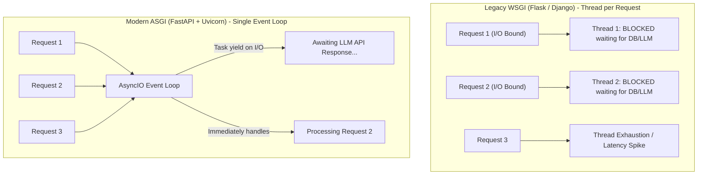

# 📹 FastAPI Philosophy & Setup: Installation & Hello World

<div className="video-card" style={{border: '1px solid #30363d', borderRadius: '8px', padding: '16px', marginBottom: '24px', background: 'rgba(56, 139, 253, 0.05)'}}>
  <div style={{display: 'flex', gap: '16px', flexWrap: 'wrap'}}>
    <div><strong>Instructor:</strong> Nitish Singh (CampusX)</div>
    <div><strong>Duration:</strong> 18m 45s</div>
    <div><strong>Course:</strong> Module 1 - Production Backend & Docker</div>
    <div><strong>Watch Link:</strong> <a href="https://www.youtube.com/watch?v=lXx-_1r0Uss" target="_blank" rel="noopener noreferrer">YouTube Lecture ↗</a></div>
  </div>
</div>


## 📌 Executive Summary

**FastAPI** is a modern, high-performance web framework for building APIs with Python 3.8+ based on standard Python type hints. It is currently the industry standard framework for deploying Machine Learning, Deep Learning, and LLM applications due to its blazing speed, native asynchronous support, and automatic OpenAPI schema generation.

FastAPI is built on the shoulders of two giants:
1. **Starlette:** For high-speed web routing, WebSocket support, and ASGI performance.
2. **Pydantic:** For lightning-fast data validation, serialization, and type enforcement.

---

## 🏗️ Architecture: ASGI vs WSGI Concurrency



---

## 📖 Core Concepts & Technical Deep Dive

### 1. Why FastAPI for AI / ML?
- **High Concurrency for I/O Bound Tasks:** LLM calls take seconds to stream tokens. Synchronous frameworks like Flask block entire worker threads while waiting for API responses. FastAPI's async/await allows a single worker to manage thousands of active connections simultaneously.
- **Strict Data Validation:** Type hints eliminate subtle runtime bugs. If a model expects a float array and receives a string, FastAPI automatically returns a structured `422 Unprocessable Entity` error before touching your GPU.
- **Interactive Documentation:** Free, automatic Swagger UI (`/docs`) and ReDoc (`/redoc`) without writing a single line of YAML.

### 2. Environment Setup & Installation
Create an isolated virtual environment and install FastAPI with standard extras:

```bash
# Create virtual environment
python3 -m venv .venv
source .venv/bin/activate

# Install FastAPI and Uvicorn
pip install "fastapi[standard]"
```

---

## 💻 Practical Code: First Production FastAPI App

Create a file named `main.py`:

```python
from fastapi import FastAPI
from typing import Dict

app = FastAPI(
    title="2026 AI Inference Gateway",
    description="Production API gateway for ML predictions and health checks.",
    version="1.0.0"
)

@app.get("/", tags=["Root"])
async def root() -> Dict[str, str]:
    """Root welcome endpoint."""
    return {"message": "AI Engineering API is live and operational!"}

@app.get("/health", tags=["Monitoring"])
async def health_check() -> Dict[str, str]:
    """System health probe for container orchestration (Kubernetes / AWS ECS)."""
    return {
        "status": "healthy",
        "engine": "FastAPI + Uvicorn",
        "version": "1.0.0"
    }
```

### Running the Server:
```bash
uvicorn main:app --reload --host 0.0.0.0 --port 8000
```

- `main`: Refers to the file `main.py`.
- `app`: Refers to the `FastAPI()` instance created inside `main.py`.
- `--reload`: Enables hot-reloading when code changes (use only in development).

---

## 💡 Production Best Practices & Tips

:::tip The `/docs` Swagger Interface
Open `http://localhost:8000/docs` in your browser. You can test your endpoints interactively, view automatically generated JSON request bodies, and copy ready-to-run `curl` commands.
:::

:::info Async vs Sync Endpoints
If your endpoint calls non-blocking async libraries (like `httpx`, `asyncpg`, or `motor`), define your function with `async def`. If your endpoint runs heavy CPU-bound code (like NumPy matrix multiplication or scikit-learn predictions), use standard `def` — FastAPI will automatically run it in an external thread pool to prevent blocking the event loop!
:::

---

## 🎯 Key Takeaways & Cheat Sheet

| Flag / Command | Purpose |
| :--- | :--- |
| `pip install "fastapi[standard]"` | Installs FastAPI + Uvicorn + Pydantic v2 + email-validator |
| `uvicorn main:app --reload` | Starts development server on port 8000 with hot reload |
| `/docs` | Interactive Swagger UI documentation |
| `/redoc` | Clean, production-ready ReDoc API documentation |

