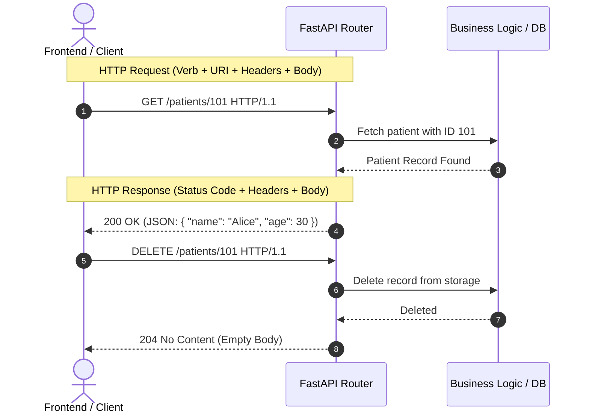

# 📹 HTTP Methods in FastAPI: GET, POST, PUT, DELETE & Status Codes

<div className="video-card" style={{border: '1px solid #30363d', borderRadius: '8px', padding: '16px', marginBottom: '24px', background: 'rgba(56, 139, 253, 0.05)'}}>
  <div style={{display: 'flex', gap: '16px', flexWrap: 'wrap'}}>
    <div><strong>Instructor:</strong> Nitish Singh (CampusX)</div>
    <div><strong>Duration:</strong> 16m 10s</div>
    <div><strong>Course:</strong> Module 1 - Production Backend & Docker</div>
    <div><strong>Watch Link:</strong> <a href="https://www.youtube.com/watch?v=O8KrViWNhOM" target="_blank" rel="noopener noreferrer">YouTube Lecture ↗</a></div>
  </div>
</div>


## 📌 Executive Summary

Modern RESTful APIs rely on standardized **HTTP Verbs (Methods)** to describe actions performed on resources. In this lesson, we explore how HTTP methods map to CRUD (Create, Read, Update, Delete) operations, the concepts of **Safety** and **Idempotency**, and how FastAPI handles HTTP status codes.

---

## 🏗️ Architecture: HTTP Request & Response Anatomy



---

## 📖 Core Concepts & Technical Deep Dive

### 1. The Core HTTP Verbs in REST
| Method | CRUD Equivalent | Safe? | Idempotent? | Typical Use Case in AI Engineering |
| :--- | :--- | :--- | :--- | :--- |
| **GET** | Read | ✅ Yes | ✅ Yes | Retrieve model metadata, check service health, fetch past predictions |
| **POST** | Create / Action | ❌ No | ❌ No | Submit inference inputs, generate embeddings, create training jobs |
| **PUT** | Replace / Update | ❌ No | ✅ Yes | Full overwrite of an agent configuration or hyperparameter set |
| **PATCH** | Partial Update | ❌ No | ❌ No | Update a single threshold or token budget without rewriting resource |
| **DELETE** | Delete | ❌ No | ✅ Yes | Terminate an inference worker, purge cache, or delete a dataset |

> **Safety:** The operation does not modify server state (read-only).  
> **Idempotency:** Making the same request multiple times produces the exact same server state as making it once.

### 2. HTTP Status Code Taxonomy
- **`2xx` Success:**
  - `200 OK`: Request succeeded (standard response for `GET`, `PUT`, `PATCH`).
  - `201 Created`: Resource successfully created (standard for `POST`).
  - `204 No Content`: Action succeeded, but no body returned (standard for `DELETE`).
- **`4xx` Client Error:**
  - `400 Bad Request`: Malformed syntax or invalid client inputs.
  - `401 Unauthorized`: Missing or invalid authentication token.
  - `403 Forbidden`: Authenticated, but lacking permission.
  - `404 Not Found`: Target resource URI does not exist.
  - `422 Unprocessable Entity`: FastAPI's default for Pydantic validation failures.
- **`5xx` Server Error:**
  - `500 Internal Server Error`: Unhandled exception in Python code.
  - `503 Service Unavailable`: GPU worker out of memory (OOM) or overloaded.

---

## 💻 Practical Code: Implementing RESTful Endpoints

```python
from fastapi import FastAPI, status, HTTPException
from typing import Dict, List

app = FastAPI(title="Patient Management & Diagnostics API")

# In-memory database
patients_db = {
    "P001": {"name": "Alice Smith", "age": 34, "diagnosis": "Hypertension"},
    "P002": {"name": "Bob Jones", "age": 52, "diagnosis": "Type 2 Diabetes"}
}

@app.get("/patients", status_code=status.HTTP_200_OK)
async def list_patients() -> Dict[str, Dict]:
    """Retrieve all registered patients."""
    return patients_db

@app.get("/patients/{patient_id}", status_code=status.HTTP_200_OK)
async def get_patient(patient_id: str):
    """Retrieve a specific patient by ID."""
    if patient_id not in patients_db:
        raise HTTPException(
            status_code=status.HTTP_404_NOT_FOUND,
            detail=f"Patient with ID '{patient_id}' does not exist."
        )
    return patients_db[patient_id]

@app.delete("/patients/{patient_id}", status_code=status.HTTP_204_NO_CONTENT)
async def delete_patient(patient_id: str):
    """Delete a patient record."""
    if patient_id not in patients_db:
        raise HTTPException(
            status_code=status.HTTP_404_NOT_FOUND,
            detail=f"Patient '{patient_id}' not found."
        )
    del patients_db[patient_id]
    return None
```

---

## 💡 Production Best Practices & Tips

:::tip Use `status` Constants
Avoid hardcoding raw status integers like `200` or `404`. Always import and use `fastapi.status` constants (e.g., `status.HTTP_201_CREATED`) to eliminate typos and enhance readability.
:::

:::warning Avoid GET Requests with Request Bodies
While the HTTP/1.1 spec does not explicitly forbid a body on a GET request, most web proxies, caches (like Cloudflare), and client libraries strip it. Use Query Parameters for GET, and reserve Bodies for POST/PUT/PATCH.
:::


---

---

## 📜 Complete Lecture Transcript (Hindi / Hinglish)

> **Language:** Hindi / Hinglish | **Source:** `03 - HTTP Methods in FastAPI ｜ Video 3 ｜ CampusX.hi.srt` | **Total Segments:** 14 | **Word Count:** ~4,651 words

<details>
<summary><b>Click to expand full chronological transcript (14 timestamped intervals)</b></summary>

#### ⏱️ [00:00 ➔ 00:02]

हाय गाइस, माय नेम इज निश एंड यू वेलकम टू माय YouTube चैनल। सो इस वीडियो में भी हम लोग अपना फास्ट एपीआई प्लेलिस्ट कंटिन्यू करेंगे। अभी तक इस प्लेलिस्ट में मैंने दो वीडियोस डाले हैं। फर्स्ट वीडियो में मैंने आपको एपीआई क्या होता है यह बताया था बहुत डिटेल में और फिर सेकंड वीडियो में मैंने आपको फास्ट एपीआई का एक इन डेप्थ इंट्रोडक्शन दिया था। अब आज के वीडियो से हम लोग अपने प्रोजेक्ट पे काम करना स्टार्ट करेंगे। तो आज के वीडियो में सबसे पहले मैं आपको प्रोजेक्ट का एक ओवरव्यू दूंगा कि यह प्रोजेक्ट एग्जैक्टली है क्या? इसमें हम क्या बनाने वाले हैं और फिर हम इसके अर्ली पार्ट्स इनिशियल पार्ट्स आज की वीडियो में कोड करना शुरू करेंगे। ठीक है? तो अब गोइंग फॉरवर्ड जो भी होगा इस पूरे प्लेलिस्ट में आप कह सकते हो कि वो सब कुछ बहुत हैंड्स ऑन और प्रैक्टिकल होगा। ठीक है? तो नाउ लेट्स स्टार्ट द वीडियो। तो चलो गाइस लेट मी गिव यू द ओवरव्यू ऑफ़ द प्रोजेक्ट। ठीक है? तो पहले मैं आपको प्रॉब्लम स्टेटमेंट बताता हूं कि हमारा प्रोजेक्ट क्या प्रॉब्लम सॉल्व कर रहा है। सो अगर आप कभी किसी डॉक्टर के क्लनिक पे गए होंगे तो आपने एक चीज नोटिस की होगी कि वो आपको एक प्रिस्रिप्शन टाइप का प्रोवाइड करते हैं। एक डॉक्यूमेंट होता है जो उनके क्लनिक के लेटर हेड पर बना होता है। वहीं पर डॉक्टर पेन से अपने रिमार्क्स लिखते हैं और वहीं पे दवाइयों के नाम लिखते हैं और वह आपसे बोलते हैं कि जब आप नेक्स्ट टाइम क्लनिक में आओगे दोबारा विजिट करने तो आप प्लीज यह डॉक्यूमेंट लेके आना। फिर अगले विजिट पे वो आपको एक सेकंड सेम तरह का डॉक्यूमेंट देते हैं। और आपको यह सारा डॉक्यूमेंट एक फाइल में मेंटेन करके रखना पड़ता है ओवर द इयर्स। अब ऑब्वियसली ये सब कुछ ऑफलाइन है। कल को एक आध पेपर यहां वहां मिस हो सकता है। तो इट इज़ नॉट गुड। राइट? पेशेंट की साइड से भी और डॉक्टर की साइड से भी। डॉक्टर की साइड भी जो कॉपी होगी उस डॉक्यूमेंट की वह भी मिसप्लेस हो सकती है। तो एक बहुत अच्छा तरीका क्या है कि अगर हम एक स्टार्टअप बिल्ड करें जिसका काम हो इस पूरी चीज को ऑनलाइन ले आने का। मतलब यह हुआ कि हम डॉक्टर को एक ऐप दे देंगे। ठीक है? और उस ऐप के थ्रू डॉक्टर

#### ⏱️ [00:02 ➔ 00:04]

क्या कर सकता है? अपने हर पेशेंट का एक प्रोफाइल मेंटेन कर सकता है। ठीक है? एक टिपिकल प्रोफाइल कुछ ऐसा दिखाई दे सकता है। ठीक है? कि पेशेंट का नाम क्या है? सिटी, एज, जेंडर, हाइट, वेट, बीएएमआई और इसके अलावा और भी बहुत सारा मेडिकल इनेशन आप यहां पे डाल सकते हो। बट सिंस हम बेसिक लेवल प्रोजेक्ट कर रहे हैं। तो हम फिलहाल हाइट, वेट और बीएएमआई तक रुक रहे हैं। ठीक है? बट यू कैन अंडरस्टैंड यहां पे और कितनी चीजें ऐड की जा सकती हैं। सो, हम क्या करेंगे? हम डॉक्टर को एक ऐप दे रहे हैं और इस ऐप के थ्रू द डॉक्टर कैन क्रिएट न्यू पेशेंट्स, न्यू रिकॉर्ड्स। ठीक है? और हम क्या कर रहे हैं? उन सारे पेशेंट्स को एक जगह पर स्टोर करते जा रहे हैं। आइडियली तो हमें इसको स्टोर करना चाहिए एक डेटाबेस के अंदर। बट सिंस हम बेसिक लेवल प्रोजेक्ट कर रहे हैं। तो हम फिलहाल पेशेंट्स के जो भी नए रिकॉर्ड्स आएंगे उनको एक jसon फाइल के अंदर स्टोर करेंगे। ठीक है? मेथड बिल्कुल सेम होगा। उसी तरीके से ऑपरेट करेंगे। इट्स जस्ट कि इंस्टेड ऑफ यूजिंग अ डेटाबेस हम jसon यूज़ कर रहे हैं। ठीक है? और नॉट ओनली दैट हम सिर्फ हमारे डॉक्टर को नया पेशेंट बनाने का ऑप्शन नहीं दे रहे हैं। हम उसको नए पेशेंट को व्यू करने का भी ऑप्शन दे रहे हैं। मतलब वो हमारे पूरे के पूरे डेटाबेस के अंदर से किसी भी पेशेंट का प्रोफाइल व्यू कर सकता है। साथ ही साथ हम उसको यह भी ऑप्शन दे रहे हैं कि किसी एकिस्टिंग पेशेंट का वो रिकॉर्ड मॉडिफाई कर सकता है। जैसे मान लो एक साल बाद पता चला कि इस पेशेंट का वेट थोड़ा सा घट गया है। तो वो झट से जाकर के इस ऐप के थ्रू अ जो वेट का वैल्यू है उसको चेंज कर देगा और ऑटोमेटिकली हमारा बैक एंड क्या करेगा? बीएमआई को एडजस्ट कर देगा। ठीक है? तो ये अपडेट का फीचर भी हम उसको दे रहे हैं और साथ ही साथ हम उसको डिलीट का फीचर भी दे रहे हैं। ठीक है? तो बेसिकली इस पूरे प्रोजेक्ट में हमारा काम क्या है? हमारा काम है एक एपीआई को डेवलप करना। ऑब्वियसली हम यह ऐप बनाने नहीं जा रहे हैं। यह ऐप बनाना फ्रंट एंड वालों का काम है। हम एज बैक एंड इंजीनियर्स हम एक

#### ⏱️ [00:04 ➔ 00:06]

एपीआई बनाने जा रहे हैं। जिसमें चार-प एंड पॉइंट्स रहेंगे। ठीक है? पहला एंड पॉइंट रहेगा नया पेशेंट क्रिएट करने के लिए। ठीक है? डॉक्टर यहां पे फॉर्म फिल करेगा। यह डाटा इस एंड पॉइंट को मिलेगा। और यह एंड पॉइंट हमारे json फाइल के अंदर एक नया पेशेंट ऐड करेगी। ठीक है? सेकंड हम एक एंड पॉइंट देंगे पेशेंट्स को व्यू करने का। आप इस पर्टिकुलर एंड पॉइंट पे जैसे ही हिट करोगे तो आपके JSON फाइल में जितने भी रिकॉर्ड्स हैं वो सब आपको दिखने लग जाएंगे। उसके बाद हम एक और एंड पॉइंट बनाएंगे। जहां पर आप किसी एक पर्टिकुलर पेशेंट का प्रोफाइल देख सकते हो। पेशेंट आईडी वन का, पेशेंट आईडी फाइव का, पेशेंट आईडी 10 का। ठीक है? उसके बाद हम एक और एंड पॉइंट बनाएंगे जिसकी हेल्प से आप किसी पर्टिकुलर पेशेंट का रिकॉर्ड अपडेट कर सकते हो। ठीक है? बेसिकली अपडेट के लिए और फाइनली हम एक लास्ट एंड पॉइंट बनाएंगे जहां पे फॉर अ गिवन पेशेंट आईडी हम उस पेशेंट को डिलीट कर सकते हैं हमारे डेटाबेस के अंदर से। ठीक है? तो हमारा काम इस पूरे प्रोजेक्ट में बस इतना है कि हमें यह एपीआई बनाना है। अब कल को इस एपीआई को यूज करके कोई भी इस तरह का ऐप बना सकता है या वेबसाइट बना सकता है। वो फ्रंट एंड वाले के ऊपर है। बट हमारा टास्क इस पूरे प्रोजेक्ट में है टू डेवलप दिस एपीआई व्हिच विल कंटेन अराउंड फाइव एंड पॉइंट्स मे बी मोर फ्यूचर में। अभी मैंने पूरी तरीके से डिसाइड नहीं किया। बट आई रियली होप आपको आईडिया लग गया कि हम इस प्रोजेक्ट में क्या करने वाले हैं। ठीक है? अब प्रोजेक्ट को स्टार्ट करने के पहले एक बहुत इंपॉर्टेंट डिस्कशन करना जरूरी है और वो डिस्कशन है अराउंड एचटीटीपी मेथड्स। बिकॉज़ ये एक ऐसी चीज है जो आप इस पूरे प्लेलिस्ट में देखोगे तो अच्छा होगा अगर हम इसको शुरुआत में ही

#### ⏱️ [00:06 ➔ 00:08]

डिस्कस कर लें। तो एचटीटीपी मेथड्स को डिस्कस करने के लिए हम थोड़ा फंडामेंटल लेवल पे जाके डिस्कशन करेंगे। ठीक है? सो मैं आपसे एक सवाल पूछना चाहता हूं। क्वेश्चन यह है कि अगर मैं आपसे पूछूं कि आप सॉफ्टवेयर्स को कितनी कैटेगरी में डिवाइड कर सकते हो बेस्ड ऑन यूजर इंटरेक्शन? तो व्हाट वुड यू से? आई गेस आपको स्क्रीन पे भी दिख रहा है और शायद आपके दिमाग में भी यह बात आ रही होगी कि यूजर एक सॉफ्टवेयर के साथ कितना इंटरेक्ट कर सकता है। इस चीज के बेसिस पे आप सॉफ्टवेयर को दो पार्ट्स में डिवाइड कर सकते हो। एक ऐसा सॉफ्टवेयर जो स्टैटिक होता है। स्टैटिक होने का मतलब है कि आपका जो यूजर है वो इस सॉफ्टवेयर के साथ बहुत ज्यादा इंटरेक्ट नहीं करता। ठीक है? मोस्टली हम ऐसे सॉफ्टवेयर्स को इंफॉर्मेशन रिसीव करने के लिए यूज करते हैं। ठीक है? ऑन द अदर हैंड हमारे पास एक और क्लास ऑफ सॉफ्टवेयर होता है जिसको हम डायनेमिक सॉफ्टवेयर बोलते हैं। और ये ऐसे सॉफ्टवेयर्स हैं जिनके साथ यूजर का इंटरेक्शन बहुत ज्यादा होता है। ठीक है? मतलब आप टू वे कम्युनिकेशन कर सकते हो। यूजर सॉफ्टवेयर को कुछ बोल रहा है। पलट के सॉफ्टवेयर यूजर को कुछ बोल रहा है। तो वो कम्युनिकेशन होता है। ठीक है? इन दोनों के मैं आपको एक एग्जांपल देता हूं ताकि आपको और बेटर से अच्छे तरीके से ये चीज समझ में आए। तो स्टैटिक सॉफ्टवेयर का एक बहुत अच्छा एग्जांपल है कैलेंडर। खुद सोच के देखो। आपके Windows मशीन में एक कैलेंडर का सॉफ्टवेयर है। आप उस पे क्लिक करते हो। वो झट से आपको आज का डेट बता देता है। आज कौन सा डे है यह बता देता है और आप फ्यूचर की भी कोई डेट्स वहां पे देख सकते हो। बट क्या हम बहुत ज्यादा इंटरेक्ट करते हैं उस कैलेंडर सॉफ्टवेयर के साथ? द आंसर इज़ नो। हम उसको सिर्फ यूज़ करते हैं डेट देखने के लिए। तो देयर इज़ जस्ट वन वे कम्युनिकेशन। हमारा सॉफ्टवेयर हमें कुछ बता रहा है। ठीक है? इतना ही कम्युनिकेशन है। देयर इज़ नो मोर इंटरेक्शन इनवॉल्वड। वेयर एज अगर मैं आपको एक एग्जांपल दूं डायनेमिक सॉफ्टवेयर का तो वो हो सकता है Microsoft Excel। आप खुद सोच के देखो एक Microsoft Exl वर्कशीट

#### ⏱️ [00:08 ➔ 00:10]

के साथ आप कितने लेवल पर इंटरेक्ट कर सकते हो। आप नए वर्कशीट बना सकते हो। उसमें डेटा एंटर कर सकते हो। एकिस्टिंग डेटा के ऊपर एनालिसिस कर सकते हो। तो यू कैन सी कि जो लेवल ऑफ इंटरेक्शन है विद Microsoft Exl वो कितना ज्यादा है। Microsoft Excel इज़ जस्ट वन सॉफ्टवेयर। आप खुद सोच के देखो और बहुत सारे ऐसे सॉफ्टवेयर्स हैं जैसे कि Microsoft Word हो गया, पीपीटी हो गया। अह तो बहुत सारे ऐसे सॉफ्टवेयर्स हैं जहां पे यूजर का इंटरेक्शन बहुत ज्यादा होता है। ऑन द अदर हैंड स्टैटिक सॉफ्टवेयर में यूजर इंटरेक्शन बहुत कम है। वन मोर एग्जांपल कुड बी क्लॉक जिसको आप सिर्फ टाइम देखने के लिए यूज़ करते हो। राइट? और कुछ यूजर इंटरेक्शन वहां पे नहीं होता। तो आई रियली होप आपको इस पॉइंट पे ये समझ में आ गया कि सॉफ्टवेयर में दो क्लासेस हो सकती हैं। एक होता है स्टैटिक सॉफ्टवेयर, एक होता है डायनेमिक सॉफ्टवेयर। अब हम अपना पूरा डिस्कशन डायनेमिक सॉफ्टवेयर के अराउंड करेंगे। ठीक है? तो जब मैंने आपको यह बोला कि हम डायनेमिक सॉफ्टवेयर के साथ एज अ यूजर बहुत तरह के इंटरेक्शंस कर सकते हैं। तो व्हाट वुड यू थिंक लाइक व्हाट डू यू थिंक हम कितने टाइप्स ऑफ इंटरेक्शंस कर सकते हैं? अगर मैं आपसे यह सवाल पूछूं कि आपके पास एक डायनेमिक सॉफ्टवेयर है। कैन यू टेल मी आप उस सॉफ्टवेयर के साथ कितने तरीकों से इंटरेक्ट कर सकते हो? तो व्हाट वुड बी योर आंसर? आई कैन टेल यू द आंसर? द आंसर इज़ कि आप किसी भी डायनेमिक सॉफ्टवेयर के साथ सिर्फ और सिर्फ चार टाइप के इंटरेक्शंस ही कर सकते हो। और इन चार टाइप के इंटरेक्शंस के लिए एक टर्म भी कॉइन किया गया है और इसको बुलाया जाता है क्रड। ठीक है? वेयर सी स्टैंड्स फॉर क्रिएट। आर स्टैंड्स फॉर रिट्रीव, यू स्टैंड्स फॉर अपडेट एंड डी स्टैंड्स फॉर डिलीट। अब आप खुद सोच के देखो। कोई भी डायनेमिक सॉफ्टवेयर के बारे में सोचो अपने दिमाग में और आप सोचने की कोशिश करो कि व्हाट आर द टाइप्स ऑफ़ इंटरेक्शंस जो मैं सॉफ्टवेयर के साथ कर सकता हूं। एंड आई आई कैन बेट कि आप इवेंचुअली रियलाइज़ करोगे कि हां वो इन

#### ⏱️ [00:10 ➔ 00:12]

चारों में से ही कोई एक टाइप का इंटरेक्शन है। Microsoft Excel का एग्जांपल लेके हम चल रहे थे। वहां पे आप सोच के देखो। आप या तो सेल्स को क्रिएट करते हो। उसमें डेटा एंटर करते हो या तो एग्जिस्टिंग सेल्स को जाकर के व्यू करते हो, रिट्रीव करते हो या फिर आप एग्ज़िस्टिंग सेल्स में जाके चेंजेस करते हो, अपडेट करते हो या फिर एग्ज़िस्टिंग सेल्स को आप डिलीट करते हो। राइट? तो यही चार पॉसिबल इंटरेक्शंस हैं। आप Microsoft Word का एग्जांपल ले लो। वहां पे या तो आप नया डॉक्यूमेंट क्रिएट कर रहे हो या एग्ज़िस्टिंग डॉक्यूमेंट को रीड कर रहे हो या फिर एग्ज़िस्टिंग डॉक्यूमेंट को अपडेट कर रहे हो या फिर एग्ज़िस्टिंग डॉक्यूमेंट को डिलीट कर रहे हो। तो यही चार क्लासेस ऑफ इंटरेक्शंस होती हैं किसी भी डायनेमिक सॉफ्टवेयर में। आई रियली होप आपको यहां तक का डिस्कशन समझ में आ गया। द एंटायर थिंग दैट वी डिस्कस्ड। समरी ये है कि सॉफ्टवेयर में दो टाइप्स ऑफ सॉफ्टवेयर्स हैं। स्टैटिक डायनेमिक। स्टैटिक को हटा देते हैं। डायनेमिक की बात करते हैं। डायनेमिक सॉफ्टवेयर वो सॉफ्टवेयर है जहां पे यूज़र्स कई तरह के इंटरेक्शंस कर सकता है। बट कितने टाइप के इंटरेक्शंस हो सकते हैं? द आंसर इज़ फोर। क्रड सी आर यू डी क्रिएट, रिट्रीव, अपडेट एंड डिलीट। ठीक है? तो ये तो बात हो गई सॉफ्टवेयर्स की। अब बात करते हैं वेबसाइट्स की। क्या वेबसाइट्स में भी यह बात ट्रू है या नहीं? अब वेबसाइट्स के बारे में बात करने के पहले एक चीज मैं क्लेरिफाई करना चाहूंगा कि वेबसाइट्स खुद में कोई अलग चीज नहीं होते। यह भी एक तरह के सॉफ्टवेयर्स ही हैं। द ओनली डिफरेंस इज कि जो नॉर्मल सॉफ्टवेयर्स होते हैं जैसे कि Microsoft Exl या कैलेंडर हुआ या क्लॉक हुआ ये जिस मशीन पे इंस्टॉल्ड होते हैं उसी मशीन पे इनको यूज़ भी किया जाता है। सोच के देखो ना आपने अपनी मशीन पे Microsoft Excel इंस्टॉल कर रखा है और आप अपनी ही मशीन पे उसको यूज़ करते हो। राइट? बट वेबसाइट के केस में क्या होता है कि वेबसाइट एक ऐसा स्पेशल सॉफ्टवेयर है जो इंस्टॉल किसी दूसरी मशीन पे होता है और उसको यूज किया जाता है किसी दूसरी मशीन के ऊपर। राइट? तो जिस मशीन के ऊपर वेबसाइट

#### ⏱️ [00:12 ➔ 00:14]

इंस्टॉल्ड है, उसको हम सर्वर बुलाते हैं। और जिस मशीन से उस वेबसाइट को एक्सेस किया जाता है, यूज़ किया जाता है, उसको हम क्लाइंट बुलाते हैं। ठीक है? तो ये टू वे कम्युनिकेशन होता है। क्लाइंट कुछ सर्वर से मांगता है। सर्वर पलट करके क्लाइंट को कुछ देता है। और ये जो पूरा का पूरा कम्युनिकेशन होता है ये एक प्रोटोकॉल के थ्रू होता है जिसको हम http बुलाते हैं। आई होप आपको ये सारी चीज ऑलरेडी पता है। अब वेबसाइट की अगर हम बात करें तो वेबसाइट में भी आप बिल्कुल सेम तरीके से दो कैटेगरीज मान सकते हो। पहला होती है स्टैटिक वेबसाइट्स और दूसरा होती है डायनेमिक वेबसाइट्स। सो स्टैटिक वेबसाइट ऐसी वेबसाइट हुई जहां पर यूजर जो आपका क्लाइंट है वो बहुत ज्यादा इंटरेक्ट नहीं करता वेबसाइट के साथ। तो कोई भी ब्लॉग उठा लो या फिर कोई भी गवर्नमेंट की वेबसाइट उठा लो। तो इन वेबसाइट्स को आप स्टैटिक वेबसाइट की कैटेगरी में डाल सकते हो। देयर इज़ नॉट मच इंटरेक्शन गोइंग ऑन। राइट? एंड अगर आप बात करो डायनेमिक वेबसाइट की तो डायनेमिक वेबसाइट्स वो वेबसाइट्स हैं जहां पर यूजर या एज एन क्लाइंट आपके वेबसाइट के साथ कई तरह के इंटरेक्शंस करता है। ठीक है? फॉर एग्जांपल Instagram Instagram पे आप कई तरह के इंटरेक्शंस कर सकते हो। आप लॉग इन करते हो, आप कमेंट करते हो, आप पोस्ट क्रिएट करते हो, आप दूसरे के पोस्ट पे लाइक करते हो, दूसरे के कमेंट पे रिप्लाई करते हो। राइट? तो बहुत सारे इंटरेक्शंस पॉसिबल है। एंड आई गेस आपने समझ लिया होगा कि मैं नेक्स्ट क्या बोलने वाला हूं। यहां पे भी आप कितने भी इंटरेक्शंस कर लो किसी भी वेबसाइट पे उन इंटरेक्शंस को आप फिर से चार कैटेगरीज में डिवाइड कर सकते हो। क्रिएट, रिट्रीव, अपडेट एंड डिलीट। सोच के देखो ना। Instagram पे आप एक नया पोस्ट क्रिएट कर रहे हो, फोटो अपलोड कर रहे हो, नया कमेंट लिख रहे हो। यह सब कुछ क्रिएट के अंदर

#### ⏱️ [00:14 ➔ 00:16]

आया। आप फीड स्क्रोल कर रहे हो। किसी की प्रोफाइल व्यू कर रहे हो। वो रिट्रीव के अंदर आया। आप अपना प्रोफाइल जाके एडिट कर रहे हो। अपना कमेंट जाके एडिट कर रहे हो। वो अपडेट के अंदर आया। आप अपने प्रोफाइल में कुछ जाके पोस्ट डिलीट कर रहे हो। अपना कोई कमेंट डिलीट कर रहे हो। वो डिलीट के अंदर आया। और आप कोई भी और वेबसाइट उठा लो। आप Zomato उठा लो। आप अगर एक नया ऑर्डर प्लेस कर रहे हो। आप क्रिएट कर रहे हो। अगर आप अपने पास्ट ऑर्डर्स देख रहे हो, आप रिट्रीव कर रहे हो। अगर आप अपना एड्रेस अपडेट कर रहे हो, अपडेट कर रहे हो, अगर आप अपना कोई एड्रेस डिलीट कर रहे हो, डिलीट कर रहे हो। राइट? तो दुनिया भर की जितनी भी वेबसाइट्स हैं डायनेमिक वेबसाइट्स उनमें आप चार ही टाइप के इंटरेक्शंस कर सकते हो। क्रिएट, रिट्रीव, अपडेट एंड डिलीट। बिल्कुल सॉफ्टवेयर्स की तरह। बस यहां पर एक प्रॉब्लम क्या है कि सिंस यह डायनेमिक वेबसाइट्स हैं और सिंस यह वेबसाइट्स हैं तो यह कम्युनिकेशन इंटरनेट के थ्रू हो रहा है। क्लाइंट से यह एचटीटीपी रिक्वेस्ट उठ के आ रही है और यह रिक्वेस्ट सर्वर पे जा रही है और सर्वर समझ रहा है कि क्लाइंट को क्या चाहिए और फिर पलट के वो चीज रिटर्न हो रही है एज रिस्पांस। तो यहां पे बहुत इंपॉर्टेंट हो जाता है कि जब आप इनमें से कोई भी ऑपरेशन परफॉर्म कर रहे हो, कोई भी अ इंटरेक्शन परफॉर्म कर रहे हो, क्रिएट, रिट्रीव, अपडेट या फिर डिलीट तो आप अपने http रिक्वेस्ट में यह बात मेंशन करो कि हमें इस टाइप का इंटरेक्शन परफॉर्म करना है वेबसाइट के साथ। जैसे कि अगर आप मान लो आप एक वेबसाइट से अपना प्रोफाइल पेज मांगना चाहते हो। तो ये किस तरह का इंटरेक्शन है? ये रिट्रीव टाइप का इंटरेक्शन है। बिकॉज़ आप कुछ व्यू करना चाहते हो। तो यहां पे आप क्या करोगे? आप अपने http रिक्वेस्ट के अंदर एक वर्ब ऐड करोगे और उस वर्ब का नाम होता है गेट। गेट का मतलब क्या हुआ? कि मैं कुछ रिट्रीव करना चाहता हूं मेरी

#### ⏱️ [00:16 ➔ 00:18]

वेबसाइट से। ठीक है? सिमिलरली अगर आप कोई फॉर्म फिल करके वो इंफॉर्मेशन वेबसाइट के पास भेज रहे हो जैसे लॉग इन वाला फॉर्म हुआ, रजिस्ट्रेशन वाला फॉर्म हुआ या फिर किसी भी तरह का आप इंफॉर्मेशन अगर प्रोवाइड कर रहे हो और आप भेजना चाह रहे हो उसको अ वेबसाइट के पास तो इस टाइम पे आप क्या करते हो कि आप अपने एचटीटीपी रिक्वेस्ट में एक सेकंड टाइप ऑफ वर्ब ऐड करते हो जिसको हम पोस्ट बुलाते हैं। पोस्ट का मतलब हम क्रिएट वाला इंटरेक्शन करना चाहते हैं। ठीक है? सिमिलरली अगर आप कुछ एग्जिस्टिंग रिसोर्स को अपडेट करना चाहते हो वेबसाइट के ऊपर तो आप अपने http रिक्वेस्ट में जो वर्ब ऐड करते हो उसको बुलाया जाता है पुट। पुट का मतलब है आप अपडेट वाला इंटरेक्शन करना चाहते हो। और फाइनली अगर आप कुछ डिलीट करना चाहते हो वेबसाइट के ऊपर तो जो वर्ब आप ऐड करते हो उसको हम डिलीट बुलाते हैं व्हिच टेल्स द सर्वर कि जो यूजर है जो क्लाइंट है वो डिलीट वाला इंटरेक्शन परफॉर्म करना चाहता है। सो बेसिकली फॉर एव्री टाइप ऑफ इंटरेक्शन इन द एचटीटीपी बॉडी यू सेंड अ वर्ब और इन्हीं वर्ब्स को कलेक्टिवली HTTP मेथड बुलाया जाता है। तो, यह चार सबसे ज्यादा यूज होने वाले मेथड्स हैं। इनसे इनमें भी गेट और पोस्ट ज्यादा यूज़ होते हैं। पुट और डिलीट थोड़ा कम यूज़ होते हैं। बट ये चार एचटीटीपी मेथड्स आपको पता होने चाहिए। अगर आप कभी भी कोई वेबसाइट या फिर एपीआई बनाने जा रहे हो। ठीक है? और हम जो प्रोजेक्ट बना रहे हैं उसमें भी आप नोटिस करोगे कि हम अपने एंड पॉइंट्स डिजाइन करते टाइम इनमें से किसी एक मेथड को डेफिनेटली यूज करेंगे। ठीक है? तो चलो गाइस जो मैंने आपको अभी पढ़ाया http मेथड्स के बारे में मैं आपको उसका एक डेमो दिखाता हूं। ठीक है? तो ये हमारी वेबसाइट है। ऑब्वियसली किसी सर्वर पे होस्टेड है और मैं फिलहाल क्लाइंट बनके हमारी इस

#### ⏱️ [00:18 ➔ 00:20]

वेबसाइट के ऊपर एचटीटीपी रिक्वेस्ट सेंड करूंगा। ठीक है? तो सबसे पहले मैं क्या करना चाहता हूं कि मैं कोर्सेज वाला पेज एक्सेस करना चाहता हूं। तो खुद सोच के देखो ये सीआर यू डी में कौन सा ऑपरेशन हुआ। आई गेस आप फिगर आउट कर पा रहे हो कि यह एक तरह का रिट्रीव ऑपरेशन है। ठीक है? तो मैं आपको दिखाऊंगा कि सच में बिहाइंड द सीनंस एक गेट रिक्वेस्ट मेरे सर्वर के पास जाएगा। और वो दिखाने के लिए आई विल गो टू द इंस्पेक्ट टैब। वहां से आई विल गो टू नेटवर्क। और यहां पर हम देखेंगे कि सच में आपका एक गेट रिक्वेस्ट जाएगी। ठीक है? सो आई विल क्लिक ऑन कोर्सेज। और यह देखो कोर्सेज वाला पेज लोड हो गया है। यहां पे काफी मूवमेंट है। बट हम क्या करेंगे? हम यहां पे जाएंगे स्टोर वाले पेज पे। बिकॉज़ दिस इज़ द यूआरएल। तो अगर आप स्टोर वाले यूआरएल पे जाओ तो यू कैन सी कि दिस इज़ द रिक्वेस्ट यूआरएल जो हमने अपने http रिक्वेस्ट में भेजा। और यह देखो रिक्वेस्ट मेथड क्या है? गेट। आई होप आप समझ पा रहे हो। अब मैं आपको दिखाता हूं पोस्ट का एग्जांपल। तो नेक्स्ट लेट्स से मुझे लॉग इन करना है इस वेबसाइट में। अब लॉग इन करने के लिए मुझे क्या करना पड़ेगा? मुझे कुछ डेटा भेजना पड़ेगा। राइट? या लॉग इन या रजिस्ट्रेशन करने के लिए कुछ डाटा मुझे सर्वर पे भेजना है। तो मैं लॉग इन पे क्लिक कर रहा हूं। साइन अप पे क्लिक कर रहा हूं। या लेट्स से लॉग इन पे क्लिक करके कंटिन्यू विद ईमेल पे जा रहा हूं। यहां पर मैंने एक डमी ईमेल डाल दिया। gmail.com 1 2 3 4 मैंने गलत पासवर्ड डाल दिया। नेक्स्ट पे क्लिक किया। ठीक है? सो फिलहाल हमारा जो यूआरएल है यह ऑथेंटिकेट है। तो अगर मैं यहां पे जाऊं और खोजूं ऑथेंटिकेट को तो यह रहा ऑथेंटिकेट और यहां पे देखो गाइज़ रिक्वेस्ट मेथड क्या है? पोस्ट। ठीक है? तो आई होप मैं आपको समझा पाया विद एग्जांपल कि http मेथड्स क्या होते हैं? अब आज हम क्या करने वाले हैं कि हम अपना प्रोजेक्ट किक स्टार्ट करेंगे और

#### ⏱️ [00:20 ➔ 00:22]

मैं आपको एक एपीआई बना के दिखाने वाला हूं। एक एंड पॉइंट आई एम सॉरी बना के दिखाने वाला हूं। जहां पे हम अपने सारे पेशेंट्स का डेटा अ रिट्रीव कर पाएंगे। तो आई होप यू आर एबल टू फिगर आउट कि जो एचटीटीपी मेथड हम यूज़ करेंगे वो गेट होगा। ठीक है? तो लेट्स स्टार्ट विद द प्रोजेक्ट। अब एंड पॉइंट बनाने के पहले थोड़ा सा सेटअप रिलेटेड काम कर लेते हैं। हम एग्जैक्टली उसी प्रोजेक्ट फोल्डर में काम करेंगे जो मैंने आपको लास्ट वीडियो में दिखाया था। अ मैंने वहां पे आपको फास्ट एपीआई इंस्टॉल करके दिखाया था। piddant और यूवीकॉन इंस्टॉल करके दिखाया था और एक बेसिक अ छोटा सा ऐप एपीआई बना के दिखाया था। राइट? वहां पे भी अगर आपको याद होगा तो हमने दो एंड पॉइंट्स बनाए एक था हेलो, एक था अबाउट और यह दोनों गेट टाइप के एचटीटीपी मेथड्स को यूज़ कर रहे थे। बिकॉज़ ऑब्वियसली हम यूजर को डेटा रिट्रीव करके दे रहे थे। ठीक है? सो अब यहां से ही हम लोग अपना काम कंटिन्यू करेंगे। अ तो फर्स्ट थिंग दैट वी विल डू इज़ कि सिंस हमने एक नया सेशन स्टार्ट किया है तो हम यहां पे सबसे पहले अपने वर्चुअल एनवायरनमेंट को अ स्टार्ट कर देंगे। सो आई वुड राइट माय env स्क्रिप्ट्स सश एक्टिवेट। ठीक है? सेकंड मैंने क्या किया है? मैंने यहां पर एक पेशेंट्स डॉट json बोल के एक फाइल बनाई है और यहां पे ऑलरेडी फाइव पेशेंट्स का डेटा ऐड कर दिया है। ठीक है? तो ये काइंड ऑफ़ हमारे डेटाबेस की तरह ऑपरेट करेगी। सो यह हमारा फर्स्ट पेशेंट है। फिर उसके बाद यहां से हमारा सेकंड पेशेंट आता है। फिर थर्ड, फिर फोर्थ एंड फिफ्थ। ठीक है? तो जो भी नया पेशेंट आएगा उसको हम यहीं पे ऐड करते जाएंगे। और एकिस्टिंग पेशेंट्स यहां पर है। तो हम यहीं से रिट्रीव करके यूजर को दिखाएंगे। ठीक है? तो ये एक और सेटअप हो गया। थोड़ा सा एकिस्टिंग कोड को भी मैं मॉडिफाई कर लेता हूं। सो हेलो में जहां पे मैंने मैसेज में हेलो वर्ल्ड लिखा था। यहां पर

#### ⏱️ [00:22 ➔ 00:24]

मैं लिख देता हूं पेशेंट मैनेजमेंट सिस्टम एपीआई। ठीक है? और अबाउट में हम लिख सकते हैं अ फुली फंक्शनल एपीआई टू मैनेज योर पेशेंट्स पेशेंट रिकॉर्ड्स। ठीक है? अब यहां से हम अपना काम शुरू करेंगे। तो हमें क्या करना है? हमें सबसे पहले एक एंड पॉइंट बनाना है जिसका नाम होगा व्यू। और जैसे ही कोई हमारे उस एंड पॉइंट पे हिट करेगा तो हम क्या करेंगे कि हम जितने भी पेशेंट्स हमारे हैं उन सबका डेटा भेज देंगे क्लाइंट के पास। ठीक है? ये हमारा हमारा एंड पॉइंट होने वाला है। ठीक है? तो व्हाट यू विल डू इज कि एंड पॉइंट बनाने के पहले आपको सबसे पहले ये पेशेंट डॉट json के अंदर से डेटा को लोड करने के लिए एक फंक्शन लिखना पड़ेगा। बिकॉज़ ये काम आपको बार-बार करना है। आगे भी जब आप एंड पॉइंट्स बनाओगे तो आपको अपने पेशेंट्स डॉट json फाइल से रिकॉर्ड्स निकालने पड़ेंगे। तो व्हाट आई विल डू इज मैं यहां पर एक हेल्पर फंक्शन बना रहा हूं लोड डेटा बोल के और इस फंक्शन को इनपुट में कुछ नहीं चाहिए। इस फंक्शन के अंदर हम क्या कर रहे हैं कि पेशेंस json फाइल को ओपन कर रहे हैं और हम इसको ओपन कर रहे हैं रीड मोड में एज एफ और हमें सिंस ये jसon फाइल है। इसको रीड करने के लिए हमें jसon मॉड्यूल की जरूरत पड़ेगी। तो हम लिखेंगे इंपोर्ट jसon और यहां पर हम लिखेंगे json डॉट लोड और यहां पर हम अपनी फाइल पास

#### ⏱️ [00:24 ➔ 00:26]

कर देंगे और इससे हमें हमारा डाटा मिल जाएगा और यही डेटा हम क्या करेंगे रिटर्न कर देंगे ठीक है तो बहुत सिंपल सा फंक्शन है जभी भी आप इस फंक्शन को कॉल करोगे इस फाइल का सारा डेटा यह फंक्शन रिटर्न करेगा ठीक है तो ये हमारा काम हो गया अब हम एक काम करते हैं एक नया एंड पॉइंट क्रिएट करते गेट और इसका जो राउट है वो है व्यू। ठीक है? और यहां पे हम इसका फंक्शन बनाएंगे व्यू। इसको इनपुट की जरूरत नहीं है। यहां पे आप क्या करोगे? जैसे ही कोई रिक्वेस्ट इस राउट में आती है तो आप सबसे पहले डेटा फैच करके लाओगे यूजिंग द लोड डेटा फंक्शन और फिर सिंपली उस डेटा को एज इट इज रिटर्न कर दोगे। दैट्स इट गाइस। दिस इज आवर एंड पॉइंट विल गिव ऑल द पेशेंस डाटा टू आवर क्लाइंट। ठीक है? तो अब एक काम करते हैं। इस ऐप को रन करते हैं। ठीक है? यूवीकॉन मेन ऐप रीलोड। यह हमारा कमांड था टू स्टार्ट द uvॉन सर्वर एंटर मारा। और यह रहा हमारा यूआरएल। तो ये रहा गाइज़ हमारा यूआरएल। फिलहाल हम होम यूआरएल पर हैं। आप बहुत ईली अबाउट पर जा सकते हो। ठीक है? और बहुत आसानी से आप व्यू पे भी जा सकते हो। एंड यू कैन सी ये रहा हमारा डेटा। ठीक है? और अगर आप डॉक्स पर जाओ तो आपको इस नए एंड पॉइंट का भी डॉक्यूमेंटेशन मिल जाएगा। ठीक है? ये रहा आपका थर्ड गेट एंड पॉइंट। इसको अगर मैं एक्सपैंड करूं यहां पे मैं ट्राई इट आउट पे अगर जाऊं और एग्जीक्यूट बटन को क्लिक

#### ⏱️ [00:26 ➔ 00:26]

करूं तो यू कैन सी दिस इज़ द रिस्पांस दैट आई एम गेटिंग। ठीक है? ठीक है? तो जितने भी हमारे पेशेंट्स होंगे हमारी पेशेंट्स डॉट json फाइल में वो सब का सब हम लोड करके दिखा रहे हैं। ठीक है? तो आई होप आपको समझ में आ गया कि हमारा ये फर्स्ट एंड पॉइंट कैसे काम कर रहा है। ठीक है? अब इसी प्रोजेक्ट को हम लोग और अच्छे तरीके से आने वाले वीडियोस में डेवलप करेंगे। जैसे कि नेक्स्ट वीडियो में हम यह एंड पॉइंट डेवलप करेंगे कि अगर आप चाहो तो किसी स्पेसिफिक पेशेंट का डेटा लोड कर सकते हो। या फिर अगर आप चाहो तो पेशेंट्स का डेटा किसी पर्टिकुलर पैरामीटर के बेसिस पे सॉर्ट करके डिस्प्ले कर सकते हो। ठीक है? तो इस तरह की चीज हम लोग नेक्स्ट वीडियो में करेंगे। ठीक है? सो आई होप आपको यह वीडियो पसंद आया। यहां पे हमने एचटीटीपी मेथड्स के बारे में डिस्कशन किया। हमने अपने प्रोजेक्ट को इंट्रोड्यूस किया और हमने प्रोजेक्ट पे काम करना स्टार्ट किया। ठीक है? अगर आपको वीडियो पसंद आया है तो प्लीज लाइक करना। अगर आपने इस चैनल को सब्सक्राइब नहीं किया है, प्लीज डू सब्सक्राइब। मिलते हैं नेक्स्ट वीडियो में। बाय।

</details>
