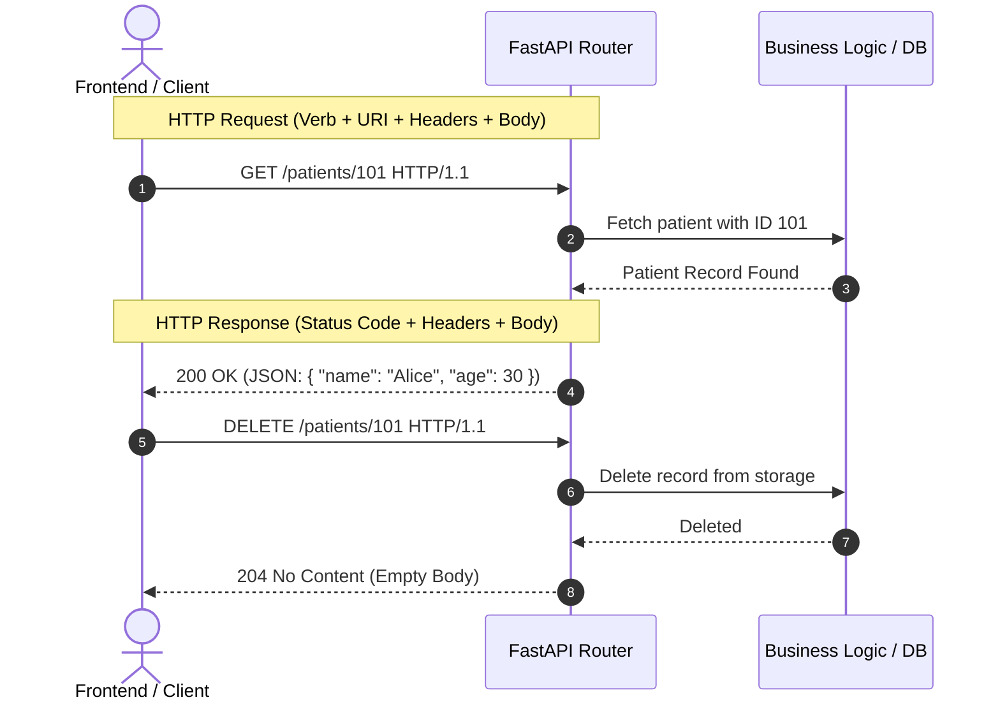

# 📹 HTTP Methods in FastAPI: GET, POST, PUT, DELETE & Status Codes

<div className="video-card" style={{border: '1px solid #30363d', borderRadius: '8px', padding: '16px', marginBottom: '24px', background: 'rgba(56, 139, 253, 0.05)'}}>
  <div style={{display: 'flex', gap: '16px', flexWrap: 'wrap'}}>
    <div><strong>Instructor:</strong> Nitish Singh (CampusX)</div>
    <div><strong>Duration:</strong> 16m 10s</div>
    <div><strong>Course:</strong> Module 1 - Production Backend & Docker</div>
    <div><strong>Watch Link:</strong> <a href="https://www.youtube.com/watch?v=O8KrViWNhOM" target="_blank" rel="noopener noreferrer">YouTube Lecture ↗</a></div>
  </div>
</div>


## 📌 Executive Summary

Modern RESTful APIs rely on standardized **HTTP Verbs (Methods)** to describe actions performed on resources. In this lesson, we explore how HTTP methods map to CRUD (Create, Read, Update, Delete) operations, the concepts of **Safety** and **Idempotency**, and how FastAPI handles HTTP status codes.

---

## 🏗️ Architecture: HTTP Request & Response Anatomy



---

## 📖 Core Concepts & Technical Deep Dive

### 1. The Core HTTP Verbs in REST
| Method | CRUD Equivalent | Safe? | Idempotent? | Typical Use Case in AI Engineering |
| :--- | :--- | :--- | :--- | :--- |
| **GET** | Read | ✅ Yes | ✅ Yes | Retrieve model metadata, check service health, fetch past predictions |
| **POST** | Create / Action | ❌ No | ❌ No | Submit inference inputs, generate embeddings, create training jobs |
| **PUT** | Replace / Update | ❌ No | ✅ Yes | Full overwrite of an agent configuration or hyperparameter set |
| **PATCH** | Partial Update | ❌ No | ❌ No | Update a single threshold or token budget without rewriting resource |
| **DELETE** | Delete | ❌ No | ✅ Yes | Terminate an inference worker, purge cache, or delete a dataset |

> **Safety:** The operation does not modify server state (read-only).  
> **Idempotency:** Making the same request multiple times produces the exact same server state as making it once.

### 2. HTTP Status Code Taxonomy
- **`2xx` Success:**
  - `200 OK`: Request succeeded (standard response for `GET`, `PUT`, `PATCH`).
  - `201 Created`: Resource successfully created (standard for `POST`).
  - `204 No Content`: Action succeeded, but no body returned (standard for `DELETE`).
- **`4xx` Client Error:**
  - `400 Bad Request`: Malformed syntax or invalid client inputs.
  - `401 Unauthorized`: Missing or invalid authentication token.
  - `403 Forbidden`: Authenticated, but lacking permission.
  - `404 Not Found`: Target resource URI does not exist.
  - `422 Unprocessable Entity`: FastAPI's default for Pydantic validation failures.
- **`5xx` Server Error:**
  - `500 Internal Server Error`: Unhandled exception in Python code.
  - `503 Service Unavailable`: GPU worker out of memory (OOM) or overloaded.

---

## 💻 Practical Code: Implementing RESTful Endpoints

```python
from fastapi import FastAPI, status, HTTPException
from typing import Dict, List

app = FastAPI(title="Patient Management & Diagnostics API")

# In-memory database
patients_db = {
    "P001": {"name": "Alice Smith", "age": 34, "diagnosis": "Hypertension"},
    "P002": {"name": "Bob Jones", "age": 52, "diagnosis": "Type 2 Diabetes"}
}

@app.get("/patients", status_code=status.HTTP_200_OK)
async def list_patients() -> Dict[str, Dict]:
    """Retrieve all registered patients."""
    return patients_db

@app.get("/patients/{patient_id}", status_code=status.HTTP_200_OK)
async def get_patient(patient_id: str):
    """Retrieve a specific patient by ID."""
    if patient_id not in patients_db:
        raise HTTPException(
            status_code=status.HTTP_404_NOT_FOUND,
            detail=f"Patient with ID '{patient_id}' does not exist."
        )
    return patients_db[patient_id]

@app.delete("/patients/{patient_id}", status_code=status.HTTP_204_NO_CONTENT)
async def delete_patient(patient_id: str):
    """Delete a patient record."""
    if patient_id not in patients_db:
        raise HTTPException(
            status_code=status.HTTP_404_NOT_FOUND,
            detail=f"Patient '{patient_id}' not found."
        )
    del patients_db[patient_id]
    return None
```

---

## 💡 Production Best Practices & Tips

:::tip Use `status` Constants
Avoid hardcoding raw status integers like `200` or `404`. Always import and use `fastapi.status` constants (e.g., `status.HTTP_201_CREATED`) to eliminate typos and enhance readability.
:::

:::warning Avoid GET Requests with Request Bodies
While the HTTP/1.1 spec does not explicitly forbid a body on a GET request, most web proxies, caches (like Cloudflare), and client libraries strip it. Use Query Parameters for GET, and reserve Bodies for POST/PUT/PATCH.
:::

