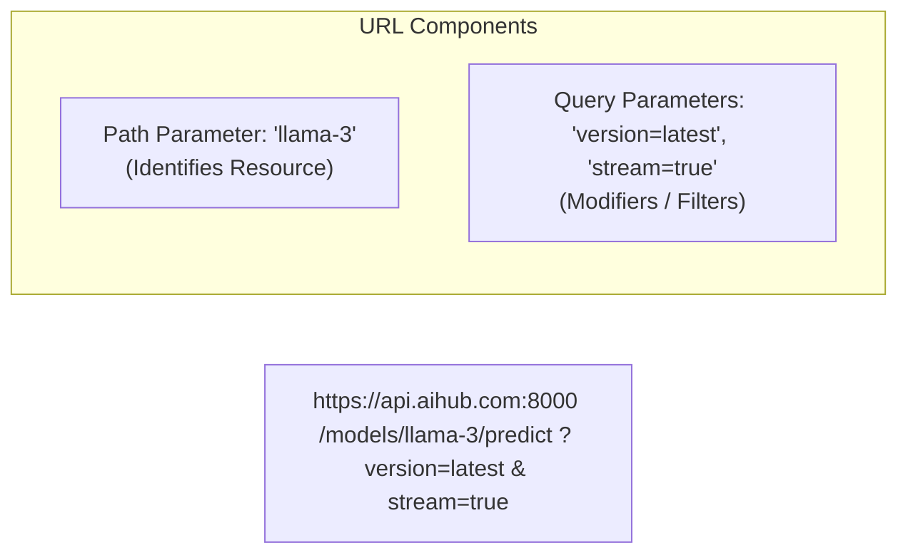

# 📹 Path & Query Parameters: Type Annotations & Validation

<div className="video-card" style={{border: '1px solid #30363d', borderRadius: '8px', padding: '16px', marginBottom: '24px', background: 'rgba(56, 139, 253, 0.05)'}}>
  <div style={{display: 'flex', gap: '16px', flexWrap: 'wrap'}}>
    <div><strong>Instructor:</strong> Nitish Singh (CampusX)</div>
    <div><strong>Duration:</strong> 22m 15s</div>
    <div><strong>Course:</strong> Module 1 - Production Backend & Docker</div>
    <div><strong>Watch Link:</strong> <a href="https://www.youtube.com/watch?v=VVVKEfhXCQ4" target="_blank" rel="noopener noreferrer">YouTube Lecture ↗</a></div>
  </div>
</div>


## 📌 Executive Summary

Every Web API endpoint receives inputs through different channels. Two of the most common are:
1. **Path Parameters:** Embedded directly in the URL path to identify a specific resource (e.g., `/models/{model_id}`).
2. **Query Parameters:** Key-value pairs appended after the `?` in the URL to filter, sort, paginate, or configure options (e.g., `/predictions?limit=10&sort_by=confidence`).

FastAPI automatically parses, validates, and casts these parameters based purely on your standard Python type annotations.

---

## 🏗️ Architecture: Anatomy of an HTTP URI



---

## 📖 Core Concepts & Technical Deep Dive

### 1. Path Parameters & Endpoint Precedence
Path parameters are declared with curly braces `{param_name}` in the route decorator and matched as function arguments:

```python
@app.get("/models/{model_id}")
async def get_model(model_id: str):
    return {"model_id": model_id}
```

> **Critical Rule on Route Order:** In FastAPI, route evaluation happens sequentially from top to bottom. If you have a static route `/models/me` and a dynamic route `/models/{model_id}`, **`/models/me` must be defined first**! Otherwise, FastAPI will capture `"me"` as a `model_id`.

### 2. Predefined Values with Python `Enum`
If a path parameter should only accept a fixed set of allowed options (like supported model names), use Python's `Enum`:

```python
from enum import Enum

class ModelArchitecture(str, Enum):
    LLAMA_3 = "llama-3-8b"
    MISTRAL = "mistral-7b"
    GEMMA_2 = "gemma-2-9b"
```

### 3. Query Parameters & Optional Defaults
Any function parameter that is **not** present in the path template is automatically treated by FastAPI as a **Query Parameter**:

- Required Query Param: `q: str`
- Optional Query Param with default: `limit: int = 10`
- Fully Optional Query Param: `q: Optional[str] = None`

---

## 💻 Practical Code: Validating Parameters with `Path` and `Query`

FastAPI provides `Path` and `Query` functions to enforce strict validation rules:

```python
from fastapi import FastAPI, Path, Query, status
from typing import Optional, List
from enum import Enum

app = FastAPI(title="Model Catalog API")

class Environment(str, Enum):
    DEVELOPMENT = "dev"
    STAGING = "staging"
    PRODUCTION = "prod"

@app.get("/deployments/{deployment_id}")
async def get_deployment(
    deployment_id: int = Path(
        ...,
        title="Deployment ID",
        description="The unique integer ID of the model deployment.",
        ge=1,
        le=100000
    ),
    env: Environment = Query(
        Environment.PRODUCTION,
        description="Target deployment environment."
    ),
    include_metrics: bool = Query(
        False,
        description="Whether to include latency and GPU memory usage."
    ),
    tags: Optional[List[str]] = Query(
        None,
        description="Filter metrics by custom tags."
    )
):
    return {
        "deployment_id": deployment_id,
        "environment": env.value,
        "include_metrics": include_metrics,
        "filtered_tags": tags or []
    }
```

---

## 💡 Production Best Practices & Tips

:::tip Automatic Type Coercion
If a client sends `/deployments/42?include_metrics=true`, FastAPI automatically parses `"42"` as the integer `42`, and `"true"` as Python boolean `True`. If the client passes `"abc"` for `deployment_id`, FastAPI automatically returns a `422 Unprocessable Entity` with a precise error location.
:::

:::info Regex Validation
You can add regex pattern matching to strings: `Query(..., pattern="^[a-zA-Z0-9_-]+$")` to sanitize inputs and prevent injection attacks.
:::

