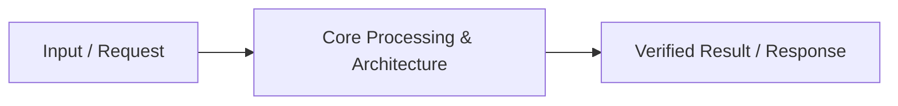

# 📹 Path & Query Params in FastAPI

<div className="video-card" style={{border: '1px solid #30363d', borderRadius: '8px', padding: '16px', marginBottom: '24px', background: 'rgba(56, 139, 253, 0.05)'}}>
  <div style={{display: 'flex', gap: '16px', flexWrap: 'wrap'}}>
    <div><strong>Instructor:</strong> Nitish Singh (CampusX)</div>
    <div><strong>Duration:</strong> 41m 12s</div>
    <div><strong>Playlist:</strong> FastAPI for ML & GenAI</div>
    <div><strong>Watch Link:</strong> <a href="https://www.youtube.com/watch?v=VVVKEfhXCQ4" target="_blank" rel="noopener noreferrer">YouTube Lecture ↗</a></div>
  </div>
</div>

## 📌 Executive Summary & Learning Objectives

This lecture covers **Path & Query Params in FastAPI**, focusing on production implementations, edge cases, and industry standards:
- Core intuition, architecture, and underlying mechanisms.
- Key differences between theoretical research implementations and scalable enterprise patterns.
- Concrete Python walkthroughs, error recovery, and performance optimization.

---

## 🏗️ Architecture & Conceptual Workflow



---

## 📖 Core Concepts & Technical Deep Dive

### 1. Architectural Foundations
In modern production AI engineering, **Path & Query Params in FastAPI** is essential for ensuring reliability, low latency, and deterministic outcomes. As AI systems evolve from naive prompt-in / completion-out scripts into distributed systems, engineers must handle:
- **State management & consistency:** Ensuring intermediate states and tool invocations are tracked.
- **Error boundaries & recovery:** Graceful degradation when external LLMs or vector stores encounter rate limits or network partitions.
- **Resource utilization & cost efficiency:** Caching common queries and reducing unnecessary foundation model token expenditure.

### 2. Operational Considerations
- **Latency Optimization:** Pre-computing embeddings, utilizing asynchronous non-blocking event loops, and streaming tokens via Server-Sent Events (SSE).
- **Security & Sandboxing:** Validating inputs before ingestion, sanitizing LLM outputs, and isolating tool execution environments.

---

## 💻 Production Implementation Walkthrough

```python
# Production Implementation Blueprint
def run_production_pipeline():
    print("Executing production pipeline...")

if __name__ == "__main__":
    run_production_pipeline()
```

---

## 💡 Production Best Practices & Tips

:::tip Production Deployment Guideline
When deploying Path & Query Params in FastAPI in enterprise environments, always configure automated retries with exponential backoff and telemetry tracing (such as OpenTelemetry or LangSmith).
:::

:::warning Common Failure Modes
Watch out for state contamination across concurrent requests. Ensure each session or user interaction uses an isolated thread ID or execution context.
:::

---

## 🎯 Key Takeaways & Quick Reference

| Dimension | Production Standard | Pitfall to Avoid |
| :--- | :--- | :--- |
| **Execution** | Async / Non-blocking with timeouts | Synchronous blocking calls in event loops |
| **Data Validation** | Strict Pydantic v2 schemas | Untyped dictionary access |
| **Monitoring** | Distributed tracing & latency percentiles | Relying only on standard console logs |

## ⏱️ Lecture Timeline & Key Topics

| Timestamp | Key Topic / Concept Discussed |
| :--- | :--- |
| **00:00:00** | हाय गाइज़, माय नेम इज़ नितेश एंड यू आर... |
| **00:09:50** | ठीक है तो ये तो एक तरीका हो गया सेकंड... |
| **00:19:17** | गड़बड़ हो गई। ठीक है? 502 बैड गेटवे का... |
| **00:30:00** | है। ठीक है? यहां पे देखो लिखा हुआ है।... |
| **00:41:10** | में। बाय।... |


---

---

## 📜 Complete Lecture Transcript (Hindi / Hinglish)

> **Language:** Hindi / Hinglish | **Source:** `04 - Path & Query Params in FastAPI ｜ Video 4 ｜ CampusX.hi.srt` | **Total Segments:** 21 | **Word Count:** ~6,650 words

<details>
<summary><b>Click to expand full chronological transcript (21 timestamped intervals)</b></summary>

#### ⏱️ [00:00 ➔ 00:02]

हाय गाइज़, माय नेम इज़ नितेश एंड यू आर वेलकम टू माय YouTube चैनल। इस वीडियो में भी हम लोग अपना फास्ट एपीआई प्लेलिस्ट कंटिन्यू करेंगे और हम लोग एग्जैक्टली वहीं से वीडियो को शुरू करेंगे जहां पे हमने लास्ट वीडियो को खत्म किया था। अब आज की वीडियो का जो गोल है वो बहुत सिंपल है। हमने जो प्रोजेक्ट डिस्कस किया था लास्ट वीडियो में हम उसी को कंटिन्यू करने वाले हैं। और आज के वीडियो में नॉट ओनली हम प्रोजेक्ट को कंटिन्यू करेंगे बट दो बहुत इंपॉर्टेंट कांसेप्ट्स भी सीखेंगे। अ जिनका नाम है पाथ पैराटर्स एंड क्वेरी पैराटर्स। ठीक है? तो नाउ लेट्स स्टार्ट द वीडियो। अ सो सबसे पहले बात कर लेते हैं पाथ पैराटर्स की बिकॉज़ पास्ट एपीआई में इट्स अ वेरी वेरीरीेंट कांसेप्ट। सो व्हाट आई विल डू इज़ पहले मैं आपको एक डेफिनेशन पढ़ के सुनाता हूं और फिर मैं आपको थोड़ा एग्जांपल के थ्रू समझाता हूं कि पाथ पैराटर्स होते क्या हैं। सो यहां पे देखो मैंने लिखा है पाथ पैराटर्स आर डायनेमिक सेगमेंट्स ऑफ अ यूआरएल पाथ यूज्ड टू आइडेंटिफाई अ स्पेसिफिक रिसोर्स। ठीक है? अब इस बात को एक एग्जांपल के थ्रू समझते हैं। अगर आपने लास्ट वीडियो देखा होगा तो आपको याद होगा कि लास्ट वीडियो में हमने क्या किया था कि हमने एक एंड पॉइंट डिजाइन किया था हमारे प्रोजेक्ट के अंदर जहां पर हम इस एंड पॉइंट की हेल्प से हमारे डेटाबेस में एज इन हमारे json फाइल में जितने भी पेशेंट्स का डेटा था हम वो सारा का सारा डेटा एक साथ लोड करके यूजर को दिखा रहे थे। ठीक है? सो इफ यू रिमेंबर हमारा पाथ कुछ ऐसा था। यूआरएल कुछ ऐसा था। लोकल होस्ट 8000 सश व्यू। जैसे ही कोई भी इस यूआरएल पे हिट कर रहा था तो उसको सारे के सारे पेशेंट्स का डिटेल दिखाई दे रहा था। नाउ लेट मी आस्क यू अ क्वेश्चन। व्हाट इफ मैं एक ऐसा एंड पॉइंट बनाना चाहता हूं जिस पे हिट करके हम सारे पेशेंट्स का डाटा ना देख पाएं। बट अपने पसंद के अपने चॉइस के पेशेंट का डेटा देख पाएं। जैसे हमारे

#### ⏱️ [00:02 ➔ 00:04]

डेटाबेस में करेंटली पांच पेशेंट्स हैं। एंड व्हाट आई वांट इज़ कि मैं थर्ड पेशेंट का डेटा देखना चाहता हूं। मुझे बाकियों से फर्क नहीं पड़ता। तो यहां पर आप क्या कर सकते हो कि आप अपने यूआरएल में एक छोटा सा मॉडिफिकेशन कर सकते हो। जैसे कि आपका यूआरएल हो सकता है लोकल होस्ट 8000 व्यू 3 अब यहां पे ये जो थ्री है ना ये आपके यूआरएल का एक डायनेमिक पार्ट है जो बदला जा सकता है। यहां पर आप इस पार्ट को नहीं बदल सकते लोकल होस्ट बिकॉज़ यह आपका डोमेन है। आप इस व्यू को भी नहीं बदल सकते। बट आप इस थ्री को बदल सकते हो। किसी और दूसरे क्लाइंट के हिसाब से। यह थ्री के बदले फोर आ सकता है या फाइव आ सकता है। राइट? तो ये डायनेमिक पोर्शन है और ये जो पोर्शन है हमारे यूआरएल का इसका सिर्फ एक ही काम है कि ये एक स्पेसिफिक रिसोर्स को लोकेट करता है हमारे सर्वर पे। ठीक है? तो यही काम होता है पाथ पैरामीटर का। यहां पे जो ये थ्री लिखा हुआ है या फिर ये जो फोर हमने काट के लिखा ये जो डायनेमिक सेगमेंट है इसी को हम पाथ पैरामीटर बुलाते हैं। ठीक है? एंड आई एम प्रीटी श्योर आप आसानी से समझ पा रहे होंगे कि इसका फायदा क्या है? इस पाथ पैरामीटर की हेल्प से हम बहुत सारे रिसोर्सेज जो पड़े हुए हैं, बहुत सारे पेशेंट्स जो पड़े हुए हैं हमारे सर्वर पे उनमें से किसी एक पर्टिकुलर रिसोर्स को आइडेंटिफाई कर पा रहे हैं। ठीक है? तो ये बहुत हेल्प करता है जब आप डेटा रिट्रीव करना चाहते हो। मान लो आपके पास बहुत सारे सोशल मीडिया अकाउंट्स हैं और आप किसी पर्टिकुलर बंदे का प्रोफाइल दिखाना चाहते हो तो अगेन वहां पर आप पाथ पैरामीटर यूज कर सकते हो या फिर आप मान लो अपडेट ऑपरेशन परफॉर्म करना चाहते हो तो ऑब्वियसली आप किसी सिंगल रिसोर्स को अपडेट करना चाहोगे तो फिर यहां पे भी आप पाथ पैरामीटर्स यूज़ करोगे या फिर आप किसी पर्टिकुलर रिसोर्स को डिलीट करना चाहते हो तो वहां पर भी आप पाथ पैरामीटर्स यूज़

#### ⏱️ [00:04 ➔ 00:06]

करोगे। तो इन तीन ऑपरेशंस में आप पाथ पैरामीटर्स एक्सटेंसिवली यूज़ करते हो। ठीक है? तो हम क्या करेंगे? हम अभी हमारा जो प्रोजेक्ट है उसमें एक नया एंड पॉइंट क्रिएट करेंगे। और इस एंड पॉइंट में हम ये कोड लिखेंगे कि क्लाइंट जो है यूजर जो है वो अपने पसंद के किसी भी पेशेंट का डेटा देख सकता है। ठीक है? सारे पेशेंट्स का डेटा नहीं दिखाना है। किसी स्पेसिफिक पेशेंट का डेटा दिखाना है। और वो पेशेंट होगा कौन? यह हमें यूआरएल के थ्रू बताया जाएगा यूजिंग पाथ पैराटर्स। ठीक है? तो आई होप आपको यहां तक का डिस्कशन समझ में आ गया। तो नाउ व्हाट आई विल डू इज़ आई विल गो बैक टू माय कोड और यहां पे हम स्टार्ट करते हैं कोड करना। तो सबसे पहले आपको क्या करना है? फिर से आपको अपना राउट डिफाइन करना है। ठीक है? अ थोड़ी देर के लिए हम यहां पे अपना जो राउट है उसका नाम मान लेते हैं पेशेंट है। ठीक है? तो हमारा पूरा यूआरएल कैसा दिखाई देगा? लोकल होस्ट कोलोन 8000 पेशेंट। ठीक है? बट हमें सिर्फ पेशेंट पास करने से हमारा काम नहीं चलेगा। हमें साथ ही साथ पेशेंट का आईडी भी चाहिए। तो यहां पर हम क्या कर रहे हैं? हमारे पाथ में अ एक डायनेमिक सेगमेंट ऐड कर रहे हैं और वो सेगमेंट है पेशेंट आईडी। ठीक है? ठीक है? तो जभी भी कोई इस एंड पॉइंट को हिट करेगा तो वो जो यूआरएल लिखेगा वो कुछ इस तरह का होगा। लोकल होस्ट कोलोन 8000 पेशेंट स्लश पेशेंट का आईडी जो भी पेशेंट उसको देखना है। ठीक है? तो ये हमने यहां पर एक वेरिएबल की तरह डिफाइन कर दिया। बिकॉज़ ऑब्वियसली दिस इज़ अ वेरिएबल। हमें अभी नहीं पता कि फ्यूचर में क्लाइंट कौन से पेशेंट का डेटा देखना चाहेगा। ठीक है? तो, यह हो गया हमारा राउट। अब हम इस राउट से एसोसिएटेड एक फंक्शन क्रिएट करेंगे। तो फंक्शन का नाम रखते हैं व्यू पेशेंट। ठीक है? और यहां पे इस व्यू पेशेंट को अपना काम करने के लिए एक पेशेंट आईडी चाहिए होगी। ठीक है? तो हम क्या करेंगे? यहां पे

#### ⏱️ [00:06 ➔ 00:08]

राउट में हमें जो पेशेंट आईडी मिल रही होगी वही पेशेंट आईडी हम यहां पे पास कर देंगे। तो हम लिखेंगे पेशेंट आईडी। ठीक है? इस पर्टिकुलर फंक्शन को अपना काम करने के लिए एक पेशेंट आईडी चाहिए। और हम यहां पे इस पेशेंट आईडी का डेटा टाइप भी स्पेसिफाई कर देंगे। तो हमारा जो पेशेंट आईडी होने वाला है वो एक स्ट्रिंग होने वाला है। स्ट्रिंग क्यों होने वाला है? बिकॉज़ अगर आप अपने पेशेंट डॉट json में जाओ तो आप नोटिस करोगे कि हमारी जो आईडीज हैं वो कुछ इस तरीके की दिखाई देती हैं। P01 P002 दैट इज़ व्हाई हम इसको स्ट्रिंग लेके चल रहे हैं। ठीक है? तो ये बन गया हमारा फंक्शन। ठीक है? अब इस फंक्शन के अंदर हमें अपना डेफिनेशन क्रिएट करना है। फंक्शन का लॉजिक लिखना है। तो फंक्शन का लॉजिक बहुत सिंपल है। पहले हम क्या करेंगे? पूरा का पूरा पेशेंट्स का डाटा लोड करेंगे और फिर उसमें खोजेंगे कि यह पर्टिकुलर पेशेंट आईडी एग्जिस्ट करता है या नहीं। अगर करता है तो इस पेशेंट का डेटा हम दिखा देंगे। अदरवाइज हम बोलेंगे इट्स एन एरर। ठीक है? तो सबसे पहले वी विल लोड ऑल द पेशेंट्स। अब अच्छी बात क्या है कि हमने लास्ट वीडियो में एक यूटिलिटी फंक्शन बनाया था जिसकी हेल्प से आप पूरा डेटा लोड कर सकते हो। तो मैं लिख रहा हूं डेटा इज इक्वल टू लोड डेटा। ठीक है? तो अब मेरे पास सारे पेशेंट्स का डाटा है। ठीक है? नाउ व्हाट आई विल डू इज़ मैं यहां पे एक सिंपल इफ स्टेटमेंट लिखूंगा कि इफ पेशेंट आईडी इन दिस डेटा। ठीक है? बिकॉज़ ये डिक्शनरी की तरह ट्रीट हो रहा है। तो हम चेक कर रहे हैं कि यह पर्टिकुलर पेशेंट आईडी एज की हमारे कंप्लीट डेटा में एग्जिस्ट करता है कि नहीं। अगर करता है तो हम सिंपली रिटर्न कर देंगे अ डेटा के अंदर से पेशेंट आईडी। ठीक है? सोच के देखो। अगर यहां पे मुझे पेशेंट आईडी में P01 मिला तो मैं यहां पे क्या चेक कर रहा हूं कि क्या P01 मेरे डिक्शनरी में एज इन इस पूरे डेटा में एग्ज़िस्ट करता है कि नहीं। अगर एग्ज़िस्ट

#### ⏱️ [00:08 ➔ 00:10]

करता है तो मैं उससे एसोसिएटेड जो सारी वैल्यू है वो रिटर्न कर दूंगा। ठीक है? और अगर यह रिटर्न स्टेटमेंट कभी ट्रिगर नहीं हुआ, इसका मतलब यह है कि यह पर्टिकुलर पेशेंट आईडी हमारे डेटा में एक्सिस्ट नहीं करता। तो इन दैट केस हम यहां पर एक एरर मैसेज रिटर्न कर देंगे। और वो एरर मैसेज होगा पेशेंट नॉट फाउंड। एंड दैट्स इट गाइस। दिस इज द कोड। ठीक है? एक बार फिर से समझ लेते हैं इसको। हमारे यूआरएल में क्लाइंट ने लिखा कि उसको पेशेंट स्लश P01 वाला पेशेंट चाहिए। तो हमने यहां पे इस राउट की हेल्प से वो P01 को रिसीव कर लिया इन द वेरिएबल पेशेंट आईडी और वही हमने पास कर दिया इस फंक्शन में। ठीक है? और अब इस फंक्शन में हम क्या कर रहे हैं? डेटा को लोड करके चेक कर रहे हैं कि वो पर्टिकुलर पेशेंट आईडी हमारे डेटा में एग्ज़िस्ट करता है कि नहीं। अगर करता है तो उससे एसोसिएटेड डेटा रिटर्न कर रहे हैं। अदरवाइज़ हम बोल रहे हैं कि पेशेंट नॉट फाउंड। बहुत ही सिंपल स्ट्रेट फॉरवर्ड कोड है। ठीक है? तो अब एक काम करते हैं। इस कोड को रन करते हैं। तो हमने यूवीकॉन वाला कमांड रन किया। एंड यू कैन सी हमारा सर्वर इज़ अप एंड रनिंग। एक बार सो ये रहा हमारा एप्लीकेशन। ठीक है? यह हमारा एपीआई रन कर रहा है। अब हम क्या करते हैं? एक बार हिट करते हैं पेशेंट P01। अब हम लोग क्या करते हैं? एक बार हिट करते हैं हमारे उस एंड पॉइंट के ऊपर। सो हमारे एंड पॉइंट का नाम है पेशेंट और लेट्स से हमें सेकंड पेशेंट या थर्ड पेशेंट का डाटा देखना है तो मैं लिखूंगा P003 एंटर मारा एंड यू कैन सी ये रहा हमारा सेकंड पेशेंट का डेटा या फिर लेट्स से मुझे फिफ्थ पेशेंट का डेटा देखना है तो P005 ये रहा हमारा फिफ्थ पेशेंट का डेटा ठीक है तो ये तो एक तरीका हो गया सेकंड तरीका है कि आप ऑटोमेटेड जो डॉक्यूमेंट्स हैं डॉक्यूमेंटेशन है उसकी हेल्प से भी आप यह काम कर सकते हो बिकॉज़ इंटरेक्टिव है वो

#### ⏱️ [00:10 ➔ 00:12]

डॉक्यूमेंटेशन। तो ये देखो ये रहा हमारा फोर्थ एंड पॉइंट पेशेंट स्लैश पेशेंट आईडी। यहां पे देखो लिखा आ रहा है कि पेशेंट आईडी एक पाथ पैरामीटर है जो कि रिक्वायर्ड है। ठीक है? तो व्हाट वी विल डू इज़ हम ट्राई इट आउट पे जाएंगे। यहां पे लिखेंगे P01 एग्जीक्यूट पे क्लिक करेंगे और अगर आप नीचे जाओ तो ये रहा हमारा फर्स्ट पेशेंट का डेटा। ठीक है? तो अभी हमने जस्ट क्या किया कि पाथ पैरामीटर क्या होता है ये डिस्कस किया और पाथ पैरामीटर की हेल्प से हमने एक एंड पॉइंट बनाया और हम हमारे सारे रिसोर्सेज के अंदर में से एक कोई स्पेसिफिक रिसोर्स लोड कर पा रहे हैं। ठीक है? तो अब नेक्स्ट क्या करते हैं? ये जो कोड हमने लिखा है इसको थोड़ा सा और इंप्रूव करते हैं। सो जो फर्स्ट इंप्रूवमेंट हम ला सकते हैं वो थोड़ा सा कोड रीडेबिलिटी के टर्म्स में ला सकते हैं। जैसे अभी हमने ये जो एंड पॉइंट बनाया है अगर आप इसको जाकर के हमारे डॉक्स में चेक करो। जैसे यह हमारा डॉक्स है। ये रहा हमारा एंड पॉइंट। तो यहां पर दिखाई तो दे रहा है कि पेशेंट आईडी नाम का एक पाथ पैरामीटर है। बट इसके अलावा हमें कुछ और इसके बारे में समझ नहीं आ रहा है। सो इफ आई एम द क्लाइंट और मुझे इस एंड पॉइंट को यूज़ करना है। मुझे थोड़ा ज्यादा इंफॉर्मेशन मिलना चाहिए अबाउट द पाथ पैरामीटर। ठीक है? मे बी यहां पर अगर हम एक डिस्क्रिप्शन ऐड कर दें या फिर इफ पॉसिबल यहां पर एक एग्जांपल ऐड कर दें कि पेशेंट आईडी दिखता कैसा है? तो फिर क्लाइंट को इस एंड पॉइंट को कॉल करने में बहुत आसानी होगी। तो इस पर्टिकुलर चीज के लिए हम क्या करेंगे कि हम एक स्पेशल फंक्शन यूज़ करेंगे। इस फंक्शन का नाम है पाथ और यह आपको फास्ट एपीआई के अंदर ही मिलता है। पाथ की हेल्प से आप क्या कर सकते हो कि अपने पाथ पैराटर्स की जो रीडेबिलिटी है उसको एनहांस कर सकते हो। इसके अलावा आप थोड़ा डेटा वैलिडेशन भी ऐड कर सकते हो। इनफैक्ट लेट मी शो यू कि आप पाथ फंक्शन से क्या-क्या कर सकते हो। यहां पर मैंने एक डेफिनेशन लिखा है। द पाथ

#### ⏱️ [00:12 ➔ 00:14]

फंक्शन इज इन फास्ट एपीआई इज यूज्ड टू प्रोवाइड मेटा डेटा वैलिडेशन रूल्स एंड डॉक्यूमेंटेशन हिंट्स फॉर पाथ पैराटर्स इन योर एपीआई एंड पॉइंट्स। ठीक है? तो यहां पर आप एक टाइटल ऐड कर सकते हो। अगर आप चाहो आप एक डिस्क्रिप्शन ऐड कर सकते हो। आप एक एग्जांपल या मल्टीपल एग्जांपल्स दे सकते हो। इसके अलावा आप चाहो तो वैलिडेशन भी ऐड कर सकते हो। जैसे मान लो पेशेंट आईडी जो होता अगर वो इंटीजर होता हमारे केस में तो स्ट्रिंग है बट मान लो अगर इंटीजर होता तो हम वहां पे ग्रेटर दैन इक्वल टू ग्रेटर दैन लेस दैन इक्वल टू लेस दैन का भी वैलिडेशन लगा सकते थे। हम लगा सकते थे कि भाई 100 से ऊपर पेशेंट आईडी नहीं जा सकता या ज़ीरो से नीचे नहीं जा सकता। नेगेटिव में पेशेंट आईडी नहीं हो सकता। तो इस तरीके की चीजें हम यहां पे कर सकते हैं। सिमिलरली आप मिन लेंथ मैक्स लेंथ के ऊपर भी कंस्ट्रेंट अप्लाई कर सकते हो। और अगर आप चाहो तो कोई रेग्स पैटर्न का भी डेटा वैलिडेशन अप्लाई कर सकते हो यूजिंग द पाथ फंक्शन। ठीक है? तो अब मैं आपको दिखाता हूं कि पाथ फंक्शन को एग्जैक्टली यूज़ कैसे करना है कोड में। सो, हमने ऊपर तो इंपोर्ट कर लिया है। अब आपको क्या करना होता है कि जहां पर आप अपने फंक्शन के अंदर रिसीव कर रहे होते हो पाथ पैरामीटर को वहीं पर आप क्या करते हो? इक्वल टू पाथ फंक्शन कॉल कर देते हो। अब यहां पे आपको क्या करना होता है? जो भी चीजें आपको करनी है यहां पर आप डाल सकते हो। जैसे फिलहाल मैं आपको एक डिस्क्रिप्शन और एक एग्जांपल ऐड करके दिखाता हूं। तो सबसे पहले आप यहां पर तीन डॉट डालते हो। तीन डॉट ये बताता है कि ये पाथ पैरामीटर इज़ अ रिक्वायर्ड। हालांकि सारे पाथ पैरामीटर्स रिक्वायर्ड ही होते हैं। बट ये एक अच्छा तरीका है। तीन डॉट्स का मतलब जो भी है वह रिक्वायर्ड है। ठीक है? उसके बाद हम डिस्क्रिप्शन में लिख रहे हैं आईडी ऑफ द पेशेंट इन द डीबी। ठीक है? उसके बाद हम एक एग्जांपल ऐड कर रहे हैं। और एक एग्जांपल हमारा ऐसा दिखाई देगा P01। ठीक है? और इसके अलावा आप बहुत तरह की चीजें कर सकते हो। ग्रेटर दैन

#### ⏱️ [00:14 ➔ 00:16]

इक्वल टू ज़ीरो कर सकते हो। इस तरीके से आप वैलिडेशन ऐड कर सकते हो। फिलहाल हमारे केस में जरूरत नहीं है। तो व्हाट आई विल डू इज़ आई विल सेव दिस एंड एक काम करते हैं। वर्डप ऑन कर देते हैं। सो या ये हमने पाथ फंक्शन को कॉल कर दिया। अब एक बार चलते हैं वापस अपने डॉक्यूमेंटेशन के पास और चलते हैं अपने एंड पॉइंट की तरफ। अब यहां पे देखो क्या फायदा हो रहा है कि डिस्क्रिप्शन में सबसे पहले आपको एक डिस्क्रिप्शन दिखाई दे रहा है। अब इफ यू आर द क्लाइंट आपको यह पढ़ के समझ में आएगा कि ये पर्टिकुलर पैरामीटर मुझसे क्या एक्सपेक्ट कर रहा है। सिमिलरली यहां पे हमने एक एग्जांपल भी ऐड कर दिया। ठीक है? कि एक टिपिकल पेशेंट आईडी ऐसा दिखाई देता है। तो, इसकी हेल्प से पाथ फंक्शन की हेल्प से हम क्या कर पा रहे हैं? हमारे जो एंड पॉइंट्स हैं उसकी रीडेबिलिटी एनहांस कर पा रहे हैं। बिकॉज़ एट द एंड आपको अपने क्लाइंट के साथ काम करना है। तो क्लाइंट को अच्छा आईडिया होना चाहिए कि कोई भी एंड पॉइंट में क्या-क्या रिक्वायरमेंट्स हैं। ठीक है? तो दिस वाज़ द फर्स्ट इंप्रूवमेंट दैट आई वाज़ टॉकिंग अबाउट। अब बात करते हैं एक सेकंड इंप्रूवमेंट की। अब नेक्स्ट वाली प्रॉब्लम को समझने के पहले मैं आपको एक इंपॉर्टेंट कांसेप्ट पढ़ाना चाहता हूं जिसको हम बुलाते हैं HTTP स्टेटस कोड्स। यह एक बहुत इंपॉर्टेंट कांसेप्ट है अगर आप एपीआई डिजाइन थोड़ा डिटेल में समझना चाहते हो। सो होता क्या है कि पहले मैं आपको एक डेफिनेशन पढ़ाता हूं। फिर मैं आपको इसका डिटेल बताऊंगा। सो http स्टेटस कोड्स आर थ्री डिजिट नंबर्स रिटर्नड बाय अ वेब सर्वर टू इंडिकेट द रिजल्ट ऑफ अ क्लाइंट्स रिक्वेस्ट। ठीक है? तो बेसिक फंडा क्या होता है? मैंने आपको बताया है कि वेब डेवलपमेंट में या फिर एपीआई डेवलपमेंट में आपके पास अ आपका एपीआई या वेबसाइट एक सर्वर पे होता है और उसको एक्सेस करने की कोशिश करता है क्लाइंट फ्रॉम अ डिफरेंट मशीन और होता क्या है कि क्लाइंट एक रिक्वेस्ट भेजता है जो सर्वर रिसीव करता है उसके ऊपर प्रोसेसिंग करता है और पलट के एक रिस्पांस जनरेट करता है जो क्लाइंट के

#### ⏱️ [00:16 ➔ 00:18]

पास जाता है और यह पूरा का पूरा जो कम्युनिकेशन हो रहा है यह http प्रोटोकॉल फॉलो करता है ठीक है? अब यहां पर एक चीज मैंने अभी तक आपको नहीं बताई है कि जब यह रिस्पांस प्रिपेयर होता है सर्वर पे तो इस रिस्पांस में सर्वर हमेशा एक http स्टेटस कोड भी ऐड करता है जो कि बेसिकली एक थ्री थ्री डिजिट का नंबर होता है। ठीक है? अब यह थ्री डिजिट का नंबर क्लाइंट को यह बताता है कि उसने जो रिक्वेस्ट भेजा था उस रिक्वेस्ट के साथ हुआ क्या? क्या वो रिक्वेस्ट सक्सेसफुल रहा या फिर उसके साथ कुछ गलत हुआ या फिर अगर कुछ गलती हुई तो किस तरह की गलती हुई? तो बेसिकली ये स्टेटस कोड इज़ वेरीेंट और ये है हर एचटीटीपी रिस्पांस में आपको देखने को मिलता है। ठीक है? अ मेजरली आपके पास चार टाइप्स ऑफ स्टेटस कोड्स होते हैं। एक ऐसे स्टेटस कोड जो टू से स्टार्ट होते हैं। फिर जो थ्री से स्टार्ट होते हैं, फिर जो फोर से स्टार्ट होते हैं और जो फाइव से स्टार्ट होते हैं। ठीक है? अगर कभी भी आपको किसी भी http रिस्पांस में टू से स्टार्ट होने वाला स्टेटस कोड दिखाई दे तो आपको समझ जाना है कि आपने जो रिक्वेस्ट भेजा था वो सक्सेसफुल रहा था। ठीक है? अगर आपको थ्री से स्टार्ट होने वाला स्टेटस कोड मिले तो इसका मतलब है कि कुछ फर्दर एक्शन की जरूरत है आपके रिक्वेस्ट को फुलफिल करने के लिए। अगर फोर मिले तो समझ लो कि देयर इज़ सम एरर फ्रॉम द क्लाइंट साइड। जो रिक्वेस्ट क्लाइंट ने भेजी है उसमें ही कुछ गड़बड़ है और अगर आपको फाइव से स्टार्ट होने वाला स्टेटस कोड दिखाई दे तो यह सर्वर एरर होता है। इसका मतलब सर्वर की साइड से कुछ गड़बड़ हुई है। ठीक है? तो अब मैं आपको बताता हूं कुछ फेमस स्टेटस कोड्स बहुत सारे होते हैं बट कुछ फेमस वाले मैं डिस्कस करता हूं। सो सबसे पहला है 200। तो 200 का मतलब हुआ कि जो आपका रिक्वेस्ट आपने भेजा था उसका रिस्पांस सही से आया है। ठीक है? सो अगर मैं आपको दिखाऊं यहां पर आप देखो अभी हमने जस्ट अ एक काम करते हैं डॉक्स को लोड करते हैं यहां पे

#### ⏱️ [00:18 ➔ 00:20]

हम गए और ट्राई इट आउट में हमने P01 को एग्जीक्यूट किया और हमारे पास ये डेटा आ गया। अब यहां पे देखो आप एक स्टेटस कोड क्या आ रहा है? 200 तो कभी भी अगर आपका रिक्वेस्ट सही से प्रोसेस हो के रिस्पांस सही से आ रहा है तो आपको 200 मिलता है। 2001 का मतलब होता है कि जो भी रिसोर्स आप क्रिएट करना चाहते हो सर्वर पे वो आपने सही से क्रिएट कर दिया। यह मैं आपको पढ़ाऊंगा जब हम पोस्ट डिस्कस करेंगे इन अ फ्यूचर वीडियो। ठीक है? 204 का मतलब है कि सक्सेस है बट पलट के आपको कोई डेटा रिटर्न नहीं करना है। ये आप जनरली तब करते हो जब आप एक डिलीट रिक्वेस्ट प्रोसेस करते हो। बिकॉज़ डिलीट में आप डिलीट कर देते हो बट पलट के आपको कुछ दिखाना नहीं है। तो आप 204 दिखाते हो। 400 का मतलब है बैड रिक्वेस्ट। ठीक है? कुछ मिसिंग फील्ड है या रॉन्ग डेटा टाइप है। 401 का मतलब है अनऑथराइज्ड। आप उस पर्टिकुलर रिसोर्स को एक्सेस नहीं कर सकते विदाउट लॉगिंग इन। 403 इज़ फोरबिड इन अ आप लॉक्ड इन हो बट यू आर नॉट अलाउड टू सी। ठीक है? अ उसके बाद 404 तो बहुत फेमस है। आपने डेफिनेटली कभी ना कभी फेस किया होगा कि जो रिसोर्स आप खोज रहे हो, वह एग्ज़िस्ट ही नहीं करता। दैट इज़ 404। ठीक है? उसके बाद 500 बेस्ड भी है। 500 का मतलब है कि सर्वर पे ही कुछ गड़बड़ हो गई। ठीक है? 502 बैड गेटवे का मतलब है कि जो पूरा hटीtp कम्युनिकेशन है वो ब्रोकन है। कहीं पे कुछ गड़बड़ हुई है बीच में। सर्वेज़ अनअवेलेबल का मतलब है कि सर्वर इज़ इदर डाउन और ओवरलोडेड। ऑलरेडी बहुत सारे रिक्वेस्ट प्रोसेस हो रहे हैं। तो यू हैव टू ट्राई इट आफ्टर सम टाइम। तो ये कुछ फेमस स्टेटस कोड्स हैं जो आपको याद रखने हैं। अ एग्जैक्टली याद नहीं रखने हैं बट ये अगर आप एपीआई डिजाइन करते जाओगे तो आपको समझ में आने लग जाएंगे। ठीक है? तो अब मैं आपको दिखाता हूं कि हमारे कोड में प्रॉब्लम क्या है? ठीक है? देयर इज अ प्रॉब्लम जो मैं आपको शो करना चाहता हूं। सो प्रॉब्लम यह है कि अगर आप हमारे बनाए

#### ⏱️ [00:20 ➔ 00:22]

हुए इस एंड पॉइंट पर जाओ और यहां पर आप एक ऐसे पेशेंट का आईडी डालो जो हमारे डेटाबेस में एक्सिस्ट नहीं करता। तो होगा क्या कि आपको पलट के यह एरर दिखाई देगा। एरर क्या है? पेशेंट नॉट फाउंड व्हिच इज़ फाइन। ठीक है? बट द प्रॉब्लम इज कि स्टेटस कोड अभी भी क्या आ रहा है? 200 और 200 बाय डेफिनेशन क्या है? सक्सेस कि रिक्वेस्ट सही से प्रोसेस हो गया। आइडियली यहां पे आपको 404 दिखाना चाहिए था। बिकॉज़ जो रिसोर्स क्लाइंट खोज रहा है वो उसको नहीं मिला डेटाबेस में। ठीक है? तो अब हम क्या करेंगे? हम अपने कोड को इस तरीके से इंप्रूव करेंगे कि अगर कभी क्लाइंट नहीं मिलेगा तो हम 404 स्टेटस कोड जनरेट करेंगे और एक एरर मैसेज उसके साथ जनरेट करेंगे। ठीक है? और यह करने के लिए हमें चाहिए होगा अ एक कस्टम एक्सेप्शन क्लास जिसको हम http एक्सेप्शन बुलाते हैं। सो http एक्सेप्शन क्या है? वो भी मैं आपको बता देता हूं। यहां पे देखो लिखा हुआ है मैंने। HTTP एक्सेप्शन इज अ स्पेशल बिल्ट इन एक्सेप्शन। Python में अलग-अलग टाइप के एक्सेप्शनंस होते हैं। यहां पर http एक्सेप्शन इज अ स्पेशल बिल्ट इन एक्सेप्शन इन फास्ट एपीआई दैट इज़ यूज्ड टू रिटर्न कस्टम एचटीटीपी एरर रिस्पांससेस जब सब जब कुछ गड़बड़ होता है आपकी एपीआई में। ठीक है? तो इंस्टेड ऑफ़ रिटर्निंग अ नॉर्मल jसon जैसा हम कर रहे हैं। ये जो हम यहां पे रिटर्न कर रहे हैं। दिस इज़ अ नॉर्मल jसon। ये रिटर्न करने के बदले व्हाट यू कैन डू इज़ कि आप ग्रेसफुली एक एरर रेज़ कर सकते हो। और उस एरर में आप प्रॉपर एचटीटीपी स्टेटस कोड डाल सकते हो और आपका एक कस्टम एरर मैसेज भी डाल सकते हो। ठीक है? तो वही हम करने वाले हैं। सो व्हाट वी विल डू इज़ इंस्टेड ऑफ रिटर्निंग अ एरर पेशेंट नॉट फाउंड हम रेज करेंगे एक एचटीटीपी एक्सेप्शन। और यहां पे

#### ⏱️ [00:22 ➔ 00:24]

हम अपना स्टेटस कोड डालेंगे 404 और डिटेल में हम डालेंगे पेशेंट नॉट फाउंड। ठीक है? सो अब क्या हो रहा है? अगर डाटा सही से आ गया तो हम डाटा रिटर्न कर रहे हैं। अदरवाइज वी आर रेजिंग अ hटीtp एक्सेप्शन विद अ प्रॉपर स्टेटस कोड। तो चलो एक बार इसको ट्राई आउट करते हैं। ये रहा हमारा एंड पॉइंट। हम क्या करेंगे? ट्राइट आउट पे जाएंगे। यहां पे हम सेवन डालेंगे। एग्जीक्यूट पे क्लिक करेंगे। एंड यू कैन सी यहां पर देखो क्या आ रहा है। 404 ठीक है? और यह रहा हमारा रिस्पांस बॉडी जहां पर हम बोल रहे हैं डिटेल इज पेशेंट नॉट फाउंड। ठीक है? तो अब गोइंग फॉरवर्ड इस प्रोजेक्ट में जभी भी कुछ भी गड़बड़ होगा तो रादर देन रिटर्निंग नॉर्मल jसon वी विल रेज़ अ hटीtp एक्सेप्शन विद प्रॉपर स्टेटस कोड। ठीक है? तो आई होप आपको समझ में आ गया कि किस दो तरीके से हमने हमारे कोड को इंप्रूव किया। फर्स्ट हमने ये पाथ पैरामीटर पाथ फंक्शन ऐड किया और सेकंड हमने ये कस्टम एक्सेप्शन ऐड किया। ठीक है? अब बात करते हैं एक दूसरे बहुत इंपॉर्टेंट टाइप के पैरामीटर की जिसका नाम होता है क्वेरी पैरामीटर। अब क्या होता है क्वेरी पैरामीटर ये समझाने के लिए मैं आपको एक एग्जांपल सिचुएशन बताता हूं। सो हमने लास्ट वीडियो में एक एंड पॉइंट क्रिएट किया था व्यू नाम से। अगर हमारा क्लाइंट इस एंड पॉइंट पर हिट करेगा तो हम उसको सारे पेशेंट्स का सारा डिटेल दिखा देंगे। राइट? नाउ व्हाट इफ हमारा एक और रिक्वायरमेंट आया है और वो रिक्वायरमेंट यह है कि मैं इस पर्टिकुलर एंड पॉइंट में मेरे यूजर या फिर मेरे क्लाइंट को एक और ऑप्शन देना चाहता हूं कि इफ ही वांट्स तो वो सॉर्टेड डेटा भी देख सकता है। मतलब मैं फिलहाल उसको सारे पेशेंट्स दिखा रहा था क्रोनोलॉजिकली जिस ऑर्डर में डेटाबेस में

#### ⏱️ [00:24 ➔ 00:26]

एंटर हुआ उसी ऑर्डर में बट आई वांट टू गिव द क्लाइंट दिस फ्लेक्सिबिलिटी कि इफ ही वांट्स ही कैन लोड द पेशेंट्स डेटा इन एनी सॉर्टेड मैनर जैसे कि अगर उसको वेट के बेसिस पे सॉर्ट करके पेशेंट्स को देखना है तो वह देख सकता है बोथ बोथ इन असेंडिंग ऑर्डर एंड डिसेंडिंग ऑर्डर। सिमिलरली इफ ही वांट्स तो वह हाइट के बेसिस पर भी पेशेंट्स को लोड कर सकता है बोथ इन असेंडिंग एंड डिसेंडिंग ऑर्डर एंड वो बीएमआई के बेसिस पे भी यह सेम काम कर सकता है। तो मुझे एक ऐसा एंड पॉइंट बनाना है। तो यहां पर आप क्या कर सकते हो कि आप अपने यूआरएल में अपने क्लाइंट को बोलोगे कि दो और एडिशनल पीसेस ऑफ इंफॉर्मेशन भेजो। एक होगा आपका सॉर्ट बाय बोल के जिसमें आपका क्लाइंट बताएगा कि वह किस चीज के बेसिस पे सॉर्टिंग करना चाहता है। बीएएमआई के बेसिस पे, वेट के बेसिस पे या हाइट के बेसिस पे। और सेकंड आप उससे एक और इंफॉर्मेशन मांगोगे वो है ऑर्डर का। कि उस पर्टिकुलर कॉलम में वह डिसेंडिंग ऑर्डर में सॉर्टिंग करना चाहता है या असेंडिंग ऑर्डर में सॉर्टिंग करना चाहता है। और मजे की बात क्या है कि आप इन पैराटर्स को ऑप्शनल रख सकते हो। व्हिच मींस कि अगर क्लाइंट ने सॉर्ट बाय का कोई वैल्यू नहीं दिया और ऑर्डर का कोई वैल्यू नहीं दिया तो हम उसको डिफॉल्ट तरीके से पेशेंट दिखा देंगे। ठीक है? अगर उसने मान लो ऑर्डर का वैल्यू नहीं दिया सॉर्ट बाय के लिए वैल्यू दिया तो हम उसको असेंडिंग ऑर्डर में रिजल्ट्स दिखा देंगे बेस्ड ऑन दिस कॉलम। सो होता क्या है कि आप इस तरीके से एक यूआरएल प्रिपेयर करके भेज सकते हो

#### ⏱️ [00:26 ➔ 00:28]

अपनी एपीआई के पास। ठीक है? जहां पे यह आपका एंड पॉइंट का यूआरएल है। उसके बाद एक क्वेश्चन मार्क आता है और क्वेश्चन मार्क के बाद आप की वैल्यू पेयर्स में अपने पैराटर्स की वैल्यू भेज सकते हो सेपरेटेड बाय अ एम परसेंट। तो ये जो की वैल्यू पेयर में आपने पैरामीटर्स भेजे इसी को हम क्वेरी पैरामीटर बोलते हैं। ठीक है? सो यहां पे देखो डेफिनेशन लिखा हुआ है क्वेरी पैरामीटर आर ऑप्शनल की वैल्यू पेयर्स अपेंडेड टू द एंड ऑफ द यूआरएल यूज्ड टू पास एडिशनल डेटा टू द सर्वर इन एन एचटीएमएल एचटीटीपी रिक्वेस्ट दे आर टिपिकली एंप्लॉयड फॉर ऑपरेशंस लाइक फ़िल्टरिंग सॉर्टिंग सर्चिंग एंड पेजिनेशन विदाउट ऑल्टरिंग द एंड पॉइंट पाथ इटसेल्फ ठीक है तो जो मैंने अभी आपके साथ डिस्कस किया अगर आपके पास एग्ज़िस्टिंग एक एंड पॉइंट पॉइंट है। उसमें आप थोड़ा एडिशनल फीचर ऐड करना चाहते हो जैसे कि फिल्टरिंग या सॉर्टिंग तो आप क्वेरी पैराटर्स को यूज़ कर सकते हो। द बेस्ट पार्ट अबाउट क्वरी पैराटर्स इज़ कि दे आर ऑप्शनल। ठीक है? तो अगर वो नहीं भी भेजे जाएंगे तो भी आपका एंड पॉइंट एक सर्टेन तरीके से काम करेगा। ठीक है? यहां पे देखो लिखा हुआ है कि कैसे आप क्वेरी पैरामीटर भेजते हो। सो क्वेश्चन मार्क लगाने के बाद आप क्वेरी पैरामीटर्स भेजते हो। ये क्वेश्चन मार्क बहुत इंपॉर्टेंट है। इसके पहले आपका यूआरएल होता है एंड पॉइंट का। क्वेश्चन मार्क के बाद आप अपने क्वेरी पैरामीटर्स भेजते हो। ठीक है? यहां पे देखो लिखा हुआ है ईच पैरामीटर इज़ अ की वैल्यू पेयर। तो यहां पे सिटी की है, दिल्ली उसका वैल्यू है। सॉर्ट बाय की है, एज उसका वैल्यू है। ठीक है? और फिर अगर आपके पास मल्टीपल क्वेरी पैरामीटर्स हैं, तो यू सेपरेट देम बाय एन एमसेंट। ठीक है? जैसा यहां पे किया हुआ है। आई होप आपको दिखाई दे रहा है। ठीक है? सो या दैट्स इट। यही होता है क्वेरी पैरामीटर। तो अब हम लोग एक काम करने वाले

#### ⏱️ [00:28 ➔ 00:30]

हैं कि हम लोग एक एंड पॉइंट बनाएंगे व्हिच विल बी टू सॉर्ट पेशेंट्स। ठीक है? और इस एंड पॉइंट में हमें दो क्वेरी पैरामीटर्स मिलेंगे। ठीक है? फर्स्ट होगा सॉर्ट बाय बोल के जिसमें हमें बताया जाएगा कि किस की के बेसिस पे सॉर्टिंग करनी है। यहां पे तीन ऑप्शंस होंगे। वेट, हाइट एंड बीएमआई। और सेकंड क्वेरी पैरामीटर होगा कि किस ऑर्डर में सॉर्टिंग करनी है। इसमें आपके पास दो ऑप्शंस होंगे असेंडिंग एंड डिसेंडिंग। ठीक है? और यह पूरी चीज हम क्वेरी पैरामीटर की हेल्प से बनाएंगे। तो एक काम करते हैं। कोड लिखना स्टार्ट करते हैं। तो आई एम क्रिएटिंग अ न्यू एंड पॉइंट और अगेन ये गेट टाइप का ही एंड पॉइंट होगा। सो इसका नाम रख लेते हैं सॉर्ट। ठीक है? और यहां पर हम एक फंक्शन बना रहे हैं। सॉर्ट पेशेंट्स बोल के। ठीक है? अब इस फंक्शन को अपना काम करने के लिए दो क्वेरी पैराटर्स चाहिए। पहले वाले का नाम होगा सॉर्ट बाय और यह होगा एक स्ट्रिंग। ठीक है? और इसके ऊपर अगर आप चाहो इस पर्टिकुलर क्वेरी पैरामीटर के ऊपर तो आप पाथ पैराटर्स की तरह यहां पर कुछ डिस्क्रिप्शन ऐड कर सकते हो। कुछ एग्जांपल्स दे सकते हो और कुछ डेटा वैलिडेशन ऐड कर सकते हो। पाथ पैरामीटर में जैसे हमारे पास पाथ बोल करके एक फंक्शन था। सिमिलरली क्वेरी पैराटर्स के पास क्वेरी बोल करके एक फंक्शन होता

#### ⏱️ [00:30 ➔ 00:32]

है। ठीक है? यहां पे देखो लिखा हुआ है। क्वेरी इज़ अ यूटिलिटी फंक्शन प्रोवाइडेड बाय फ़स्ट एपीआई टू डिक्लेअर वैलिडेट एंड डॉक्यूमेंट क्वेरी पैराटर्स इन योर एपीआई एंड पॉइंट्स। ठीक है? है तो इसकी हेल्प से आप डिफॉल्ट वैल्यू सेट कर सकते हो क्वेरी पैरामीटर की इफ यू वांट आप कोई वैलिडेशन रूल्स लगा सकते हो ग्रेटर दैन लेस दैन रेगx या फिर आप कुछ मेटा डेटा ऐड कर सकते हो ठीक है दीज़ आर द पॉसिबल थिंग्स डिफॉल्ट वैल्यू ऐड कर सकते हो लाइक दिस टाइटल ऐड कर सकते हो डिस्क्रिप्शन ऐड कर सकते हो एक एग्जांपल या मल्टीपल एग्जांपल्स दे सकते हो मेन लेंथ मैक्स लेंथ ये सब कुछ और रेग्स ये सारी चीजें बिल्कुल पाथ की तरह काम करता है तो सबसे पहले पहले हम क्या करेंगे? यहां पर इंपोर्ट कर लेंगे क्वरी फंक्शन को और यहां पे मैं आऊंगा एंड आई विल राइट क्वरी और मैं इस पर्टिकुलर क्वेरी पैरामीटर को अ रिक्वायर्ड बना रहा हूं। ठीक है? और यहां पर मैं डिस्क्रिप्शन में डाल रहा हूं सॉर्ट ऑन द बेसिस ऑफ हाइट, वेट और बीएएमआई। ठीक है? अब यहां पे और चीजें भी आप डाल सकते हो। फिलहाल इट्स नॉट रिक्वायर्ड। अ सेकंड जो हमारा क्वेरी पैरामीटर रहने वाला है वो है ऑर्डर। ठीक है? ऑर्डर भी आपका स्ट्रिंग रहेगा। और यहां पे भी हम लोग क्वेरी फंक्शन को कॉल कर रहे हैं। और फिलहाल मैं यहां पे लिख दे रहा हूं असेंडिंग। तो असेंडिंग हमारा डिफॉल्ट वैल्यू है। ठीक है? तो अगर अ किसी ने ऑर्डर की वैल्यू प्रोवाइड नहीं भी की तो भी जो डिफॉल्ट वैल्यू है वो ऑटोमेटिकली असेंडिंग के बराबर सेट हो जाएगी। इसका ये मतलब हुआ कि ऑर्डर जो हमारा है ये एक ऑप्शनल क्वेरी पैरामीटर है। ठीक है? सॉर्ट बाय जो है ये तीन डॉट्स डालने का मतलब है

#### ⏱️ [00:32 ➔ 00:34]

ये रिक्वायर्ड है। और ऑर्डर को मैंने अ ऑप्शनल रखा है। ठीक है? और यहां पर मैं डिस्क्रिप्शन में लिख देता हूं सॉर्ट इन असेंडिंग और डिसेंडिंग ऑर्डर। ठीक है? तो ये बन गया मेरा फंक्शन डेफिनेशन फंक्शन का नेम और उसका पैरामीटर। अब यहां से हम लोग मेन काम शुरू करेंगे। ठीक है? तो सबसे पहले हम क्या करेंगे? हम यहां पर एक वेरिएबल बनाएंगे वैलिड फील्ड्स बोल के और इसमें मैं तीन फील्ड्स को रखूंगा हाइट वेट एंड बीएएमआई को। ठीक है? और मैं क्या करूंगा? मैं सबसे पहले चेक करूंगा कि इफ सॉर्ट बाय जो मेरा क्वेरी पैरामीटर है वह अगर वैलिड फील्ड्स के अंदर नहीं है मतलब मेरे क्लाइंट ने वेट हाइट और बीएएमआई के बदले कुछ और कॉलम नेम अगर भेजा तो फिर मैं यहां पे सीधे एक http एक्सेप्शन रेज़ कर दूंगा विथ अ स्टेटस कोड ऑफ 400 400 00 का मतलब होता है बैड रिक्वेस्ट। मतलब क्लाइंट की तरफ से रिक्वेस्ट सही नहीं है। ठीक है? कोई मिसिंग फील्ड है या गलत डेटा टाइप है या जो ऑप्शंस थे उससे कुछ अलग उसने सेलेक्ट किया। ठीक है? तो फोर जीरो हो गया। और यहां पे डिटेल आ जाएगा इनवैलिड फील्ड। सेलेक्ट फ्रॉम। यहां पर हम डाल देंगे वैलिड फील्ड्स। ठीक है? और इसको हम एफ स्ट्रिंग बना लेंगे

#### ⏱️ [00:34 ➔ 00:36]

ताकि यह वैलिड फील्ड्स का वैल्यू प्रिंट हो जाए। ठीक है? तो हमने क्या किया? सबसे पहले सॉर्ट बाय में जो वैल्यू आई है उसको चेक कर लिया कि वो इन तीनों में से कोई एक है या नहीं। अगर नहीं है तो हमने ये एक्सेप्शन रेज़ कर दिया। और ये सेम काम हम लोग करेंगे। इफ ऑर्डर नॉट इन एक लिस्ट बना लेते हैं। असेंडिंग एंड डिसेंडिंग देन आल्सो आई विल रेज़ अ hटीtp एक्सेप्शन विद अ स्टेटस कोड ऑफ 400 और यहां पे डिटेल में फिर से आ जाएगा इनवैलिड ऑर्डर सेलेक्ट बिटवीन असेंडिंग एंड डिसेंडिंग। ठीक है? तो ये हो गया एरर हैंडलिंग। ठीक है? अब मानते हैं थोड़ी देर के लिए मान लेते हैं कि जो सॉर्ट बाय वैल्यू आई है वो सही आई है और ऑर्डर की वैल्यू भी हमारे पास सही है। ठीक है? तो अब हम क्या करेंगे यहां पे? सबसे पहले अपने डेटा को लोड करेंगे। तो डेटा लोड करने के लिए हमारे पास एक फंक्शन ऑलरेडी है। तो हमारे पास अब डेटा आ गया। ठीक है? अब हमें क्या करना है? डेटा को इस तरीके से दिखाना है कि वो सॉर्ट हो जाए। किस कॉलम के बेसिस पे? वैलिड फी सॉरी सॉर्ट बाय कॉलम के बेसिस पे। और किस ऑर्डर में जो भी हमें प्रोवाइड किया गया है। ठीक है? तो यहां पर अब मैं एक कोड आपको दिखाता हूं। यह कोड मैंने लिखा था। अभी ट्राई किया था। सो बेसिकली ये हमारी डिक्शनरी है। बेसिकली हमारा पूरा डेटा। हम क्या कर रहे हैं? उसकी वैल्यूज़ को एक्सट्रैक्ट कर रहे हैं। और फिर उसको सॉर्ट कर रहे हैं। ठीक है? और सॉर्ट करते टाइम हम एक की प्रोवाइड कर रहे हैं। और वो की क्या है जो हमें सॉर्ट बाय में कॉलम नेम मिला है। तो आई विल कॉपी दिस कोड एंड पेस्ट इट हियर। ठीक है? और इसको

#### ⏱️ [00:36 ➔ 00:38]

मैं लिख रहा हूं एक वेरिएबल बना के सॉर्टेड डेटा। ठीक है? सॉर्टेड डेटा इज़ डेटा डॉट वैल्यूज़। डेटा से हमने सारी वैल्यू्यूज निकाल दी। और की हम जो बना रहे हैं यहां पर हाइट के बदले आ जाएगा सॉर्ट बाय जो कॉलम हमें हमारे क्लाइंट ने दिया ऊपर यहां पे जो हमें कॉलम मिला क्वेरी पैरामीटर से। ठीक है? और रिवर्स में यहां पे हमें एक काम करना पड़ेगा। रिवर्स या तो ट्रू हो सकता है या फॉल्स हो सकता है। अगर रिवर्स फॉल्स है तो इसका मतलब असेंडिंग ऑर्डर में सॉर्टिंग होगी। अगर रिवर्स ट्रू है तो डिसेंडिंग ऑर्डर में सॉर्टिंग होगी। ठीक है? तो एक काम करते हैं। एक वेरिएबल बना रहे हैं सॉर्ट ऑर्डर बोल के। और इसका वैल्यू क्या होगा? इसका वैल्यू होगा ट्रू इफ ऑर्डर एज इन आपका जो क्वेरी पैरामीटर है उसका वैल्यू है डिसेंडिंग। एल्स इसका वैल्यू हो जाएगा फॉल्स। ठीक है? सो अगर इस क्वेरी पैरामीटर का वैल्यू डिसेंडिंग है। तो हम सॉर्ट ऑर्डर का वैल्यू ट्रू कर दे रहे हैं। अदरवाइज फॉल्स कर दे रहे हैं। ठीक है? और यहां पे अब फॉल्स डालने के बदले आई एम राइटिंग सॉर्ट ऑर्डर। ठीक है? एंड नाउ आई विल सिंपली रिटर्न सॉर्टेड डेटा। एंड दैट्स इट गाइस। दिस इज़ माय कोड। ठीक है? एक बार इसको रन करते हैं। सेव किया। पहले एक बार मैं आपको डायरेक्टली रन करके दिखाता हूं। सो हमारे यूआरएल में आएगा स्लैश सॉर्ट। इसके बाद आएगा क्वेश्चन

#### ⏱️ [00:38 ➔ 00:40]

मार्क। इसके बाद आएगा सॉर्ट बाय इक्वल टू हमें सॉर्ट करना है लेट्स से हाइट के बेसिस पे। उसके बाद एमसेंड और यहां पर आ जाएगा ऑर्डर इक्वल्स डिसेंडिंग एंटर मारा। एक बार इसको देखते हैं। बेसिकली हम हाइट के बेसिस पे सॉर्ट कर रहे हैं इन डिसेंडिंग ऑर्डर। तो सबसे ज्यादा हाइट सबसे ऊपर आनी चाहिए। उससे कम, फिर उससे कम, फिर उससे कम, फिर सबसे कम। ठीक है? तो यह काम कर रहा है। एक बार वेट के बेसिस पे देखते हैं या बीएएमआई के बेसिस पे देखते हैं। यह बीएएमआई के बेसिस पे है। सबसे ज्यादा बीएएमआई, उससे कम बीएमआई, उससे कम एंड सो ऑन। अब मैं आपको दिखाता हूं कि अगर आप ऑर्डर नहीं डालोगे तो क्या होगा? सिंस वो ऑप्शनल है। अभी भी काम कर रहा है बट आप असेंडिंग ऑर्डर में काम करेगा। सबसे कम वाला बीएएमआई सबसे ऊपर है और सबसे ज्यादा वाला यहां पर है। ठीक है? तो आवर एंड पॉइंट इज वर्किंग। यह सेम काम आप चाहे चाहो तो डॉक्स में जाकर के भी देख सकते हो। ये रहा हमारा सॉर्ट पेशेंस। थोड़ी गलती करके देखते हैं। हम यहां पे सॉर्ट बाय में कुछ गड़बड़ डाल देते हैं। एंड वी आर गेटिंग अ 400 इनवैलिड फील्ड सेलेक्ट फ्रॉम हाइट विट बीएमआई। ठीक है? यहां पर अगर आप फिर भी बीएमआई डाल रहे हो बट यहां पर आप कुछ गड़बड़ डाल दे रहे हो। तो भी यू आर गेटिंग अ 400 रिस्पांस इनवैलिड ऑर्डर सेलेक्ट बिटवीन असेंडिंग एंड डिसेंडिंग। सो या गाइस दिस इज़ हाउ क्वेरी पैराटर्स वर्क इन फास्ट एपीआई। ठीक है? तो हमने जस्ट सॉर्टिंग के लिए एक एंड पॉइंट क्रिएट किया हमारे प्रोजेक्ट में। ठीक है? तो या अ यही प्लान था गाइस इस वीडियो में। आपको ये दो चीजें आपको पढ़ानी थी। अ पाथ पैराटर्स एंड क्वेरी पैराटर्स।

#### ⏱️ [00:40 ➔ 00:41]

एक बार फिर से मैं समराइज कर देता हूं। पाथ पैराटर्स ऐसे पैराटर्स होते हैं जो आपके यूआरएल का एक डायनेमिक पार्ट होते हैं और उनकी हेल्प से आप किसी पर्टिकुलर रिसोर्स को फैच करके ला सकते हो और यह आपको हेल्प करते हैं रिट्रीवल के टाइम, अपडेट करने के टाइम, डिलीट करने के टाइम और यह रिक्वायर्ड होते हैं। ठीक है? इनकी वैल्यू सेट होनी चाहिए। सेकंड होते हैं क्वेरी पैराटर्स। इनको आप तब यूज़ करते हो जब आप अपने एकिस्टिंग एंड पॉइंट्स में सर्चिंग, फ़िल्टरिंग, पेजिनेशन टाइप का फीचर ऐड करना चाहते हो। ये पैराटर्स ऑप्शनल होते हैं। ठीक है? अ और आप इन दोनों को एक सिंगल एंड पॉइंट में भी यूज़ कर सकते हो। ठीक है? आई होप आप यह फिगर आउट कर पा रहे हो। ठीक है? आगे गोइंग फॉरवर्ड मैं ट्राई करूंगा कोई ऐसा एंड पॉइंट बनाने का जहां पर हम एक ही एंड पॉइंट में पाथ पैरामीटर भी यूज़ करेंगे। क्वेरी पैरामीटर भी यूज़ करेंगे। ठीक है? सो या इस वीडियो के लिए इतना ही। आई होप आपको वीडियो पसंद आया। अगर पसंद आया तो प्लीज लाइक करना। अगर आपने चैनल को सब्सक्राइब नहीं किया है, प्लीज डू सब्सक्राइब। मिलते हैं नेक्स्ट वीडियो में। बाय।

</details>
