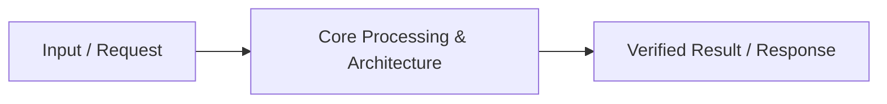

# 📹 Pydantic Crash Course ｜ Data Validation in Python

<div className="video-card" style={{border: '1px solid #30363d', borderRadius: '8px', padding: '16px', marginBottom: '24px', background: 'rgba(56, 139, 253, 0.05)'}}>
  <div style={{display: 'flex', gap: '16px', flexWrap: 'wrap'}}>
    <div><strong>Instructor:</strong> Nitish Singh (CampusX)</div>
    <div><strong>Duration:</strong> 85m 31s</div>
    <div><strong>Playlist:</strong> FastAPI for ML & GenAI</div>
    <div><strong>Watch Link:</strong> <a href="https://www.youtube.com/watch?v=lRArylZCeOs" target="_blank" rel="noopener noreferrer">YouTube Lecture ↗</a></div>
  </div>
</div>

## 📌 Executive Summary & Learning Objectives

This lecture covers **Pydantic Crash Course ｜ Data Validation in Python**, focusing on production implementations, edge cases, and industry standards:
- Core intuition, architecture, and underlying mechanisms.
- Key differences between theoretical research implementations and scalable enterprise patterns.
- Concrete Python walkthroughs, error recovery, and performance optimization.

---

## 🏗️ Architecture & Conceptual Workflow



---

## 📖 Core Concepts & Technical Deep Dive

### 1. Architectural Foundations
In modern production AI engineering, **Pydantic Crash Course ｜ Data Validation in Python** is essential for ensuring reliability, low latency, and deterministic outcomes. As AI systems evolve from naive prompt-in / completion-out scripts into distributed systems, engineers must handle:
- **State management & consistency:** Ensuring intermediate states and tool invocations are tracked.
- **Error boundaries & recovery:** Graceful degradation when external LLMs or vector stores encounter rate limits or network partitions.
- **Resource utilization & cost efficiency:** Caching common queries and reducing unnecessary foundation model token expenditure.

### 2. Operational Considerations
- **Latency Optimization:** Pre-computing embeddings, utilizing asynchronous non-blocking event loops, and streaming tokens via Server-Sent Events (SSE).
- **Security & Sandboxing:** Validating inputs before ingestion, sanitizing LLM outputs, and isolating tool execution environments.

---

## 💻 Production Implementation Walkthrough

```python
# Production Implementation Blueprint
def run_production_pipeline():
    print("Executing production pipeline...")

if __name__ == "__main__":
    run_production_pipeline()
```

---

## 💡 Production Best Practices & Tips

:::tip Production Deployment Guideline
When deploying Pydantic Crash Course ｜ Data Validation in Python in enterprise environments, always configure automated retries with exponential backoff and telemetry tracing (such as OpenTelemetry or LangSmith).
:::

:::warning Common Failure Modes
Watch out for state contamination across concurrent requests. Ensure each session or user interaction uses an isolated thread ID or execution context.
:::

---

## 🎯 Key Takeaways & Quick Reference

| Dimension | Production Standard | Pitfall to Avoid |
| :--- | :--- | :--- |
| **Execution** | Async / Non-blocking with timeouts | Synchronous blocking calls in event loops |
| **Data Validation** | Strict Pydantic v2 schemas | Untyped dictionary access |
| **Monitoring** | Distributed tracing & latency percentiles | Relying only on standard console logs |

## ⏱️ Lecture Timeline & Key Topics

| Timestamp | Key Topic / Concept Discussed |
| :--- | :--- |
| **00:00:00** | हाय गाइस, माय नेम इज नितेश एंड यू वेलकम टू माय YouTube चैनल। इस वीडियो में हम... |
| **00:20:20** | थोड़ा बहुत ऑब्जेक्ट ओरिएंटेड प्रोग्रामिंग हम लोग यूज़ कर रहे हैं बट नथिंग वेरी... |
| **00:41:32** | कैरेक्टर्स। तो अगर आप बहुत बड़ा नाम सेट करोगे 50 से ज्यादा कैरेक्टर का तो अगेन... |
| **01:03:25** | ली है मॉडल वैलिडेटर बोल के। और एग्जैक्टली वही कोड यहां पे लिखा हुआ है।... |
| **01:25:28** | हैं नेक्स्ट वीडियो में।... |


---

---

## 📜 Complete Lecture Transcript (Hindi / Hinglish)

> **Language:** Hindi / Hinglish | **Source:** `05 - Pydantic Crash Course ｜ Data Validation in Python ｜ CampusX.hi-hi.srt` | **Total Segments:** 43 | **Word Count:** ~14,494 words

<details>
<summary><b>Click to expand full chronological transcript (43 timestamped intervals)</b></summary>

#### ⏱️ [00:00 ➔ 00:02]

हाय गाइस, माय नेम इज नितेश एंड यू वेलकम टू माय YouTube चैनल। इस वीडियो में हम लोग एक बहुत इंपॉर्टेंट टॉपिक कवर करने वाले हैं और टॉपिक का नाम है पाइडेंटिक। अब अगर मैं आपको पाइडेंटिक के बारे में थोड़ा बताऊं तो पाइडेंटिक एक Python की बहुत इंपॉर्टेंट लाइब्रेरी है जिसकी हेल्प से आप डेटा वैलिडेशन परफॉर्म कर सकते हो। ठीक है? आपको ऑलरेडी पता होगा कि Python में अ स्टैटिक टाइपिंग का कांसेप्ट नहीं है। व्हिच बेसिकली मींस कि Python इज़ अ डायनेमिकली टाइप्ड लैंग्वेज। मतलब आप एक वेरिएबल को क्रिएट करके उसी वेरिएबल में इंटीजर वैल्यूज़ भी स्टोर कर सकते हो और उसी वेरिएबल में आप स्ट्रिंग वैल्यूज़ भी स्टोर कर सकते हो। अब बिगिनर्स के लिए ये फीचर तो बहुत अच्छा होता है। बट अगर आप प्रोडक्शन ग्रेड कोड कोड लिखने जाओगे तो बहुत जल्दी आपको ये रियलाइज़ होगा कि टाइप वैलिडेशन एंड डेटा वैलिडेशन आर अ वेरीेंट एस्पेक्ट ऑफ सॉफ्टवेयर प्रोग्रामिंग। स्पेशली अगर आप प्रोडक्शन ग्रेड सॉफ्टवेयर बिल्ड कर रहे हो एंड pाइडेंटिक आपको यहीं पे हेल्प करता है। piddantic की हेल्प से आप नॉट ओनली टाइप वैलिडेशन परफॉर्म कर सकते हो बट एट द सेम टाइम आप कितने भी कॉम्प्लेक्स तरीके का डेटा वैलिडेशन भी कर सकते हो। पाइडेंटिक आपको हेल्प करता है डेटा मॉडल्स बिल्ड करने में। नॉट ओनली दैट अगर आपके पास बहुत कॉम्प्लेक्स टाइप का डेटा है तो पाइडेंटिक की हेल्प से आप उसको बहुत ईजीली स्ट्रक्चर भी कर सकते हो। तो इस पर्टिकुलर वीडियो में मेरा गोल है कि मैं आपको पाइडेंटिक एंड टू एंड सिखाऊं। बिकॉज़ मेरे एक्सपीरियंस में मैंने देखा है कि पाइडेंटिक कई जगहों पे यूज़ होता है। भले ही आप फास्ट एपीआई में एपीआईस बिल्ड कर रहे हो या फिर आप यममेल की कॉन्फिग फाइल्स के साथ काम कर रहे हो या फिर आप डेटा साइंस में एमएल पाइपलाइंस बिल्ड कर रहे हो। इन सभी जगहों पे जब आप प्रोडक्शन ग्रेड कोड कोड लिखने जाते हो तो वहां पर पाइडेंटिक यूज़ होता है। तो इट इज़ वेरी वेरीेंट इफ यू आर ट्राइंग टू गेट इंटू द डेटा साइंस इंडस्ट्री तो आपको पाइडेंटिक के बारे में अच्छा खासा नॉलेज हो। तो इस छोटे से क्रैश कोर्स में आई विल मेक श्योर कि मैं आपको बिगिनर से लेकर के इंटरमीडिएट लेवल तक पाइडेंटिक में जो कुछ होता है सब कुछ पढ़ाऊं और नॉट ओनली पढ़ाऊं मैं आपको साथ

#### ⏱️ [00:02 ➔ 00:04]

ही साथ प्रैक्टिकली कोड करके भी दिखाऊंगा। सो ऑन द होल अ आई एम प्रीटी श्योर अगर आप यह वीडियो एंड तक देखते हो तो आप पाइडेंटिक को मास्टर कर लोगे और फिर पाइडेंटिक फ्यूचर में आप कहीं भी देखोगे यूज़ होते हुए लेट्स से आप फास्ट एपीआई पढ़ रहे हो तो आपको पाइडेंटिक रिलेटेड कोई कंफ्यूजन कोई डाउट नहीं होगा। ठीक है? सो आई एम सुपर एक्साइटेड फॉर दिस वीडियो। आई रियली होप आप भी हो। लेट्स स्टार्ट। वीडियो की शुरुआत करना चाहता हूं व्हाई के साथ। मैं सबसे पहले आपको यह बताना चाहता हूं कि पाइडेंटिक की जरूरत क्यों पड़ी? ऐसी क्या प्रॉब्लम है जो पाइडेंटिक सॉल्व करता है? अगर मैं ओवरव्यू मोड में आपको बताऊं तो पाइडेंटिक दो बहुत बड़ी प्रॉब्लम्स को सॉल्व करता है और मैं चाहता हूं कि वो दोनों बड़ी प्रॉब्लम्स मैं आपको प्रैक्टिकली दिखाऊं। ठीक है? तो एक काम करते हैं। एक सेटअप हम लोग लेते हैं। ठीक है? मान लो कि हम लोग एक फंक्शन बना रहे हैं और उस फंक्शन में हम क्या कर रहे हैं कि हम पेशेंट्स का डेटा रिसीव कर रहे हैं और उस डेटा को हमारे डेटाबेस में इंसर्ट कर रहे हैं। ठीक है? तो अगर मैं स्केलेटन कोड लिखना चाहूं इस फंक्शन का तो कुछ इस तरीके का कोड होगा। सो इंसर्ट पेशेंट डेटा बोल के हमारा फंक्शन है। और फिलहाल हमारे पेशेंट से रिलेटेड हमारे पास सिर्फ दो पीसेस ऑफ इंफॉर्मेशन है। एक है उसका नाम और दूसरा है उसका एज। और हमें क्या करना है कि हमें इन दोनों पीसेस ऑफ इंफॉर्मेशनेशन को डेटाबेस में एंटर करना है। ठीक है? अब ऑब्वियसली मैं यहां पे समझाने के लिए ये पूरा कोड लिख रहा हूं। तो मैं एक्चुअल डेटाबेस का कोड नहीं लिखूंगा। बट फिलहाल आप बस मान लो कि मैं डेटाबेस में इंसर्ट करने के बदले दोनों वेरिएबल्स को प्रिंट कर रहा हूं। और एक बार जब प्रिंट हो जा रहे हैं दोनों वेरिएबल्स तो मैं सिंपली यहां पे प्रिंट कर दे रहा हूं इंसर्टेड इंटू डेटाबेस। ठीक है? बट यू कैन इमेजिन कि एक प्रॉपर प्रोडक्शन कोड में यहां पे काफी सारा डेटाबेस रिलेटेड कोड होगा। राइट? तो

#### ⏱️ [00:04 ➔ 00:06]

ये हमारा फंक्शन हो गया जो इन दोनों पीसेस ऑफ इंफॉर्मेशन को उठा के डेटाबेस में डालेगा। ठीक है? अब ये फंक्शन किसी प्रोग्रामर ने बनाया है और कोई दूसरा प्रोग्रामर कोई जूनियर प्रोग्रामर इस फंक्शन को यूज़ करेगा इन ऑर्डर टू इंसर्ट डेटा इंटू द डेटाबेस। ठीक है? तो थोड़ी देर के लिए मान लेते हैं कि जो जूनियर प्रोग्रामर है उसको यह वाला कोड नहीं दिखाई दे रहा। उसने सिंपली इस फंक्शन को इंपोर्ट किया है। तो उसको इस फंक्शन का सिग्नेचर दिखाई दे रहा है कि फंक्शन का नाम क्या है और इसमें क्या इनपुट जाएगी। ठीक है? तो वो क्या करेगा? उस सिग्नेचर को देख के सिंपली इस फंक्शन को कॉल करेगा और उसको यहां पे दिखाई दे रहा है कि इस फंक्शन को दो इनपुट्स चाहिए अपना काम करने के लिए। एक चाहिए नेम और दूसरा चाहिए एज। तो वो क्या कर सकता है कि वह बहुत आसानी से एक पेशेंट का नाम और एक पेशेंट का एज भेज सकता है। राइट? और यहां पर आप शायद नोटिस कर रहे हो कि हम एक्सपेक्ट कर रहे थे एज अ सीनियर प्रोग्रामर कि जो एज हमारे पास आएगा वो इंटीजर होगा और जो नेम हमारे पास आएगा वो स्ट्रिंग होगा। बट हमारे जूनियर प्रोग्रामर ने क्या किया कि उसने दोनों चीजें स्ट्रिंग फॉर्मेट में भेजी। बिकॉज़ उसको फंक्शन के सिग्नेचर में क्या दिखाई दे रहा है कि नेम कैन बी एनी डेटा टाइप। एज कैन बी एनी डेटा टाइप। तो मे बी वो थोड़ा नया था। तो उसने 30 स्ट्रिंग में भेज दिया। अब मजे की बात क्या है कि अगर आप इस कोड को रन करोगे तो ये कोड काम करेगा और डेटाबेस में यही वैल्यू्यूज इंसर्ट हो जाएंगी। राइट? तो ये एक बहुत बड़ा फेलियर है। राइट? यहां पे हम टाइप वैलिडेशन नहीं कर पा रहे हैं। डेटाबेस में कभी भी आप वैल्यू्यूज वैल्यूज़ को इंसर्ट करोगे तो आप चाहोगे कि आप एक स्ट्रिक्ट स्कीमा फॉलो करो कि भाई सारे पेशेंट्स का नाम स्ट्रिंग होना चाहिए। सारे पेशेंट्स का एज इंटीजर होना चाहिए। बट यहां पर हमारा कोड टाइप वैलिडेशन नहीं कर रहा। और ये Python की इन जनरल प्रॉब्लम है। Python को अगर आपने डीपली स्टडी किया होगा तो

#### ⏱️ [00:06 ➔ 00:08]

आपको पता होगा कि Python में डायनेमिक टाइपिंग होती है। स्टैटिक टाइपिंग नहीं होती जावा और C++ की तरह। तो यहां पर आप एक ही वेरिएबल में अलग-अलग टाइप की वैल्यू सेट कर सकते हो और स्टिल कोड काम करेगा। ऐज़ अ प्रोग्रामर ये हमारी रिस्पांसिबिलिटी है कि हम ऐसा होने से रोके। तो अब क्या किया जा सकता है इस प्रॉब्लम को सॉल्व करने के लिए? एक तरीका ये है कि आप टाइप हिंटिंग यूज़ करो। टाइप हिंटिंग यूज़ करने का मतलब क्या है कि एज अ सीनियर प्रोग्रामर व्हाट आई विल डू इज कि मैं फंक्शन क्रिएट करते टाइम यहां पर लिख दूंगा कि नेम शुड बी स्ट्रिंग एंड एज शुड बी इंटीजर। अब क्या होगा कि अब जब मेरा जूनियर प्रोग्रामर इस फंक्शन को इंपोर्ट करेगा तो उसको फंक्शन के सिग्नेचर में दिखाई देने लगेगा कि नेम इज़ अ स्ट्रिंग एंड एज इज़ एन इंटीजर। सो व्हाट आई कैन डू नाउ इज़ कि मैं यहां पर नितीश भेज सकता हूं और यहां पे देख करके आई कैन सेंड लेट्स से 30 और अब यह कोड सही से काम कर रहा है। राइट? बट प्रॉब्लम क्या है अभी भी कि अगर किसी रीज़न से मेरे जूनियर प्रोग्रामर ने नहीं देखा कि टाइप हिंटिंग में मुझे सजेस्ट किया जा रहा है कि ऐज शुड बी एन इंटीजर और अभी भी वो गलती से एक स्ट्रिंग भेज दे तो अभी भी क्या होगा? आपका कोड काम कर जाएगा। आप स्ट्रिंग वैल्यू इंसर्ट कर दोगे। ऐसा इसलिए बिकॉज़ यह जो टाइप हिंटिंग होती है, यह एरर प्रोड्यूस नहीं करती है। ये आपको इंफॉर्मेशन देने के लिए है एज अ प्रोग्रामर कि देखो इस डेटा टाइप इस वेरिएबल का डेटा टाइप ये होना चाहिए। बट अगर आप गलत डेटा टाइप दोगे तब भी वो काम कर जाता है। तो Python का जो टाइप हिंटिंग है वो बहुत स्ट्रांग नहीं है। वो आपको एरर्स प्रोड्यूस करके नहीं देता। ठीक है? तो प्रॉब्लम अभी भी वहीं की वहीं है। एज अ सीनियर प्रोग्रामर हम किसी तरीके से इनफोर्स नहीं कर पा रहे कि नेम शुड बी स्ट्रिंग एंड एज शुड बी इंटीजर। और अगर इसमें से कुछ भी ट्रू नहीं है तो फिर हम एरर रेज़ कर देंगे। ये अभी तक हम एनफोर्स नहीं कर पा रहे हमारे कोड के थ्रू। तो

#### ⏱️ [00:08 ➔ 00:10]

व्हाट वी कैन डू इज़ कि हम इसको स्ट्रिक्टली इनफोर्स कर सकते हैं। सो व्हाट आई कैन डू इज़ मैं अपने कोड को कुछ इस तरीके से मॉडिफाई करूंगा कि मैं यहां पे एक इफ स्टेटमेंट लिखूंगा और मैं लिखूंगा इफ टाइप ऑफ नेम इज़ इक्वल टू इक्वल टू स्ट्रिंग एंड टाइप ऑफ एज इज़ इक्वल टू इक्वल टू इंटीजर देन ओनली यू डू दिस मतलब डेटाबेस में इंसर्शन अगर इसमें से कुछ भी फेल करता है तो यू विल विल रेज़ अ टाइप एरर। ठीक है? सेइंग कि इनकरेक्ट डेटा टाइप। और अब अगर मेरा जूनियर प्रोग्रामर ये करता है कि उसने नितीश भेजा और 30 स्ट्रिंग में भेजा तो देखो एरर आ रहा है। ठीक है? अब जब तक वो सही डेटा फॉर्मेट में चीजों को नहीं भेजेगा तब तक कोड काम नहीं करेगा। तो इस कोड की हेल्प से इस पीस ऑफ लॉजिक की हेल्प से हमने मेक श्योर किया कि हमारे फंक्शन को सही डेटा टाइप ही मिले और हम सही डेटा टाइप मिलने पे ही डेटाबेस में इंसर्शन करें। अब आपको क्या लगता है कि यह तरीका सही है? ये जो अभी हमने कोड लिखा खुद से टाइप वैलिडेशन करने की कोशिश की। क्या ये सही सही तरीका है? यू कैन से यस यह तरीका सही है। बट यह तरीका स्केलेबल नहीं है। क्यों? लेट्स से हमारे पास एक और फंक्शन है और वह फंक्शन है डेटाबेस में पेशेंट का रिकॉर्ड अपडेट करने के लिए। ठीक है? तो बहुत सिमिलर सा ही फंक्शन है। फिलहाल मैं बिल्कुल सेम लॉजिक लिख देता हूं। बस इस पर्टिकुलर फंक्शन का नाम मैं लिख देता हूं अपडेट। ठीक है? और इसको भी नेम और ऐज चाहिए और ये क्या करेगा? ये अपडेट करेगा। ठीक है? दैट्स द ओनली डिफरेंस बिटवीन दीज़ टू फंक्शंस। पहला वाला इंसर्ट करता है, दूसरा वाला अपडेट करता है। अब ऑब्वियसली अपडेट के लिए भी आपको यह सेम लॉजिक लिखना पड़ेगा। बिल्कुल इसी तरीके से। राइट? अब खुद सोच के देखो। ये तो सिर्फ दो पीसेस ऑफ

#### ⏱️ [00:10 ➔ 00:12]

इंफॉर्मेशन है और ज्यादा भी हो सकते हैं। और ये तो सिर्फ दो फंक्शनंस हैं। और ज्यादा भी हो सकते हैं। ये सारा कोड आप कितनी बार लिखोगे? और कल को अगर एक नया डेटा मान लो पेशेंट का हम ऐड कर देते हैं। मतलब अभी फिलहाल नेम और एज है। अब सडनली से मान लो हम वेट भी मांग रहे हैं। तो अब मुझे सारे फंक्शनंस में जाके अपडेट करना पड़ेगा। तो दिस इज़ द फर्स्ट प्रॉब्लम जो पाइडेंटिक सॉल्व करता है। द प्रॉब्लम इज़ कि टाइप वैलिडेशन नहीं है Python में बाय डिफ़ॉल्ट। और उसको अचीव करने के लिए स्पेशली प्रोडक्शन लेवल कोड में आपको इस तरह की मेहनत करनी पड़ रही है। मैनुअल कोड करना पड़ रहा है। व्हिच इज़ नॉट गुड। ठीक है? तो आई होप मैं आपको समझा पाया फर्स्ट प्रॉब्लम। द प्रॉब्लम इज टाइप वैलिडेशन। ठीक है? देयर इज वन मोर प्रॉब्लम वो भी डिस्कस करते हैं। प्रॉब्लम नंबर टू है डेटा वैलिडेशन की। ठीक है? टाइप तो आपने हैंडल कर लिया। अब सेकंड प्रॉब्लम ये है कि अगर आपके जो वेरिएबल्स हैं उनकी कुछ स्पेसिफिक रिक्वायरमेंट्स हैं तो आप उनको कैसे हैंडल करोगे? फॉर एग्जांपल आपके पास यहां पर ऐज है। अब ऑब्वियसली आप यहां पे एक वैलिडेशन लगाना चाहोगे कि कभी भी एज नेगेटिव नहीं हो सकता। सो दैट कल को मेरा जूनियर प्रोग्रामर किसी का एज नेगेटिव वैल्यू ना दे पाए। राइट? ऑब्वियसली लॉजिकली स्पीकिंग कोई देगा नहीं। बट एज अ सीनियर प्रोग्रामर हु इज़ राइटिंग दिस कोड यू हैव टू मेक श्योर कि किसी भी तरह की गलती फ्यूचर में ना हो। किसी भी तरीके का गलत वैल्यू डेटाबेस में इंसर्ट ना हो। तो इसको हैंडल करने के लिए अब आपको क्या करना पड़ेगा? यहां पे आ करके एक और स्टेटमेंट लिखना पड़ेगा। एक और स्टेटमेंट लिखना पड़ेगा कि इफ एज इज़ लेस देन ज़ीरो देन रेज़ वैल्यू एरर एज कांट बी नेगेटिव राइट एल्स डू व्हाटएवर यू आर डूइंग बेसिकली इंसर्ट कर देना। ये हो गया मेरा कोड। अब इस कोड में हम टाइप वैलिडेशन भी कर रहे हैं और डेटा वैलिडेशन भी कर रहे

#### ⏱️ [00:12 ➔ 00:14]

हैं। ठीक है? अब यू कैन इमेजिन यहां पे कल को एक अगर ईमेल आईडी भी हम पेशेंट का रिसीव कर रहे होते तो ईमेल आईडी के ऊपर भी हमें कुछ डेटा वैलिडेशन करना करना पड़ता कि जो ईमेल आईडी प्रोवाइड की गई है वो सही ईमेल फॉर्मेट में है कि नहीं। फोन नंबर मिलता तो फोन नंबर के ऊपर अलग डेटा वैलिडेशन करना पड़ता। तो यू कैन इमेजिन कि यहां पर यह जो कोड मैंने लिखा है ये सिर्फ एक वेरिएबल के लिए है। अगर आपके पास 10 वेरिएबल्स आ रहे होते तो आपको 10ों के लिए कुछ ना कुछ डेटा वैलिडेशन लिखना पड़ता। अगेन द सेम प्रॉब्लम यहां पर काम तो हो रहा है बट यही सेम कोड आपको एज इट इज अपडेट वाले में भी लिखना पड़ेगा। ठीक है? तो आई होप यू आर एबल टू सी दिस कि आपको एक ऐसा फंक्शन लिखने के लिए जो प्रोडक्शन पे सही तरीके से काम करे। बहुत सारा बोईलर प्लेट कोड लिखना पड़ रहा है। बहुत सारा मैनुअल कोड लिखना पड़ रहा है। इन ऑर्डर टू मेक श्योर कि जो आपका फंक्शन है वो सही से काम करे। पाइडेंटिक एग्जजेक्टली यही प्रॉब्लम्स को सॉल्व करता है। पाइडेंटिक मेक श्योर करता है कि आपको किसी भी तरीके से टाइप वैलिडेशन रिलेटेड कोई परेशानी ना हो। डेटा वैलिडेशन रिलेटेड कोई प्रॉब्लम ना हो। ठीक है? तो अब हम डिस्कस करते हैं कि कैसे पाइडेंटिक पिक्चर में आता है और इन दोनों प्रॉब्लम्स को सॉल्व करता है। सो दैट हमें इतना सारा मैनुअल कोड ना लिखना पड़े। अब पाइडेंटिक एसेंशियली तीन स्टेप्स में काम करता है। ठीक है? एक बार हम ये तीनों स्टेप्स डिस्कस करेंगे। फिर मैं आपको कोड करके दिखाऊंगा। ठीक है? तो स्टेप नंबर वन में आप क्या करते हो कि आप एक मॉडल बिल्ड करते हो। ठीक है? मॉडल थोड़ा फैंसी नेम है। बट आप ऐसा कह सकते हो कि आप एक क्लास बिल्ड करते हो पाइडेंटिक क्लास। ठीक है? और इस पाइडेंटिक क्लास के अंदर आप अपने डेटा का आइडियल स्कीमा डिफाइन करते हो। ठीक है? व्हिच मींस कि आप इस क्लास में बताते हो कि आपके फंक्शन को कौन-कौन सी फील्ड्स चाहिए। जैसे हमारे केस में नेम और एज और उन फील्ड्स का डेटा टाइप क्या

#### ⏱️ [00:14 ➔ 00:16]

रहने वाला है? नेम का रहेगा स्ट्रिंग, एज का रहेगा इंटीजर। और इसके अलावा अगर आपको कोई वैलिडेशन कंस्ट्रेंट्स लगाने हैं जैसे कि एज शुड ऑलवेज बी ग्रेटर दैन ज़ीरो। तो वो भी आप इस क्लास के अंदर इस मॉडल के अंदर लगा सकते हो। ठीक है? तो ये हो गया स्टेप वन जहां पे आपने अपना पाइडेंटिक मॉडल बिल्ड किया। ठीक है? अब स्टेप टू में आप क्या करते हो कि आप रॉ इनपुट की हेल्प से इस मॉडल को इंस्टेंशिएट करते हो। मतलब इस क्लास का एक ऑब्जेक्ट बनाते हो। ठीक है? तो आपने क्या किया? आपने एक डिक्शनरी बनाई। उस डिक्शनरी में आपने लिखा कि नेम का वैल्यू नितिश है और एज का वैल्यू 30 है। और अब आप ये डिक्शनरी को पास कर दोगे इस क्लास के ऑब्जेक्ट के पास। ठीक है? तो इस स्टेप में हमारे पास एक पाइडेंटिक ऑब्जेक्ट है। अब सबसे अच्छी बात इस पाइडेंटिक ऑब्जेक्ट की क्या है? कि ये वैलिडेटेड है। तो जब आप इस रॉ डेटा की हेल्प से ये पाइडेंटिक ऑब्जेक्ट बना रहे हो तो इस प्रोसेस में आप ऑटोमेटिकली अपने डेटा को वैलिडेट करते हो कि यहां पे इस डिक्शनरी में जो नेम मुझे मिल रहा है क्या वो सच में स्ट्रिंग है? जो एज हमें मिल रहा है क्या सच में वो इंटीजर है जो एज हमें मिल रहा है क्या सच में वो जीरो से ज्यादा है ये सारे वैलिडेशन आप सेकंड स्टेप में चेक कर लेते हो और अगर ये सारे वैलिडेशन चेक हो गए सही से तो अब आपके पास एक वैलिडेटेड पाइडेंटिक ऑब्जेक्ट है। ठीक है? जिसको आप स्टेप थ्री में अपने फंक्शन के पास भेजते हो। ठीक है? और आपका फंक्शन इस ऑब्जेक्ट को यूज़ करके अपना पूरा लॉजिक इंप्लीमेंट करता है। दैट्स द बेसिक आईडिया। ठीक है? तो एक बार मैं आपको कोड करके दिखाता हूं और फिर हम इसके अराउंड और थोड़ा डिस्कशन करेंगे। सो मैंने क्या किया है? हमारे कोड में मैंने वापस जो चेंजेस किए थे उनको रिवर्ट कर लिया है। अब फिर से मेरे पास एक सिंपल फंक्शन है जिसका काम है गिवन इनपुट

#### ⏱️ [00:16 ➔ 00:18]

को डेटाबेस में इंसर्ट करना। ठीक है? तो अब हमें स्टेप बाय स्टेप जाना है। तो सबसे पहले आपको क्या करना पड़ेगा? आपको पिप इंस्टॉल पidtिक करना पड़ेगा। ठीक है? पाइडेंटिक के दो वर्जनंस आए हैं और आपको वर्जन टू इंस्टॉल करना है। ठीक है? जो कि अभी सबसे ज्यादा यूज़ होता है। पidेंटिक टू और पाइडेंटिक वन में काफी डिफरेंसेस हैं। पidेंटिक टू जो है वो रस्ट में लिखा हुआ है। तो बिहाइंड द सीन्स बहुत फास्ट काम करता है। और उसके अलावा और भी बहुत तरह के इंप्रूवमेंट्स आपको पाइडेंटिक V2 में मिलेंगे। सो आई वुड सजेस्ट कि कभी भी अगर आप गोइंग फॉरवर्ड पाइडेंटिक के साथ काम कर रहे हो प्लीज मेक श्योर दैट यू आर यूजिंग पाइडेंटिक V2 ठीक है नॉट V1 तो अब आपको क्या करना होता है सबसे पहले स्टेप वन करना है स्टेप वन में हम क्या करेंगे कि हम अपने अ अपने लिए एक पाइडेंटिक मॉडल बिल्ड करेंगे जिसके अंदर हम अपने डेटा का स्कीमा क्रिएट करेंगे तो सबसे पहले यू विल इंपोर्ट फ्रॉम पाइडेंटिक इंपोर्ट बेस मॉडल ये क्लास आपको ऑलमोस्ट हमेशा इंपोर्ट करनी पड़ती करती है। तो अब हमें क्या करना है? हमें एक क्लास बनानी है और क्लास का नाम रख लेते हैं पेशेंट। ठीक है? कैपिटल पी और मेक श्योर करना है आपको कि ये जो क्लास आपने बनाई है ये इंपोर्ट कर रही हो बेस मॉडल क्लास को। तभी आपकी बनाई हुई क्लास एक पाइडेंटिक मॉडल बनेगी। ठीक है? अब यहां पे इस क्लास के अंदर हमें अपना आइडियल स्कीमा डिफाइन करना है। ठीक है? तो हमें पता है कि हमारे फंक्शनंस को दो चीजें चाहिए। एक चाहिए है नेम और दूसरा चाहिए है एज। ठीक है? बट सिंस हमें साथ ही साथ टाइप वैलिडेशन करना है तो हम यहां पे बता देंगे कि भाई देखो नेम शुड ऑलवेज बी स्ट्रिंग एंड एज शुड ऑलवेज बी इंटीजर। ठीक है? तो इसकी हेल्प से वी आर परफॉर्मिंग टाइप वैलिडेशन। डेटा वैलिडेशन भी यहीं पे कर सकते हैं। बट इट्स जस्ट कि हम अपना पहला पाइडेंटिक मॉडल बना रहे हैं। तो मैं

#### ⏱️ [00:18 ➔ 00:20]

ज्यादा इंफॉर्मेशन अभी आपके ऊपर नहीं डालना चाह रहा। गोइंग फॉरवर्ड मैं यहां पे आपको डेटा वैलिडेशन भी करके दिखाऊंगा। ठीक है? बट फिलहाल एक बार फ्लो में मूव करते हैं। तो ये हो गया हमारा स्टेप वन। हमने एक पाइडेंटिक मॉडल बना लिया है जिसके अंदर हमने अपना स्कीमा डिफाइन कर लिया है। ठीक है? अब आता है स्टेप नंबर टू। जहां पे हम इस पाइडेंटिक मॉडल का एक ऑब्जेक्ट बनाएंगे। इस क्लास का एक ऑब्जेक्ट बनाएंगे। ठीक है? तो ऑब्जेक्ट बनाने के लिए व्हाट आई विल डू इज़ कि पहले मैं एक डिक्शनरी बना रहा हूं अपने लिए। और उस डिक्शनरी में मैं डिफाइन कर ले रहा हूं कि जो नेम है वह नितीश है। जो एज है वह 30 है। ठीक है? अब इस रॉ अ डिक्शनरी की हेल्प से मैं अपने पाइडेंटिक ऑब्जेक्ट को इंस्टेंशिएट करूंगा। सो व्हाट आई विल डू इज़ आई विल क्रिएट पेशेंट वन बोल करके एक ऑब्जेक्ट और ये ऑब्जेक्ट होगा पेशेंट क्लास का जो ऊपर हमने बनाई है। ठीक है? और यहां पे हम क्या करेंगे? इस डिक्शनरी को पास कर देंगे। और सिंस ये डिक्शनरी है तो हमें इसको अनपैक करना पड़ेगा। सो हम ये सिंटेक्स यूज़ करेंगे और यहां पे पेशेंट इनफो भेज देंगे। ठीक है? अब इस कोड को अगर आप रन करोगे तो दो चीजें होंगी। पहले इस डेटा के ऊपर ये रूल्स अप्लाई होंगे। ठीक है? और अगर रूल्स अप्लाई हो गए सही से कोई प्रॉब्लम नहीं हुई तो हमारे पास ये ऑब्जेक्ट आ जाएगा जिसको हम यूज़ कर सकते हैं। फिर ठीक है? आई होप आपको समझ में आ रहा है। दिस इज स्टेप नंबर टू। अब स्टेप नंबर थ्री में हमें क्या करना है? सिंपली इस पाइडेंटिक ऑब्जेक्ट को अपने फंक्शन के पास भेज देना है। तो हम क्या करेंगे? अपने फंक्शन का सिग्नेचर थोड़ा सा चेंज करेंगे। अब हमें नेम और एज नहीं मिल रहा है। अब हमें डायरेक्टली एक पेशेंट ऑब्जेक्ट मिल रहा है जो कि किस टाइप का है? पेशेंट टाइप का। ठीक है? ठीक है? तो व्हाट वी आर सेइंग इज़ कि हमारा इंसर्ट वाले फंक्शन को अपना काम करने के लिए एक पाइडेंटिक ऑब्जेक्ट मिल

#### ⏱️ [00:20 ➔ 00:22]

रहा है पेशेंट नाम का। और इसके अंदर से अब आप क्या करोगे? सिंस ये एक ऑब्जेक्ट है तो आप पेशेंट डॉट करोगे तो आपको नेम भी मिल जाएगा और आप पेशेंट डॉट करोगे तो आपको एज भी मिल जाएगा। आई होप आपको समझ में आ रहा है। ठीक है? ठीक है? थोड़ा बहुत ऑब्जेक्ट ओरिएंटेड प्रोग्रामिंग हम लोग यूज़ कर रहे हैं बट नथिंग वेरी डिफिकल्ट। ठीक है? तो अब हमने पूरा सेटअप रेडी कर लिया है। अब बस हमें क्या करना है? हमें अपने फंक्शन को कॉल करना है और यहां पे हम हमारा सिग्नेचर हमें बता रहा है कि वी नीड अ पेशेंट ऑब्जेक्ट। और हमारे पास वो पेशेंट ऑब्जेक्ट है बाय द नेम ऑफ़ पेशेंट वन। ठीक है? और अब हम इस कोड को जैसे ही रन करेंगे। ये देखो। इट्स वर्किंग। ठीक है? अब अगर मैं यहां पर जाऊं और इस 30 के बदले टी एच आई आर टी वाई लिख दूं और रन करूं तो देखो कोड फट गया। इट्स नॉट वर्किंग। ठीक है? एंड द बेस्ट पार्ट इज़ ये सारा टाइप वैलिडेशन तो हो ही रहा है। द बेस्ट पार्ट इज़ नाउ व्हाट आई कैन डू इज़ आई कैन क्रिएट वन मोर फंक्शन जिसका नाम है अपडेट। और उसको भी एक पेशेंट ऑब्जेक्ट चाहिए अपना काम करने के लिए। और आप देख रहे हो कितना क्लीन हो गया सब कुछ। अगर मैं यहां पर जाके अब अपडेट को कॉल करूं तो वह भी बिल्कुल ऐसे ही काम करेगा। देयर इज सम इशू ओ ऑब्वियसली यहां पे 30 लिखा हुआ है। अगर मैं इसको 30 कर दूं तो ये फंक्शन भी सही से काम करेगा। ठीक है? राइट? अब आप कितने भी फंक्शनंस बना लो आप इंटरनली क्या कर रहे हो? पाइडेंटिक को यूज़ कर रहे हो। टू परफॉर्म टाइप वैलिडेशन एंड डेटा वैलिडेशन। डेटा वैलिडेशन मैंने आपको नहीं बताया अभी। थोड़ी देर में बताऊंगा। बट यू आर एबल टू सी राइट कि कितना आसान हो गया सब कुछ। अब कल को मुझे यहां पर एक नया अ फील्ड ऐड करना है। तो मैं यहां पे ऐड कर सकता हूं कि पेशेंट का वेट होगा फ्लोट। ठीक है? अब मुझे यहां पे कुछ चेंज करने की जरूरत नहीं पड़ रही ज्यादा। राइट? ये सारा का सारा जो टाइप वैलिडेशन का कोड है वो सब

#### ⏱️ [00:22 ➔ 00:24]

हम इस स्कीमा के अंदर डिफाइन कर रहे हैं। सारा का सारा डेटा वैलिडेशन हम इस स्कीमा की तरफ डिफाइन कर रहे हैं। सब कुछ एक जगह पे हो रहा है। इस जगह पे चेंज किया सारे फंक्शनंस में वो रिफ्लेक्ट कर रहा है। ठीक है? तो आई होप आपको समझ में आ रहा है और बेस्ट पार्ट क्या है कि pाइडेंटिक सिर्फ आपको टाइप वैलिडेशन और डेटा वैलिडेशन नहीं देता। इसके अलावा और बहुत सारे छोटे-छोटे फीचर्स आपको देता है। जैसे कि ऑटोमेटिकली पाइडेंटिक इज़ स्मार्ट इनफ टू अ यू नो कन्वर्ट द टाइप ऑफ योर डेटा। मान लो गलती से आप 30 ऐसे भेज दो स्ट्रिंग के फॉर्मेट में। तो पाइडेंटिक इसके लिए एरर रेज़ नहीं करेगा। अह अच्छा एक और एरर आ गया। सो हमने यहां पे वेट डिफाइन कर रखा था और वेट हमने यहां पे भेजा नहीं है। इसी वजह से एरर रेज हो रहा है। बिकॉज़ ये तीनों फील्ड्स रिक्वायर्ड है। पेशेंट का नेम भी होना चाहिए, एज भी होना चाहिए, वेट भी होना चाहिए। बट यहां पे जब हम ऑब्जेक्ट बना रहे हैं तो उसमें वेट है ही नहीं। तो पाइडेंटिक इज़ स्मार्ट इनफ। उसने यहां पे भी एरर रेज़ कर दिया। ठीक है? तो ये भी एक फीचर है जो आप खुद ब खुद देख सकते हो। सो, अगर मैं वेट को फिलहाल हटा दूं और रन करूं, यह कोड रन कर जाएगा। बिकॉज़ इंटरनली पाई डंटिंग ने क्या किया कि उसने इस 30 को जो स्ट्रिंग फॉर्मेट में है उसको इंटीजर में कन्वर्ट कर दिया। ठीक है? बिकॉज़ इट इज स्मार्ट इनफ। राइट? आपको करने की जरूरत नहीं है। ठीक है? सो या हुआ एक बहुत बेसिक पाइडेंटिक इंट्रोडक्शन। बट आई होप आपको बहुत क्लियरली ये समझ में आ रहा है कि पाइडेंटिक क्या प्रॉब्लम सॉल्व कर रहा है। ठीक है? तो अगर आपको यहां तक चीजें समझ में आ रही हैं और आपको सच में लग रहा है कि या पाइडेंटिक इज़ यूज़फुल। तो अब गोइंग फॉरवर्ड हम क्या करेंगे कि पाइडेंटिक को और डीपली सीखेंगे। ठीक है? कि इसमें और क्या-क्या फीचर्स हैं। जैसे मैंने अभी तक आपको डेटा वैलिडेशन नहीं बताया। मैं आपको वो भी बताऊंगा और इसके अलावा और भी बहुत सारी चीजें हम इस वीडियो में डिस्कस करेंगे। तो अभी तक का जो वीडियो था वो आप एक ट्रेलर की तरह लो। अब फिल्म शुरू होती है। अब एक काम करते हैं। थोड़ा और बड़ा पाइडेंटिक मॉडल बनाते हैं। मेरे कहने का मतलब है कि हमारे इस एग्जिस्टिंग

#### ⏱️ [00:24 ➔ 00:26]

पाइडेंटिक मॉडल में और फील्ड्स ऐड करेंगे। ठीक है? विद डिफरेंट-डिफरेंट डेटा टाइप्स और हम लोग थोड़ी कॉम्प्लेक्स फील्ड्स भी ऐड करेंगे। जैसे कि लिस्ट या डिक्शनरी। ठीक है? तो अ क्या-क्या कर सकते हैं? पेशेंट है तो पेशेंट रिलेटेड डेटा ही करेंगे। अह सो अगर आपको फ्लोट ऐड करना है तो आप यहां पे वेट, हाइट या बीएमआई ऐड कर सकते हो। तो यहां पे आप लिख दोगे फ्लोट। ठीक है? अ बुलियन भी होता है। सो अगर आप मान लो यह इंफॉर्मेशन रखना चाहते हो कि जो पेशेंट है वो मैरिड है कि नहीं तो फिर यू कैन कीप इट एज बूल। ठीक है? अ यह तो हो गए नॉर्मल वाले डेटा टाइप्स। अब थोड़ा सा कॉम्प्लेक्स अगर आप इंफॉर्मेशन रखना चाहते हो जैसे कि पेशेंट की सारी एलर्जीस को आप एक लिस्ट के अंदर रखना चाहते हो तो उसके लिए आप क्या करोगे? सबसे पहले एक फील्ड बनाओगे एलर्जीस बोल के और ये एलर्जीस जो होगी ये एक लिस्ट ऑफ इंटीजर लिस्ट ऑफ स्ट्रिंग होगी। राइट? मतलब एक लिस्ट के अंदर हम मल्टीपल स्ट्रिंग्स में रिप्रेजेंट करेंगे हर एलर्जी को। तो यहां पर आप डायरेक्टली ऐसे लिस्ट नहीं लिख सकते। ठीक है? आपको क्या करना पड़ेगा? आपको टाइपिंग मॉड्यूल से इंपोर्ट करना पड़ेगा लिस्ट को। ठीक है? और आप यहां पे लिखोगे लिस्ट ऑफ स्ट्रिंग। ठीक है? अभी मैं आपको थोड़ी देर में बताऊंगा ऐसा क्यों किया मैंने कि मैंने ये ना लिख करके लिस्ट ऑफ स्ट्रिंग लिखा। ठीक है? बट दिस इज़ हाउ यू डू इट। सिमिलरली मान लो आप पेशेंट के कांटेक्ट डिटेल्स भी स्टोर करना चाहते हो तो मोस्ट लाइकली इट विल बी अ डिक्शनरी। ठीक है? अ जैसे उस डिक्शनरी के अंदर लिखा होगा ईमेल फिर उसका वैल्यू फिर लिखा होगा फोन नंबर उसका वैल्यू। तो यहां पे हम लिखेंगे कांटेक्ट

#### ⏱️ [00:26 ➔ 00:28]

डिटेल्स। और यह जो होगा यह एक डिक्शनरी होगा। बट हम इसको फिर से ऐसे नहीं लिखेंगे। डीआईसीटी स्मॉल इंस्टेड हम फिर से क्या करेंगे? टाइपिंग मॉड्यूल से डिक्ट को इंपोर्ट करेंगे और यहां पे हम लिखेंगे कि कांटेक्ट डिटेल विल बी अ डिक्शनरी जिसमें जो की है वो भी स्ट्रिंग है और जो वैल्यू है वो भी स्ट्रिंग है। ठीक है? तो ये हमने बनाया एक बड़ा सा पाइडेंटिक मॉडल जिसमें काफी सारी फील्ड्स हैं और कॉम्प्लेक्स फील्ड्स भी हैं। ठीक है? अब हम इसको यूज़ करेंगे। ठीक है? तो यूज़ करने का तरीका बिल्कुल सेम है। आप क्या करोगे? यहां पे आओगे और यहां पे चीजें ऐड करोगे। जैसे कि आपने वेट में लिख दिया 75.2 फिर आपने मैरिड में लिख दिया या वन या ज़ीरो भी लिख सकते हो। उसके बाद आप क्या करोगे? आप एलर्जीज़ के लिए लिखोगे। अ फर्स्ट ऑफ़ ऑल दिस शुड बी अ स्ट्रिंग एलर्जीज़। और एलर्जीज़ में आप एक लिस्ट के अंदर लिखोगे पोलन और आप लिखोगे लेट्स से डस्ट। ठीक है? एक काम करते हैं वर्ड रैप ऑन कर देते हैं। ठीक है? तो ये हो गया अ एलर्जीस। और इसके अलावा हम लिखेंगे कांटेक्ट डिटेल्स। और ये कांटेक्ट डिटेल्स खुद एक डिक्शनरी होगा जहां पे ईमेल में हम लिखेंगे abc@gmail.com एंड फोन में हम लिखेंगे कुछ भी नंबर डाल दिया। ठीक है? तो ये हमने अपना रॉ डेटा बना लिया। अब इस रॉ डेटा को हम यूज करेंगे टू बिल्ड आवर पाइडेंटिक ऑब्जेक्ट और उसी पाइडेंटिक ऑब्जेक्ट को हम अपने फंक्शन के पास भेजेंगे। ठीक है? अब यहां पे मैं सारे चेंजेस नहीं कर रहा। पेशेंट डॉट नेम, एज वेट ये सब आप कर सकते हो। मैं फिलहाल नहीं कर रहा। व्हाट आई विल डू इज़ आई विल रन दिस कोड। एंड यू कैन सी

#### ⏱️ [00:28 ➔ 00:30]

दिस कोड इज़ वर्किंग फाइन। ठीक है? बट यहां पे अगर आप कुछ भी चेंज कर दो। मान लो यहां पे आपने ये जो लिस्ट बनाया इसमें आपने एक इंटीजर ऐड कर दिया तो नाउ दिस कोड विल नॉट वर्क। ठीक है? सिमिलरली यहां पे आपने फोन नंबर मान लो इंटीजर में भेज दिया तो दिस कोड विल नॉट वर्क। ठीक है? तो यू कैन सी पidेंटिक अपना काम कर रहा है। ठीक है? बड़े मॉडल्स भी आप बना पा रहे हो। कॉम्प्लेक्स टाइप का डेटा भी उसके अंदर रख पा रहे हो। एंड स्टिल सब कुछ कितनी आसानी से हो रहा है। ठीक है? अब एक चीज और मैं आपको जल्दी से एक्सप्लेन कर देता हूं कि हमने क्यों यहां पर सिर्फ लिस्ट नहीं रखा और क्यों हमें ऐसा करना पड़ा? तो, इसके पीछे का रीजन यह है कि अगर आप सिर्फ लिस्ट लिखते, तो आप सिर्फ यह वैलिडेट कर पाते कि यहां पे एलर्जीस के अंदर जो डेटा भेजा जा रहा है वो खुद में लिस्ट है। बट हमें सिर्फ यही वैलिडेट नहीं करना। हमें इसके साथ-साथ यह भी वैलिडेट करना है कि इसके अंदर हर जो आइटम है वो स्ट्रिंग भी होना चाहिए। तो ये टू लेवल वैलिडेशन के लिए हम ये सिंटेक्स यूज़ करते हैं। सो हम बता रहे हैं कि एलर्जीस खुद में लिस्ट होगा बट उसका हर आइटम स्ट्रिंग होगा। ठीक है? एंड सेम गोज़ फॉर कांटेक्ट डिटेल्स। कांटेक्ट डिटेल्स में अगर मैं सिर्फ यहां पे डिक्ट लिखता हूं। तो इससे हम ये तो वैलिडेट कर पाते कि कांटेक्ट डिटेल में हमें एक डिक्शनरी मिल रही है। बट हम ये वैलिडेट नहीं कर पाते कि उस डिक्शनरी के अंदर हर की स्ट्रिंग होना चाहिए और हर वैल्यू स्ट्रिंग होना चाहिए। ठीक है? तो दैट इज व्हाई हम ये ये स्ट्रक्चर यूज़ करेंगे। ठीक है? गोइंग फॉरवर्ड भी आप देखोगे कि हम टाइपिंग मॉड्यूल से लिस्ट और डिक्शनरी को इंपोर्ट करके इसी तरीके से यूज़ करेंगे। ठीक है? तो अभी जस्ट हमने सीखा थोड़ा सा बड़ा थोड़ा सा कॉम्प्लेक्स पाइडेंटिक मॉडल बनाना और उसको यूज़ करना। अब बात कर लेते हैं रिक्वायर्ड एंड ऑप्शनल फील्ड्स के बारे में। सो होता क्या है कि जब आप एक पाइडेंटिक मॉडल बिल्ड करते हो तो उसमें आप जितने भी फील्ड्स ऐड करते हो जैसे यहां पे हमने नेम, एज, वेट एक्सट्रा ऐड किया है। ये सारे के सारे

#### ⏱️ [00:30 ➔ 00:32]

फील्ड्स बाय डिफॉल्ट रिक्वायर्ड होते हैं। व्हिच मींस कि अगर आप यहां पर जब ये डिक्शनरी क्रिएट कर रहे हो। यहां पर अगर आप इनमें से कोई भी फील्ड को स्किप कर दो। मान लो मैं नेम प्रोवाइड नहीं करता हूं। तो होगा क्या कि हमारे पाइडेंटिक मॉडल का ऑब्जेक्ट बनेगा ही नहीं और एक वैलिडेशन एरर थ्रो हो जाएगा कि आपने सारे के सारे फील्ड्स को वैल्यू्यूज प्रोवाइड नहीं की। तो दिस प्रूव्स कि बाय डिफॉल्ट आपके जितने भी फील्ड्स हैं आपके पाइडेंटिक मॉडल में वो सब के सब रिक्वायर्ड होते हैं। ठीक है? बट कभी-कभी ऐसा हो सकता है कि आपके पास ऐसी रिक्वायरमेंट है कि आपको कुछ फील्ड्स रिक्वायर्ड रखनी है और कुछ फील्ड्स आपको ऑप्शनल रखनी है। ठीक है? जैसे कि मान लो नेम हमें रिक्वायर्ड चाहिए, एज हमें रिक्वायर्ड चाहिए, वेट, मैरिड रिक्वायर्ड चाहिए। बट हो सकता है कि हम एलर्जीस जो पेशेंट है वो बताए ना या उसको कोई एलर्जी ना हो। तो इन दैट केस व्हाट वी कैन डू इज़ कि हम ये एलर्जीस वाले कॉलम को ऑप्शनल बना सकते हैं। ठीक है? तो ऑप्शनल बनाने का तरीका बहुत आसान है। आपको क्या करना है? सबसे पहले टाइपिंग मॉड्यूल से ऑप्शनल को इंपोर्ट करना है। और फिर आपको जिस फील्ड को ऑप्शनल बनाना है, आपको वहां पे सिंपली ये सिंटेक्स लिखना होता है। ऑप्शनल स्क्वायर ब्रैकेट और उसके अंदर आपका जो भी अ टाइप डिस्क्रिप्शन है। ठीक है? मान लो मुझे मैरिड वाले को बनाना होता ऑप्शनल। तो मैं ये कोड लिखता और इस तरीके से ये फील्ड भी ऑप्शनल बन जाती। ठीक है? आई होप आपको समझ में आ रहा है। देयर इज ओनली वन थिंग जो आपको ख्याल रखना है। जब आप ऑप्शनल बनाते हो किसी फील्ड को तो आपको उस फील्ड को एक डिफॉल्ट वैल्यू देनी होती है और वो वैल्यू होती है नन। तो होगा क्या कि अगर कोई पेशेंट एलर्जीस नहीं डिस्क्राइब करेगा तो उसका एलर्जी के बदले हमें नन दिखाई देगा। ठीक है? मैं आपको दिखाता हूं। सो यहां पर एक बार हम फिर से नेम ऐड कर देते

#### ⏱️ [00:32 ➔ 00:34]

हैं। बिकॉज़ वो रिक्वायर्ड है। और थोड़ी देर के लिए हम क्या करते हैं? एलर्जीस को हटा देते हैं। और यहां पे जाके एक काम करते हैं। प्रिंट करा लेते हैं। पेशेंट डॉट एलर्जीस जस्ट टू सी कि इसकी वैल्यू क्या आ रही है। अ सो यहां पर हमने गड़बड़ की है। फोन शुड बी अ स्ट्रिंग। यह देखो। यह जो नन दिखाई दे रहा है, यह एलर्जीस का नन है। ठीक है? तो आई होप आपको समझ में आ गया कि पाइडेंटिक में रिक्वायर्ड फील्ड्स क्या होती हैं? और ऑप्शनल फील्ड्स क्या होती हैं? बाय डिफॉल्ट सब कुछ रिक्वायर्ड है। बट इफ यू वांट आप टाइपिंग के ऑप्शनल मॉड्यूल को यूज करके चीजों को ऑप्शनल बना सकते हो। बट ऑप्शनल बनाने के प्रोसेस में आपको उसको एक डिफॉल्ट वैल्यू देनी होती है जो कि नन होता है। ठीक है? अ और डिफॉल्ट वैल्यू की एक बार और थोड़ी सी बात कर लेते हैं। तो जिस तरीके से आप यहां पे डिफॉल्ट वैल्यू सेट कर रहे हो, बिल्कुल इसी तरीके से आप यहां पर भी डिफॉल्ट वैल्यू सेट कर सकते हो। ठीक है? मान लो मुझे मैरिड को बाय डिफॉल्ट फॉल्स रखना है। बिकॉज़ हमारे पास ज्यादातर पेशेंट्स जो आ रहे हैं वो बैचलर्स हैं। ठीक है? तो अब क्या होगा कि अगर आप यहां से मैरिड को सेट नहीं करते तो डिफॉल्ट वैल्यू फॉल्स रहेगी। मैं आपको दिखाता हूं। यहां पे मैं प्रिंट कर देता हूं पेशेंट डॉट मैरिड। और व्हाट आई विल डू इज़ कि मैं मैरिड वाला फील्ड हटा देता हूं। सेट नहीं करता हूं। अभी भी यह कोड काम करेगा। बस मैरिड में आपको फॉल्स दिखने लग जाएगा। ठीक है? तो आई होप आपको सिंपल सा ये पूरा चीज समझ में आ गया। रिक्वायर्ड फील्ड्स क्या होती हैं? ऑप्शनल फील्ड्स क्या होती हैं? और आप डिफॉल्ट वैल्यूज़ कैसे सेट करते हो अपने पाइडेंटिक मॉडल में। सो, अभी तक हमने बात की है टाइप वैलिडेशन के बारे में। अब थोड़ी बात करते हैं डेटा वैलिडेशन के बारे में। वि मींस कि आपके इन फील्ड्स में जो डेटा आ रहा है, हम कैसे चेक कर सकते हैं कि वो डेटा सही है। ठीक है? तो पाइडेंटिक

#### ⏱️ [00:34 ➔ 00:36]

डेटा वैलिडेशन करने के लिए आपको दो-तीन तरीके देता है। अ एक-एक करके हम सारे तरीके पढ़ेंगे। अ सबसे पहला जो तरीका है वो है कि पidेंटिक आपको कुछ कस्टम डेटा टाइप्स देता है। जो पाइथन के डेटा टाइप्स नहीं है। बट आप उनको यूज़ कर सकते हो इन ऑर्डर टू परफॉर्म सम काइंड ऑफ डेटा वैलिडेशन। फॉर एग्जांपल आपको मान लो आपने अपने पेशेंट से ईमेल कलेक्ट करना है। ठीक है? एज अ फील्ड। अब आपको भी पता है कि ईमेल एक स्पेसिफिक फॉर्मेट फॉलो करता है। योर नेम@gmail.com समथिंग लाइक दिस। राइट? तो कभी भी अगर आप प्रोडक्शन ग्रेड कोड लिखोगे तो आपको ईमेल्स को वैलिडेट करना होता है। ऐसा ना हो कि कोई कुछ भी जिबिश लिख के आपको दे दे। तो ये एक वैलिडेशन है जो आपको खुद से बहुत लिखना पड़ता है और इसका मैनुअल कोड बहुत हेक्टिक है। रेगुलर एक्सप्रेशन वगैरह यूज करना पड़ता है। तो पाइडेंटिक आपको एक बिल्ट इन डेटा टाइप देता है जिसको यूज़ करके आप ईमेल्स को वैलिडेट कर सकते हो। ठीक है? सो फॉर एग्जांपल मान लो कि हम पेशेंट से उसका नाम लेने के साथ-साथ उसका ईमेल भी कलेक्ट कर रहे हैं। ठीक है? तो हम क्या करेंगे? रादर देन कीपिंग इट एज स्ट्रिंग। हम पाइडेंटिक के अंदर से ईमेल स्ट्रिंग बोल करके एक डेटा टाइप है। इसको फैच करेंगे और हम ईमेल को स्ट्रिंग रखने के बजाय ईमेल स्ट्रिंग बना देंगे। ठीक है? इससे क्या होगा कि ऑटोमेटिकली जभी भी कोई ईमेल को एक वैल्यू प्रोवाइड करेगा तो वो वैलिडेट होगा अगेंस्ट दिस कस्टम डेटा टाइप। ठीक है? मैं आपको दिखाता हूं। सो व्हाट आई विल डू इज़ यहां पे मैं आ रहा हूं। और यहां पर मैं ईमेल में डाल रहा हूं abc@gmail.com ठीक है? और थोड़ी देर के लिए कांटेक्ट डिटेल्स में ये ईमेल को हटा देते हैं। कांटेक्ट डिटेल्स में सिर्फ फोन को रखते हैं। ठीक है? अब इस कोड को रन करते हैं। तो यू कैन सी हमारा कोड सही से रन किया। बट अगर मैं यहां से अगर @ हटा दूं और इस कोड को रन करूं तो देखना यह कोड

#### ⏱️ [00:36 ➔ 00:38]

काम नहीं करेगा। व्हाई? बिकॉज़ दिस इज नॉट अ वैलिड ईमेल फॉर्मेट। ठीक है? तो यही काम होता है ईमेल स्ट्रिंग का। सिमिलरली आपके पास एक और बिल्ट इन कस्टम डेटा टाइप है जिसको हम बोलते हैं एनी यूआरएल। एनी यूआरएल क्या करता है कि आप अगर अपने पेशेंट से या अपने कस्टमर से किसी भी टाइप का यूआरएल ले रहे हो। ठीक है? वेब बेस्ड यूआरएल या फाइल बेस्ड यूआरएल तो वो पर्टिकुलर डेटा टाइप चेक करेगा कि यूआरएल का फॉर्मेट सही है कि नहीं। ठीक है? मान लो कि हम एक बहुत फैंसी हॉस्पिटल के लिए पेशेंट अ का मॉडल बना रहे हैं। एक ऐसा हॉस्पिटल जो सिर्फ आईटी एंप्लाइजज़ के लिए बना हुआ है। उनके चेकअप के लिए बना हुआ है। तो हो सकता है कि हम वहां पर पेशेंट का Lindin यूआरएल भी मांगेंगे इलाज करते टाइम। तो हम क्या कर सकते हैं? Lindin यूआरएल में स्ट्रिंग रखने के बदले वी कैन कीप इट एज एनी यूआरएल। ठीक है? और यहां पर वी विल राइट एनी यूआरएल। अब क्या होगा? यहां पर मैं जाऊंगा ईमेल के बाद और lindin यूआरएल में आई विल पुट http कोन डबल फॉरवर्ड lindin.com स सम नंबर ठीक है और यहां पे मैं @ डाल देता हूं नहीं तो एरर आएगा और एक बार इसको रन करते हैं। कोड सही से काम कर रहा है। बट अगर मैं यहां पर लेट्स से कुछ और स्ट्रिंग डाल दूं। मान लो यह डॉट के पहले का डॉट हटा दूं और अब मैं रन करूं। बट अगर मैं यहां से लेट्स से यह http वाला पार्ट हटा दूं और सिर्फ linkin.com रखूं और इस कोड को रन करूं तो नाउ दिस विल थ्रो एन एरर। ठीक है? और यह बोल रहा है कि यह एक वैलिड यूआरएल नहीं

#### ⏱️ [00:38 ➔ 00:40]

है। ठीक है? तो यह फायदा है इस तरह के कस्टम डेटा टाइप्स को यूज़ करने का कि आपको बहुत ज्यादा कोड खुद से नहीं लिखना पड़ा। आई मीन किसी ने अगर ईमेल को वैलिडेट करने का अगर कोड लिखा होगा पास्ट में तो उसको पता होगा कि यहां पे कितना आपको मेहनत करना पड़ता है। आपको रेगुलर एक्सप्रेशन का यूसेज लिखना पड़ता है। तो इट्स डिफिकल्ट। तो पidेंटिक उस सेंस में आपके लिए काम बहुत आसान कर रहा है। ठीक है? तो ये एक तरीका है डेटा को वैलिडेट करने का। ठीक है? अब थोड़ा और एक डिस्कशन करते हैं जहां पे मैं एक दूसरा तरीका बताता हूं जो आप बहुत यूज़ करोगे आगे चलके डेटा को वैलिडेट करने के लिए। सो अभी जो तरीका हमने देखा डेटा वैलिडेशन का जहां पर हमने यह ईमेल स्ट्रिंग टाइप का डेटा टाइप यूज किया जो पidेंटिक में आपको मिलता है। यह जनरली आप तब यूज़ करते हो जब आपके पास कॉमन यूज़ केसेस हैं। राइट? जैसे कि ईमेल को वैलिडेट करना है, यूआरएल को वैलिडेट करना है। तो, यह थोड़ा कॉमन टाइप ऑफ़ सिनेरियोज़ हैं। बट कभी-कभी क्या होगा कि जो एप्लीकेशन आप बिल्ड कर रहे होगे, तो उस एप्लीकेशन में आपके बिजनेस यूज़ केस के हिसाब से कुछ अ डेटा वैलिडेशन रिक्वायर्ड होता है। फॉर एग्जांपल, आप ऐज को लेकर के चल रहे हो। तो, ऐज के ऊपर डिपेंडिंग ऑन योर बिनेस यूज़ केस। आप यह रिक्वायरमेंट आप यह वैलिडेशन अप्लाई कर सकते हो कि एज शुड ऑलवेज बी इन बिटवीन ज़ीरो टू 60 इयर्स समथिंग लाइक दैट। तो इस तरह का कुछ कस्टम डेटा वैलिडेशन अगर आपको लगाना है जो आपके बिजनेस यूज़ केस के ऊपर अप्लाई कर रहा है तो फिर उसके लिए आपको पाइडेंटिक एक दूसरा तरीका देता है जिसको हम फील्ड फंक्शन बोलते हैं। ठीक है? और यह सुपर यूज़फुल है। यह आप यूज़ कर सकते हो न्यूमेरिकल डेटा टाइप्स के ऊपर भी। ये आप यूज कर सकते हो स्ट्रिंग बेस्ड डेटा टाइप्स के ऊपर भी। ठीक है? तो चलो मैं आपको दिखाता हूं। जैसे वीडियो की शुरुआत में हमने डिस्कस किया था कि हम चाहते हैं कि हमारा जो वेट फील्ड है इसकी वैल्यू कभी कोई नेगेटिव सेट ना कर पाए। तो इसके लिए आप क्या कर सकते हो? आप ऐसे लिख सकते हो।

#### ⏱️ [00:40 ➔ 00:42]

आप बोलोगे फ्लोट इक्वल्स फील्ड ग्रेटर दैन और इसकी वैल्यू आप रख दोगे ज़ीरो। तो आपने अभी एसेंशियली क्या किया कि आपने एक कंस्ट्रेंट लगा दिया अपने इस फील्ड के ऊपर कि कोई भी इस फील्ड की वैल्यू जीरो से कम सेट नहीं कर सकता। ठीक है? तो अगर मैं यहां जाऊं और वेट में अगर मैं माइनस लगा दूं तो आप देखोगे यह कोड काम नहीं करेगा। देखो इनपुट शुड बी ग्रेटर दैन ज़ीरो। राइट? तो सिमिलरली आप लेस दैन इक्वल टू भी कर सकते हो लेस दैन ग्रेटर लेस दैन भी कर सकते हो ग्रेटर दैन इक्वल टू भी कर सकते हो ठीक है तो इस तरीके से आप रेंज डिफाइन कर सकते हो जैसे मान लो हमें एक रेंज डिफाइन करनी है ऐज के ऊपर तो हम क्या करेंगे हम कुछ ऐसा कोड लिखेंगे फील्ड ग्रेटर देन ज़ीरो एंड लेस दैन लेट्स से 120 इयर्स तो हमने एक तरीके से रेंज डिफाइन ाइन कर दिया। ठीक है? आई होप आपको समझ में आ रहा है। सिमिलरली अगर आप चाहो तो आप स्ट्रिंग बेस्ड डेटा टाइप्स के ऊपर भी इस तरह के कंस्ट्रेंट्स लगा सकते हो। जैसे मान लो आप चाहते हो कि आपका पेशेंट का जो नाम है वो मे बी 50 कैरेक्टर से ज्यादा बड़ा ना हो। लेट्स से तो आप क्या कर सकते हो? फिर से यहां पे लिख सकते हो फील्ड मैक्स लेंथ। मैक्स लेंथ इक्वल टू 50 कैरेक्टर्स। तो अगर आप बहुत बड़ा नाम सेट करोगे 50 से ज्यादा कैरेक्टर का तो अगेन आपको पाइडेंटिक अलाउ नहीं करेगा। ठीक है? सिमिलरली ये सेम लॉजिक आप लगा सकते हो लिस्ट के ऊपर भी। जैसे एलर्जीस हमारा एक लिस्ट है। तो यहां पे आप क्या कर सकते हो? फील्ड में यू कैन सेट मैक्स लेंथ = 5। इससे क्या होगा कि कोई भी एलर्जीस में पांच से ज्यादा एलर्जीस ऐड नहीं कर सकता। ठीक है? आई होप

#### ⏱️ [00:42 ➔ 00:44]

आपको समझ में आ रहा है अभी तक कि आप किस तरीके से कस्टम डेटा वैलिडेशन कर पा रहे हो यूजिंग फील्ड फंक्शन। ठीक है? अब मजे की बात क्या है कि फील्ड फंक्शन का अ काम सिर्फ डेटा वैलिडेशन करना नहीं है। फील्ड फंक्शन को एक और पर्पस के लिए यूज़ किया जाता है और वो पर्पस है टू अटैच मेटा डेटा। ठीक है? तो अगर आप थोड़ा सा डिस्क्रिप्शन ऐड करना चाहते हो इन फील्ड्स के साथ। सो दैट सामने वाला प्रोग्रामर उस डिस्क्रिप्शन को पढ़ के थोड़ा बेटर समझ पाए कि ये पाइडेंटिक मॉडल क्या ऑफर कर रहा है। तो वो मेटा डेटा आप अटैच कर सकते हो यूजिंग द फील्ड फंक्शन। ठीक है? कहां पे यूज़फुल है ये? मान लो आप एपीआई बना रहे हो। ठीक है? और एपीआई में आप चाहते हो कि आपका यह मॉडल सामने वाला जो क्लाइंट साइड है वो यूज करें तो उस एपीआई के डॉक्यूमेंटेशन में आप यहां पे जो मेटाडेटा ऐड करोगे वो दिखाई देने लगेगा। ठीक है? तो फास्ट एपीआई जो इंटरनली पाइडेंटिक को बहुत यूज़ करता है। वहां पर आप इस तरीके से मेटाडेटा सेट करते हो और वो फास्ट एपीआई के डॉक्यूमेंटेशन में दिखाई देने लगता है। ठीक है? तो एक काम करता हूं। मैं आपको यह सेकंड यूसेज भी दिखाता हूं कि कैसे आप फील्ड को यूज करके मेटा डेटा अटैच कर सकते हो अपने किसी भी फील्ड के ऊपर। ठीक है? पाइडेंटिक मॉडल के फील्ड के ऊपर। अब आपको उसके लिए क्या करना पड़ेगा? एक और चीज को यूज़ करना पड़ेगा जिसको हम बुलाते हैं एनोटेटेड। एनोटेटेड टाइपिंग मॉड्यूल का पार्ट है। तो आप एनोटेटेड और फील्ड इन दोनों के कॉम्बिनेशन को यूज़ करके मेटाडेटा अटैच करते हो। ठीक है? मैं आपको करके दिखाता हूं। सो मान लो हमें इस नेम के लिए अ कुछ मेटा डेटा ऐड करना है। मेटा डेटा एज इन हम ऐड करेंगे अ टाइटल ऑफ दिस फील्ड। हम ऐड करेंगे डिस्क्रिप्शन ऑफ दिस फील्ड और हम ऐड कर सकते हैं कुछ एग्जांपल्स। ठीक है? तो व्हाट यू कैन डू इज़ फॉर दिस यू कैन

#### ⏱️ [00:44 ➔ 00:46]

राइट इट लाइक दिस। आप इस पूरी चीज को हटाओगे। आप लिखोगे एनोटेटेड स्क्वायर ब्रैकेट। सबसे पहले आप डेटा टाइप बताओगे। सो डेटा टाइप है स्ट्रिंग और फिर मेटा डेटा और कंस्ट्रेंट्स ऐड करने के लिए आप फील्ड फंक्शन को यूज़ करोगे। ठीक है? तो यहां पर आप क्या कर सकते हो? आप कई चीजें कर सकते हो। आप सबसे पहले कुछ भी अगर आपके कंस्ट्रेंट्स हैं तो वो लगा सकते हो। आपने लगाया था मैक्स लेंथ 50। उसके बाद आप यहां पर टाइटल ऐड कर सकते हो नेम ऑफ द पेशेंट। उसके बाद आप चाहो तो डिस्क्रिप्शन ऐड कर सकते हो। गिव द नेम ऑफ द पेशेंट इन लेस देन 50 कैरेक्टर्स। ठीक है? तो ये आपका डिस्क्रिप्शन हो गया। इसके अलावा अगर आप चाहो तो कुछ एग्जांपल्स भी अटैच कर सकते हो। ठीक है? इन द फॉर्म ऑफ अ लिस्ट। ठीक है? जैसे एग्जांपल है नितिश। एग्जांपल है अमित। ठीक है? तो यू कैन सी नाउ आपने अपना फील्ड बनाया। आपने उसका डेटा टाइप बताया और फील्ड फंक्शन की हेल्प से आप दो काम कर रहे हो। आप कंस्ट्रेंट्स भी लगा रहे हो और आप मेटा डेटा भी अटैच कर रहे हो। ठीक है? तो फील्ड फंक्शन जो है वो दो काम आपको करके दे रहा है। फर्स्ट डेटा वैलिडेशन, कस्टम डेटा वैलिडेशन और सेकंड वो आपको मेटा डेटा अटैच करने का अ ऑप्शन दे रहा है। ठीक है? अ एक और चीज आप कर सकते हो फील्ड फंक्शन की हेल्प से कि आप डिफॉल्ट वैल्यू सेट कर सकते हो। ठीक है? अ जैसे कि मान लो हम इसको मैरिड को यूज करना चाहते हैं। अ तो व्हाट वी विल विल डू इज़ एनोटेटेड बूल हमारा डेटा टाइप है। और फिर फील्ड से हम इसका डिफॉल्ट वैल्यू सेट करेंगे टू नन। उसके बाद अगर आपको कोई कंस्ट्रेंट्स लगाने हैं तो आप कंस्ट्रेंट लगा सकते हो। उसके बाद अगर आपको मेटा डेटा ऐड करना है तो वह भी आप ऐड कर सकते हो। इज द पेशेंट मैरिड।

#### ⏱️ [00:46 ➔ 00:48]

और नॉट। ठीक है? तो एसेंशियली आपको तीन चीजें यहां पर दिखाई दे रही होंगी जो आप फील्ड फंक्शन के साथ कर पा रहे हो। फर्स्ट इज़ कस्टम डेटा वैलिडेशन, सेकंड मेटा डेटा, थर्ड डिफॉल्ट वैल्यूज़। ठीक है? अ एक चीज और यहां पे होती है वो भी मैं आपको जल्दी से बताता हूं। सो, मान लो कि मैं यहां पर वेट में 75.2 डाल रहा हूं। बट स्ट्रिंग में डाल रहा हूं। अब थोड़ी देर पहले मैंने आपको बताया था कि पाइडेंटिक इज स्मार्ट इनफ टू अंडरस्टैंड कि यह एक नंबर है और वो यहां पे एरर थ्रो नहीं करेगा। ठीक है? सो अगर मैं इस कोड को रन करूं तो सम फील्ड इज़ मिसिंग। एक्चुअली यहां पे दो एरर आ रहे हैं। अ पहला तो यह जब हमने ये Lindin वाले से http हटा दिया था। उसकी वजह से एक एरर आ रहा है। और सेकंड एरर यह आ रहा है कि यहां पर एलर्जीज़ में हमने ऑप्शनल का वैल्यू नन लिख रखा था। तो उस नन को हमने हटा दिया। इसलिए इट्स नॉट वर्किंग। तो, एक काम करते हैं। इस पूरी चीज को हम लोग रिीडज़ाइन कर लेते हैं। सो, एनोटेटेड यूज़ करते हैं। एनोटेटेड के अंदर पहले हम अपना डेटा टाइप बता रहे हैं। ठीक है? तो, हमारा डेटा टाइप है ऑप्शनल लिस्ट ऑफ स्ट्रिंग। और फिर फील्ड की हेल्प से हम पहले एक डिफॉल्ट वैल्यू बता देते हैं जो कि होगी नन और हमने कंस्ट्रेंट भी ऐड कर लिया कि पांच ही एलर्जीस आप ऐड कर सकते हो। ठीक है? तो ये गड़बड़ हो रही थी। इसको हमने ठीक कर लिया। अब हम बात कर रहे थे टाइप कोरिजन के बारे में कि पाइडेंटिक इज़ स्मार्ट इनफ टू ऑटोमेटिकली अंडरस्टैंड कि आप जब स्ट्रिंग ऑफ़ 75.2 भेज रहे हो। इट मींस कि आप एक्चुअली फ्लोट ऑफ 75.2 भेजना चाह रहे हो और वो यह अपने आप हैंडल कर लेता है बिहाइंड द सीन्स। सो अगर अब मैं इस कोड को रन करूं तो नाउ इट इज़ वर्किंग फाइन बिकॉज़ उसने इंटरनली समझ लिया कि दिस इज़ फ्लोट। बट यह स्मार्टनेस हमेशा अच्छा नहीं होता। कभी-कभी यह आपके अगेंस्ट में

#### ⏱️ [00:48 ➔ 00:50]

भी काम कर सकता है और पidेंटिक कुछ ऐसी चीजों को भी अलाउ कर सकता है जो अलाउ नहीं होनी चाहिए। तो अगर आप कभी भी डाउटफुल हो कि सामने से कुछ अलग सा डेटा आ जाएगा और पाइडेंटिक अलऊ कर देगा तो आप ये जो टाइप कर्सिंग का जो बिहेवियर है इसको सप्रेस कर सकते हो यूजिंग फील्ड फंक्शन। सो आपको क्या करना पड़ेगा कि आपको जाना पड़ेगा वेट में और वेट को भी हम लोग रिीडन कर लेते हैं। हम लिखेंगे एनोटेटेड और दिस शुड बी फ्लोट और यहां पर फील्ड फील्ड के अंदर हमारा जो कंस्ट्रेंट है हमारा कंस्ट्रेंट है शुड बी ग्रेटर देन 0। अब यहां पर आप क्या कर सकते हो कि एक स्ट्रिक्ट बोल के पैरामीटर होता है। उसकी वैल्यू आप ट्रू सेट कर सकते हो। अब ये स्ट्रिक्ट क्या कर रहा है कि ये आपको बोल रहा है कि आप टाइप को वर्जन मत करने देना। ठीक है? तो अब देखो अगर मैं स्ट्रिंग ऑफ 75.2 भेजूंगा इट शुड थ्रो एन एरर। ठीक है? और जब मैं इसको एग्जैक्टली फ्लोट भेजूंगा देन ओनली इट विल वर्क। ठीक है? तो यह स्ट्रिक्ट का यही काम होता है। तो अभी हमने जस्ट देखा कि कैसे आप फील्ड फंक्शन की हेल्प से कस्टम डेटा वैलिडेशन कर सकते हो। कैसे आप मेटा डेटा सेट कर सकते हो। कैसे आप डिफॉल्ट वैल्यू सेट कर सकते हो और कैसे आप टाइप को वर्जन के बिहेवियर को ओवराइड कर सकते हो। ठीक है? तो इन शॉर्ट ये जो एनोटेटेड और फील्ड का कॉम्बिनेशन है यह बहुत यूज़फुल है और आप इसको बहुत यूज करोगे। सो अब मैं आपको एक बहुत इंपॉर्टेंट पाइडेंटिक फीचर बताने वाला हूं जिसको हम बुलाते हैं फील्ड वैलिडेटर। ठीक है? अ फील्ड वैलिडेटर क्या होता है? यह बताने के पहले मैं आपको पहले यह बताऊंगा कि फील्ड वैलिडेटर का काम क्या है? व्हाई डू वी यूज़ फील्ड वैलिडेटर्स? सो एक सिचुएशन लेते हैं। मान लो कि आपका जो हॉस्पिटल है जिसके लिए आप यह पेशेंट मॉडल बना रहे हो। यह हॉस्पिटल अ कुछ बैंक्स को भी अ अपना

#### ⏱️ [00:50 ➔ 00:52]

क्लाइंट बना के रखे हुए हैं। व्हिच बेसिकली मींस कि इस हॉस्पिटल का कुछ बैंक्स के साथ टाई अप है। जैसे कि HDFC बैंक या फिर ICICI बैंक के साथ टाई अप है। और बेसिक फंडा ये है कि HDFC बैंक के जो एम्प्लाइजस हैं या जो ICICI एम्प्ल बैंक के जो एम्प्लाइज हैं वो लोग एक रिड्यूस्ड डिस्काउंटेड प्राइस पे इस हॉस्पिटल में अपना इलाज करवा सकते हैं। ठीक है? तो अब आपको क्या करना है? आपको एक पेशेंट मॉडल डेवलप करना है। जहां पर आप ईमेल में यह चेक करोगे कि जो सामने वाला पेशेंट है वो सच में HDFC बैंक या फिर icici बैंक का एंप्लई है कि नहीं। और यह आप चेक कैसे करोगे? आप उसका ईमेल स्ट्रिंग को देखोगे। उसमें HDFC.com होना चाहिए या फिर icici.com होना चाहिए। अगर gmail.com है मतलब वह वैलिड एंप्लई नहीं है। ठीक है? ठीक है? तो उसको इलाज करने को नहीं मिलेगा। ठीक है? तो अब खुद सोच के देखो। अगर आपको यह टेस्ट करना है कि एक गिवन ईमेल स्ट्रिंग में HDFC.com या फिर ICICI.com है कि नहीं तो ये भी एक तरीके का डेटा वैलिडेशन ही है। बट द प्रॉब्लम इज़ कि ये थोड़ा सा आपके बिजनेस यूज़ केस के स्पेसिफिक डेटा वैलिडेशन है। ठीक है? और ये काम कैसे करना है, ये हमने अभी तक नहीं पढ़ा। हमने अभी तक पढ़ा था कि हमें कुछ कस्टम डेटा टाइप्स मिल जाते हैं। जैसे कि ईमेल स्ट्रिंग और एनी यूआरएल जिसकी हेल्प से हम कुछ कॉमन यूज़ केसेस को हैंडल कर सकते हैं। फिर हमने फील्ड के बारे में भी पढ़ा। फील्ड से भी यह वाला काम नहीं हो सकता। तो इस तरह के सिचुएशन में अगर आपको बहुत ज्यादा अपने बिजनेस यूज़ केस के हिसाब से कुछ डेटा वैलिडेशन करना हो तो फिर आप यूज़ करते हो फील्ड वैलिडेटर को। ठीक है? तो फील्ड वैलिडेटर दो काम करता है। आपके फील्ड के ऊपर ये जो फील्ड्स हैं इन फील्ड्स के ऊपर आप किसी भी तरह का कस्टम डेटा वैलिडेशन कर सकते हो। सेकंड आप चाहो तो कोई ट्रांसफॉर्मेशन भी कर सकते हो। फॉर एग्जांपल आपको चाहिए कि आपके पेशेंट का नाम हमेशा कैपिटल में हो। तो ये

#### ⏱️ [00:52 ➔ 00:54]

ट्रांसफॉर्मेशन अप्लाई करने के लिए भी आप @ फील्ड वैलिडेटर यूज़ करोगे। ठीक है? कैसे यूज़ करना है मैं आपको बताता हूं। मैंने एक नई फाइल बना ली है और मैंने थोड़ा सा ना पिछली फाइल में काफी सारी चीजें मैंने लिख दी थी। तो उससे थोड़ा कंफ्यूजिंग हो सकता था इसलिए मैंने उसको सिंपलीफाई कर दिया यहां पे। सो दिस इज़ आवर pाइडेंटिक मॉडल राइट नाउ। हम क्या करेंगे? सबसे पहले पidेंटिक से फील्ड वैलिडेटर को इंपोर्ट करेंगे। ठीक है? और हमें करना क्या है? हमें चेक करना है कि ईमेल में @ hdfc.com या फिर icici.com है कि नहीं। अगर नहीं है तो हम एरर रेज कर देंगे। ठीक है? तो यह करने के लिए आपको क्या करना पड़ेगा कि अपनी क्लास के अंदर आपको एक नया मेथड बनाना पड़ेगा। ठीक है? और यू हैव टू मेक श्योर कि यह मेथड एक डेकोरेटर के साथ यूज़ हो। और उस डेकोरेटर का नाम है फील्ड वैलिडेटर। ठीक है? यहां पे आप बताते हो कि यह फील्ड वैलिडेटर आपकी किस फील्ड के ऊपर अप्लाई होगा। सो हमारे केस में हम इसे ईमेल फील्ड के ऊपर अप्लाई करना चाहते हैं। ठीक है? इसके बाद यहां पर आपको यह भी बताना होता है कि यह जो मेथड आप बना रहे हो, यह एक क्लास मेथड है। ठीक है? और फिर आप अपना मेथड डिफाइन करते हो। तो हमारा मेथड है ईमेल वैलिडेटर। ठीक है? अब इस मेथड को इनपुट में दो चीजें मिलती है। एक मिलता है आपका क्लास का इंस्टेंस नॉट इंस्टेंस आपका क्लास और सेकंड आपको मिलता है इस ईमेल का वैल्यू जो पेशेंट ने आपको प्रोवाइड किया है। ठीक है? तो अब आपको क्या करना है? आपको इस वैल्यू को पकड़ के चेक करना है कि इस वैल्यू के अंदर hdfc.com या फिर icici.com है कि नहीं। ठीक है? तो कैसे करेंगे हम लोग? हम लोग सबसे पहले एक लिस्ट बना लेंगे वैलिड डोमेनस बोल के। और इस लिस्ट में हम ऐड कर देंगे hdfc.com को एंड icici.com को। ठीक है? अब हम क्या करेंगे?

#### ⏱️ [00:54 ➔ 00:56]

हम अपने ईमेल के अंदर से @ के बाद वाला पार्ट एक्सट्रैक्ट करेंगे। फॉर एग्जांपल हमारे यूजर ने ये ईमेल दिया abc@ gmail.com तो हम ये वाला पार्ट एक्सट्रैक्ट करेंगे। ठीक है? तो एक वेरिएबल बना लेते हैं। डोमेन नेम ये होगा वैल्यू डॉट स्प्लिट फंक्शन यूज़ करेंगे हम और स्प्लिट करेंगे @ के ऊपर। तो जैसे ही हम @ के ऊपर स्प्लिट करेंगे तो हमें एक लिस्ट के अंदर एबीसी अलग मिल जाएगा। gmail.com अलग मिल जाएगा और हमें इसके अंदर से लास्ट वाली चीज चाहिए एज इन gmail.com चाहिए। तो अब हमारे डोमेन नेम में वो आ गया जो पेशेंट ने यहां पे प्रोवाइड किया है। अब मैं यहां पे चेक करूंगा कि इफ अ डोमेन नेम नॉट इन वैलिड डोमेनस। तो आई विल रेज अ वैल्यू एरर। आई विल से नॉट अ वैलिड डोमेन। और यहां पे अदरवाइज आई विल रिटर्न व्हाटएवर इज़ इनसाइड वैल्यू। ठीक है? एंड दिस इज़ आवर कोड गाइज़। ठीक है? तो, हमने क्या किया? एक फील्ड वैलिडेटर क्रिएट किया। कौन सी फील्ड के ऊपर? ईमेल फील्ड के ऊपर। आपको हमेशा याद रखना है फील्ड वैलिडेटर एक क्लास मेथड होता है। यह रहा हमारा मेथड। हमने नाम इसका रखा ईमेल वैलिडेटर। इसको दो चीजें मिल रही है। आपका क्लास और आपका वैल्यू। आपका क्लास मिलने का फायदा क्या है? कि आपकी क्लास में इस पेशेंट क्लास में अगर और भी कोई मेथड होगा तो आप उसको यहां पर एक्सेस कर सकते हो। ठीक है? थोड़ा एडवांस यूज़ केस के लिए। और वैल्यू में आपको क्या मिल रहा है? पेशेंट ने ईमेल में जो वैल्यू डाल के भेजी है। ठीक है? तो दिस इज़ द फील्ड वैलिडेटर दैट वी आर गोइंग टू टेस्ट नाउ। ठीक है? सो व्हाट आई विल डू इज़ कि अभी हमारा ईमेल है abc@gmail.com इसको हम लोग चला के देखते हैं। और अगर एरर आया इट मींस सही से काम

#### ⏱️ [00:56 ➔ 00:58]

कर रहा है। ठीक है? तो लेट्स रन दिस। देखो यहां पे आ रहा है वैल्यू एरर नॉट अ वैलिड डोमेन। तो व्हाट आई विल डू इज़ कि मैं Gmail के बदले अब लिख दूंगा HDFC.com। सेव किया। अब यह काम कर रहा है। ठीक है? अगर मैं यहां पर ICICI लिख दूं तो भी इट शुड वर्क। वेयर एज अगर मैं यहां पे Axis लिख दूं फॉर Axis Bank इट शुड नॉट वर्क। ठीक है? आई होप आपको समझ में आ रहा है। तो ये हो गया पहला यूज़ केस फील्ड वैलिडेटर का। ठीक है? सेकंड यूज़ केस इज़ जैसा मैंने आपको बताया कि अगर आप कोई ट्रांसफॉर्मेशन परफॉर्म करना चाहते हो तो वो भी आप कर सकते हो। जैसे मान लो आप चाहते हो कि पेशेंट का नाम हमेशा कैपिटल में हो। तो व्हाट आई विल डू इज़ फॉर दिस यूज़ केस आल्सो आई विल क्रिएट अ फील्ड वैलिडेटर। सो फील्ड वैलिडेटर इस बार हम कौन सी फील्ड पे काम कर रहे हैं? नेम के ऊपर। और यहां पे आ जाएगा क्लास मेथड। और यहां पे हम लिख देंगे अ ट्रांसफॉर्म नेम। इसको भी क्लास मिलेगा और वैल्यू मिलेगा। और हम सिंपली रिटर्न कर देंगे वैल्यू डॉट अपर को। दैट्स इट। दिस इज द कोड। ठीक है? अब देखो इस कोड को जैसे ही आप रन करोगे ये देखो आपको नेम जो है वो कैपिटल पे मिल रहा है। ठीक है? तो यही मेन पर्पस है फील्ड वैलिडेटर का। आपके बिनेस यूज़ केस के हिसाब से कितना भी कॉम्प्लेक्स डेटा वैलिडेशन आपको करना है कर लो। और अगर आपको कोई ट्रांसफॉर्मेशन परफॉर्म करना है वो भी आप परफॉर्म कर सकते हो विद द हेल्प ऑफ फील्ड वैलिडेटर। अ फील्ड वैलिडेटर के बारे में एक डिटेल आपको पता होनी चाहिए और वह यह है कि फील्ड वैलिडेटर दो मोड्स में ऑपरेट करता है। एक है बिफोर मोड और एक है आफ्टर मोड। ठीक है? दोनों कैसे काम करते हैं मैं आपको बताता हूं। सो होता क्या है कि जब यहां से आप डेटा भेजते हो इस जगह पे आपने डेटा प्रिपेयर किया और यहां पे आपने अपने पाइडेंटिक मॉडल के लिए एक ऑब्जेक्ट

#### ⏱️ [00:58 ➔ 01:00]

बनाया। तो इस स्टेप में क्या होता है कि वैलिडेशन परफॉर्म होता है। इसी स्टेप में क्या होता है? अगर टाइप कर्वजन की जरूरत है तो टाइप कर्वर्जन भी इसी स्टेप में परफॉर्म होता है। ठीक है? तो होगा क्या कि अगर आपने अपने फील्ड वैलिडेटर में मोड सेट कर रखा है आफ्टर जो कि डिफॉल्ट है। अगर आप यहां पे कुछ भी नहीं लिखोगे तो मोड आफ्टर ही रहता है। तो मोड आफ्टर का मतलब क्या है कि यहां पे जो आपको वैल्यू मिल रही है नेम की या फिर यहां पे आपको जो वैल्यू मिल रही है ईमेल की ये आपको टाइप को वर्जन होने के बाद मिलेगी। ठीक है? बट अगर आपने यहां पे मोड बिफोर कर दिया तो क्या होगा कि आपको ये जो वैल्यू मिलेगी वो टाइप कोरिजन के पहले की वैल्यू मिलेगी। ठीक है? सो एक छोटा सा एग्जांपल दे के मैं आपको समझाता हूं कि इन दोनों के बीच का डिफरेंस क्या है। सो मान लो कि हमारे पास यहां पर ऐज आ रहा है। ठीक है? और हम ये चेक करना चाहते हैं कि ऐज ज़ीरो से 100 के बीच है कि नहीं। ठीक है? अब आई नो ये चीज आप बहुत आसानी से फील्ड फंक्शन के थ्रू कर सकते हो। बट यह काम मैं फील्ड वैलिडेटर के थ्रू करूंगा। ठीक है? तो व्हाट आई विल डू इज़ कि मैं यहां पर एक नया फील्ड वैलिडेटर बनाऊंगा। और यह अप्लाई होगा एज के ऊपर। और यहां पे मैं मोड सेट कर रहा हूं फिलहाल बिफोर। यह भी एक क्लास मेथड होगा। और इसका नाम रख देते हैं वैलिडेट एज बोल के। इसको भी क्लास और वैल्यू मिलेगी। अब देखो यहां पे हम क्या कर रहे हैं कि इफ एज ग्रेटर दन 0 एंड लेस दैन 100 देन एक्चुअली यहां पे एज नहीं होगा वैल्यू होगी। तो फिर रिटर्न व्हाटएवर इज इनसाइड

#### ⏱️ [01:00 ➔ 01:02]

वैल्यू एल्स रेज वैल्यू एरर एज शुड बी इन बिटवीन ज़ीरो एंड 100 ठीक है ये मेरा कोड है। ठीक है? सिंपल वैलिडेशन। अब देखो, मैं क्या कर रहा हूं? मैं यहां पे आ रहा हूं और मैं ये पेशेंट बना के भेज रहा हूं। अब यहां पर आपको ध्यान देना है कि एज की वैल्यू मैंने क्या सेट कर रखी है? मैंने सेट कर रखी है 30 बट 30 ऑफ स्ट्रिंग। और यहां पे मैंने फील्ड वैलिडेटर का मोड रखा है बिफोर। तो यहां पे जो वैल्यू मुझे मिलेगी ये स्ट्रिंग ऑफ़ 30 होगी। टाइप को वर्जन होने के पहले वाली वैल्यू। ठीक है? तो अब मैं इसको जैसे ही रन करूंगा तो एरर आ जाएगा। ठीक है? क्योंकि वो बोलेगा कि भाई मैं इंटीजर और स्ट्रिंग को कंपेयर नहीं कर सकता। राइट? ज़ीरो इंटीजर है, 100 इंटीजर है। बट ये जो वैल्यू है, यह क्या है? यह एक स्ट्रिंग है। क्योंकि हमने टाइप वर्जन की पहले वाली वैल्यू ली। ठीक है? अब इस प्रॉब्लम से बचने का तरीका क्या है? कि आप यहां मोड के अंदर आफ्टर सेट कर दो। अब आप सेम कोड को चलाओगे, यह काम कर जाएगा। बिकॉज़ हुआ क्या कि यहां पे जो वैल्यू मुझे मिली, वो स्ट्रिंग ऑफ़ 30 नहीं मिली। वो टाइप वर्जन के बाद इंटीजर ऑफ़ 30 मिली। और इंटीजर ऑफ 30 के ऊपर आई कैन परफॉर्म दिस ऑपरेशन। ठीक है? तो ये एक छोटा सा डिटेल है जो आपको याद रखना है कि फील्ड वैलिडेटर को आप दो मोड्स में ऑपरेट कर सकते हो। बिफोर मोड में जहां पे उसको जो वैल्यू मिलेगी वो टाइप वर्जन के पहले वाली मिलेगी और सेकंड आफ्टर मोड में जहां पे आप टाइप वर्जन के बाद वाली वैल्यू के ऊपर काम करोगे। ठीक है? आल्सो डिफॉल्ट वैल्यू आफ्टर रहती है। तो अगर मैं यहां से इसको हटा भी दूं तो भी ये कोड काम कर जाएगा। ठीक है? आई होप आपको समझ में आ गया फील्ड वैलिडेटर एग्जैक्टली काम कैसे कर रहा है। सो गाइस अभी आपने सीखा कि किसी एक सिंगल फील्ड के ऊपर आप किसी भी टाइप का कस्टम डेटा वैलिडेशन कैसे लगा सकते हो यूजिंग

#### ⏱️ [01:02 ➔ 01:04]

फील्ड वैलिडेटर। बट व्हाट इफ आपको कुछ ऐसा डेटा वैलिडेशन करना है जहां पर जो डेटा वैलिडेशन है वह एक से ज्यादा फील्ड के ऊपर डिपेंड करती हो। फॉर एग्जांपल मान लो हम यह सिनेरियो चेक करना चाहते हैं कि अगर पेशेंट का एज 60 से ज्यादा है तो फिर उसके कांटेक्ट डिटेल्स में एक इमरजेंसी फोन नंबर होना चाहिए। ठीक है? यह हमें वैलिडेट करना है। अगर इमरजेंसी फोन नंबर नहीं है तो हम पेशेंट क्रिएट ही नहीं करेंगे। ठीक है? अगर इमरजेंसी फोन नंबर होगा देन ओनली हम पेशेंट क्रिएट करने देंगे। तो यहां पर आप देखो कि आपको जो डेटा वैलिडेशन करना है वो एक्चुअली दो फील्ड्स के ऊपर डिपेंड कर रहा है कि एज की वैल्यू क्या है और उस पे डिपेंड कर रही है कांटेक्ट की वैल्यू क्या होगी। आई होप आपको समझ में आ रहा है। तो इस सिचुएशन में आप फील्ड वैलिडेटर यूज़ नहीं कर सकते। बिकॉज़ फील्ड वैलिडेटर का काम ही होता है एक सिंगल फील्ड के ऊपर डेटा वैलिडेशन करके देने का। इस पर्पस के लिए आपके पास एक सेकंड चीज होती है जिसको हम मॉडल वैलिडेटर बोलते हैं। मॉडल वैल वैलिडेटर में क्या कर सकते हो? आप एक साथ मल्टीपल फील्ड्स को कंबाइन करके डेटा वैलिडेशन कर सकते हो। कैसे करना है? मैं आपको दिखाता हूं। सो मैंने एक नई फाइल बना ली है मॉडल वैलिडेटर बोल के। और एग्जैक्टली वही कोड यहां पे लिखा हुआ है। ठीक है? और हम वही डेटा वैलिडेशन करेंगे जो मैंने अभी आपको एग्जांपल दिया कि अगर एज 60 से ज्यादा है तो आपके कांटेक्ट डिटेल्स में एक इमरजेंसी फोन नंबर होना चाहिए। ठीक है? यह हम चेक करेंगे। तो, इसके लिए आपको क्या करना है? सबसे पहले मॉडल वैलिडेटर को इंपोर्ट करना है। उसके बाद फिर से आप अपनी क्लास में जाओगे और आप एक डेकोरेटर क्रिएट करोगे बाय द नेम ऑफ मॉडल वैलिडेटर। ठीक है? अब यहां पे आपको स्पेसिफाई नहीं करना किसी फील्ड का नाम बिकॉज़ आप किसी फील्ड के ऊपर काम नहीं कर रहे। आप पूरे के पूरे पाइडेंटिक मॉडल के ऊपर काम कर रहे हो। यहां पे बस आपको बताना

#### ⏱️ [01:04 ➔ 01:06]

है मोड आफ्टर या फिर बिफोर। ठीक है? तो हम आफ्टर कर रहे हैं। बिकॉज़ हमें टाइप कोज़न के बाद वाली वैल्यूज़ चाहिए। उसके बाद आपको यहां पर एक मेथड बनाना है। मेथड का नाम रख लेते हैं वैलिडेट इमरजेंसी कांटेक्ट। ठीक है? अब इस मेथड को अपने आप दो वैल्यूज़ मिलेंगी। एक मिलेगा आपका क्लास और दूसरा मिलेगा आपका पूरा पाइडेंटिक मॉडल जिसकी हेल्प से आप इनमें से किसी भी फील्ड को एक्सेस कर सकते हो। उसकी वैल्यू एक्सट्रैक्ट कर सकते हो। ठीक है? तो अब देखो यहां का कोड बहुत सिंपल है। आपको सिंपली चेक करना है कि अगर ऐज 60 से ज्यादा है। इफ मॉडल डॉट एज इज ग्रेटर देन 60 एंड अ इमरजेंसी नॉट इन मॉडल डॉट कांटेक्ट डिटेल्स। ठीक है? हमने क्या चेक किया कि एज 60 से ज्यादा है लेकिन इमरजेंसी वर्ड इस डिक्शनरी का की नहीं है। इन दैट केस वी विल रेज अ वैल्यू एरर सेइंग अ पेशेंट्स ओल्डर देन 60 मस्ट हैव एन इमरजेंसी कांटेक्ट। ठीक है? और अदरवाइज अगर इमरजेंसी कांटेक्ट है तो फिर हम मॉडल को एज एज इट इज रिटर्न कर देंगे। ठीक है? तो ये बना दिया हमने अपना मॉडल वैलिडेटर। चलो अब इसको टेस्ट करते हैं। ठीक है? तो यहां पे नोटिस करो फिलहाल हमारे पास जो एज है वो 30 है और कांटेक्ट डिटेल में इमरजेंसी नहीं है। तो इस कोड को आप जब रन करोगे तो यह सही से काम करना चाहिए। यू कैन सी यह सही से काम कर रहा है। बट अगर मैं एज को बढ़ा के 65 कर दूं तो अब देखो यह कोड काम नहीं कर रहा। बिकॉज़ यह रहा आपका एरर। ठीक है? तो इस एरर को रॉल्व

#### ⏱️ [01:06 ➔ 01:08]

करने के लिए हमें क्या करना पड़ेगा? इस डिक्शनरी में इमरजेंसी बोल करके एक नंबर ऐड करना पड़ेगा। और अब जब आप इस कोड को रन करोगे नाउ इट विल वर्क। ठीक है? तो ये हो गया एक एग्जांपल जहां पर आप मॉडल वैलिडेटर की हेल्प से पूरे के पूरे मॉडल के ऊपर कुछ कस्टम बिनेस लॉजिक अप्लाई कर पा रहे हो। एक डेटा वैलिडेशन कर पा रहे हो। ठीक है? तो यहां पे भी वो सेम कांसेप्ट है मोड आफ्टर और बिफोर का। तो आप अलग-अलग चीजें ट्राई आउट कर सकते हो। ठीक है? तो हमने दो बहुत पावरफुल वैलिडेशन टेक्निक सीखी। एक सीखा फील्ड वैलिडेटर जो एक सिंगल फील्ड के ऊपर ऑपरेट करता है और एक हमने सीखा मॉडल वैलिडेटर जो आपके पूरे पाइडेंटिक मॉडल के ऊपर ऑपरेट करता है। अब हम लोग डिस्कस करेंगे एक बहुत इंटरेस्टिंग चीज जिसको हम पाइडेंटिक में बुलाते हैं कंप्यूटेड फील्ड। सो कंप्यूटेड फील्ड क्या होती है कि ये एक ऐसी फील्ड है आपके पाइडेंटिक मॉडल की जिसकी वैल्यू आपको यूजर प्रोवाइड नहीं करता। इनफैक्ट आप बाकी की फील्ड्स को यूज करके उस कंप्यू्यूटेड फील्ड की वैल्यू कैलकुलेट करते हो। अगर समझ नहीं आया तो मैं आपको एक एग्जांपल के थ्रू समझाता हूं। सो मान लो हमने ये पाइडेंटिक मॉडल बिल्ड कर रखा है। जहां पे हम पेशेंट से ये सारा इंफॉर्मेशन मांग रहे हैं। तो ये हमारी सारी फील्ड्स हैं। अब यहां पे नोटिस करो कि हमारे पास दो और फील्ड्स हैं। वेट एंड हाइट। यह हम यूजर से मांग रहे हैं। बट अब हमें क्या चाहिए कि हम अपने इस स्पाइडेंटिक मॉडल के अंदर एक और फील्ड लाना चाहते हैं जो कि होगी बीएमआई। अब बीएएमआई हम यूजर से नहीं मांगेंगे बिकॉज़ यूजर को कैलकुलेट करना पड़ेगा। राइट? तो इंस्टेड व्हाट वी विल डू इज़ कि जो यूजर ने हमें वेट की वैल्यू दे रखी है और जो हाइट की वैल्यू दे रखी है, इन दोनों वैल्यूज़ को यूज़ करके हम डायनेमिकली बीएएमआई की वैल्यू कैलकुलेट करेंगे। और सिंस यह जो बीएमआई फील्ड है यह डायनेमिकली क्रिएट हो रही है और इसका जो क्रिएशन है वो बाकी के फील्ड्स की हेल्प से हो रहा है तो हम इस बीएमआई की

#### ⏱️ [01:08 ➔ 01:10]

फील्ड को कंप्यूटेड फील्ड बुलाते हैं। ठीक है? तो आई होप आपको समझ में आ गया इसका रिक्वायरमेंट क्या है। ऑन द गो अगर आपको कुछ चाहिए है अपने पाइडेंटिक मॉडल के लिए जो यूजर आपको नहीं दे सकता बट आपकी बाकी की फील्ड्स आपको दे सकती हैं तो फिर आप वो चीज कंप्यूटेड फील्ड के थ्रू अचीव करते हो। ठीक है? तो चलो ये बीएमआई वाला एग्जांपल हम लोग करके देखते हैं प्रैक्टिकली। इसके लिए आपको क्या करना पड़ेगा? सबसे पहले पidेंटिक से कंप्यूटेड फील्ड को इंपोर्ट करना पड़ेगा। और फिर से पहले की तरह आप क्या करोगे? आप एक मेथड बनाओगे टू कैलकुलेट द बीएमआई। बट उसको आप एक डेकोरेटर के अंदर रखते हो जिसका नाम है कंप्यूटेड फील्ड। और इसके नीचे आपको एक और डेकोरेटर यूज़ करना होता है जिसको हम बोलते हैं प्रॉपर्टी। और यहां पे अब आएगा हमारा मेथड। तो मेथड का हम लोग नाम रख लेते हैं कैलकुलेट अंडरस्कोर बीएमआई। अब यहां पर हमें हमारे पाइडेंटिक मॉडल का एक इंस्टेंस एज इनपुट मिलता है और हम बता रहे हैं कि इस पर्टिकुलर मेथड का जो आउटपुट होगा वो फ्लोट होगा। बिकॉज़ बीएएमआई जो है वो फ्लोट में होगी। ठीक है? तो अब हमें क्या करना है? सिंपली बीएमआई कैलकुलेट करना है। तो बीएएमआई की वैल्यू हो जाएगी अ फार्मूला होता है अ अगर आपका वेट केजीस में है और अगर आपकी हाइट मीटर्स में है तो फिर फार्मूला होता है सेल्फ डॉट वेट डिवाइडेड बाय सेल्फ डॉट हाइट का स्क्वायर दिस इज द फार्मूला। ठीक है? और आप क्या कर सकते हो? इस पूरी चीज को राउंड ऑफ भी कर सकते हो अप टू टू डेसिमल प्लेसेस। और अब आप क्या करोगे? यही वैल्यू जो बीएमआई की कैलकुलेट हुई है वो आप रिटर्न कर दोगे। ठीक है? तो एक काम करते

#### ⏱️ [01:10 ➔ 01:12]

हैं। यहां पे जो अपडेट पेशेंट डेटा है यहां पर लेट्स आल्सो प्रिंट बीएमआई की क्या वैल्यू आई कैलकुलेट होने के बाद? सो हम लिखेंगे पेशेंट डॉट बीएमआई सेव किया। यहां पर वेट हमने प्रोवाइड कर रखा है केजीस में। एक काम करते हैं। हाइट भी प्रोवाइड करते हैं। हाइट है मान लो 1.72 मीटर्स। ठीक है? तो हमारा यूजर हमें वेट प्रोवाइड कर रहा है। हमें हाइट प्रोवाइड कर रहा है। और हम इस इंफॉर्मेशन की हेल्प से एक पाइडेंटिक मॉडल बिल्ड कर रहे हैं। बट वो पडेंटिक मॉडल बिल्ड होने के प्रोसेस में ये एक कंप्यूटेड फील्ड भी कैलकुलेट हो रही है जिसकी वैल्यू को हम प्रिंट कराना चाह रहे हैं। ठीक है? तो इस कोड को रन करते हैं। और कुछ एरर आ गया। अ सो एरर है कि ओके। सो प्रॉब्लम क्या हुई है? हमने एक गलती की। सो होता क्या है कि आप यहां पर जो नाम सेट करते हो वही आपकी फील्ड का नाम बन जाता है। सो टेक्निकली हमें यहां पर बीएएमआई के बदले कैलकुलेट अंडरस्कोर बीएमआई रखना पड़ेगा। तब हमें हमारी वैल्यू मिलेगी। यू कैन सी बट ऑब्वियसली इट्स नॉट लॉजिकल। सो व्हाट वी कैन डू इज़ इंस्टेड ऑफ़ नेमिंग दिस मेथड कैलकुलेट बीएमआई लेट्स जस्ट कॉल इट बीएमआई। ठीक है? और यहां पे भी लेट्स कीप इट एज बीएमआई एंड नाउ इफ वी रन वी आर गेटिंग द आउटपुट। ठीक है? सो या अ हमने एक बहुत इंटरेस्टिंग चीज पढ़ी कंप्यूटेड फील्ड और इसको आप आगे चलके बहुत तरह के सिनेरियोस में यूज़ कर पाओगे। नेक्स्ट हम एक बहुत इंटरेस्टिंग कांसेप्ट डिस्कस करेंगे। और यह कांसेप्ट है नेस्टेड मॉडल्स का। सो नेस्टेड मॉडल्स क्या होते हैं कि अगर आप पाइडेंटिक में किसी एक मॉडल को किसी दूसरे मॉडल के अंदर एज अ फील्ड यूज़ करने लगो तो इसको हम नेस्टेड मॉडल बुलाते हैं। ठीक है? फॉर

#### ⏱️ [01:12 ➔ 01:14]

एग्जांपल अ एक काम करते हैं। कोड लिख के मैं आपको समझाता हूं। सो सबसे पहले लेट्स इंपोर्ट फ्रॉम पाइडेंटिक अ बेस मॉडल एंड लेट्स क्रिएट अ वेरी सिंपल पेशेंट मॉडल। ठीक है? सो वी आर क्रिएटिंग अ पेशेंट मॉडल जैसे अभी तक हम लेके चल रहे थे। और ये ऑब्वियसली इनहेरिट करता है बेस मॉडल से। और फिलहाल हम यहां पे क्या-क्या फील्ड्स ऐड कर रहे हैं? ऑब्वियसली नेम रख रहे हैं। जेंडर रख ले रहे हैं। एज रख ले रहे हैं। एंड लेट्स से मुझे यहां पर एड्रेस भी चाहिए। ठीक है? अब खुद सोच के बताओ कि एड्रेस का डेटा टाइप क्या होना चाहिए? क्या वो स्ट्रिंग होगा? लिस्ट होगा, डिक्शनरी होगा? क्या होगा? अब आई गेस आप लोगों में से कुछ लोग बोल सकते हो कि हम स्ट्रिंग रख सकते हैं। अब अगर आप स्ट्रिंग रखोगे किसी एड्रेस को तो वो शायद कुछ ऐसा दिखाई देगा। हाउस नंबर टू सेक्टर 66 स्टेट सिटी गुड़गांव स्टेट हरियाणा एंड पिन कोड ठीक है ऐसा दिखाई देगा। अब व्हाट इफ मुझे इस पूरे एड्रेस में से सिर्फ यह पिन कोड चाहिए या फिर सिर्फ सिटी का नाम चाहिए। तब तो आपको बहुत मेहनत करनी पड़ेगी इस स्ट्रिंग के अंदर से सिटी को निकालने में। तो हो क्या रहा है कि यहां पे एड्रेस जो है ना वो खुद में एक कॉम्प्लेक्स टाइप का डेटा है जो जो खुद मल्टीपल और डेटा से मिलके बना है। तो आइडियली ऐसे सिचुएशन में आपको क्या करना चाहिए कि आपको एक और पाइडेंटिक मॉडल बनाना चाहिए फॉर

#### ⏱️ [01:14 ➔ 01:16]

एड्रेस। और उस मॉडल को आप पेशेंट वाले मॉडल के अंदर एज अ फील्ड यूज कर सकते हो। एंड दैट इज व्हाई वी कॉल इट नेस्टेड मॉडल। आई होप आपको समझ में आ रहा है कि नेस्टेड मॉडल क्या होता है और उससे भी ज्यादा इंपॉर्टेंट आपको इसकी जरूरत समझ में आ रही है। ठीक है? तो एक काम करते हैं। लेट्स बिल्ड अ नेस्टेड मॉडल। हम लोग वही करेंगे। हम लोग एड्रेस के लिए एक सेपरेट पाइडेंटिक मॉडल बनाएंगे और उसको हम यहां पे एज फील्ड यूज़ करेंगे। तो व्हाट वी विल डू इज़ लेट्स वी विल क्रिएट अ पाइडेंटिक मॉडल। दिस विल आल्सो बी अ चाइल्ड ऑफ बेस मॉडल। और यहां पर आप चीजें तो बहुत सारी रख सकते हो। बट फिलहाल मैं तीन चीजें रख रहा हूं। एक होगा सिटी, दूसरा होगा स्टेट और तीसरा होगा पिन कोड। ठीक है? तो ये बन गया मेरा एड्रेस का पाइडेंटिक मॉडल। और अब मैं क्या करूंगा? पेशेंट वाले मॉडल में एड्रेस में आई विल राइट एड्रेस। सो यह जो हमारा एड्रेस है, यह एड्रेस टाइप का है। ठीक है? तो, अब एक काम करते हैं। पेशेंट मॉडल का एक पाइडेंटिक ऑब्जेक्ट बनाते हैं। बट उसके लिए पहले हमें एड्रेस मॉडल का एक पाइडेंटिक ऑब्जेक्ट बनाना पड़ेगा। तो वी आर क्रिएटिंग अ एड्रेस डिक्शनरी जिसमें तीन चीजें होंगी। पहला होगा सिटी, सिटी हो गया गुड़गांव। दूसरा होगा स्टेट, स्टेट हो गया हरियाणा और तीसरा होगा पिन कोड। और वह हो जाएगा यह। ठीक है? अब हम क्या करेंगे? इस रॉ डिक्शनरी से एड्रेस पाइडेंटिक मॉडल का एक ऑब्जेक्ट बनाएंगे। सो, हम इसको कॉल कर सकते हैं या बुला सकते हैं एड्रेस वन। और यह एड्रेस क्लास का ऑब्जेक्ट है। यहां पे हम अनपैक कर देंगे एड्रेस डिक्शनरी को। तो, इस स्टेप में हमने एड्रेस पidेंटिक मॉडल का ऑब्जेक्ट बना लिया। अब हम क्या करेंगे? अब हम एक पेशेंट के लिए डिक्शनरी बनाएंगे। और उसमें होगा पेशेंट का नाम जो कि फिलहाल

#### ⏱️ [01:16 ➔ 01:18]

मेरा ही नाम है। उसके बाद आएगा जेंडर, मेल उसके बाद आएगा एज और उसके बाद आएगा एड्रेस। अब इस एड्रेस में आप क्या करोगे कि आप यह जो आपने ऑब्जेक्ट बनाया था एड्रेस पाइडेंटिक मॉडल का उसको भेज दोगे। ठीक है? और अब आप पेशेंट पाइडेंटिक मॉडल का एक ऑब्जेक्ट बनाओगे और उसमें आप अनपैक कर दोगे पेशेंट वाली डिक्शनरी। एंड दैट्स इट गाइस। हमने हमारा पेशेंट अ पाइडेंटिक मॉडल का ऑब्जेक्ट बना लिया। लेट्स प्रिंट पेशेंट वन के अंदर क्या है देखते हैं। सो इस कोड को अगर आप रन करोगे तो यह देखो गाइज़ यह रहा हमारा वो कॉम्प्लेक्स ऑब्जेक्ट। नेम नितीश जेंडर। ठीक है? बट यहां पे देखो एड्रेस में क्या है? एड्रेस एड्रेस क्लास का ऑब्जेक्ट है और वहां पे सिटी स्टेट हरियाणा ये सब लिखा हुआ है। अब अगर आप चाहो तो इसमें से कुछ भी निकाल सकते हो। आप पेशेंट वन का नेम निकाल सकते हो। बट अगर आप चाहो तो पेशेंट वन का एड्रेस के अंदर जाकर के सिटी भी निकाल सकते हो। या फिर आप पेशेंट वन के एड्रेस में जाकर के उसका पिन कोड भी निकाल सकते हो। अगर मैं इस कोड को रन करूं। यह देखो। नाउ आई एम एबल टू फच गुड़गांव एंड पिन कोड। एंड दिस इज द मेन बेनिफिट ऑफ हैविंग अ नेस्टेड पाइडेंटिक मॉडल। ठीक है? तो, क्या बेनिफिट हुआ हमें? एक बार रीइट्रेट कर लेते हैं। पहला बेनिफिट यह है कि आपने अपने डेटा को थोड़े बेटर तरीके से ऑर्गेनाइज किया। राइट? फिर सेकंड बेनिफिट यह है कि आपने अपना कोड रयूजेबल बना लिया। अब कल को यह एड्रेस वाली जो क्लास है, यह पेशेंट को छोड़ के किसी और जगह पे भी अप्लाई हो सकती है। मान लो आपने एंप्लई बोल करके एक पाइडेंटिक मॉडल बनाया तो

#### ⏱️ [01:18 ➔ 01:20]

एंप्लई का भी एड्रेस हो सकता है। स्टूडेंट बनाया। स्टूडेंट का भी एड्रेस हो सकता है। तो ये वाली चीज आप रीयूज कर सकते हो। ठीक है? थर्ड इज़ रीडेबिलिटी। ऑब्वियसली आपकी कोड रीडेबिलिटी एनहांस हुई है। दिख रहा है कि एड्रेस में ये सारे सब कंपोनेंट्स हैं। एंड लास्टली आपने वैलिडेशन भी परफॉर्म किया। ठीक है? नेस्टेड मॉडल्स आर ऑटोमेटिकली वैलिडेटेड। मतलब अगर एड्रेस यहां पे आ रहा है सही से। इसका मतलब ये है कि ये सारी फील्ड्स ऑलरेडी वैलिडेटेड हैं। ठीक है? तो ये तीनचार बेनिफिट्स हैं अगर आप नेस्टेड मॉडल्स के साथ काम करते हो तो फ्यूचर में जब आप किसी कॉम्प्लेक्स प्रोजेक्ट में काम कर रहे हो और आपको ऐसा लगे कि यहां पे डेटा में कुछ हायरार्की है तो उसको ऑर्गेनाइज करने के लिए आप नेस्टेड मॉडल्स का कांसेप्ट यूज कर सकते हो। अब जो लास्ट चीज हम लोग इस वीडियो में डिस्कस करेंगे वो ये है कि हम कैसे अपने पाइडेंटिक मॉडल ऑब्जेक्ट्स को एक्सपोर्ट कर सकते हैं एज पाइथन डिक्शनरी या फिर jसon। ठीक है? सो pाइडantिक हमें बिल्ट इन मेथड्स देता है जिसकी हेल्प से आप अपने एकिस्टिंग पाइडेंटिक मॉडल ऑब्जेक्ट्स को एक्सपोर्ट कर सकते हो एज अ पython डिक्शनरीज। ठीक है? और यह बहुत तरह के सिचुएशंस में आपको हेल्प कर सकता है। अगर आप फास्ट एपीआई यूज़ कर रहे हो टू बिल्ड एपीआई वहां पे इसका बहुत यूज़ केस होता है। आप डीबगिंग करना चाहते हो, लॉगिंग करना चाहते हो, वहां पे भी इसका बहुत यूज़ केस होता है। तो इन शॉर्ट यह एक ऐसी चीज़ है जो आपको पता होनी चाहिए। तो चलो एक काम करते हैं। हमने अभी जो नेस्टेड मॉडल बनाया एड्रेस और पेशेंट वाला इसको हम लोग एक्सपोर्ट करके देखते हैं। ठीक है? पहले मैं आपको डिक्शनरी में एक्सपोर्ट करके दिखाऊंगा। फिर मैं आपको jसon में एक्सपोर्ट करके दिखाऊंगा। तो यहां पे आपको कुछ नहीं करना है। आपने सबसे पहले अपना ऑब्जेक्ट बना लिया है। अब आपको क्या करना है? सिंपली अपने ऑब्जेक्ट को कॉल करना है और उसके साथ आपको कुछ बिल्ट इन मेथड्स मिलते हैं। जैसे कि एक है मॉडल अंडरs डंप। यह क्या करेगा? यह आपके एकिस्टिंग

#### ⏱️ [01:20 ➔ 01:22]

पाइडेंटिक मॉडल ऑब्जेक्ट को एक Python डिक्शनरी में कन्वर्ट कर देगा। लेट मी शो इट टू यू। सो, अ लेट्स कॉल इट टेम। बस टेम बुला लेते हैं। ठीक है? और प्रिंट कर लेते हैं कि टेम में क्या है? और साथ ही साथ हम प्रिंट कर लेते हैं टाइप ऑफ टेम। और अब अगर आप इस कोड को रन करोगे तो यह देखो सबसे पहले आपने जो पाइडेंटिक मॉडल ऑब्जेक्ट बनाया था वो एज इट इज़ डिक्शनरी में कन्वर्ट हो गया। और यह आपको यहां से समझ में अभी आ रहा होगा कि जो टाइप है टेंप का वो एक डिक्शनरी है। ठीक है? तो सिंपली आपको कुछ नहीं करना है। आपको अपने ऑब्जेक्ट को उठाना है पाइडेंटिक ऑब्जेक्ट को और उसके ऊपर मॉडल डंप को कॉल कर देना है और वो आपको पूरा का पूरा डिक्शनरी बना के दे देगा। अगर आपको jसon चाहिए तो उस केस में आपके पास एक दूसरा मेथड होता है जिसको हम मॉडल डंप jसon बुलाते हैं। ठीक है? इसमें भी आपको कुछ अलग दिखाई नहीं देगा। अ यहां पे भी चीजें आपको सेम लगेंगी। द ओनली डिफरेंस इज़ कि Python इसको एज स्ट्रिंग रिसीव करेगा। ठीक है? बट आप अगर इसको एक्सपोर्ट करना चाहो तो यह प्रॉपर jसon फॉर्मेट में एक्सपोर्ट हो जाएगा। ठीक है? तो ये हो गए आपके दो मेथड्स। अब इन दो मेथड्स में भी पाइडेंटिक आपको बहुत सारी फ्लेक्सिबिलिटी देता है। जैसे कि अगर मैं वापस आपको डिक्शनरी वाला मेथड दिखाऊं मॉडल अंडरस्कोर डंप तो यहां पे आप कंट्रोल कर सकते हो कि आपको कौन-कौन से फील्ड्स अ एक्सपोर्ट करने हैं। जैसे कि फॉर एग्जांपल मैं सिर्फ नेम वाली फील्ड एक्सपोर्ट करना चाहता हूं। तो मेरे पास यहां पर इंक्लूड बोल के एक पैरामीटर है जिसमें लिस्ट के अंदर आई कैन पास नेम। अब इससे क्या होगा कि जब मैं एक्सपोर्ट करूंगा तो मुझे सिर्फ डिक्शनरी में नेम की फील्ड दिखाई देगी। अगर आपको एक से ज्यादा चीजें इंपोर्ट करनी है तो आप ऐसे करोगे। ठीक है?

#### ⏱️ [01:22 ➔ 01:24]

अगर आप चाहते हो कि कुछ चीजें आप इंक्लूड ना करो और बाकी सब कुछ इंक्लूड करो तो आपके पास एक्सक्लूड का भी ऑप्शन होता है। तो इस बार उल्टा होगा सब कुछ आएगा बस नेम और जेंडर नहीं आएगा। यह देखो सब कुछ आ रहा है। नेम और जेंडर नहीं आ रहा। ठीक है? अ मान लो हम चाहते हैं कि ये स्टेट ना दिखाई दे तो इसके लिए आप क्या करोगे? आप यह कोड लिखोगे। आप एक डिक्शनरी में लिखोगे एड्रेस और एड्रेस के अंदर लिस्ट में आप लिखोगे अम स्टेट। अब क्या होगा कि आपका सब कुछ आएगा। बस एड्रेस के अंदर स्टेट नहीं आएगा। यह देखो। आई होप आपको समझ में आ रहा है कि इंक्लूड और एक्सक्लूड कैसे आपको कंट्रोल दे रहे हैं कि आप चाहोगे आपकी डिसीजन मेकिंग के हिसाब से चीजें एक्सपोर्ट होंगी। जो आप हटाना चाहोगे वो हट जाएगा। जो आप रखना चाहोगे वो एक्सपोर्ट होगा। ठीक है? अ यहां पर एक और इंटरेस्टिंग पैरामीटर होता है जिसको हम एक्सक्लूड अनसेट बोलते हैं। वो भी बहुत इंटरेस्टिंग है। मैं आपको जल्दी से दिखाता हूं। सो थोड़ी देर के लिए मान लो कि यहां पे जेंडर में हमने एक डिफॉल्ट वैल्यू दे रखी है मेल। आई नो इट्स नॉट लॉजिकल बट मान लो कि हमने यहां पे मेल दे रखा है। ठीक है? और अब हम क्या कर रहे हैं कि पेशेंट वाली डिक्शनरी बनाते टाइम हम यहां से एक्सप्लसिटली स्पेसिफाई नहीं कर रहे जेंडर। तो ऑटोमेटिकली क्या होगा कि बिहाइंड द सीन्स ये डिफॉल्ट वैल्यू आ जाएगी। करेक्ट? अब अगर आप एक्सक्लूड अनसेट यूज करते हो और इसको अगर आप ट्रू कर देते हो तो इसका मतलब क्या हुआ कि यह ऑब्जेक्ट बनाते टाइम जो चीजें सेट नहीं की गई हैं वो एक्सपोर्ट नहीं होंगी। जैसे यह पेशेंट ऑब्जेक्ट बनाते टाइम जेंडर सेट नहीं किया

#### ⏱️ [01:24 ➔ 01:25]

गया है। तो फिर जब एक्सपोर्ट करोगे आप अपने मॉडल को तो उसमें जेंडर नहीं दिखाई देगा। यह देखो यहां पे जेंडर नहीं दिखाई दे रहा है। व्हाई? बिकॉज़ इट वाज़ नॉट सेट ड्यूरिंग द ऑब्जेक्ट क्रिएशन प्रोसेस। ठीक है? तो, यह होता है एक्सक्लूड अनसेट। यह भी कभी-कभी काम आ जाता है। ठीक है? तो, नटशेल में यही दो-तीन चीजें मुझे आपको दिखानी थी। आप फर्स्ट ऑफ़ ऑल Pidentic मॉडल ऑब्जेक्ट्स को एक्सपोर्ट कर सकते हो दो फॉर्मेट्स में। Python डिक्शनरी के फॉर्मेट में, jसon फॉर्मेट में। ठीक है? और साथ ही साथ पidेंटिक आपको कंट्रोल भी देता है कि आप क्या एक्सपोर्ट करना चाहते हो विद द हेल्प ऑफ इंक्लूड एक्सक्लूड एक्सक्लूड अनसेट। ठीक है? तो गोइंग फॉरवर्ड जब भी आपको इसकी जरूरत लगे आप यह कांसेप्ट्स यूज कर सकते हो। ठीक है? सो पidेंटिक में ऑनेस्टली और भी काफी सारी चीजें हैं। बट मुझे लगता है कि फॉर अ बिगिनर जितना मैंने इस वीडियो में कवर किया है, इट इज़ मोर देन सफिशिएंट। इतना अगर आपको आता है तो आप पidेंटिक को यूज करके बेसिक लेवल प्रोजेक्ट्स बना लोगे। ठीक है? फॉर एग्जांपल आप फास्ट एपीआई सीख रहे हो जहां पर पाइडेंटिक एक्सटेंसिवली यूज़ होता है। तो फिर आप फास्ट एपीआई आसानी से सीख पाओगे। बिकॉज़ आपको पidेंटिक का बिगिनर लेवल नॉलेज तो है। ठीक है? बाकी आप बताओ आपको वीडियो कैसा लगा? मैंने पूरी कोशिश की आपको पाइडेंटिक समझाने की। अगर आपको वीडियो अच्छा लगा तो प्लीज लाइक करना और अगर आपने इस चैनल को सब्सक्राइब नहीं किया है तो प्लीज डू सब्सक्राइब। मिलते हैं नेक्स्ट वीडियो में।

</details>
