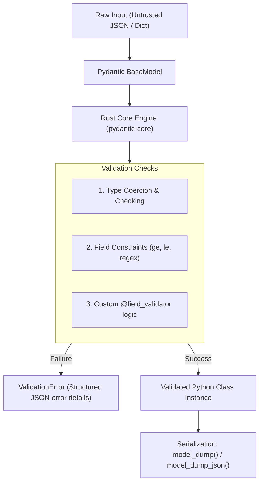

# 📹 Pydantic Crash Course: Data Validation & Type Enforcement

<div className="video-card" style={{border: '1px solid #30363d', borderRadius: '8px', padding: '16px', marginBottom: '24px', background: 'rgba(56, 139, 253, 0.05)'}}>
  <div style={{display: 'flex', gap: '16px', flexWrap: 'wrap'}}>
    <div><strong>Instructor:</strong> Nitish Singh (CampusX)</div>
    <div><strong>Duration:</strong> 35m 50s</div>
    <div><strong>Course:</strong> Module 1 - Production Backend & Docker</div>
    <div><strong>Watch Link:</strong> <a href="https://www.youtube.com/watch?v=lRArylZCeOs" target="_blank" rel="noopener noreferrer">YouTube Lecture ↗</a></div>
  </div>
</div>


## 📌 Executive Summary

**Pydantic** is the most widely used data validation library for Python. It enforces type hints at runtime, validates raw dictionaries and JSON into structured Python objects, and provides user-friendly error handling.

With the release of **Pydantic v2**, the core validation engine was completely rewritten in **Rust** (`pydantic-core`), delivering a **5x to 17x speed improvement**. Pydantic is not only the backbone of FastAPI, but also the cornerstone of structured LLM outputs (`langchain`, `instructor`, `openai-python`).

---

## 🏗️ Architecture: The Pydantic v2 Parsing Pipeline



---

## 📖 Core Concepts & Technical Deep Dive

### 1. Defining a Schema with `BaseModel`
In standard Python, classes don't validate types:
```python
# Standard Python: No validation!
class Person:
    def __init__(self, name: str, age: int):
        self.name = name
        self.age = age

p = Person("Alice", "twenty") # Runs without error, causing bugs downstream!
```

In Pydantic:
```python
from pydantic import BaseModel, ValidationError

class Person(BaseModel):
    name: str
    age: int

# Pydantic coerces valid strings:
p = Person(name="Alice", age="25")
print(p.age) # Output: 25 (converted to integer!)

# Invalid values raise ValidationError immediately:
try:
    p2 = Person(name="Bob", age="not-an-age")
except ValidationError as e:
    print(e.json())
```

### 2. Constraints with `Field`
Use `Field()` to assign defaults, define metadata for Swagger docs, and enforce numerical and string boundaries:
```python
from pydantic import BaseModel, Field

class LLMGenerationConfig(BaseModel):
    model_name: str = Field(..., description="Target model identifier")
    temperature: float = Field(0.7, ge=0.0, le=2.0, description="Sampling randomness")
    max_tokens: int = Field(512, gt=0, le=4096, description="Max generated tokens")
    stop_sequences: list[str] = Field(default_factory=list)
```

### 3. Custom Validation with `@field_validator`
For complex business logic that cannot be expressed with simple comparison operators:

```python
from pydantic import BaseModel, field_validator

class UserProfile(BaseModel):
    username: str
    email: str

    @field_validator("username")
    @classmethod
    def validate_username(cls, v: str) -> str:
        if len(v.strip()) < 3:
            raise ValueError("Username must contain at least 3 non-whitespace characters.")
        if not v.isalnum():
            raise ValueError("Username must be alphanumeric.")
        return v.lower()
```

---

## 💻 Practical Code: Complex Nested Models & Serialization

Modern AI systems deal with multi-turn conversations and nested agent states:

```python
from pydantic import BaseModel, Field
from typing import List, Literal
from datetime import datetime

class Message(BaseModel):
    role: Literal["system", "user", "assistant"]
    content: str
    timestamp: datetime = Field(default_factory=datetime.utcnow)

class ChatSession(BaseModel):
    session_id: str
    model: str = "gpt-4o"
    messages: List[Message]
    total_tokens_used: int = 0

# Instantiate nested model
session = ChatSession(
    session_id="sess_12345",
    messages=[
        {"role": "system", "content": "You are a helpful AI assistant."},
        {"role": "user", "content": "Explain Pydantic v2."}
    ]
)

# Serialization in Pydantic v2
dict_repr = session.model_dump() # Convert to Python dictionary
json_repr = session.model_dump_json(indent=2) # Convert to JSON string
print(json_repr)
```

---

## 💡 Production Best Practices & Tips

:::tip Pydantic v1 vs v2 Method Migration
In Pydantic v1, serialization used `.dict()` and `.json()`. In Pydantic v2, always use `.model_dump()` and `.model_dump_json()`. The old methods are deprecated and slower.
:::

:::warning Strict Mode in Pydantic
By default, Pydantic will coerce `"123"` into integer `123`. If you want zero coercion, enable strict mode: `age: int = Field(..., strict=True)`.
:::

