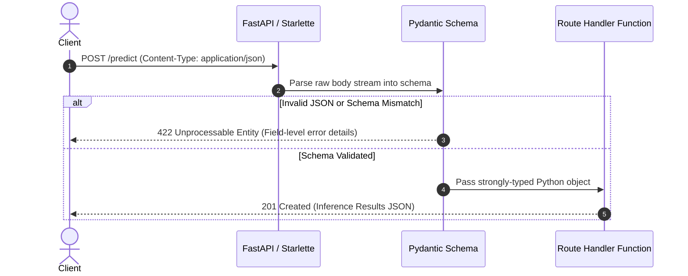

# 📹 POST Requests & Request Body: Handling JSON Payloads

<div className="video-card" style={{border: '1px solid #30363d', borderRadius: '8px', padding: '16px', marginBottom: '24px', background: 'rgba(56, 139, 253, 0.05)'}}>
  <div style={{display: 'flex', gap: '16px', flexWrap: 'wrap'}}>
    <div><strong>Instructor:</strong> Nitish Singh (CampusX)</div>
    <div><strong>Duration:</strong> 24m 30s</div>
    <div><strong>Course:</strong> Module 1 - Production Backend & Docker</div>
    <div><strong>Watch Link:</strong> <a href="https://www.youtube.com/watch?v=sw8V7mLl3OI" target="_blank" rel="noopener noreferrer">YouTube Lecture ↗</a></div>
  </div>
</div>


## 📌 Executive Summary

When building AI APIs, the **`POST`** HTTP method is the primary vehicle for sending data to the server. Unlike `GET` requests where parameters are visible in the URL, `POST` requests send data in the **Request Body**, typically encoded as `application/json`.

In FastAPI, declaring a Pydantic model as a parameter in a route function automatically signals FastAPI to read, parse, and validate the incoming JSON body against that schema.

---

## 🏗️ Architecture: Request Body Validation Workflow



---

## 📖 Core Concepts & Technical Deep Dive

### 1. Declaring the Request Body
To declare a request body, simply annotate a function parameter with your Pydantic `BaseModel`:

```python
from fastapi import FastAPI, status
from pydantic import BaseModel, Field

app = FastAPI()

class LoanApplication(BaseModel):
    applicant_name: str
    annual_income: float = Field(..., gt=0)
    loan_amount: float = Field(..., gt=0)
    credit_score: int = Field(..., ge=300, le=850)

@app.post("/loans/assess", status_code=status.HTTP_201_CREATED)
async def assess_loan(application: LoanApplication):
    # Access strongly typed attributes directly:
    approved = application.credit_score > 680 and (application.loan_amount / application.annual_income < 0.4)
    return {
        "applicant": application.applicant_name,
        "status": "APPROVED" if approved else "REJECTED"
    }
```

### 2. Combining Path, Query, and Body Parameters
FastAPI seamlessly resolves parameters based on where they appear:
1. Parameter is in the path template (`/items/{id}`) -> **Path Parameter**.
2. Parameter is a singular type (`int`, `str`, `bool`) -> **Query Parameter**.
3. Parameter is a Pydantic model (`BaseModel`) -> **Request Body**.

---

## 💻 Practical Code: Multi-Source Endpoints

```python
from fastapi import FastAPI, Path, Query, status
from pydantic import BaseModel, Field
from typing import Optional

app = FastAPI()

class DocumentChunk(BaseModel):
    chunk_id: str
    text: str = Field(..., min_length=10)
    embedding_dim: int = 1536

class EmbeddingResponse(BaseModel):
    document_id: str
    chunk_id: str
    status: str
    vector_indexed: bool

@app.post(
    "/documents/{document_id}/chunks",
    response_model=EmbeddingResponse,
    status_code=status.HTTP_201_CREATED
)
async def ingest_chunk(
    document_id: str = Path(..., description="Parent document identifier"),
    overwrite: bool = Query(False, description="Whether to overwrite existing chunk"),
    chunk: DocumentChunk = ... # Indicates Body parameter is required
):
    return EmbeddingResponse(
        document_id=document_id,
        chunk_id=chunk.chunk_id,
        status=f"Indexed successfully (overwrite={overwrite})",
        vector_indexed=True
    )
```

---

## 💡 Production Best Practices & Tips

:::tip Use `response_model`
Always declare `response_model=YourSchema` in your decorator. This ensures FastAPI filters out sensitive internal fields (like database passwords or internal raw logits) before transmitting JSON to the client.
:::

:::warning Enforce `Content-Type: application/json`
Ensure your API clients include the header `Content-Type: application/json`. If a client sends plain text or form data without the proper header, FastAPI will reject the request with `422 Unprocessable Entity`.
:::


---

---

## 📜 Complete Lecture Transcript (English)

> **Language:** English | **Source:** `06 - Post Request in FastAPI ｜ What is Request Body？ ｜ Video 5 ｜ CampusX.en.srt` | **Total Segments:** 18 | **Word Count:** ~4,970 words

<details>
<summary><b>Click to expand full chronological transcript (18 timestamped intervals)</b></summary>

#### ⏱️ [00:00 ➔ 00:02]

Hi Guys, My name is Nitesh and welcome to my YouTube channel.  In this video also we will continue our fast API playlist. And before we start the video, I'd like to give you a little recap of what we've covered so far in this playlist.  So far I have added four videos to this playlist.  In the first two videos, we mostly discussed the theory. In the first video, we had a general discussion about APIs, what are APIs ?  Why are they needed? Why is it so useful?  A. After that, in the second video, we discussed the fundamentals of Fast API. Ok?  What are your strengths and weaknesses? We compared it with a flask.  Ok? Then, in the third video onwards, we started a project where we were building a patient management system.  The idea is that we want to build an API that helps the front-end client perform four operations. Which four operations?  Create, Retrieve, Update and Delete.  Ok?  And in this so far we have created five endpoints inside this API.  A. In the first end point, it was basically a toy end point where we were simply returning hello.  The second one was also kind of toy and point.  Where we were describing our project a little bit. From the third end point we started our serious work and we covered the retrieval part. So we created an endpoint called View whose job was to load all the details of the patients currently present in our database, which is a JSON file. As you can see here, this is kind of a sample patient. This is how the patient data is stored in our json file.  So once you hit this view endpoint as a client, what will our API do?  It will show you the records of all the patients that are currently present in the JSON file as it is. Ok?  So here it was, this was

#### ⏱️ [00:02 ➔ 00:04]

our view and point.  A After that we again created a patient end point. What is the specialty of patient end point?  That if you are not interested in seeing the records of all the patients and you want to see the records of a specific patient, then you specify the patient ID in this endpoint and what will this endpoint do?  It will enter the JSON file into our database and locate that particular patient and display his details.  Ok?  Here we learned an important concept which we call path parameter.  And with the help of this path parameter, we were able to send the patient ID to our endpoint. Ok?  Then we created another end point in the last video called sort. So here we gave this option to our client that if you want to see the data of all the patients but in a sorted manner then you can use this endpoint. So what is the specialty of this endpoint? If you want, you can sort on the fields Height, Weight and BMI both in ascending order and descending order.  Ok?  And in the process of creating this endpoint, we also studied a concept called query parameters. Ok?  So that's all we've covered so far. Now in today's video we will cover something new.  We will create an endpoint named create and with the help of this endpoint our client will be able to create a new patient in our database as in this json file.  Ok?  So we have covered the retrieve part in the crowd. Today we will cover the create part. Ok?  So I hope you understand what we have done so far. And you also understand what we are going to do in today's video. Now next I will explain to you step by step how we will create this created end point.

#### ⏱️ [00:04 ➔ 00:06]

Now before discussing the step by step plan, let me tell you one thing that before watching today's video, there is a prerequisite and that prerequisite is pedantic.  You won't understand today's video unless you know pydantic. Ok?  I told you at the beginning of this playlist that the API relies heavily on two libraries.  One is Starlet and the other is Pedantic.  So whatever data validation is required, we do it all through Pydantic.  So if you don't know pedantic then you won't be able to understand today's video.  Now the good thing is that recently I have posted a crash course on pedantic on our channel.  Ok ?  So you can go and watch that video. I will put the link to that video in the description.  Cover that video once first. After that you come and watch this video.  You will understand everything well. Ok?  So this pre-request has been discussed.  Now let us talk about how we will create this create end point. Ok?  So we will work very step by step. So what happens in step one is that as always happens in the case of any API, you have your client and you have your server or API. Ok?  So what will happen in this case is that your client will hit your API endpoint and send an http request. Ok?  This was true in the past as well for the end points we had created.  Our client always sends an http request. Now the only difference this time would be that this HTTP request will be of POST type.  Till now all the http requests you have seen in the past endpoints were of get type.  And the reason for that was that you were processing the retrieve.  Were

#### ⏱️ [00:06 ➔ 00:08]

processing retrieval.  You were ordering something from the server.  For the first time you will send some information to the server because you have to create a new patient. So this time your HTTP request will be of POST type.  Ok?  And you'll see this in a bit when we code.  Second, a very important thing is that in the process of creating a patient, you have to send some information to the server.  Like what will be the name of the new patient ?  What is his gender?  Which city is he from ?  What is his height?  What is his weight? Additionally, you will send all this information in a JSON format and this information that you are sending while creating the patient, this information is called request body in API terminology. Ok?  So this is a technical term that you should know.  I have also added its definition here.  Let's go through this once.  A request body is the portion of an HTTP request that contains data sent by the client to the server.  It is typically used in HTTP methods such as POST and PUT.  Put if you remember is used for updates.  So even when you update a patient's record, what you're doing is sending data from the client to the server. Right?  The first patient's name was something like Nitish.  Now if you want to change it then you will send a new name, so this new name which you are sending also goes in the request body form. Ok?  So let's read it once again.  A request body is a portion of an HTTP request that contains data sent by the client to the server.  It is typically used in http methods such as post and put to transmit structured data such as json and xml. In our case we are sending JSON.  Ok ?  For the purpose of creating and updating resources on the server.  This is the definition. Ok?  So there is no need to remember such fancy definitions.  The simple concept is that in the process of creating this endpoint, the

#### ⏱️ [00:08 ➔ 00:10]

HTTP request that our client will send to us will be POST.  And along with that he will also send a request body in which he will send all the patient related data with the help of which we will create that new patient on the back end.  Ok?  So this is step one that the client has sent us the patient's data.  Now what we will do in step two is that we will validate all the data that has come to us and this is obvious.  Right?  Now the client sent me say 30 in the age and he sent that 30 in the string like this.  So obviously this is not acceptable.  I am expecting that age should be an integer.  So I will have to validate this somewhere. Right?  So step two is that whatever data is coming from the client in the request body, we will validate it and to validate it, we will create a pydantic model. Ok?  So what will happen is that this request body data will automatically get passed to this pydantic model.  The pydantic model will validate the entire request body. If it gets validated then it is a good thing.  If it is not validated, we will raise an error. Ok?  Step number three: What do we do if the data is validated correctly ?  We will add this new record to our json file which is our database. So it is simply a three step process.  Step one is sending client data.  Step two we are validating that.  Step Three: If the validation is done correctly then we are adding it to our database.  That's it. We will develop this entire API in these three steps. Ok?  So I hope you got a little overview.  Now let us start coding.  So guys let's do the work step by step.  First of all we have opened our code editor and activated our virtual

#### ⏱️ [00:10 ➔ 00:12]

environment. What you have to do here is that first of all, in the process of creating this endpoint, we will first build our pydantic model.  Ok ?  With the help of which we will validate whatever data is coming in the incoming request body. So what do you have to do first for this ?  You have to install Pydantic.  Ok?  So in my case I have already installed it.  So it happened very fast. Your case may take some time. Now look, what will we do first in the process of making a pedantic model?   The base model will be imported from Pindentik. After that, what we have to do now is we have to create a class.  We call this class patients. And it will inherit from the base model class.  Now what do we have to do here ?  Fields to be added.  All the fields that we will require in the process of creating a patient. So if you look at your patience.json data, these are the fields that are required.  Name, City, Age, Gender, Height, Weight. We will get these many things from inside the request body. This is BAMI and Verdict.  We will have to calculate this ourselves based on given height and weight.  Ok?  So what we're doing right now is adding a name to our A patient pedantic model, which will be a string. Adding a gender that will be a string again.  Actually we do things in the same order. Name City Age Gender Name City Age will be integer.  Then comes gender which will be a string.  Then comes height and weight.  So the height will be a float and the weight will also be a float.  Ok?  So this is

#### ⏱️ [00:12 ➔ 00:14]

a very basic level pedantic model. But obviously we are looking to create a good level API. So we will improve it a little bit here. Basically, we will put some built-in validations here that no one can set the age value less than zero. Similarly, height and weight cannot be negative values.  There will be only two options in gender.  There will be an option of male, female or other.  Ok? So we do all these improvements here.  You can also add a little description that will appear in the documentation. So let's do one thing.  Let's improve it bit by bit.  First of all, I forgot to add one thing here. Our patient ID will also be a field.  So id will also be a field and it will be a string.  Ok?   So let's do one thing.  Look, first of all, to add the description, we import annotated from the typing module. Ok?  So that we can add the description. Annotated Field A Next we will also need a field from pydantic.  So we're creating a field. This is a required field. Its description will be ID of the patient. And here we can put a sample example.  Like P01 this is an example.  What type of patient ID is there?  Ok?  After that will come the name.  Name is also required.  Its description will be my bat.  Ok.  So, there is an error here. We will have to close this. The name of the patient will appear here.

#### ⏱️ [00:14 ➔ 00:16]

City will be a string Field Required [Music] Description City where the patient is living Okay, after that comes Age Age will also be an annotated integer field Required must be greater than 0 and less than 120 and its description will be Age of the patient. Ok?  After that will come gender.  We will also annotate in gender and here we want to give three options. Male, female, others.  So what do we have to do for this?  Literals have to be imported from the typing module. And here we will write literal options will be male, female, others. After that the field will appear which is required.  We will add the gender of the patient in the description.  Let's turn on word wrap once. Ok?  We did gender.  Now only height and weight are left.  So again Annotated float field Required should be greater than zero

#### ⏱️ [00:16 ➔ 00:18]

Description Height of the patient Annotated float field Required greater than zero Description Weight of the patient Also height of the patient in meters and weight of the patient in kilograms.  Ok ?  We will tell you this.  Look guys, right now you might be wondering how much unnecessary code we have to write.  But trust me, whatever we are writing here , all this will be visible in the documentation of Fast API.  So all our clients who are using our API will see all this in a very descriptive manner and it will become very easy for them to use our API. So user experience also matters a lot if you are a programmer and you should focus some time.  Ok? You will have to spend some time and patience on this. Ok?  So this is our patient pedantic model.  Ok?  Where we have handled all these fields.  But if you remember, in our patient A, in any patient, we are expecting two more fields. One is BMI and the other is Verdict.  But our client will not give us these two fields. We have to calculate this ourselves from the height and weight fields.  So for this we will use a concept of pydantic which we call computed field.  Where what you can do is dynamically compute new fields with the help of your existing fields. Ok?  Again, if you watch that pedantic video, you will understand this whole concept very well.  So what are we doing?  We're importing the computed field from inside of Pydantic and we're going to go here and we're creating a

#### ⏱️ [00:18 ➔ 00:20]

new computed field property and the name of this computed field is going to be BMI. Ok?  And this will get self and what it will return is a float data type.  And here we will calculate our BAMI. You don't have to do anything to calculate your BMI. Simply divide the self dot weight by the self dot height, actually by the square of the height. Ok?  This is the formula for BMI. You can easily Google it.  And we will round this whole thing off to two digits. Like this.  And we'll simply return whatever the BMI value is.  So what are we doing here?  Dynamically calculating BMI on the go. So BAMI is not coming in the request body.  Height and weight is coming.  With its help we are calculating BMI.  And what do we have to do at the same time?  What is our BMI?   On that basis, a verdict has to be added whether the person is underweight, normal, overweight or obese. Ok?  So what will we do for this also ?  Will create a computed field. Here we will add the property. Here the name of this field is Verdict. This one is also getting a selfie. And what it returns will be a string. Ok?  So what do you simply have to do here ?  If else we have to apply that if self dot BMI is less than 18.5 I have this chart khuda hua hai phone me a then I would return under weight l if self dot

#### ⏱️ [00:20 ➔ 00:22]

BMI is less than 25 then I will return normal l if self dot emi i mean BMI is less than 30 then I will return normal else I will return obese. Ok?  So this is our second computed field.  Now here you may have a doubt that the computed field that we are creating in Word is asking for the help of BMI to do its work, which is itself a computed field.  So how will this whole thing work?  So this funda is very simple.  Whenever Pydantic tries to create a verdict, it will trigger this code. Now in the process of triggering this code, it will need the value of self.bi.  So to find the value of self dot bmi, he will trigger this code and as soon as he triggers this code, the value of bmi will be computed and he will get the same value here.  So you don't have to take the burden that the BMI value was not there at all.  So how can we use it?  That is getting triggered by default. First Verdic is triggering. Then BMI is triggered.  So you have all these values.  Ok?  So now guys we have worked hard and created our pydantic model.  Where we have added not only meta data which will help the client.  But at the same time we have also applied various types of data validations.

#### ⏱️ [00:22 ➔ 00:24]

Like all these fields are required. We have given a numerical range to all the numerical fields and apart from that we have also created computed fields. what shall we do now?  We will design our endpoint which will take the data from the request body using this spedantic model and add it to our patient database. So to create the end point, we will first go down and here we will create our end point.  So we will write app dot post.  This time the endpoint we are creating is of type POST and we will create its route by the name of create. So basically, our website name slash create, whoever hits this domain, that request will come to this particular endpoint of ours. Ok?  Now what do we have to do after this ?  Here we have to create a function by saying create patient.  Now this created patient will automatically receive whatever data is coming from the request body.  Ok ?  So here the user who is our client will send all the details of the patient. His ID, his name, his gender, everything he will send in the form of JSON. We will receive him in a variable called patient.  And what is the data type of this patient variable?  Patient. Our pedantic model.  So what will happen basically?  That the data is coming from there from the request body. We are sending it directly to our pedantic model. What will our pydantic model do?  It will check all the rules on it and see whether the data has come in the correct format or not. We will do further processing only if it is in the correct format. If anything goes wrong, an error will appear at this very step. Ok?  So this is the subsection step and here you can probably see a little bit how the Fast API is operating very closely with Pydantic.  We do n't have to do this manually, we're

#### ⏱️ [00:24 ➔ 00:26]

putting the data from the request body into a variable. With the help of that variable, we are creating a pydantic object. We don't have to do all this manually. Behind the scenes, the First API is doing this automatically.  Ok?  So whatever it is, in this point patient variable we have all the data that came in the request body and this data is validated.  We do n't need to worry about this.  Ok?  So what do we do now?  We just have to do some things step by step.  Like what will we do in the first step ? We will load whatever existing data is there. We will bring all the patient data we have till now. Then we will check whether the patient ID of the new patient data being given to me already exists in my database.  Ok ?  So check if the patient already exists. If the patient ID already exists, then we will raise an error that this is not possible.  Ok?  But if this is a new patient, it means he does not already exist in our database.  So then what we will do is we will add the new patient to the database.  Ok?  And that's it. We have to do all the work in these three steps.  So what do we need to do first?  We need to load the existing data. For that we have already created a function called load data.  So as soon as we call this function, all this data will come inside the data variable in the form of a dictionary. Ok?  Now what we will do is we have to check whether this new patient's data has this patient ID or not?  So for that we will write this code that if patient dot id in data because what are all the keys of this dictionary

#### ⏱️ [00:26 ➔ 00:28]

?  If we have a patient ID, we can check it directly.  If it happens that the patient ID that has been entered already exists in the data then we will raise an http exception.  Ok?  And this time our status code will be 400 and we will add its detail that patient already exists. Ok?  But if this patient does not exist.  So now what we have to do is add this new patient to this existing data.  Ok?  Now you have to pay attention to one thing here.  This existing data is a Python dictionary and this is a Python object.  Ok? So what do we do? This pedantic object has to be added to this existing data. So what do we have to do for that ?  First the Spidentic object needs to be converted into a dictionary.  Ok ?  So what we will do is we will write this code.  We're going to write patient dot model dump.  What does this function do?  Converts a pydantic object to a dictionary. And we will exclude the ID here.  The reason for this is that if you pay attention, how have we organised the patients?  The key for each patient is their patient ID and their value is everything else. Ok?  So we excluded the ID. And what are we doing now ?  The rest of the data is name, city, age, gender, everything.  We are adding this to the data by creating a new key and that key is the ID of the new patient. So this is the code with its help what are we able to do?  You are

#### ⏱️ [00:28 ➔ 00:30]

able to add new patients to your existing data. Now another interesting thing here is that the patient, sorry client, did not give us the calculated BMI and weight. I am sorry what am I saying. When a client sent us data in the request body, it did not contain BAMI, nor did it contain Verdict.  But we did not have to worry about that.  Because behind the scenes this data with request body went to our pydantic model. Not only did he put all these checks.  Not only did he put all these checks but behind the scenes he also calculated the BMI and also calculated the verdict.  Now what's cool is that when we're doing patient dot model dump, it has everything is coming name gender city everything is coming including BMI and verdict.  Ok? So this is our new patient add in our existing database.  Now only one last thing is left, that is this new dictionary with the new patient. We have to save this back into the json file. This is currently a Python dictionary. Ok?  So what do we have to do for this ?  We will need to create another utility function. Ok?  We created load data like that. We will create another function in the same manner. Save data. And the code in the saved data will be very similar.  We will write with the name of the open file.  This time we will open it in Edge F in write mode.  And what do we have to do here? We have to write json dot dump.  What are we dumping ?  Whatever data we are being given as input in this function and

#### ⏱️ [00:30 ➔ 00:32]

where are we dumping it?  inside our file. Ok?  So this is a function, if you give it a dictionary then we will put that dictionary in the JSON file.  Ok? So what we will do is that here we will simply call this function and here we will pass our data.  Ok?  And what do you have to do in the last?  You have to simply tell the client that the creation work is done.  So what will you do for that ?  You will send a JSON response basically.  So what do we have to do for that?  We have to go here and import [music] JSONResponse from fromst api dot responses and here we come and at this point we will return a JSON response. In the JSON response you send two things.  The first is the status code which will be 2001. I told you that whenever you create a resource successfully, you send 2001 from the server and here you can also send a content which is a dictionary and in it you can write the message Patient created successfully and that's it guys this is our end point okay let me tell you again the data coming from the request body is going to the pedantic model. Validation is being performed there.  BAMI Verdict is being calculated.  We are loading existing data into a dictionary.  We are checking if the ID does not match the existing data.

#### ⏱️ [00:32 ➔ 00:34]

If it is not matching then we are merging the data of the new patient with the existing data and then saving it back in the json file. And we are returning a response.  Ok?  And that's it guys. Ok?  So let's do one thing.  Let's test this endpoint.  So we are driving. it became.  This has started our server. Let's open.  So, here's our API.  Let's do one thing.  First of all go to the docs. And you can see here now a new end point has been added.  And you can see how well designed this automatic interactive documentation is. All the gates are clearly visible to you in blue colour. And the post we created is visible in green color.  Now we can go here and test it.  Ok?  So look here, if you want to try this then you will have to create a request body which is required.  Ok?  So let's click on try it out.  And what do you have to do now?  Patient Data New patient data has to be entered.  Ok?  So let's do one thing.  Data of existing patients is entered here. So let's say we use P01.  Ok ? And let's send some sample data here right now. Age became one, it became male, height became one, weight became one.  Ok?  what shall we do now?  Click on execute. And look what is the response coming ?  400 patients already exist.  Ok? Now let's do one thing. Enter the ID of a patient who does not exist.  The last one is P005.

#### ⏱️ [00:34 ➔ 00:35]

Let's add a patient by the ID P006 This patient's name is Rahul Gupta City [Music] Hyderabad Age is 19 Male Height is 1.74 and Weight is 55 kg Okay this is our new patient and click on execute.  The end of 2001 is coming.  It cess patient created successfully.  How will it be checked? Come here and see guys, this has become our new patient.  Name is Rahul Gupta City Hyderabad.  Age 19 Male Height 1.74 Weight 55.  Look at the interesting thing. BMI was automatically calculated. Verdict calculated automatically.  And our create API, create endpoint is working properly. Ok?  So you can see how easy things have become with the help of Pedantic.  Otherwise you would have to write all this code inside your endpoint. You would have to do all this validation inside your endpoint and Pydantic saves you from doing this work. Ok?  So I hope you are understanding everything so far. Now what will we do in the next video?  We will write the update endpoint and we will write the delete endpoint. Ok?  So if you liked the video please like it.  If you have not subscribed to this channel , please do subscribe.  See you in the next video.  Bye.

</details>
