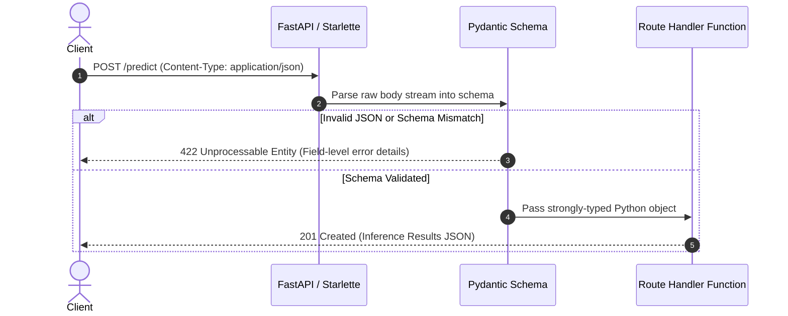

# 📹 POST Requests & Request Body: Handling JSON Payloads

<div className="video-card" style={{border: '1px solid #30363d', borderRadius: '8px', padding: '16px', marginBottom: '24px', background: 'rgba(56, 139, 253, 0.05)'}}>
  <div style={{display: 'flex', gap: '16px', flexWrap: 'wrap'}}>
    <div><strong>Instructor:</strong> Nitish Singh (CampusX)</div>
    <div><strong>Duration:</strong> 24m 30s</div>
    <div><strong>Course:</strong> Module 1 - Production Backend & Docker</div>
    <div><strong>Watch Link:</strong> <a href="https://www.youtube.com/watch?v=sw8V7mLl3OI" target="_blank" rel="noopener noreferrer">YouTube Lecture ↗</a></div>
  </div>
</div>


## 📌 Executive Summary

When building AI APIs, the **`POST`** HTTP method is the primary vehicle for sending data to the server. Unlike `GET` requests where parameters are visible in the URL, `POST` requests send data in the **Request Body**, typically encoded as `application/json`.

In FastAPI, declaring a Pydantic model as a parameter in a route function automatically signals FastAPI to read, parse, and validate the incoming JSON body against that schema.

---

## 🏗️ Architecture: Request Body Validation Workflow



---

## 📖 Core Concepts & Technical Deep Dive

### 1. Declaring the Request Body
To declare a request body, simply annotate a function parameter with your Pydantic `BaseModel`:

```python
from fastapi import FastAPI, status
from pydantic import BaseModel, Field

app = FastAPI()

class LoanApplication(BaseModel):
    applicant_name: str
    annual_income: float = Field(..., gt=0)
    loan_amount: float = Field(..., gt=0)
    credit_score: int = Field(..., ge=300, le=850)

@app.post("/loans/assess", status_code=status.HTTP_201_CREATED)
async def assess_loan(application: LoanApplication):
    # Access strongly typed attributes directly:
    approved = application.credit_score > 680 and (application.loan_amount / application.annual_income < 0.4)
    return {
        "applicant": application.applicant_name,
        "status": "APPROVED" if approved else "REJECTED"
    }
```

### 2. Combining Path, Query, and Body Parameters
FastAPI seamlessly resolves parameters based on where they appear:
1. Parameter is in the path template (`/items/{id}`) -> **Path Parameter**.
2. Parameter is a singular type (`int`, `str`, `bool`) -> **Query Parameter**.
3. Parameter is a Pydantic model (`BaseModel`) -> **Request Body**.

---

## 💻 Practical Code: Multi-Source Endpoints

```python
from fastapi import FastAPI, Path, Query, status
from pydantic import BaseModel, Field
from typing import Optional

app = FastAPI()

class DocumentChunk(BaseModel):
    chunk_id: str
    text: str = Field(..., min_length=10)
    embedding_dim: int = 1536

class EmbeddingResponse(BaseModel):
    document_id: str
    chunk_id: str
    status: str
    vector_indexed: bool

@app.post(
    "/documents/{document_id}/chunks",
    response_model=EmbeddingResponse,
    status_code=status.HTTP_201_CREATED
)
async def ingest_chunk(
    document_id: str = Path(..., description="Parent document identifier"),
    overwrite: bool = Query(False, description="Whether to overwrite existing chunk"),
    chunk: DocumentChunk = ... # Indicates Body parameter is required
):
    return EmbeddingResponse(
        document_id=document_id,
        chunk_id=chunk.chunk_id,
        status=f"Indexed successfully (overwrite={overwrite})",
        vector_indexed=True
    )
```

---

## 💡 Production Best Practices & Tips

:::tip Use `response_model`
Always declare `response_model=YourSchema` in your decorator. This ensures FastAPI filters out sensitive internal fields (like database passwords or internal raw logits) before transmitting JSON to the client.
:::

:::warning Enforce `Content-Type: application/json`
Ensure your API clients include the header `Content-Type: application/json`. If a client sends plain text or form data without the proper header, FastAPI will reject the request with `422 Unprocessable Entity`.
:::

