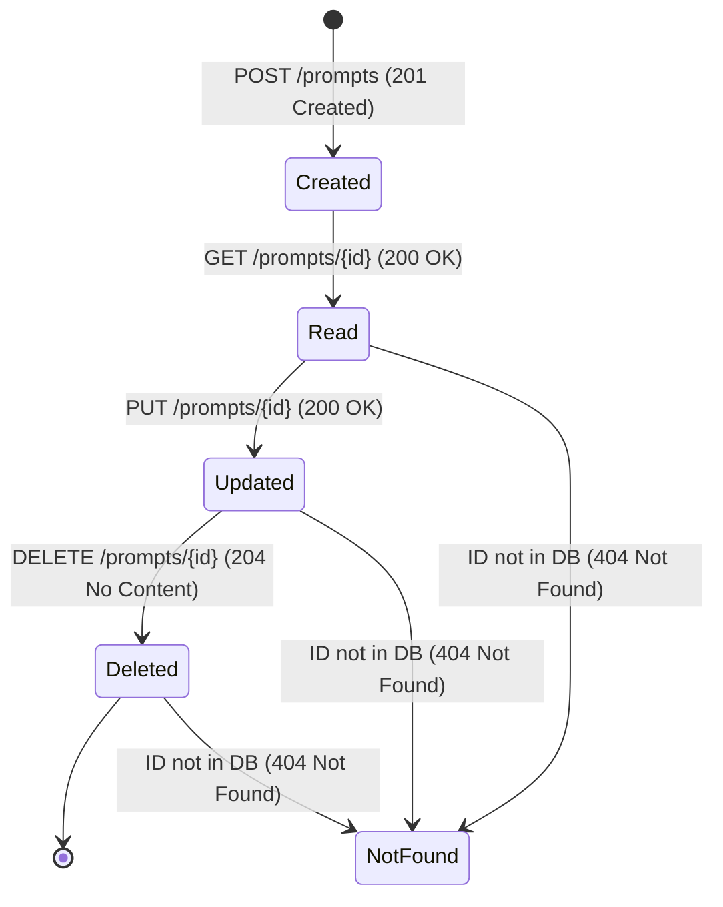

# 📹 PUT & DELETE in FastAPI: Modifying and Removing Resources

<div className="video-card" style={{border: '1px solid #30363d', borderRadius: '8px', padding: '16px', marginBottom: '24px', background: 'rgba(56, 139, 253, 0.05)'}}>
  <div style={{display: 'flex', gap: '16px', flexWrap: 'wrap'}}>
    <div><strong>Instructor:</strong> Nitish Singh (CampusX)</div>
    <div><strong>Duration:</strong> 19m 20s</div>
    <div><strong>Course:</strong> Module 1 - Production Backend & Docker</div>
    <div><strong>Watch Link:</strong> <a href="https://www.youtube.com/watch?v=XVu22pTwWE8" target="_blank" rel="noopener noreferrer">YouTube Lecture ↗</a></div>
  </div>
</div>


## 📌 Executive Summary

In REST architecture:
- **`PUT`** is used for **full replacement** of an existing resource. It is designed to be idempotent: sending the identical PUT request multiple times leaves the resource in the exact same state.
- **`DELETE`** removes a specified resource from the system. It is also idempotent: deleting a resource once removes it; subsequent deletes continue to result in that resource being absent.

In this lesson, we implement full CRUD operations backed by an in-memory database with error handling using `HTTPException`.

---

## 🏗️ Architecture: The Complete CRUD Lifecycle



---

## 💻 Practical Code: Complete Production CRUD Service

```python
from fastapi import FastAPI, HTTPException, status
from pydantic import BaseModel, Field
from typing import Dict, Optional

app = FastAPI(title="System Prompt Registry API")

class PromptTemplate(BaseModel):
    title: str = Field(..., max_length=100)
    system_prompt: str = Field(..., min_length=10)
    version: str = "v1.0"
    temperature: float = Field(0.7, ge=0.0, le=1.0)

# In-memory storage
prompt_store: Dict[str, PromptTemplate] = {
    "rag-analyst": PromptTemplate(
        title="RAG Analyst Prompt",
        system_prompt="You are an expert retrieval analyst. Answer questions strictly from context.",
        version="v1.0",
        temperature=0.2
    )
}

# 1. READ
@app.get("/prompts/{prompt_id}", response_model=PromptTemplate)
async def get_prompt(prompt_id: str):
    if prompt_id not in prompt_store:
        raise HTTPException(
            status_code=status.HTTP_404_NOT_FOUND,
            detail=f"Prompt '{prompt_id}' does not exist."
        )
    return prompt_store[prompt_id]

# 2. UPDATE (PUT - Full Replace)
@app.put("/prompts/{prompt_id}", response_model=PromptTemplate)
async def update_prompt(prompt_id: str, updated_prompt: PromptTemplate):
    if prompt_id not in prompt_store:
        raise HTTPException(
            status_code=status.HTTP_404_NOT_FOUND,
            detail=f"Cannot update: Prompt '{prompt_id}' does not exist."
        )
    # Full replacement
    prompt_store[prompt_id] = updated_prompt
    return updated_prompt

# 3. DELETE
@app.delete("/prompts/{prompt_id}", status_code=status.HTTP_204_NO_CONTENT)
async def delete_prompt(prompt_id: str):
    if prompt_id not in prompt_store:
        raise HTTPException(
            status_code=status.HTTP_404_NOT_FOUND,
            detail=f"Cannot delete: Prompt '{prompt_id}' does not exist."
        )
    del prompt_store[prompt_id]
    return None
```

---

## 💡 Production Best Practices & Tips

:::tip Returning 204 on DELETE
A standard `DELETE` operation should return HTTP status `204 No Content` and an empty response body. In FastAPI, declare `status_code=status.HTTP_204_NO_CONTENT` and return `None`.
:::

:::warning PUT vs PATCH
If you only want to update a single field (like changing `temperature` from 0.7 to 0.2 without re-supplying the entire `system_prompt` string), use `PATCH` instead of `PUT`.
:::

