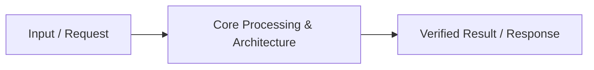

# 📹 PUT & DELETE in FastAPI

<div className="video-card" style={{border: '1px solid #30363d', borderRadius: '8px', padding: '16px', marginBottom: '24px', background: 'rgba(56, 139, 253, 0.05)'}}>
  <div style={{display: 'flex', gap: '16px', flexWrap: 'wrap'}}>
    <div><strong>Instructor:</strong> Nitish Singh (CampusX)</div>
    <div><strong>Duration:</strong> 31m 11s</div>
    <div><strong>Playlist:</strong> FastAPI for ML & GenAI</div>
    <div><strong>Watch Link:</strong> <a href="https://www.youtube.com/watch?v=XVu22pTwWE8" target="_blank" rel="noopener noreferrer">YouTube Lecture ↗</a></div>
  </div>
</div>

## 📌 Executive Summary & Learning Objectives

This lecture covers **PUT & DELETE in FastAPI**, focusing on production implementations, edge cases, and industry standards:
- Core intuition, architecture, and underlying mechanisms.
- Key differences between theoretical research implementations and scalable enterprise patterns.
- Concrete Python walkthroughs, error recovery, and performance optimization.

---

## 🏗️ Architecture & Conceptual Workflow



---

## 📖 Core Concepts & Technical Deep Dive

### 1. Architectural Foundations
In modern production AI engineering, **PUT & DELETE in FastAPI** is essential for ensuring reliability, low latency, and deterministic outcomes. As AI systems evolve from naive prompt-in / completion-out scripts into distributed systems, engineers must handle:
- **State management & consistency:** Ensuring intermediate states and tool invocations are tracked.
- **Error boundaries & recovery:** Graceful degradation when external LLMs or vector stores encounter rate limits or network partitions.
- **Resource utilization & cost efficiency:** Caching common queries and reducing unnecessary foundation model token expenditure.

### 2. Operational Considerations
- **Latency Optimization:** Pre-computing embeddings, utilizing asynchronous non-blocking event loops, and streaming tokens via Server-Sent Events (SSE).
- **Security & Sandboxing:** Validating inputs before ingestion, sanitizing LLM outputs, and isolating tool execution environments.

---

## 💻 Production Implementation Walkthrough

```python
# Production Implementation Blueprint
def run_production_pipeline():
    print("Executing production pipeline...")

if __name__ == "__main__":
    run_production_pipeline()
```

---

## 💡 Production Best Practices & Tips

:::tip Production Deployment Guideline
When deploying PUT & DELETE in FastAPI in enterprise environments, always configure automated retries with exponential backoff and telemetry tracing (such as OpenTelemetry or LangSmith).
:::

:::warning Common Failure Modes
Watch out for state contamination across concurrent requests. Ensure each session or user interaction uses an isolated thread ID or execution context.
:::

---

## 🎯 Key Takeaways & Quick Reference

| Dimension | Production Standard | Pitfall to Avoid |
| :--- | :--- | :--- |
| **Execution** | Async / Non-blocking with timeouts | Synchronous blocking calls in event loops |
| **Data Validation** | Strict Pydantic v2 schemas | Untyped dictionary access |
| **Monitoring** | Distributed tracing & latency percentiles | Relying only on standard console logs |

## ⏱️ Lecture Timeline & Key Topics

| Timestamp | Key Topic / Concept Discussed |
| :--- | :--- |
| **00:00:00** | Hi Guys, My name is Nitesh and you are... |
| **00:07:04** | First, let's import the optional from the typing module.... |
| **00:14:50** | Both the key and the value are extracted.... |
| **00:22:44** | Ok?  So this is... |
| **00:31:08** | in the next video.  Bye.... |


---

---

## 📜 Complete Lecture Transcript (English)

> **Language:** English | **Source:** `07 - PUT & DELETE in FastAPI ｜ Video 6 ｜ CampusX.en.srt` | **Total Segments:** 16 | **Word Count:** ~4,341 words

<details>
<summary><b>Click to expand full chronological transcript (16 timestamped intervals)</b></summary>

#### ⏱️ [00:00 ➔ 00:02]

Hi Guys, My name is Nitesh and you are welcome to my YouTube channel.  In this video also we will continue our fast API playlist. And right now we are building the API for our patient management system. And our progress so far is that we wanted to build a feature of Crud. Create, Retrieve, Update and Delete.  Out of that, we have built both create and retrieve features into our API. So at this point, our API has four endpoints. One is the view through which we can see the details of all our patients together. Next is Patient where we can see the details of any particular patient by providing the patient ID.  Third is sort where we can see the details of all the patients. But by sorting them on the basis of weight, height and BMI.  Both in ascending and descending order.  And lastly, we created the end point of a create in the last video.  With the help of which you can add a new patient to our database.  So the retrieval part was already done.  The creation part was done in the last video. In today's video, we are going to cover the remaining two features, update and delete.  This means that we will add this feature so that we will be able to edit the details of any existing patient and we will be able to delete any existing patient from our database. Ok?  So today we will create two new end points.  One endpoint will be named update.  Call it update or edit, whatever you want.  And we will create another endpoint named delete.  Ok?  With the help of which we will be able to delete the existing patient.  Ok ?  So after today's video, our project will be completed and then we will move on to the machine learning part. Ok?  So I hope you understand what the progress is so far and what we are going to do in this video going forward. Now let's get down to coding.  So guys let's first talk about the update endpoint and how exactly it will work. Ok?  So we'll create an endpoint called

#### ⏱️ [00:02 ➔ 00:04]

edit.  Ok?  Now as soon as our client hits this endpoint, it will provide us two things. First he will provide us a patient ID.  He will have to tell which patient he wants to update.  Ok ?  Out of all the patients.  And secondly he will provide us a request body in which he will tell what changes he wants to make about the patient.  Suppose our patient changes his city, then the new value of the city will come in this request body.  Maybe he wants to change the city and his weight. So the new value of city and weight will come. Ok?  So we will receive a request body of this type. Ok? Also the http method we will use here will be put.  I told you that you use put to update.  There is a gate to retrieve.  There is a post to create. Put is used to update. Ok?  Now the tricky part here is that your client may want to change everything about a particular patient or may want to change just one or two things.  We do n't know that in advance.  So we have to build our logic in such a way that it sends one thing or sends all the things.  Our update mechanism should work properly. So here's how the step by step work will be done: first of all, we will create a new pydantic model. We will build a new pedantic model.  Now you will say why do we need to make a new one ?  We already have a patient speaking pedantic model.  Right?  So what we made in the last video.  If

#### ⏱️ [00:04 ➔ 00:06]

you go here, you would see that we have created this pedantic model with a lot of hard work. Where we were receiving all this information from the request body and also validating it.  We cannot use this because if you pay attention, there are seven fields in total here but all the seven fields are required.   This means that if we use the pedantic model of the patient to update, then this pedantic model of the patient will expect to get the values ​​of all the fields in this request body.  But we are updating it.  We don't know whether the client will send the city or not. Will he send the wait or not?  So we have to create a completely new pedantic model. Where we will keep all these fields.  But what will we do?  We will make all these fields optional.  So that whatever is coming is correct, even if it is not coming it is still correct.  Ok ?  So step one is to build a new pedantic model.  Step two is that once the data is validated in the pedantic model, we update this new data with our existing data. Now here there is a little work of two-three steps.  I will explain that to you while writing the code.  But the most important discussion here is that our end point will include two things.  A patient ID will come as a path parameter.  The first will be part of the URL and the second will be a request body which will contain in JSON format which details of the patient need to be updated and this entire mechanism will be put and we will have to create a new pedantic model.  Ok?   I hope you are understanding things till here. Ok?  So let's start coding. So first of all what I will do is

#### ⏱️ [00:06 ➔ 00:08]

I am creating a second pydantic model right below this pydantic model. And let's name this spedantic model Patient Update.  Ok? Because it is useful for updating. This too will inherit from the base model. And here is the code inside it.  Ok?  I do n't want to write the code again and again.  A so or this is the code.  Here are those six fields.  We are not asking for ID again.  Because ID what we are asking for is the edge path parameter. So that will not be a part of the request body. Ok?  So that is why I have removed the ID.  Apart from that, everything is there like name, city, age, gender, height and weight.  A BMI and Verdict I have not included this. Because obviously we will have to compute this ourselves.  Ok?  Hey, look at something special here.  First of all, it has been used optionally. Error is coming.  So, let's do one thing. First, let's import the optional from the typing module. Ok?  Is.  So now look carefully here that all the fields are optional and we have given a default value of none to all of them inside the field.  So now something is coming, something is not coming, we will receive everything.  Ok?  Nothing is required.  Ok?  This is our pedantic model.  Now let us start building our end point.  Now look, I am telling you in advance that this end point is a bit tricky.  The logic behind this is a bit tricky.  And mostly because while updating the user can also send all the information. Can also send information of one or two fields.  That's why it is tricky.  But don't worry, I will try to explain everything to you clearly.  It would be best if you try to code this endpoint yourself. Ok?  So look,

#### ⏱️ [00:08 ➔ 00:10]

what we will do is first we will write app dot put our end point name is edit and it will get a patient ID as path parameter. Ok? So let's create a function called update patient. Ok?  And this update patient function will get two things.  First it will get a patient ID which is coming from the path param and it will be a string and second we will get a request body.  Ok?  In which our client will send new information about the patient.  Like city and weight have changed.  So, we will receive this information in a variable called patient update. And this patient update, it will be a pedantic object.  The PatientUpdate pedantic object that we just created above will be an object of this class here. Ok?  I hope you are understanding till here. Now look what will we do here?  First of all, we will first load the data of all the patients that we have in our database, basically patients.json.  So for that we already had a utility function called load data.  With his help we loaded the data.  Now the first step is that you will check whether the patient ID you are getting actually exists in your database or not?  So here you have to put a check if patient ID is in data.  In fact, let's apply this.

#### ⏱️ [00:10 ➔ 00:12]

If patient ID not in data.  In this case you will raise an http exception with a status code of 404 and here in the details you will add patient not found.  Ok?  So we have handled this case where the patient ID itself has been given wrong.  Ok?  Now assume that the patient ID is given correctly.  So what to do?  So here the first thing you have to do is suppose the patient ID was P004 which is a correct patient ID, then we will extract the complete existing information of that patient. Ok?  And that is very easy to do.  What will we do?  We will write the patient ID from within the data.  This is my existing patient info. Ok?  So now I have the existing data for patient P004.  Ok?  Now consider that in the process of updating, the client has sent me two new pieces of information. He has sent one city which was earlier Bengaluru, let's say he has sent a new one, Mumbai.  And the second is the weight which was earlier 95 and he has sent 90.  These two things have to be updated about the patient. Ok?  So what do you have to do?   First of all there is the simple process.  What do you have to do ?  In this dictionary that you just extracted, you have to update the values ​​of these two fields, City and Weight. Right? Currently Existing Patient Info: This dictionary has the value of city in it.  The value of weight is 95.  What do we have to do ? We need to extract the new value of city from within this patient update.  We have to find out the new value of weight and update it in this dictionary here.

#### ⏱️ [00:12 ➔ 00:14]

Right?  This is the process. So, what do we need to do for this?   First of all, this patient update, which is currently a pedantic object, will have to be converted into a dictionary.  Ok ?  Only then will this also become a dictionary.  This will also become a dictionary and it will become easier to work with them. So step one what do we do ?  First, let's convert this object into a dictionary.  Ok?  Now it is easy to convert it into dictionary.  If you have seen my video on pydantic. You simply need to call the model dump function. Ok?  But here's the tricky part.  You simply won't dump the model. You will write exclude unset true.  Why did I do this?  What would have happened if I had n't written this is that the dictionary I would have gotten from this entire step would have contained all these fields. Even though the client has sent only the city value and the weight value.  But since we are converting our entire pedantic model to a dictionary.  Then all the other fields would also be included in the dictionary. Even if their value was nun.  But what do I want?  I only need the fields that the client has set and sent. Vi is city and wait.  That's why what did I do here? ExcludeUnsetEqu to True.  Now what will happen is that when this dictionary is created, it will have only two items inside it.  One will be the city, its new value will be Mumbai, one will be the weight, its new value will be 90.  Ok?  So let's do one thing.  We put this dictionary that is being created into a variable. Let's Call It Updated Patient Info. Ok?  So now we have reached a stage where we have the existing information of the patient in a dictionary and the new information of the patient is also in a dictionary.

#### ⏱️ [00:14 ➔ 00:16]

Ok?  The existing one has all the fields and the updated one has only two fields.  City and Wait.  Now look at what we have to do. We will run a loop on updated patient info.  Ok?  We'll write for key comma value in updated patient info dot items.  Ok?  So basically what we are doing is that we have updated patient info which currently looks like this.  It appears so at the moment.  This is what it looks like.  We are running a loop over it. And inside the loop we are extracting both the key and the value. Both the key and the value are extracted. Ok?  And now look, think for yourself, how many times will this loop run?  This loop will run twice. Because there are two key value pairs inside it. So, what are we doing?  I am writing this code inside. Going to the existing patient info dictionary and updating the new value in the same key inside it.  Ok ?  So think carefully when you go for the first time. Here, when the loop is run for the first time, the key will be city and the value will be Mumbai.  Right?  So what did we do?  We went to the dictionary containing existing patient information and entered the city key and what was the current value of the city key? Bangalore.  What did we put there? Current value that is Mumbai.  So basically we are running the loop on the updated one but we are making changes to the existing one. I hope you understand.  Then when the second time loop runs, the key here will become weight and the new value will be 90.  So we will update the new value.  I hope you understand. Ok?  So now after this loop we will have

#### ⏱️ [00:16 ➔ 00:18]

a new dictionary which will have all these fields with old values ​​but city and weight will be with new values.  I hope you are understanding things till here. Now ideally the work from here onwards should be very easy.  All we have to do is put this existing patient information in the patient ID key of the overall data.  What will happen with this?  Again this dictionary will become a part of the overall data. But there is a big problem.  I hope you are able to figure out what the problem is.  The problem is that as soon as I updated the weight from 95 to 90 two more things automatically changed.  Which ones ?  One BMI changed and the other verdict also changed.  Right?  So we will have to apply some logic here so that as soon as we change the weight, then the BMI also changes and the word also changes.  At present we do not have any mechanism to change this. So now here's where the tricky part begins. What will we do?  First of all, we have this dictionary called Existing Patient Info where there is both old information about the patient and updated information.  We will first create a pydantic object using this dictionary.  Which class?   Of the patient class. Which we made in the last video. Now what will be the benefit of doing this is that as soon as you convert this dictionary into pydantic object, a new pydantic object will be created with new values ​​and in that process the computed fields will also be recalculated.  Look, these

#### ⏱️ [00:18 ➔ 00:20]

fields will be calculated again.  So automatically BMI will be calculated with the new weight value and verdict will be calculated on the basis of new BMI. So here we will have a pydantic object that will have the updated BAMI plus verdict. Ok?  What will we do now?  We will convert this pydantic object back to a dictionary.  Ok?  And then we will run this step on this dictionary and save the data.  And our work is done.  I hope you understand.  We are taking this whole detour for granted because we need new values ​​for BAMI and Verdict. Ok?  So let's do all this work step by step. First, let's convert the existing patient info into a patient object. Now this work is easy to do.  You know the code for this. You simply don't have to do anything. You have to create an object of the Patient class and pass this dictionary inside it. This will become your patient pedantic object. But as soon as you run this code you will get an error. Can you pause the video and think what the error could be?  I will tell you what the error will be.  So when you are taking this existing patient info dictionary, which is basically this dictionary which is currently selected on the screen with new values.  Ok?  There is only one problem.  You cannot create a pydantic object directly from this dictionary. Because it doesn't have a field.  Which

#### ⏱️ [00:20 ➔ 00:22]

field?  You'll find out if you go to the patient model above.  Look here you don't have an ID field.  You see, you don't have an ID field inside this dictionary.  If the End Since ID field is required then this code will not work.  So what do you have to do?  Here you will have to add a new key to your existing patient info and its value will be patient ID.  And after doing this transformation, when you run this code, then you will be able to easily convert it into a pydantic object. Ok?  So converted to pydantic object, data validated , computed fields arrived, new BAMI arrived, new Verdict arrived.  What do we do now?  We have to form a dictionary back from this pydantic object. So, this is also a very easy task.  What do we have to do?  We have to write patient pedantic object dot model dump.  Ok?  Now there is one thing here also.  The dictionary we get will also contain the ID.  But we don't need ID here. So what we will do is we will exclude. Ok?  So we store it back in this variable. Ok? And now add this dictionary to data.  So what are we doing?  In the overall data, existing patient information is added to the patient ID key. And in the end, just save this data. So we will call save data.  And here we are passing the data.  And that's it guys. This is the logic.  Now I know, the logic might seem a bit confusing to you.  And trust me there are better ways to do this. But I had to show you the logic of computed fields. All this had to be done. So I tried to implement the logic in this way. Ok?

#### ⏱️ [00:22 ➔ 00:24]

Rest you can use this API in your own way also.  But in the process of teaching, I had to implement whatever I taught you.  That's why I chose this method.  But whatever it is, you have to modify and manipulate things.  I guess I understand.  Come on guys, now this API is almost ready.  Let's run it and see.  Let's test it and see.  Just before that, let's do one more thing.  From here, if this operation is done successfully, then a JSON response is returned with status code 200 and here we send it in a content. Message patient updated. Ok?  So this is our update patient API endpoint.   Let's run our code once. So let's go through the documentation once. Docs, so look here your update put endpoints are in red color, they are not red, they are orange, I guess, okay, so look here you have to provide two things, one you have to provide the path parameter, second you have to provide the request body, okay, so let's test this endpoint, so we will test this patient about whom we are talking constantly, patient number four, so our patient ID becomes P004 and we want to update two things. We don't want to name names.  We just want to do so many things. Ok?  So in city we put Mumbai and in weight we put 90. You can take a look here once.  The guy's name is

#### ⏱️ [00:24 ➔ 00:26]

Arjun Verma.  This should not change.   The city is Bengaluru.  It should be Mumbai. Age is 40, it will remain 40.  The gender is male and will remain male.  The height will remain the same.  Weight should decrease from 95 to 90.  The BMI is currently 29.32.  This will decrease.  Ok?  And the verdict is overweight.  I am not sure whether this will happen or not.  Ok?  So let's run this code once. Execute and here is speaking patient updated.  Let's check again. Here is P004, see what has happened to the city, Mumbai, weight has become 90 due to which BMI has become 27 and the verdict is normal, okay, so it is getting updated, let's try one more. This is patient number one.  Her name is Ananya Sharma.  Let's just change its name and see.  Let's change Ananya Sharma to Ananya Verma.  Just checking like this. So let's reset pension number one once. Passion number one is not changing anything.  Simply changing the name. Ananya Verma. Ok.  Let's run. 200 Yes Verma is done.  Ok.  Sharma was there earlier, right?  Yes, Verma is done.  Let's look at another test case.  Where we will give wrong patient ID.  The patient ID is P010 which does not exist in our data.  Let's execute this. Look 404 is coming and it says patient not found.  Ok?  So our updated API is working fine.  Ok?  Come on guys, now we will create our delete endpoint with the help of which we can

#### ⏱️ [00:26 ➔ 00:28]

delete the record of any particular patient.  Ok ?  So, this endpoint will be named delete. And we will give it only one input and that will be the patient's ID and we will provide this patient's ID as a path parameter in the URL.  Ok ?  Apart from this, there is no need to give anything else here.  And the HTTP method we will use here will be delete only. Ok?  And you understand the whole flow I guess.  They are asking for patient ID. Loading the entire data.  They are removing that key value pair from inside it. Whose exactly this is the patient ID.   That's it.  This is the flow.  Ok?  So this is easy to make.  Let's code this quickly. So, first of all let's create a route. So, here we will say delete.  Because we are creating a delete endpoint.  And let's name it Delete Slush.  Here we will get a patient ID.  Let's create a function called delete patient. And it will get the patient ID as input which is a string. And what will we do first here ?  Load the data.  So data is equal to load data function.  We got all the data.  Now here you will have to check whether the patient ID being provided to you by the client exists in our database or not.  So we will check here if the patient ID is not in the data then we will raise an http exception with a status code 404 with a detailed message

#### ⏱️ [00:28 ➔ 00:30]

patient not found and if the patient is there then we do not have to do anything, we simply have to delete the value of patient ID from the data. And after deleting, we have to save the data again.  And we will also return a JSON response with a status code of 200 and a content saying patient deleted.  And that's it guys.  This is the end point. Ok?  This is the end point.  Let's try it. So, we have these patients.   Let us delete it and see. [MUSIC] So cut to P006.  So let's reload the docs one more time. Look here, our delete end point has come in red color. Try It Out P006 OK?  Click on execute. Currently, it is showing P006 here. After execution, he is saying patient deleted. You come here.  Now look, the last patient is P005.  So this means we are able to successfully delete the patient.  Let's check it once. Send the ID of a patient who does not exist in our database.  Let's click on execute. 404 Patient Not Found and or Guys our

#### ⏱️ [00:30 ➔ 00:31]

delete end point is also working.  So with that we completed this small project. We created a patient management system in which we wrote different endpoints for the crowd. Write three endpoints to create and to retrieve.  Wrote one endpoint for update and one endpoint for delete.  And I really hope that in the process of making this entire project, the fundamentals of Fast API became clear to you. Ok?  If you haven't already, I'd recommend that you write this entire code yourself by hand. Ok ?  Now going forward what are we going to do ?  In the next video we'll use the Fast API to serve a model. So from there our interesting part will start.  That's what we came to do. Whatever we have studied till now were fundamentals.  But now we will study some machine learning specific fast APIs.  Ok?  So I hope you liked this video.  So far, you've enjoyed this playlist.  If everything looks good then please like it.  If you have not subscribed to this channel, please do subscribe.  See you in the next video.  Bye.

</details>
