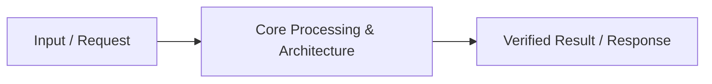

# 📹 Serving ML Models with FastAPI

<div className="video-card" style={{border: '1px solid #30363d', borderRadius: '8px', padding: '16px', marginBottom: '24px', background: 'rgba(56, 139, 253, 0.05)'}}>
  <div style={{display: 'flex', gap: '16px', flexWrap: 'wrap'}}>
    <div><strong>Instructor:</strong> Nitish Singh (CampusX)</div>
    <div><strong>Duration:</strong> 46m 37s</div>
    <div><strong>Playlist:</strong> FastAPI for ML & GenAI</div>
    <div><strong>Watch Link:</strong> <a href="https://www.youtube.com/watch?v=JdDoMi_vqbM" target="_blank" rel="noopener noreferrer">YouTube Lecture ↗</a></div>
  </div>
</div>

## 📌 Executive Summary & Learning Objectives

This lecture covers **Serving ML Models with FastAPI**, focusing on production implementations, edge cases, and industry standards:
- Core intuition, architecture, and underlying mechanisms.
- Key differences between theoretical research implementations and scalable enterprise patterns.
- Concrete Python walkthroughs, error recovery, and performance optimization.

---

## 🏗️ Architecture & Conceptual Workflow



---

## 📖 Core Concepts & Technical Deep Dive

### 1. Architectural Foundations
In modern production AI engineering, **Serving ML Models with FastAPI** is essential for ensuring reliability, low latency, and deterministic outcomes. As AI systems evolve from naive prompt-in / completion-out scripts into distributed systems, engineers must handle:
- **State management & consistency:** Ensuring intermediate states and tool invocations are tracked.
- **Error boundaries & recovery:** Graceful degradation when external LLMs or vector stores encounter rate limits or network partitions.
- **Resource utilization & cost efficiency:** Caching common queries and reducing unnecessary foundation model token expenditure.

### 2. Operational Considerations
- **Latency Optimization:** Pre-computing embeddings, utilizing asynchronous non-blocking event loops, and streaming tokens via Server-Sent Events (SSE).
- **Security & Sandboxing:** Validating inputs before ingestion, sanitizing LLM outputs, and isolating tool execution environments.

---

## 💻 Production Implementation Walkthrough

```python
# Production Implementation Blueprint
def run_production_pipeline():
    print("Executing production pipeline...")

if __name__ == "__main__":
    run_production_pipeline()
```

---

## 💡 Production Best Practices & Tips

:::tip Production Deployment Guideline
When deploying Serving ML Models with FastAPI in enterprise environments, always configure automated retries with exponential backoff and telemetry tracing (such as OpenTelemetry or LangSmith).
:::

:::warning Common Failure Modes
Watch out for state contamination across concurrent requests. Ensure each session or user interaction uses an isolated thread ID or execution context.
:::

---

## 🎯 Key Takeaways & Quick Reference

| Dimension | Production Standard | Pitfall to Avoid |
| :--- | :--- | :--- |
| **Execution** | Async / Non-blocking with timeouts | Synchronous blocking calls in event loops |
| **Data Validation** | Strict Pydantic v2 schemas | Untyped dictionary access |
| **Monitoring** | Distributed tracing & latency percentiles | Relying only on standard console logs |

## ⏱️ Lecture Timeline & Key Topics

| Timestamp | Key Topic / Concept Discussed |
| :--- | :--- |
| **00:00:00** | Hi Guys, My name is Nitesh and welcome... |
| **00:10:54** | created a completely new feature called BAMI.... |
| **00:21:41** | work in a separate folder.... |
| **00:35:00** | that this input that will be sent will be... |
| **00:46:34** | subscribe.  See you in the next video.  Bye.... |


---

---

## 📜 Complete Lecture Transcript (English)

> **Language:** English | **Source:** `08 - Serving ML Models with FastAPI ｜ Video 7 ｜ CampusX.en.srt` | **Total Segments:** 24 | **Word Count:** ~6,699 words

<details>
<summary><b>Click to expand full chronological transcript (24 timestamped intervals)</b></summary>

#### ⏱️ [00:00 ➔ 00:02]

Hi Guys, My name is Nitesh and welcome to my YouTube channel.  In today's video also we will continue our fast API playlist. Before we start the video, I'd like to give you a quick recap of what we've covered so far in this playlist. A I think we've added six videos to this playlist so far. I guess in these six videos we've covered the fundamentals of the FAST API. Ok?  So what did we do? Made a small project in these six videos. Created a patient management system and basically created an API for the patient management system in which we created different endpoints to perform the following operations crd create, retrieve, update, delete.  So created an end point to create a patient.  Created endpoint to update patient. Created different end points to retrieve the patient.  And finally an end point was also created to delete the patient. Now in this entire process, we not only built this project but at the same time, we also covered the fundamentals of API one by one.  Ok?  Like first of all we saw what are APIs ?  What is their need?  Then I gave you a very detailed introduction about Fast API and how Fast API is better than other frameworks. After that we studied concepts like what are http methods and how can you implement them. InFirst API.  Apart from that we studied some other small concepts.  Like what are path parameters? What are query parameters? What is a request body?  Another very big topic we covered in the meantime was pedantic.  How to use Pydantic to perform data validation in Fast API. We learned this.  So basically, we can confidently say that up to this point, we've covered the fundamentals of fast APIs that you'll need to build large projects. Ok?  So what will we do now?  We'll move on to this playlist.  And now we'll

#### ⏱️ [00:02 ➔ 00:04]

learn how you can serve one of your machine learning models via a fast API.   You can serve it and bring it in front of these users. So that users can use that ML model. Because you know that when a data scientist is working on a model, building a model, he is probably building the model by performing different experiments on his machine using Jupyter Notebook. But he also has to bring the model in front of the users.  So Fast API helps you to do that. Ok?  So in today's video we are going to learn how we can serve a created model to the users with the help of fast API.  How can we build an API around that model that will fetch predictions from the model.  Ok ?  So I will divide today's video into three parts.  In the first part, we will talk a little about model building and what problem statement are we working on?  Which ML algorithm did we use and how did we build the entire model.  Ok?  So we will cover that in this part, Part One. What will we do in part two?  We will create an endpoint using the FAST API. With the help of which you will be able to provide the prediction of this model to the users.  Ok?  And what we'll do in part three is we'll create a front end. And what will that front end do?  It will interact with this API, send inputs and return predictions.  Ok? So basically I am going to show you the entire spectrum together in this video.  How is a machine learning model built?  How APIs are built around it and then how those APIs are

#### ⏱️ [00:04 ➔ 00:06]

consumed.  You will learn all this together in today's video.  So on the whole trust me it is going to be a very very interesting video.  So please make sure you watch it end to end.  Ok ?  Now let's start the video.  Now guys, let us understand this entire flow through a diagram.  So as I said, this entire video is divided into three parts. So in the first part what we'll do is we'll generate our ML model using a model building process. This will be a trend model which, if you give correct inputs, will give you predictions in return.  Ok?  Then what we'll do in the second part is use the Fast API to design an endpoint around this model, which will be responsible for providing inputs to the model and returning the model's output. Ok?  And then in part three we'll create a front end that will interact with our API endpoint.  Ok ?  So to create this endpoint, I'm sorry, this front end, we will use streamlets.  Ideally in a real world situation you would use HTML CSS JavaScript here. But since we are working in the Python domain, we will use Streamlets.  The UI can be created very easily here with the help of a streamlet. Ok?  So the entire flow is going to be such that in this front end, here in the form of a website, we will show such forms to the user. In this form the user will provide the inputs that the model requires. As soon as the submit button is clicked, these model inputs will go directly to the API. What will the API do? Will validate these inputs.  Obviously validation is necessary and after validation

#### ⏱️ [00:06 ➔ 00:08]

it will send these inputs to the ML model. What will the ML model do?  Based on those inputs, an output will be generated and that output will come to the API and then the API will send the same output in JSON format to the front end and the front end will display that JSON properly to the user. Ok? So this is going to be the entire flow of this video.  Ok?  So what will we do now ?  We will execute this whole thing one by one, part by part. So first of all let's focus on part one where I will tell you what problem statement we are going to solve.  What ML models are you building?  Which algorithm are you using?  What will be the complete flow? I will show you all of this in a Jupyter Notebook. Come on guys, now let's talk about step number one where we will build our machine learning model and also export it.  Ok?  So first let's talk about what problem statement we are solving.  What are we building a machine learning model on? So the machine learning model that we are building can be called insurance premium prediction model.  Ok?  Let me give you the full context.  So you all must know about insurance. We take different types of insurance. Life insurance, health insurance, your car insurance.  Ok?  So what happens in every insurance is that when you purchase insurance, then you have to pay some amount annually to the insurance company.  Ok?  Which we call insurance premium.  Right? So how much will this premium be?  This depends on many things.  For example, if you talk about health insurance, then how much your health insurance premium should be annually depends on multiple factors.  It depends on your personal attributes. Depends on your lifestyle.  Depends on your financial condition. So we want to create a similar model

#### ⏱️ [00:08 ➔ 00:10]

which will do that if you tell about the personal attributes, lifestyle and financial condition of a user, then that model can tell you in return whether the insurance premium of that person will be high i.e. he will have to pay more money or it will be less or very less. Ok?  So basically we want to segregate that kind of customer whether he is a high paying customer or a low paying customer. Ok?  So this model is useful for two types of people.  First for insurance companies. So what can insurance companies do ?  With the help of this model you can segregate your customers.  They can identify which customers fall into which category. Ok?  And secondly, this model is also useful for users like me and users like you.  Because what can I do?  By passing my information to this model, I can find out which class I belong to. Will I have to pay a higher premium or a lower premium?  And accordingly I can bring some changes in my lifestyle.  Ok?  So you get the idea.  Right?  We are making this particular model. And the data set we got in our model is something like this.  Ok?  So we are asking each user for their age.  They are asking for his weight.  Asking for height.   They are asking for his income.  In Enum on Lax.  Is he a smoker or not?  This is what they are asking for. Which city does it belong to? What is occupation?  Or what is the category of occupation?  We are asking for all these input features from our users and we are giving these input features to our model and on the basis of these input features our model is deciding what should be the insurance premium category of that particular user ?  High, medium or low.  Ok?  So this is the ML model we have to build.  Ok?  So

#### ⏱️ [00:10 ➔ 00:12]

before going straight into the code, let me tell you the strategy that I implemented.  So my strategy was very simple.  We did a bit of feature engineering. Ok?  Did a bit of feature engineering. And what feature engineering did was we transformed some of the features a little bit and also created some new features.  Ok? Like look at this new feature.  Age group. We made this from Edge.  Ok?  So instead of using age directly as a numerical value, I have used it as a categorical feature. Ok?  So from zero to 18 we formed a group. A group was formed from 18 to 45.  45 to 60 one group, more than 60 one group.  Ok? So these different groups were formed.  Middle Aged, Senior Extra.  Ok?  So this is a feature engineering we did.  Second, we created a completely new feature called BAMI. Ok?  So we used both weight and height and we created a new feature called BAMI.  Similarly, we have created a new feature called Lifestyle Risk.  Now this lifestyle risk is actually made up of a combination of two features.  One is BMI and the other is smoker. With the help of these two, we created a feature called Lifestyle Risk to show whether the lifestyle risk is high , low or medium.  So if the BMI is very high, more than 30, the customer is obese basically and he is also a smoker, then we have put him in high risk. If someone's BMI is perfect, around 25, and he is not a smoker, then we have put him in low risk.  Ok? So this is a new feature that has been created.  Then we created a new feature called City Tire.  We looked at the cities and divided them into three tiers. Tier one, tier two, tier three.  Ok?  So this is a new feature. Apart from that, we are using Income LPA as it is and we are also using Occupation as it is.  Ok?  So basically the

#### ⏱️ [00:12 ➔ 00:14]

user is giving us this data.  But we are creating this data from it and we are giving this data as input to our model and training it. Ok?  So this setup is going to stay.  Ok.  So, now let me show you in code how I did this whole thing.  Which ML algorithm have we used and how have our results come.  Ok?  So, guys, before I show you the code, I would like to clarify one thing that this data set is a toy data set.  Which means this is not a real world data set.  I have made this.  So, obviously the results that will come after making this model will not be of very good kind.  Ok?  And the reason I used a toy data set was because my end goal in this video is not to teach you how to build a good machine learning model.  My end goal is to show you how to serve a ready- made model via a fast API. That is why we are using a toy data set here.  But still, whatever I show you here will be applicable to any real world data set as well. Ok?  So look, first of all we have imported all the libraries.  Here we have imported our data set. We tried printing this randomly for five days. This is the data set that we have.  Here we have created a copy of the data set. Because we will be applying a lot of feature engineering steps to our data set now. So the first step is that we are creating a new column with the name BAMI.  And here is the formula to make it.  Ok?  So this became a new feature of ours.  After that we have to create a feature by calling age group which will work on this logic that if the age is less than 25 then it will be called young, if it is less than 45 then it will be called adult , middle age or senior.  Ok?  And we have created this new feature here by calling age group. After that, as I said, we will create a feature called lifestyle risk which will depend on two things.

#### ⏱️ [00:14 ➔ 00:16]

First, whether the user is a smoker or not and second, what is his BMI.  Ok?  So if you are a smoker and your BMI is more than 30 then you have high risk. If you are a smoker but your BMI is more than 27 or less than 30 then you should take medium risk.  Ok?  So this is our logic of lifestyle risk and in the next step we also created that feature.  Ok? After that I told you that instead of processing each city separately, we will divide the city into tiers.  So here I have made two lists.  Tier one cities will do this and tier two cities will do this.  Ok? Apart from this, if you enter any city, it will go into Tier 3.  Ok? So this is our function.  And this became our new feature.  Ok?  And after creating all these new features, I am deleting some old features. As such Edge is no longer needed.  Age group came in its place. Weight and height are not required. BMI came in its place.  No smoker needed.   In its place came lifestyle.  And there is no need for a city.  City tyre came in its place. And after doing this, our new data set looks like this.  Ok ?  We have to train the model on this data set. So first thing we did was we separated our x and y. Ok?  This is our target column.  These became all our features.  Ok? So, I ran this code.  Here's our x and here's our y.  Ok?  Now what I did in the next step is that I put all my categorical features in a separate list and put the numerical features in a separate list. We did this because later on we are going to apply one hot encoding on the categorical features.  So what did we do? Created a column transformer and applied one hot encoding to all the categorical features in that column transformer and passed through all the numerical features as it is.

#### ⏱️ [00:16 ➔ 00:18]

No transformation was done on it.  Ok?  Then we created a SciKitLearn pipeline in which we are conducting two steps. First, this column is the transformer and second, we are training a random forest classifier on that transformed data. Ok? So the algorithm we're using is a random forest classifier.  So this is our pipeline and now our last step is we cut our X data into training and test data by using train test split and then train the model by calling pipeline.fit.  Ok?  And here is the accuracy of the model.  At present it is around 90%.  But again, as I said, this is a toy data set.  Not a very large data set. So these results are not very reliable. You should consider this entire project as a dummy project.  The flow is correct but you cannot rely on the results. Ok?  So our model is ready. Now what do we just have to do? We have to download this model which was created in the last step. So here if you go and refresh, this is our model.pk file.  We will download this into our machine.  Ok?  And what will we do with this model file ?  Build your own API. Ok?  So with that, our step one is complete.  Ok ?  We have completed the model building and the output we got is that we have a model.pk file.  So this step is done.  Now we will move on to step number two where we will create an API endpoint for this model using the Fast API. So at this point we have a model, a machine learning model, which has been trained and we need to write an API endpoint for the predictions of this ML model. Ok? I would like to clarify a few things about this API endpoint that we will write. The first thing will be that the http method we will use here will be

#### ⏱️ [00:18 ➔ 00:20]

post.  This is where confusion may arise in your mind if you are following this playlist completely.  A few videos ago, I told you that you use the http method post when you're creating a new resource on the server. Now here we are not creating any new user or new resource. Then why are we using post ?  So here I would just like to clarify a little bit that the definition I gave you earlier was not a complete definition.  A broad and complete definition would be that you use the POST HTTP method when your client wants to send some data to your server.  Ok?  And the client wants the server to process this data.  Now many things can be done by processing.  A new resource can be created or an ML model can be inferred. All these things are possible.  Ok?  So going forward you will always see that whenever you are writing prediction API of any machine learning model or deep learning model, in fast API then you will keep http method as post only.  Ok?  So the funda is that we have to create an endpoint and the URL of the endpoint will be slush predict.  We will create this with the help of post http method and we will send some inputs in the request body from the client side. What input will you send?  I guess you understand. We will send all the input features of a given user. Like what is his age?  What is weight?  What is height? Income, Smoker, City, Occupation. We will send these six things.  Seven things.  Now this question might be coming to your mind that but our model is trained on these features. So, why aren't we shipping these features?   The reason for this is that we don't want the user to do all these calculations.  For example, if we ask him for his BMI, he will have to sit down and

#### ⏱️ [00:20 ➔ 00:22]

calculate his BMI first. If we ask him for the tyre of his city, he will have to go and first see which tyre his city falls under. Ok?  Similarly, to calculate lifestyle risk, he would need to calculate BAMI and then run an FL statement. So we don't want the user to work so hard. We will ask the user for this raw data about them and then we will build these features inside our endpoint. Ok?  So this is going to be the flow.  The user will give us this set of features. We will first of all validate these that yes, these values ​​are matching correctly.  Once these values ​​are validated correctly, then we will calculate these features with the help of these values. And then after getting these features, we will send these features to the ML model.  The ML model will make a prediction and it will return the output of that prediction in JSON.  High, low or medium, whatever it is.  Ok?  So this was a very important discussion that I had to have with you that the http method is post.  Why is this a post?  I told you.  And second, we are asking the user for these features, not these ones.  Ok?  I hope things are clear to you till here.  Now let's start coding and create our API endpoint. So Guys, before we start coding, let me explain the setup a little bit.  We're working in the exact same folder we were using throughout this playlist. So you can see main.py which is the file of the patient management system that we created.  There's also this file patients.json.  What have I done here?  I have created a new file app.py although this is not recommended.  The correct way would have been to work in a separate folder. But since we are currently working in continuation, I am doing everything here. But going forward in the next video when we work on Docker, I will show you how to do all this work in a separate folder. Ok?  But for now we have created this file in the same folder.  This is where we will create our end point. Apart from this, I have done another important work.

#### ⏱️ [00:22 ➔ 00:24]

I have pasted the model.pk file that we downloaded from Google Collab into this folder.  Ok ?  So we have done these two important things. what shall we do now?  First of all, in step number one, we will import the ML model.  So for this we have to use simple file handling. We will write v open our file name model dot PKL and here you will tell in which mode you want to open it.  We want to open in read binary mode.  Because this is a binary file as f and here we will write model is equal to pickle dot load and in load we will pass f our handler. Ok?  I have imported pickle here. So in this step we have imported our ML model. what shall we do now?  We will create a cast API app object. So app is equal to fast API. Ok?  This is how we created our app object. Now what will we do first?  We will build a Pydentic model to validate incoming data.  Ok?  So, do you know what to do for this?  The first thing you need to do is create a class.  Let's name the class as user input.  This class will inherit from the base model.  And there will be a total of seven fields in it.  Ok?  There will be age , weight , height , income in LPA, whether you are a smoker or not , city and your occupation. Ok?  So if I can show you, okay?  Age, Weight, Height, Income, LPA, Smoker, City, Occupation.  Ok?  Now

#### ⏱️ [00:24 ➔ 00:26]

what are we to do in all this?  Just need to add a little description and validation.  So we'll import annotated from the typing module. And I'll write annotated here.  This will be an integer.  And here we will make it required by calling the field function and here we will also add a little validation that the age should be greater than 0 and less than equal to 120 let's say. Ok?  Similarly, I do the same thing in everything. Here we can also add a description. By the way, the age of the user. Copy paste this will happen your float should be greater than 0 and less than 2.5 meters I guess description weight of the patient after that height will come my bad 2.5 I took it as height.  In fact, whatever upper limit you put on weight, it can be any amount.  Here also we will put float and here you can put 2.5 2.5 meters income LPA can also be float.  3.2 Someone may have a salary.  Must be greater than zero. Again there is no need to enter any upper limit.

#### ⏱️ [00:26 ➔ 00:28]

Annual salary of the user in LPA.  After that your smoker will come.  Smoker will be bool yes no and here validation is not required is the smoke is the user is a smoker okay and after that the remaining city city will be string required validation is not required the city that the user belongs to okay and lastly we need occupation key value annotated this will be a literal because we want to give options in it.  Ok?  So what are the options?  For that, let us check what we can do once.  So what we'll do is we'll write df occupation dot unique to get all the unique values. So here are all those unique values, let us copy and paste it here. Ok?  These are the options.  There can be no other option than this. Occupation of the user.  So guys, this is our basic pydantic model where we are providing a little bit of metadata to the client and also doing a little bit of

#### ⏱️ [00:28 ➔ 00:30]

validation.  Ok?  Also, we don't need to give all this in this field. Or is it okay?  So, it is a matter of whether we are able to receive and validate all the input values ​​correctly or not.  Now there is a second part.  The second part is that we have to create new features from these features. Like we have to make BAMI with the help of height and weight. With the help of similar age we have to create age group. City tier has to be created with the help of the city. And we have to create another column called Lifestyle Status.  Ok?  So what we will do is we will use computed fields.  Ok?  To compute these values.  So what I will do is first let me create the BMI field and show you.  What will we do for that?  We have imported the computed field from above. So we will write @ComputedField @Property.  And here we will create a new function by the name of BMI.  You know here the name of the function should be exactly the same as the name of your feature.  The name of the field is .  So here we are getting the self object and what we are getting in return is a string.  I'm sorry not string is float.  Ok?   The BMI value will be float.  And this function is returning us self dot weight divided by self dot height squared. We are putting the thing below in brackets like this. Ok?  So this became our first computed field.  Similarly, we create another computed field called lifestyle risk.  So computed field@ property def lifetime underscore

#### ⏱️ [00:30 ➔ 00:32]

risk this is also getting self and it will return us a string and I will not write its logic myself. What I can do is I can borrow this logic from here copy paste. We just have to fix things up a little bit here. So here instead of row it will come self dot smoker and self dot BMI okay and I will replace this here also okay?  And this became our second computed field, lifestyle risk, speaking. Now we have to create two more computed fields in the same manner. One will be age group and one will be city tyre.  So again the @ComputedField @ PropertyAsGroup function is getting the name self. Returning string.  Again, there is no need to write this logic in full. We can simply copy this code. And instead of self wherever edge is written, we have to do self dot edge. copy paste paste ok?  This became our third computed field.  And lastly we have to create another computer field

#### ⏱️ [00:32 ➔ 00:34]

and its name will be City Tire.  Again we will get self and after turning it we will get an integer. And what we will do is well for this we will have to do one thing. We need to copy this list first.  Only then will we be able to decide which category the user's city falls into. Ok?  So I copied this over here. And what will we do now ?  We will copy this code. We will write self dot city if it belongs to tier one city then return one if it belongs to tier two then return two otherwise three and this becomes our fourth computed field okay so here is our pydantic model which is not only validating the basic data but at the same time providing your meta data to the client and at the same time creating features for you through some computed fields. So we created BAMI, age group, lifestyle risk , city tier, income LP will remain the same and occupation will remain the same. So we have done a lot of work. Ok? Once done save the code.  So the pedantic model was created.  Now we will create our predicted end point. Ok?  So for that, we will first create a route app dot post.  And we can put Route Predict.

#### ⏱️ [00:34 ➔ 00:36]

Ok?  And here let's create a function by the name of predict premium.  It will receive user data as input. So let's call it data.  And what type of object will this user data be ?  This will be an object of type UserInput which is our pydantic model. Ok?  So we will get data from the request body. It will go straight to our pedantic model.  Our pydantic model will work on it, validate it, extract the computed fields, and then it will be returned to us in the form of data here.  Ok ?  Now what do we have to do here? Our model needs to be loaded.  The model is already loaded.  Well, we just have to create the proper input format.  Ok?  So basically what will happen is that in this way we have to pass the data of one row to our model.  Ok?  And you have to keep in mind that this input that will be sent will be sent in the format of Pandas data frame. Because our random forest model is trained on a data frame object. So what I will do is above I have imported Padas.  I'm creating a new data frame here.  And in that data frame, we are going to keep only one row. And inside that row we will pass a dictionary in which the value of BAMI will be data dot BMI. After that comes Age Group and its value will be data dot Age Group, after that comes Lifestyle Risk and its value will be data dot Lifestyle Risk, after that comes City Tire

#### ⏱️ [00:36 ➔ 00:38]

whose value will be data dot City Tire, after that comes Income LPA, its value will be data dot Income LPA, after that comes Occupation and its value will be data dot Occupation, okay?  And we store this in a variable. Let's call it input df.  So, this becomes our input that we will pass to our ML model.  And now we have to make a prediction.  So, we will call the predict function of the model we imported above.  Ok? And there we will pass our input df.  This will give us the output in the form of a list and we will need the zeroth item of that list and this will be our prediction. Ok?  And now we have to return this prediction in JSON format. So what we will do is we will import json response from the HMS API dot [music] responses and here we will come and we will write return json response status code will be 200 and here in the content we will add predicted

#### ⏱️ [00:38 ➔ 00:40]

category is prediction.  And that's it guys.  This is our ML model. Ok?  This is our model.  Let's take a look.  Let's recap.  We imported the model.created an object of the API. We created this pedantic model of our own. And here is our end point.  Ok ?  Ok?  It's a simple end point. What do we do now?  This has to be run.  So first of all we have activated our virtual environment. Here you will have to install two things.  First you will need to install Pandas.  Done.  And we have to install it in seconds. Ok?  Done.  What can we do now ?  We can run our fast API app.   It has started.  Let's test it then guys. Obviously nothing will come here.  We have not built any home URL. So we will go directly to the docs. And some how docs is also not working.  Now it is working.  I don't know any issue happened.  Just refreshing fixed it. So look at this guys, this is one of our endpoints which is post and it's called slash predict.  Ok?  Predict Premium works and let's try it out.  So let's put in age, put in weight 79, put in height 1 72, put in income LPA 10, from smoker lets we did Falls City, we made Gurgaon. Ok?  And we did the occupation.  Let's pick it up from here.  Let's do G Capital in Gurgaon. And we do it in occupation.  Let 's put government jobs here.

#### ⏱️ [00:40 ➔ 00:42]

Ok?  And what are we doing now?  We are executing this.  And see it cess that your premium will be low.  Because the age is low and the BMI also does not seem to be very bad. And there's Smoker Falls.  Let's set Smoker to true once and set the weight to 100.  And now let's run.  Execute medium is coming. Ok?  Let's increase the edge.  Let's do it 69.  And now let's execute.  The high is coming.  Ok?  So roughly it is working.  I am not saying that this is a perfect model and will always give perfect results. But you get the idea.  We have just completed our second step.  We made this step also.  Now we have our API.  Ok?  Now I will show you how to create a front end and interact with this API using Stream.  So now what did I do for the stream part?  I created a new file. Front Dr. Py Inside Same Folder. Ideally this should be a separate project. Your front end is a completely separate project from your API.  And that's why they should have different project directories.  But again we're doing a basic tutorial.  So we are doing all the things at the same place.  But you understand right?  What did I do after that?  I installed these two dependencies in my virtual environment.  pip install streamlet pip install requests.  Ok ?  And I have already written the code here. Because my goal in this video is not to teach you Streamlets.  I just want to show you model serving in Fast API. So I just want to show you how once your API is created, how your users, your clients access that API.  They can access it via their website and via their mobile app.  Those are different use cases.  I'm going to show you how to access it through a website.  And we are creating this website with the help of Streamlet.

#### ⏱️ [00:42 ➔ 00:44]

Streamlets is a popular library in Python that helps you create UI. Ideally, if you create a website in a real world situation, you create it with the help of HTML CSS.  But again, as I said at the beginning of the video, we want to stay within the domain of Python.  Ok?  So the code is very simple.  The best thing about Stream is that it is a very simple library.  It is a very powerful library. You can quickly create a very powerful UI. Ok?  So what did you do here?   First of all, write down your API URL. Your API URL is localhost colon 8000 predict okay basically this is the endpoint you are accessing okay and this is the URL of yours this is your AVI API server home URL okay here we have set the title of the streamlet web page and here we have written in a text enter your details below now here we have created a form where we are asking multiple things from the user.  Precisely we are asking him for seven things.  The first one is Edge which we are fetching using H ST dot number input.  Here we have told what is the name of that form field ?  What will be the minimum value? What will be the maximum and what is the current value. Ok?  These are some default values. Ok?  Same for weight, height, income LP, after that smoker, we have given a dropdown in it using ST dot select box.  We have asked are you a smoker and have given two options true and false.  Then there's the City A text input. A: Here you are giving the default value Mumbai but the user can enter anything.  And similarly, we have given a dropdown for occupation. And here are our options that will be visible to our user.  Ok ?  So if we talk from the UI point of view, this is the UI that we are getting. Ok? Enter Your Details Below Age Default Value Weight Height Everything is There What did we do after that?  A button has been added.  The name of the button

#### ⏱️ [00:44 ➔ 00:46]

is Predict Premium Category This Button. Ok?  Now what will happen on clicking this is that we will form a dictionary in which we will very carefully add all these values to a dictionary.  Whatever the user provided and then what will we do? With the help of the request library, we will hit this URL which we decided above and from here we will send our data. This is the data.  Ok?  Now from here onwards it is up to our API.   The API will get this data.  The API will make predictions on top of that.  It will send a JSON response in return.  If the response status code is 200, we will calculate and display the predicted insurance premium here. If there is any problem, we will show the error. This is the funda.  Ok?  So you don't have to do anything to run it. You basically have to run a command. Streamlet run your file name front dot py is very simple streamlet.  If you watch any tutorial even for a little while, you will understand it for 10 minutes.  Ok?  So I do one thing.  Let me enter some values ​​here again. 35 79 1.72 Annual Income Suppose I put 10. Smoker Falls put. Enter city Gurgaon and enter business owner.  Predict Premium Category And You Can See Low is coming.  Ok ?  Same if I increase the age to 65 and make it 100 and make smoker true, predict it's high.  Ok?  So this is how you consume an API.  Ok?  The same work can also be done through a mobile app.  This can also be done through a website. Ok?  So I hope you understood. If I go back to this flow diagram, we have completed this third step as well.

#### ⏱️ [00:46 ➔ 00:46]

And this whole flow, I hope you are understanding it too.  Ok?  So this is how you build an API around a machine learning model.  The same concept is true for deep learning models as well.  You can build a model in Pi Torch.  You export it in exactly the same way and you can build an API around it.   In exactly the same way.  In fact you should try that.  Ok?  So with that I will close this video.  I really hope you found this video useful.  If you liked it, please like it.  If you have not subscribed to this channel , please do subscribe.  See you in the next video.  Bye.

</details>
