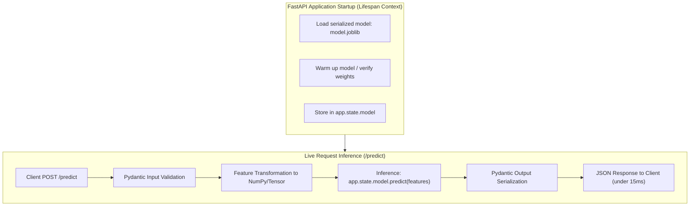

# 📹 Serving Machine Learning Models with FastAPI

<div className="video-card" style={{border: '1px solid #30363d', borderRadius: '8px', padding: '16px', marginBottom: '24px', background: 'rgba(56, 139, 253, 0.05)'}}>
  <div style={{display: 'flex', gap: '16px', flexWrap: 'wrap'}}>
    <div><strong>Instructor:</strong> Nitish Singh (CampusX)</div>
    <div><strong>Duration:</strong> 28m 10s</div>
    <div><strong>Course:</strong> Module 1 - Production Backend & Docker</div>
    <div><strong>Watch Link:</strong> <a href="https://www.youtube.com/watch?v=JdDoMi_vqbM" target="_blank" rel="noopener noreferrer">YouTube Lecture ↗</a></div>
  </div>
</div>


## 📌 Executive Summary

Deploying Machine Learning models requires bridging data science artifacts (NumPy, Scikit-learn, PyTorch) with web protocols. 

Key challenges in ML serving include:
1. **Model Loading Overhead:** Models can take seconds or minutes to load into RAM/VRAM. Reloading weights on every HTTP request destroys latency.
2. **Type Safety & Feature Alignment:** The model expects features in a strict sequence with explicit data types.
3. **Concurrency:** Ensuring CPU-heavy predictions do not block asynchronous networking loops.

---

## 🏗️ Architecture: Production ML Inference Lifecycle



---

## 📖 Core Concepts & Technical Deep Dive

### 1. Lifespan Context Manager
In modern FastAPI, model loading must happen inside an `@asynccontextmanager` lifespan handler. This runs **once** when the server starts, and safely releases GPU/CPU memory when the server shuts down:

```python
from contextlib import asynccontextmanager
from fastapi import FastAPI
import joblib

ml_models = {}

@asynccontextmanager
async def lifespan(app: FastAPI):
    # Startup: Load ML Model once
    print("Loading ML model artifacts into memory...")
    ml_models["classifier"] = joblib.load("model.joblib")
    yield
    # Shutdown: Clean up resources
    ml_models.clear()
    print("Model resources unloaded.")

app = FastAPI(lifespan=lifespan)
```

---

## 💻 Practical Code: End-to-End ML Prediction Service

```python
from contextlib import asynccontextmanager
from fastapi import FastAPI, HTTPException, status
from pydantic import BaseModel, Field
import numpy as np

# Mocking trained model for self-contained execution
class MockIrisModel:
    def predict(self, X: np.ndarray) -> np.ndarray:
        # Returns class index 0, 1, or 2
        return np.array([1])
    
    def predict_proba(self, X: np.ndarray) -> np.ndarray:
        return np.array([[0.05, 0.90, 0.05]])

model_store = {}

@asynccontextmanager
async def lifespan(app: FastAPI):
    # In production: model_store["iris"] = joblib.load("iris_model.joblib")
    model_store["iris"] = MockIrisModel()
    yield
    model_store.clear()

app = FastAPI(title="Iris Flower Species Prediction API", lifespan=lifespan)

class IrisFeatures(BaseModel):
    sepal_length: float = Field(..., gt=0.0, le=10.0, example=5.1)
    sepal_width: float = Field(..., gt=0.0, le=10.0, example=3.5)
    petal_length: float = Field(..., gt=0.0, le=10.0, example=1.4)
    petal_width: float = Field(..., gt=0.0, le=10.0, example=0.2)

class PredictionResponse(BaseModel):
    species_id: int
    species_name: str
    confidence: float

SPECIES_MAP = {0: "setosa", 1: "versicolor", 2: "virginica"}

@app.post("/predict", response_model=PredictionResponse, status_code=status.HTTP_200_OK)
def predict(features: IrisFeatures):
    model = model_store.get("iris")
    if not model:
        raise HTTPException(status_code=500, detail="Model not initialized.")
    
    # Transform Pydantic attributes into 2D NumPy array
    input_vector = np.array([[
        features.sepal_length,
        features.sepal_width,
        features.petal_length,
        features.petal_width
    ]])

    # Execute inference
    prediction = int(model.predict(input_vector)[0])
    probabilities = model.predict_proba(input_vector)[0]
    confidence = float(probabilities[prediction])

    return PredictionResponse(
        species_id=prediction,
        species_name=SPECIES_MAP.get(prediction, "unknown"),
        confidence=round(confidence, 4)
    )
```

---

## 💡 Production Best Practices & Tips

:::tip Use `def` instead of `async def` for CPU Inference
Scikit-learn and PyTorch CPU calculations are synchronous, blocking C-extensions. If you run `model.predict()` inside an `async def` function, you will freeze the entire event loop for all concurrent users! Define your endpoint with standard `def` — FastAPI will automatically dispatch it to an internal threadpool.
:::

:::warning Memory Leaks during Model Reloading
If implementing hot-reloading for model checkpoints, always run garbage collection (`import gc; gc.collect()`) and clear PyTorch CUDA caches (`torch.cuda.empty_cache()`) to prevent GPU Out Of Memory (OOM) crashes.
:::

