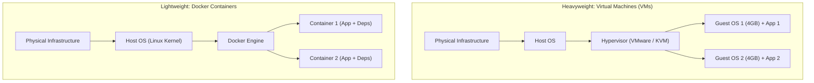

# 📹 Docker Crash Course for ML & AI Engineers

<div className="video-card" style={{border: '1px solid #30363d', borderRadius: '8px', padding: '16px', marginBottom: '24px', background: 'rgba(56, 139, 253, 0.05)'}}>
  <div style={{display: 'flex', gap: '16px', flexWrap: 'wrap'}}>
    <div><strong>Instructor:</strong> Nitish Singh (CampusX)</div>
    <div><strong>Duration:</strong> 32m 15s</div>
    <div><strong>Course:</strong> Module 1 - Production Backend & Docker</div>
    <div><strong>Watch Link:</strong> <a href="https://www.youtube.com/watch?v=GToyQTGDOS4" target="_blank" rel="noopener noreferrer">YouTube Lecture ↗</a></div>
  </div>
</div>


## 📌 Executive Summary

The infamous excuse: **"It worked on my machine!"** is the number one cause of production downtime in Machine Learning. 

ML applications depend on complex, fragile dependency trees:
- Underlying OS packages (e.g. `libgomp1`, `ffmpeg`, `cuda-drivers`)
- Specific Python minor versions (`python3.11` vs `python3.12`)
- Exact C++ compiled wheels (`torch`, `numpy`, `flash-attn`)

**Docker** solves this by packaging the application code, the runtime, system tools, libraries, and configurations into an immutable, portable artifact called a **Container Image**.

---

## 🏗️ Architecture: Virtual Machines vs. Docker Containers



---

## 📖 Core Concepts & Technical Deep Dive

### 1. Key Terminology
- **Dockerfile:** A text blueprint containing sequential instructions to build an image.
- **Image:** A read-only, immutable snapshot of an environment composed of layered filesystems.
- **Container:** A runnable, isolated instance of an image (like an object instantiated from a class).
- **Docker Hub / ECR:** Central registries for storing and sharing container images.

### 2. Essential Docker CLI Cheat Sheet
```bash
# Build an image with a tag
docker build -t my-ai-app:v1.0 .

# Run container in background mapping port 8000
docker run -d -p 8000:8000 --name ai-service my-ai-app:v1.0

# List running containers
docker ps

# Inspect logs
docker logs -f ai-service

# Execute interactive shell inside running container
docker exec -it ai-service bash

# Stop and remove container
docker stop ai-service
docker rm ai-service
```

