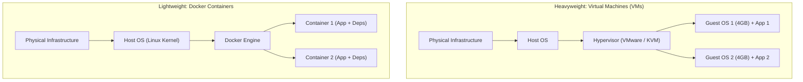

# 📹 Docker Crash Course for ML & AI Engineers

<div className="video-card" style={{border: '1px solid #30363d', borderRadius: '8px', padding: '16px', marginBottom: '24px', background: 'rgba(56, 139, 253, 0.05)'}}>
  <div style={{display: 'flex', gap: '16px', flexWrap: 'wrap'}}>
    <div><strong>Instructor:</strong> Nitish Singh (CampusX)</div>
    <div><strong>Duration:</strong> 32m 15s</div>
    <div><strong>Course:</strong> Module 1 - Production Backend & Docker</div>
    <div><strong>Watch Link:</strong> <a href="https://www.youtube.com/watch?v=GToyQTGDOS4" target="_blank" rel="noopener noreferrer">YouTube Lecture ↗</a></div>
  </div>
</div>


## 📌 Executive Summary

The infamous excuse: **"It worked on my machine!"** is the number one cause of production downtime in Machine Learning. 

ML applications depend on complex, fragile dependency trees:
- Underlying OS packages (e.g. `libgomp1`, `ffmpeg`, `cuda-drivers`)
- Specific Python minor versions (`python3.11` vs `python3.12`)
- Exact C++ compiled wheels (`torch`, `numpy`, `flash-attn`)

**Docker** solves this by packaging the application code, the runtime, system tools, libraries, and configurations into an immutable, portable artifact called a **Container Image**.

---

## 🏗️ Architecture: Virtual Machines vs. Docker Containers



---

## 📖 Core Concepts & Technical Deep Dive

### 1. Key Terminology
- **Dockerfile:** A text blueprint containing sequential instructions to build an image.
- **Image:** A read-only, immutable snapshot of an environment composed of layered filesystems.
- **Container:** A runnable, isolated instance of an image (like an object instantiated from a class).
- **Docker Hub / ECR:** Central registries for storing and sharing container images.

### 2. Essential Docker CLI Cheat Sheet
```bash
# Build an image with a tag
docker build -t my-ai-app:v1.0 .

# Run container in background mapping port 8000
docker run -d -p 8000:8000 --name ai-service my-ai-app:v1.0

# List running containers
docker ps

# Inspect logs
docker logs -f ai-service

# Execute interactive shell inside running container
docker exec -it ai-service bash

# Stop and remove container
docker stop ai-service
docker rm ai-service
```


---

---

## 📜 Complete Lecture Transcript (English)

> **Language:** English | **Source:** `10 - Docker for Machine Learning ｜ Docker Crash Course ｜ CampusX.en.srt` | **Total Segments:** 44 | **Word Count:** ~14,477 words

<details>
<summary><b>Click to expand full chronological transcript (44 timestamped intervals)</b></summary>

#### ⏱️ [00:00 ➔ 00:02]

Hi Guys, My name is Nitish and you are Welcome to my YouTube channel. In this video We are going to talk about a topic like this You are going to what you call the world of software. You can call it a universal topic. Universal means that you can You are working in any profile. To you This particular topic will definitely be needed. Whether you are a software developer or a web developer Whether you are a developer or a data scientist or Are you an MLPs engineer or a DevOps engineer? I work. In all these profiles You will need today's topic and today The topic is called Docker. I am Pretty sure you've heard about it. Have heard. Ok? Now because it is universal It is a topic and it is used everywhere. that is why its from job point of view and Much more from an interview point of view There is a requirement. And that is why you I get daily messages from people. Sir, when will you cover Docker? specially With Context to Machine Learning. So today In the video, I have decided that I will take you from the very beginning to intermediate Level up to the amount of Docker you require A Data Scientist and Mlops Engineer I will teach you everything in these 90 minutes. and this I divided the entire 90 minutes into two parts. Has divided. In the first part I It will take you around 40 minutes to learn all about Docker. I will teach whatever fundamentals theory there is. Here we will cover the topics. Such as What is Docker Engine? What is a Docker image? Are there? What is a Docker container? What is a registry? What is a Docker file? It happens? All these are very important Components are of Docker. We will discuss all this do. Along with this, we overall We will discuss the architecture that Docker Exactly how overview mode works Is. Ok? And when you get all these The fundamentals will become clear. After that We will move to the second part of the video. On the side where I will tell you practically all these things. I will show you things. Ok? So we are a We will take the ML project and we will make a will build the Docker image. We can create that Docker image Push to Docker Hub and then deploy that image Run the edge container back on your machine

#### ⏱️ [00:02 ➔ 00:04]

Will run it. Ok? This whole thing we Gonna cover that in today's video. So If you are a beginner who needs to study Docker and You have never read it till date. Trust Me If you watch this video, you will You will have enough knowledge about Docker that You will never learn about MLOPS and data science again. There is no need to touch any extra resources. There will be no need. Ok? so with that Let's start the video. So come on let's Start our discussion. The first and most The basic question that will come to your mind is this What is Docker? Ok? if you Just like the Wikipedia definition Wikipedia defines Docker as a Platform Designed to Help Developers Build Share and run container applications. Very It is a simple definition. But if you have this Samjha Hai with an example with an analogy So I can give you a good analogy. Am. I probably told you before, a good Analogy to Understand Docker Wood B. Magee Noodles. We all must have eaten. Now if you pay attention, Maggi noodles if If you've ever made one, you'll know that It has two components. There happens to be one Your noodle part is that white Whatever Thing That Happens to Be Ramen and Seconds It is yours and the spices that come with it. It is called Maggi Masala, which Wright himself now think How important is the seasoning aspect of noodles? That when you add this spice to noodles If yes, then Maggi will always taste the same. It is possible, you can make it at home or if you Have you gone trekking in the mountains? Make it, the taste of Maggi remains exactly the same. End Think about it, this is a very important thing. If Mana Lo In An Alternate Universe Maggie The product comes in such a way that it gives us He would give us noodles and a recipe book. Dete and Recipe Book Recipe Book

#### ⏱️ [00:04 ➔ 00:06]

It would have been exactly written that Maggi masala How to make it: Add 1 gram of red chilli. Is. 1 gram black pepper has to be added. Different Methods Ingredients Listed It remains and you create that masala for the user. What if I had to cook Maggi while cooking? Could there be a problem? I Think You Can Understand what the problem could have been Even though this recipe is the same for all users, Yes, but when the user goes to make this recipe It could have happened that whatever Maggi is made for everyone Its test will be different. could be possible that the red chili that I have here is probably not as good quality or At someone else's place, what else I don't know There are spices. Black pepper is its taste Not that good. Due to which the overall The Maggi test that was supposed to come did not come. Found. So obviously people will not buy this product. Will buy. So Standardization Was Variant. So that's why Maggie What the creators did was that they kind Of which the whole spice is Containerized. a container for it Made it and everyone has the same container. I will send it. It doesn't matter anymore That you became Magi by staying in Uttar Pradesh Are you living there or in Kerala? Since that container The entire Maggi is containerized. Spices. Taste of Maggi across India You will get beans. So this is the problem with the software. It also comes in. In the software, when you When you go to make software, it goes through many stages. It is made in. Development takes place, then Testing happens, then deployment happens Is. Right? So what happens many times is that At the time of software development, The code is running on one machine. It doesn't work after testing because There may be a different OS there. apart There may be libraries. of libraries There may be different versions due to which the code It breaks and does not work. it Same issue can happen on deployment also. So People thought what if we develop your software application at the same time lock it in a container and that container

#### ⏱️ [00:06 ➔ 00:08]

Send us people. Like if my tester If he wants to test it, I will take him to my In exchange for providing the software files, I will give you a package that includes my software and All the requirements related to it That should also happen. Then automatically if my If that container is running on the machine then its machine But it will work too. And this is the basic idea Behind Docker. so what you do is you You build containerized applications. You Build it, you share it, you run it with the help of Docker. Ok? So, Now That You Have a Basic Introduction with the help of an analogy. Now Let's have one more discussion. Why Do We Need Dockers? So I will give you one reason. Diya abhi but there are more reasons. Ok? So they discuss it one by one. So The first reason I just discussed is that We Need Consistency Across Environments. Look here the problem is written. Applications offen behave differently in Development, Testing and Production. Dew to variations in configuration, dependencies and infrastructure. And this is bad. Because a lot of time is wasted on things in doing. So what do Docker containers do? that whatever are the necessary components of your Pick up all those related to software and put it in a box and You distribute the box itself. Ok? So this problem occurs genuinely. I will show you this practically with the Help of a scenario. So let's say we Working as a Data Scientist at Campus X Have been. And I don't have one Asked to make a laptop price predictor Went. So what did I do? I have my I made this project on my laptop. Its I have created a streamlet application around Made it too. and this streamlet application Pay This Laptop Price Predictor Correctly It is working on my machine. Now the next What will be the stage? Once it is made Obviously this will have to be tested. So, CPS is X I also work as a tester. So he He asked me for the entire code. So I What did you do? This laptop price predictor

#### ⏱️ [00:08 ➔ 00:10]

Take the entire code and put it on GH Gave. And that's the link to GH I used in this tester. Shared it with. Now I will show you I am sure that the tester will be able to access this GitHub profile when If A copies the project then he What could be the problem? Ok? So I am just showing you this entire scenario. Am. So let's assume for a moment that Here is the link to our website The project is hosted. So your tester What will he do? Your tester on his machine Will come. open command prompt and in command prompt he simply writes this clone the repository Will take. He tried to clone this repository. Effort of. By Writing This Command CD Desktop Gate Clone Done clone. Now that's gone VS Code Pay. VS Code Pay and he VS Code I opened this folder. Sorry my The machine is running a little slow. So Open on the folder Went. From there he went to the desktop. And he opened this folder. Ok? So all the files here are That everything is present. Now what does the tester have to do? Have to do it? the entire code of this whole The application has to be tested. so obviously What is the first thing they try to do? Will he? She wants to run this application. Will try. So that he could see that Is the application running properly or not? So Since I know this is a Streamlet application And its code is written in this app. In Py So our To run this Streamlets application The command will be streamlet run app dot

#### ⏱️ [00:10 ➔ 00:12]

py Obviously we have installed streams etc. I have done it. this is my Assumption. And you can see this our stream The application opened. The tester was delighted Come on brother, the application is opening properly. On my laptop. Now to test it Is. Ok? So, for testing, he Similar sample input Gave. Notebook with 4GB RAM instead of 2GB RAM. We will give the wait are 2 kilograms. Not an IPS. Screen Size is 13. Everything else is fine. HDD is 512. It is zero. The GPU is from Intel and It's Windows. He paid the predicted price Clicked and its code exploded here. Look what is written here. column Transformer object has no attributes Named to fitted pass through. Now I give you Let me tell you why this code is cracked. so it happened Whoever wrote this entire code? Does he have a particular version of psyche? I learned and used this tester of yours. There is no different version of this on the laptop. Psych is learned due to which this particular The column transformer being used is Not working. Now obviously this is fine Can be done. What the tester will do is The tester will go and ask the developer Which version of SaksLearn did you use? and he installs that version on his machine Will install. But then guess what? more than this There is no guarantee that the application Will work. Maybe then in the next There may be a problem in the library. then his There may be a problem in some other library next time. So this is just a small example. Small It is a small project where only two people work. Are doing. Imagine in a team where a A huge project is being maintained Is. How irritating is this problem there? And it can be time consuming. don't you Think it would have been great to have something out of the box

#### ⏱️ [00:12 ➔ 00:14]

I can directly install this application exactly as I could run it in my machine as a tester It was running on that developer's machine. also this Same problem occurs at the time of deployment also. Can. Tester figured it out on his machine Done it. But now when we deployed this The application is now on the server as well. Same issue is coming. So we also need to go to the server I will have to go and make sure that everything Correct versions of all libraries installed Is. All environment variables are set correctly Are. And that is the main problem. We have a There needs to be a form of standardization that is very It is necessary. If that doesn't happen, you would waste a lot of time because of which your The efficiency will become very low. And this is the The Main Problems That Docker Solves It basically encapsulates Everything that is required to run an application and put it in a box Puts it in. And you can put that box wherever you want. Take it to that machine and you can run it. So I know, I took some time to explain. But practically I will tell you I wanted to show what issues there are. Ok? So this is the reason number one why We Need Dockers. Ok? Reason number two. Reason number two is isolation. So isolation The concept is also very important. so it would have been What is that generally you can always use any application You make it. I'm assuming you're talking About Websites. So websites give you It has to be deployed. Never again What happens is that you deploy a website Use an entire server for do it. Right? Generally it happens that the same Multiple websites are hosted on the server Are. Right? Now the problem is that if you Host multiple websites on a single server If you do, many problems can arise. Are. It is possible that this website Pe hacking happened and since these two These three websites are on the same machine. If it was there then that hack reached here also. Right? It is possible that this website

#### ⏱️ [00:14 ➔ 00:16]

There was a lot of traffic all of a sudden. So This website consumes a lot of hardware. She will start doing it and this poor girl will remain hungry. Will go. They will not get resources. So Due to this reason you need to Despite somehow being on the same machine There is a form of isolation between the Websites. Right? So this isolation provides Container also helps you to Is. To make these beans work, you can use virtual You can also use machines. Butt Virtual The problem with machines is that they are very They are heavy. Meaning it carries the OS with it. Are. So they are very heavy. So to them starting, shutting down, restarting All these things take a lot of time. And It's a big no-no in latency related things No. Ok? So if you require isolation Docker provides that to you. Ok? The third thing is scalability. Very simple in scalability also The explanation is that you will never be a single person. Deploy your website only on the machine You don't do it. What do you do? You Stream your website on multiple machines You deploy it. And the reason for this is very simple. that you want to handle scalability yes. Right? It could mean that right now There are fewer people in Svig in the afternoon. So you Run your website on just three servers Do you want? But many people will come at night. So you have to start two additional machines. Where you want to run your website Do you want? So that you can handle the Scalability. Right? So since you have your The entire website has been Dockerized. It has been containerized. What can you do? New copies of new machines very easily Can you send your website? And suddenly he Copies will start. Because containers Dockers are very light weight. and very easily You can handle the load. as soon as the morning If the load decreases again then you can use these two You can turn off the machines again. And Docker handles all this work very easily.

#### ⏱️ [00:16 ➔ 00:18]

Can do. Ok? So These Are the Men Reasons why you should use Docker You would like to. and now that you understand the Reasons Why You Need to Use Dockers. Now we People move forward and try to understand Let's see how Docker works exactly. We do. So far I have only told you this much Told that to run a software Picking up whatever you need You put it in a box and in the same box You keep sending it from here to there. But Exactly what things are at the minute level It is important for us to discuss what is happening. So if you want to understand how Docker works If it does, then this diagram is perfect for you. To explain. The only problem is that this You will see some new terms in the diagram. I will give you information about those terms and conditions until you I wouldn't know you didn't see this diagram. Can understand. So what we will do is we Will revise the diagram. Butt before her Some of the terms written here are like What is a container engine? Docker File What happens? What are images, containers Are? What is a registry? these terms We will understand once and then we I'll come back to this diagram and then I I will explain to you very well that Docker Exactly how it works. Ok? So First of all let's understand that container What is called engine or Docker engine? Correct Is? So what did I do? I have provided enough notes here. Are. So that's why I provided it. So that you can use it for revision. I will not read and tell everything here. One. But I would expect that when you If you are revising then definitely read these notes once. See. Ok? So let's first understand What is Docker Engine? Look here It is written that Docker Engine is the core component Off the Docker platform. It is responsible For Creating, Running, and Managing Docker Containers. Meaning this is the engine. This is the

#### ⏱️ [00:18 ➔ 00:20]

Maine cow. This is what Docker does. Inside. We call this the Docker Engine. Correct Is? If you open the Docker engine and see You will see three things inside it. The innermost layer or the thing that is inside We call it a server or a Docker daemon. Are. So Docker daemon is the main guy who All the management, running, building, Creating of containers is doing it. Ok? And the second thing we get is a Docker. Along with that is Docker's CLI through which we can use Edge Users interact. We tell him are you going to create a Docker container for us or Give it a go. We tell this that we have a Make an image. We tell it that this The container is running, stop it. Right? Right? So CLI is Command Line Interface Through which users interact with Docker Are. So what happens is that this CLI Basically talks to your Docker daemon. But this conversation does not happen directly. There is an API layer in between them. Rest There is an API layer. So what happens is that the user tells the CLI. CLI API and the API in turn tells the daemon And the demon does its work. This is the whole There's the whole architecture of this whole thing. Here But I have mentioned in the notes The Docker Daemon is the background service running on the Host machine. So if I'm the developer I If you want to containerize your application I installed Docker Engine on my machine. I will do it. Ok? Similarly, if I had my He picked up the box and gave it to the tester. So If the tester has to operate that box then his The machine must also have Docker Engine. Ok? This is an important matter. So, look here The Docker daemon is in the background Service running on the host machine. Host Machine is basically that machine which is currently running the application Wants to score runs. Ok? IT Manages Docker objects such as images, containers, Networks and Volumes. Look here It is written. Different types of Docker There are objects. We will study now.

#### ⏱️ [00:20 ➔ 00:22]

images, containers, Data that we call volumes. And network. So the task of managing all this Who is doing it? Docker daemon. Ok? Then The second is CLI. The Docker Command Line Interface is the tool that users interact with To communicate with the Docker daemon. I need Docker If I want to get the daemon to do anything, I can use the CLI. I will tell you. Ok? And the third is the rest API. So the Docker REST API allows Communication Between the Docker CLI and the Docker daemon. it also enables Programmatic interaction with Docker. These It is a bit advanced level thing. We are doing some automation Can I introduce Dr. Docker? In working. For that you can use this REST API You can use it. But again ours too is That is not a concern at this point. So I really Hope you understood the first thing. So These rectangular boxes in this diagram These are container engines or Docker engines. Is. You have understood this concept. Correct Is? Now we move on to our next Towards the concept and that is images or Docker Images. So let's understand Docker images What are they? So a Docker image is a light Wait stand alone and executable Software Package That Includes Everything Needed to run a piece of software such as Code, Run Time, Libraries, Environment Variables and configuration files. images are used to create Docker containers which r instances of these images. So simple If I were to put it into words, if I Developer would have happened and I would have made this project. Ok? And I want this project to As it is, it should run on the tester's laptop also. As it is also on the deployment time server Let's go. So what should I do? I this I will take an image form the project which We'll call it a Docker image. and the same image I will pick it up and give it to the tester. So what I He was saying box box the whole time, right?

#### ⏱️ [00:22 ➔ 00:24]

Baksa is Nothing But Docker Image. Ok? Look at it again once. A Docker Image is a light weight stand alone and executable software package that Includes everything needed to run a piece of Software. I put everything inside it I will give you whatever it takes to run that software. It is necessary and I will pass that box forward. Give. Ok? What were the components Are there Docker images? A base in the Dogger image There is an image. A This is the Starting Point for building an image. it could be a Mini operating system like Alpine or A full-fledged operating system like Ubu. Ok? Or it may also have applications Can. such as Python or Notes Depends on what kind of application you are using. You want to make it. seconds of your application There is complete code. basically this thing that The complete code should also be inside it. After that, all your dependencies would also be there. Are. Which library are you using? Which framework are you using, which of them The exact version you are using is Everything happens here. and also there Is there some meta data that helps it run? It helps. So all these things happen Inside that box inside the Docker image. Correct Is? Now let's talk about using a Docker image. What does the life cycle look like? means his between birth and death What all happens? That's us quickly Let's discuss. So the first thing would be This is creation. So if I am the developer of this project so I install Docker on my machine I will create an image by running. So that's it. Creation. Ok? Images are created Using docker build command. i you I will show you after some time. Which Processes the instructions in a Docker file. Now what is a Docker file? after some time You will know how to create the image layers. Second, which is your life cycle stage. Storage. Where do you store the images? Ho so that the rest of the people can pick it up from there. Correct Is? So storage is the second stage. Third is Distribution. People download from there. Are. So that is the distribution stage. And the next stage is execution. Once If he downloaded it on his machine Then they execute this image and Run it on your machine and see

#### ⏱️ [00:24 ➔ 00:26]

Whether the software is running properly or not. So There are basically four stages of a Docker image. Related to. It gets created. he somewhere There is a pay store. Download it from there It happens and then the laptop on which it is downloaded It happens there and it gets executed. These are the four main stages of your Docker image. Of. Ok? So I hope you understand now What is the image in this diagram? They You can find it here as well and you can find it here Also available. So I really hope you Understand what images are. Now we Let's move to the Docker file that this Docker What is a file? Ok? So in very simple words, if the Docker file A Docker file is a text file. That Contains A Series Of Instructions Used To build a Docker image. So very simple In words, if I am the developer of this project and I am creating a docker from this project I want to create an image. So to make that I would have to give a set of instructions to the Docker daemon. So that set off I will write the instructions in a file. And we call that file Docker file. Ok? So let's move ahead here. each instruction This Docker file creates a layer in the image. So the Docker image is in many layers. It is formed. Now this is a bit technical. We will discuss this technicality after some time. Will discuss. But what happens is that the layer To create a bi-layer image, you Write your own Docker file In. Now if we talk about what are the keys components of a Docker file so that once Let's discuss it quickly. A infact Let's do one thing. Here we are for a while We will discuss later. different things you You write like what is your base image will be. Then you tell me which one You can pick up the files and insert them into the image. You want it in a Docker image. You do your working You tell me the directory. You can expose ports. Do you. Then you run a command. So A Docker file looks something like this Is. You can see this is a sample Docker file. And in this lecture I will show you a Docker file

#### ⏱️ [00:26 ➔ 00:28]

I will write it from scratch. so don't worry You will understand all these things. Bus Now you understand that the Docker file is in its The Simplest Form Is Just a Text File In which you write a set of instructions which tells the Docker daemon exactly How to create a Docker image. I really hope You got the point. Ok? And now Once you understand that the Docker file What happens? Now we understand that What is a Docker container? So Docker Container Is A Light Weight Portable And isolated environment than that Encapsulates an application array Dependencies Allowing It to Run Consistently Across Different Computing Environments. This is a very fancy definition. i you Let me tell you in simple terms. So if you Remember I told you a while ago that the image is the life cycle of the image There are four stages in it. There happens to be one When the creation is made, it is yours. Storage is where you store it. then it happens Distribution. When someone shows him his laptop Pay downloads. The tester gave him his Downloaded it on laptop. would have been the last step This is execution. So on your laptop After downloading it, he runs it. So As soon as you install an image a Docker image If you execute or run this An instance of the image is created which Runs on the host machine. This instance itself We call it a container. Ok? So I hope you are understanding. Understand it like this, the image is a DVD of A movie. Now if you have saved that DVD in your When I put it on TV, an instance of that movie would play. If it is playing then we will container it. Will call. You picked him up and took him to your school. If played on the projector then again you can see a picture of it. The projector you are creating the instance running on. So it is very simple. which is your There is a box, we call it an image and when If that box is opened and operated then We call it a container. That's the only Concepts you should know. Ok?

#### ⏱️ [00:28 ➔ 00:30]

So I hope you understood this too. You are also comfortable with containers. Now The only thing left is this registry. What happens? Ok? What is a registry? then again Let us look at the definition once. A Docker Registry Is a Service That Stores and Distributes Docker images. so basically The storage that this provides during the image's life cycle Wala stage This is where we store images. We call that place the registry. So When my tester gets the distribution You will have to go to the stage and download it. Download only by going to this registry Will do. So this is this common place where We create and store images and If anyone else wants that image, they can go and He downloads it from there. Ok? So a Docker Registry Is a Service That Stores And distributes Docker images. It Acts as a repository where users can Push Pull and Manage Docker Images. Docker hub Is the Most Well Known Public Registry. Now! I'll show you that a little later What does Docker hub look like? It's basically a Website Just Like Ghub. like on ghub There are many repositories of codes. You will find many repositories on Docker Hub. You will get Docker images. Ok? A Docker hub is the most well known public registry But private registries can also be set Up and Securely Store and Manage Images With in an organization. Now yours from Let's If there is some very important code base then its You wouldn't put a Docker image like that on Docker Hub. Because that is a public repository. So you You can even create your own private repository if you want. You can set up your organization Inside. Ok? If you are asked what Are the Key Components of a Docker Registry? So there are two major things that you will find there and I'll show you Practically now. First is repositories. A Repository is a collection of related Docker Images typically different versions of the same Application Each Rep Repository Holding Multiple tags. So repository is basically

#### ⏱️ [00:30 ➔ 00:32]

Your Docker image. Ok? And the second thing would have been Has tags. So what happens is that for every Docker image There may be different versions. like today I developed my code and I have it today. Created my model by applying random forest. It is working well. So I gave him a Converted it to a Docker image and installed it on Docker Put on the hub. But it can happen that it is not tomorrow, the next day, the next week, or the next month I saw that XGB is better than Random Forest Boost is performing. So what did I Did? Rebuild a new application Or modified it and that modified I have used the application to convert an image into Did. Now both are same code base but There is an updated code base. So what should I do? I will add a tag back that the previous one There was version one. This one is version two. So, You get the feature to add tags. You can and I will tell you that after some time. I will show you. Ok? If you talk to me How many types of Docker registries are there? There are three types of Docker registries: Are. One is your public repositories or public registries. such as Docker hub Where anyone can upload any image and anyone You can also download them and use them. Is. It's basically public. second is Private Registries. So these organizations Set up for yourself and only Their employees use it. someone from outside Can't use it. And third is third Party Registries. Like any major Cloud providers also have their own There are Docker registries. Like Amazon's own There is an ECR speaking service. which is Elastic Container Registry, Same for Google and Same for Azure. These three types of You will find the registries. Ok? What are the benefits? to be registered Centralized image management in one place The registry is lying there. company wide Whoever wants it can pick it up from there. The registry is not available. Docker Image It is lying there. You can go from anywhere and You can pick it up. Second is version control. Right? If the same code base now has different Images you are creating Updated Images Version One, Version Two, Version Three then versions This registry is also used to manage

#### ⏱️ [00:32 ➔ 00:34]

it occurs. Third is collaboration. Me too I can collaborate. The front also Can collaborate. Security also Provides a registry. End Final integration with CICD. This is us We will try it. We actually have our image Our code base will have that and we will create a will be entered into the registry and from that registry We will download and deploy it. do. And we do all these things with CICD. Will do it through. So a lot of registries CICD is strong integration With tools. Ok? So you know that Should be. Ok? So now that we Understand This Entire Thing Like We Understand All the Components of This diagram. I think now we are In a good stage to discuss this diagram. Ok? So what I will do is I will Quickly Erase and then I will Discuss this diagram. So what happens? I will explain it to you quickly. So there is a developer who develops the project. Is developing. Suppose I am the developer and I am developing this project on my Laptop. So what should I do? I mine I will keep Docker Engine installed on my laptop. Ok? What will I do now? Our I will write a docker file in the project. That I have all the instructions in the Docker file I will give you line by line exactly What kind of Docker image to build. Then I Install this Docker build using the Docker build command I will create a Docker image using the file. This is that Docker image. Ok? Now Obviously I created the image. so what What I can do is I can save it on my laptop. I can try it once. And I'm like I will run it on my laptop If it is an execution stage, then we will do one of its The instances are running. So we him Will call the container. If it goes well then I found out it was working fine Is. I mean, I share it with my teammates. I can share it with you. So what am I Will I do it? Then I'll pick up this image and

#### ⏱️ [00:34 ➔ 00:36]

I will push it to some registry. Now this There can be a public registry or a private one. Registry can also be done, third party Registry is also possible. whoever is there But this image has settled down. Ok? Now Let's say this is my tester's machine. These He is my tester. So what did the tester do? He also installed Docker on his machine. Took. Docker Engine has also arrived on his machine Is. So now he knows that this particular Our image is there. So what will he do? It will pull that image from here. So now That image has arrived on his machine. now one Once the message image has arrived on his machine So what can he do now? run it Can. Can execute on your machine Pay. And as soon as he executes it So an instance of that image is being triggered. is what we call a container. Correct Is? Now what could possibly happen here? Maybe the developer I am has Made some changes in the code. So he again from this docker file If required, changes were made. Otherwise, trigger the build command again. which created a new image. This new image I tried running it on my machine and Saw that it was running properly. So I again I pushed it from there. And here V2 has replaced the existing V1. Went. And what can the tester do now? This V2 and run it on your machine Can. And this is the entire work flow of Docker. This Is How Docker Works and Today In my lecture, I will show you this entire flow. I will show you. So don't worry. So now we know that What is Docker? why use it Should I do it? And how Docker works exactly Does it? Let's discuss one last thing In the theory part and that is that Docker Where is it used? what are the use cases Are? Ok? So there are a lot of use cases. Actually. And I've listed some use cases here. Are written. The first use case is where But you will most commonly see Docker being used. What you will see is microservices. Architecture. I have told you this in great detail. I taught you when I started your DevOps project. I took a couple of lectures upstairs. Micro Services Architecture is like the outcome of

#### ⏱️ [00:36 ➔ 00:38]

Monolithic architecture where you have a large to keep applications within a single code base You make it by doing it. Microservices What do you do in architecture that for Each feature of your application you can create a separate You create the code base. Write separate code and You deploy it separately and every feature You can store the code base in a separate container. putting yes. Right? So microservices Architecture Is Like a Very Very Good Example where Docker is used a lot. Correct Is? It is written here. You read it. The next thing is CICD. A So Docker Insurers a consistent environment from Development through testing to production. So To ensure this whole thing, you Do you take help from CICD? so basically Docker is widely used in the CICD process. It happens. Ok? Next is the cloud Migration. Let's start with AWS Pay. yes. Your website is running on AWS And you are not happy and you take it further Do you want to go? So think about it, the whole Migrating an Entire Website From One Cloud provider to another is such a Difficult task. Right? But if you have your The entire application has been containerized. If you have an image of your application So you can simply pick up that image and share it anywhere. Take it and he will go as it is. So Claude It also helps a lot in migration. Docker. Scalable web applications. Your Have your website running on one machine. The load suddenly increased. So what can you do yes? Pick your image and copy it to another one. Run the instance on another machine. Another one Run the instance on the third machine. And As many machines as you require You can keep running your images on top of it. Go. So Great help in achieving scalability Docker does. Next is the testing end. QA. I just told you this scenario. It was only there. The developer ran it on his machine. It is not working on the tester's machine. So What will the developer do? Rather than sending the The code itself will send the image. and run that image The tester will do the testing on his machine Will take. Also very good at machine learning and AI

#### ⏱️ [00:38 ➔ 00:40]

It is used. And in this video I will show you By Dockerizing an ML Project I will show you. So MLA is also an Application field. That is why we are studying Are. And if you develop APIs etc. If yes, then also in the process of API development Dockers are used. So all in all it's a Variant Software Concepts. And you be in the field of software development Then you're in data science. Docker Is Something Which you should come. If you ever Will be performing deployment related tasks In your life. Ok? So I hope this I have a good theoretical base up to this point. I created it for you guys. Now we are Ready to move on to the practical Aspects of Docker. Now I'm completely scratched This will show you how to use Docker. I will teach you. Guys, now we're on Docker. Moving towards the practical part. And honestly, this is the more interesting part. Is. Because here you see things happening Will be visible. A Practical Things to Do First we have to create a setup once Will have to. Whatever software we have, we Will have to install. So I give you a I'll give you a kind of guideline as to whether We will use the software. So this Whenever we use Docker throughout the course, We will use only two softwares. Order to Implement Docker in Our project. The first is the software, The name is Docker Desktop. Which is A Windows software Or is it a desktop application. say so Can our Windows operating system It will run like Google Chrome or Media Play runs in VLC. Ok? End Second would be Docker hub which is our registry and this will be a website Is. Just with the help of these two softwares we Handles the entire Docker workflow Will take. Ok? So first I'll tell you about Docker Let me tell you about the desktop. To all What do you need to do first? Docker Desktop You have to install it on your laptop. so you

#### ⏱️ [00:40 ➔ 00:42]

have to go to this link and from here you will get Depends on Your Operating System a Docker Desktop Have to download it. I did not show by doing remained. It is already installed on my machine. It is a bit heavy software. a so it might take Time also. If your RAM is low The machine will also hang a little. Ok? This is me I am telling you in advance. When you get it right If you install it from here then to open it After that you will see a window like this. In my case it's a dark background. It Could be light also. Ok? He is your Depends on the system settings. But whatever it is, this is the software desktop Docker Desktop. Ok? Now what are we do? What do we get in Docker Desktop? Do you get the features? That we should understand Will try. But before that, what I would What I'd like to do is give you a conceptual I want to give you a walk-through of Docker Desktop. that happens exactly in Docker Desktop What is? When you install Docker on your machine If you install desktop then exactly What happens depends on your machine. so this is The Main Diagram. You should focus on it Is. So when you install Docker Desktop If there are two things in your machine then actually It comes to your machine. Ok? first come There goes your Docker engine. Ok? Your Docker The engine that powers your entire Docker workflow Helps in driving. With the help of this You make it. With the help of this you run So all the images are run on the Docker engine First of all, it should be installed on your machine. Will go. I told you about Docker Engine. I had told you. There are three things in it. To all The first is your Docker daemon which is the Main COW as well as your Docker CLI whose You communicate with the Docker daemon with and obviously with Docker APIs are also available. Ok? So this Docker

#### ⏱️ [00:42 ➔ 00:44]

The engine, which we read completely, is as it is It arrived on your machine. Right? Second one thing And it comes to your machine and that is the GUI Graphical user interface. Basically this is what You can also see this GUI Installs together. And this G.I. What can you do with help? you can see Which ones are on your machine right now? There are containers. Who is on your machine right now? Images are from. You can see images here Pay Jaane Pe You Can Actually See That Now What images are on your machine? Are. Docker image and which containers are in it Are you running on point or are you closed? Are. You get the listing. And this which This is a GUI to retrieve this information. to know which images are there, which There are containers, that communicate with Docker From the API. I told you a little A while ago, it was Docker's API. Is programmable. So, using this The creators of Adocker created this GUI. Is. So, the basic funda is that Docker The desktop has two components. There is one There is the Docker engine and there is Docker's GUI. Correct Is? Combining these two is called Docker Desktop. It is formed. I hope you understand this setup. Now I'll give you a little tour here. But what do you get? Ok? So First of all, if you go to images, Here you have all the images you want. There is currently no single one on your machine. There is no image. But as soon as any image If I download it, it will appear here. Correct Is? Then when I run the image it will Here the container starts appearing. Will go. Obviously, I don't have any right now. There are no containers either. Apart from this, the rest of the There are also things which are very normal. One The interesting thing is that down here You have been given the terminal feature on which As soon as you click, this GUI A Docker CLI opens inside. From here You can run Docker commands and you You can communicate with the Docker daemon. Ok? Apart from this, if we talk about

#### ⏱️ [00:44 ➔ 00:46]

Here you have the option of Docker to quit the desktop and click here. To make a resume. hey what are you doing here Can you? You can search for images. You can also search for images of your own machine. You can. And if the registry is in docker hub If there is any image lying around, you can search for it too. You can. Apart from this, other minor There are functionalities. Two or three things here You might be seeing more. what volumes It happens? What are builds? Scout What happens? I will forward all this to you I will tell you. For now, consider that you The main work will be on containers and images. Will be around. I hope you get this I understood it. So come back two We have to install softwares. Not Have to install. Two softwares Have to use it. We saw the first of them Took Docker Desktop. Now I will quickly tell you Let me show you what Docker Hub is. So Docker hub if you want to see it You will have to hit hub on the URL. Docker.com and as soon as you enter this URL If you hit it, you will see this website. This is Docker hub. here from all over the world People have uploaded their own Docker images. Have kept it. So if you go down once, it Look here is the Docker image of Tensor Flow, of pior There is a Docker image, there is a Docker image of Lachan. End You also have options here. From the LETS you want to see in data science If yes, then you can go into data science and see Which Docker images are available. You can also search from here. like you You have to search on image classification. So if someone has an image classifier or Build a Docker image on top of the classification If you have kept it, you can see it here too. Will go. A you can See this look at a model classifier magazine Classifier Image Classifier Hub. go to sleep We will have to see what is inside them. But Whatever Docker images people around the world have created

#### ⏱️ [00:46 ➔ 00:48]

I have created and uploaded it here. Available in a searchable manner. Ok? Here you have different types of filters. There are also. If you want, you can download the official Docker images. You can also see it. You are a verified publisher. You can also see the images of. all these You have got the facility. This is like a Market place where you can find all Images can be found. You too have never seen an image If you make one, you can upload it here. yes. Ok? But obviously for that you You will have to create an account here. Ok? So I would recommend this at this time. What should you do? an account here It should be made. Ok? So one of my There is an account. I am signing in here Am. So nitishcps x@gmail.com my account with this email id Is. So I will quickly log in to this. So this is my account. Ok? And also Along with I Wood recommend that the account from which you Log in to Docker Hub. from the same account What should you do? Also logged into Docker Desktop Do it. As soon as you click on Sign In there You will authenticate him with the same account. I will get it done. Ok. So if I go back, can I? I have logged in here too Am? I will just Wet. Should happen. A few redirection bugs Is. Yes. Now it's done. These See. This is my account. Ok? So this There is a lot of steps because it will take some time. After I create my image and I will upload it and I will You have to authenticate. So it's a good The idea is that both your hub and your desktop You can log in to the software using the same account.

#### ⏱️ [00:48 ➔ 00:50]

Do it. Ok? A I really hope even You get the setup. We saw this First of all, which two softwares do we need? Have to use it. of this entire Docker In the journey. I told you about Docker Desktop. gave a little bit of an architectural overview and gave a little bit of a software tour of what Where is it? Then I told you about Docker hub showed and then we did it in both the softwares Logged in with the same account. Ok? So now Till here our setup is already done. Now we the people What to do? First of all, we will check that This is the installation done on our machine Docker Desktop is it working correctly? Is it happening or not? So if you first Check that Docker is installed correctly If not, you can go to the terminal. And there you simply write Docker and press enter Beat. It shouldn't have taken so much time. A Let's wait. Yes. So you can see you here A lot of text is visible. A if You can see all this. It Simply means that you have the Docker cli on your machine and The Docker daemon is working correctly. Ok? Now let's do one thing. Now that we know that Docker is installed correctly. we our Let's pull the first image of our from the registry and execute it here We do. Ok? Our Docker Desktop In. So inside Docker, inside Docker hub, there is a The image is of saying Hello World. If I show you So this is that image and this is Docker's official The image is named Hello World. So if you pull this on your system Yes, if you pull this image on your system If you do it and then run it, you will get this

#### ⏱️ [00:50 ➔ 00:52]

The output will appear. Exactly this output Will be seen. It says hello from docker this The message shows your installation appears to be Working Correctly So This Is Like a Hello world docker image okay so what do I I'll do it right now, it's currently on Docker hub. I will pull this to pull this The command is docker pull and the name of our image So what I will do is I will go here and I'll Write Docker Pull hello world and and I'll just hit enter If I kill, then that is the latest one which has the tag Will it fetch it or the latest version? It will fetch it and show it to you. So look as I said in the images There are different layers. So all of them Downloading all the layers kind of. Ok? Now what's good is that this image It has now arrived on your machine. which means you Click on the images here to see them You can. You can see here is the image We just pulled. From where? Docker hub From. Now since it has arrived on our machine. We will run it. And as soon as we run it If we do it now it will be in the form of a container. will run and we will see it in containers Needed So the command to run is docker run your image name docker run hello The World and You Can See Here Exactly the same thing is visible Is. Hello from Docker this message shows your Installation Appears to Be Working Correctly. Ok? So we saved the image Downloaded, pulled. and him Executed in the form of a container.

#### ⏱️ [00:52 ➔ 00:54]

Now if you go into the containers, look at Here you can see that we have Run the image and this is what we created as a container Its name is Gracious Shamar. it itself This name is generated from. Like you did with ml Saw it in the flow. Exactly like that. butt it Our container just executed. Ok? And it got executed and finished. Because this is not a fast running application Was. Its only function was to print on screen. Get it done and get off. So, it's closed. Is. So, this is the entire demonstration that I did. I showed you, here we pulled the image and put it in the form of a container executed and this whole thing gave us this She is telling that our Docker The installation is done and it is working properly. Ok? So, what we did was very It was a children's thing. Hello World. Now I It will show you a proper application. Am. Let me show you how to run a proper Docker image. So if you remember a while ago I told you that one of our Hypothetical scenario is where campus x A data scientist can earn a laptop for Rs. working on the Predictor project and After the completion of the project, he Put him at the gate. So That Joe Tester He can download and run it. Butt again I showed you that when the tester ran I was working on my machine and it started getting errors. Went. Right? Now what if I'm an alternate Let me tell you the scenario. Alternate Scenario is that our data scientist After completing this project, it Uploaded it to Docker hub. And now you You're a tester and you need to pull that image. You have to run that image in your laptop. We will try this. Ok? So I Actually by creating this image in your account is putting. So, I will show you. if you in my account Go there and you will find repositories of wood chips.

#### ⏱️ [00:54 ➔ 00:56]

I've got one repository and this is the Repository. a in this if you go to tags So right now there is only one tag called latest. So What should I do? I am the tester. Me Pull this repository or this image Is. And here is the command to pull: docker pull vist 24 This is my username. And lappy this The name of my image is. So what I will do I will come here again and I I will write docker pull Twister 24 lappy As soon as I run the command it will The image currently available on Docker hub The one my data scientist put in It will be downloaded along with all its Dependencies, whatever dependencies there are, all things He will come with me and store it on my machine. Will be done. Ok? So I've done this before If I had downloaded it, it was due to caching. It happened quickly but in your case it was a little It will take more time. So if I go to Look at the images, this is the second image which I have done the bridge. Give it to my machine now There are images. And you can see the size here. It is very big. Ok? I don't know it's so big Why is it? I didn't pay attention. Little Should have been smaller. 1 1/2 GB is too much. But in any case now what I can do is I Can run this one. So to run it We will have to work a little hard. So this The command to run will be docker Run minus D sorry - P 8 5001 Cologne 8501 Wexter 24 Lapi now I no longer feel straight forward remained. Last time we covered the Simply Docker Run image Had put the name of. This time we have in the middle Why put this minus P and these ports? it

#### ⏱️ [00:56 ➔ 00:58]

I won't explain it to you right now. otherwise you You will get unnecessarily confused. just like that Understand that a concept is being used here. This is what we call port mapping. Who I will explain it to you a little later. But Right Now just understand that when I run this command If I run it, the tester's machine will But that website will open. So let me show You. Again it is taking some time. It is a bit heavy software and it The time it takes depends on the machine. A Aldo, I've noticed that when you Also, these commands can be executed from outside command prompt. You can run. then exit the command prompt Everything is happening a bit quickly while driving. Here we will tell you from this particular terminal It is taking a little more time. These are you people You can also test it on your machine. A Let's wait till then. It takes a little more time Went. Now it is working. Yes. So this website is being served. So now I Have to go to local host on my I need to access this port on the machine end local host I have to go to 8501 If you remember this is from Streamlet There is a port. And you can See This is the website. I gave you this little It was seen late before also. this is the same Website. It is taking a little time to load in being. Yes. If you remember when I gave it inputs and the code exploded. Was. So HP Notebook RAM 8GB Weight 2 kg No touch screen. IPS Not there. Screen Size 15.6 screen resolution is fine. CPU also Ok. The hard drive is not a 1 GB SSD.

#### ⏱️ [00:58 ➔ 01:00]

The GPU is from Intel. Operating System Windows Is. Now if I click on Predict Price I will do it. Look at this. The website is working fine. of the tester This website is working fine on my laptop. Is. All because the data scientist who Created an image and uploaded it to the registry. And I pulled it from the tester and my Ran it on the laptop. So if I give you the flow Again Let me show you. Sorry it was a bit slow Because of the laptop talker running. If I go here, there is a scene like this that the data scientist had found this place Pay The image was already prepared. I am the Tester. I pulled the image and ran it. I did it on my machine and it worked fine. Used to be. Now I can test it here. Am. So at this point if I go back to Docker desktop and if I look at containers If I go then this container is running. Ok? So I hope you understand the entire flow so far. came and now you are a little interested too It seems because whatever we have read till now Everything was theory. Now for the first time You are able to experience the full potential of Docker. How the functionality works. So far We have seen just one side of the coin. V This is if someone has already created the image If it has happened, how can I fix it? And I can run. This aspect we I have seen it. But now we come to the other side of the

#### ⏱️ [01:00 ➔ 01:02]

Coins will see how the image was created. and then upload it to Docker Hub how goes. This is also an aspect of us We will see the next one. So guys, now we I will try out this entire flow. it The one where you build a Docker image. So far we have tried this one. Where But we can also add a ready-made Docker image to the registry. We were driving by pulling it. But now it's time that we learn how to create our own Docker image Is made. So this is me in a little I will explain it to you through an example. so what What I will do is that I create a Flask application I'll take it and dockerize it. Ok? So, I'm not thinking too much. Am. I made a very simple Flask Application code generated from Chat GPD Is. Ah, what does this Flask application do? that it takes a number from the user and returns that number Prints a table of . Mathematical tables. Ok? So, I do one thing. Once I will show you how to run this application Normal. So, we don't have to do anything. code We already have it. We just need our Go to the terminal and type Python app.py so I would write Python app Dotpy And if we go to our browser and we Write local Host 5000 So here is our Flask application. I can add any number here I will put it. His table is being printed. Correct Is? Any number I will put in its table It is being printed. This simple flask There is an application. Ok? you can go through this Application. Simple Flask's code is. Correct Is? What should I do now? I like this

#### ⏱️ [01:02 ➔ 01:04]

Create an image from the application. Ok? And then I save that image on my own machine. I will also try going to the bar. So step by Let's do the steps. What do you do first Will it have to? In this application, there is a Adding the requirements file Will have to. requirements and at the moment we only have one There is only one requirement and that is flask. Ok? So I added Flask here. Gave. Next I told you that sometime Also if you need to build a Docker image To build a Docker image, you need a Docker file You have to create your project folder Inside. So that's what we'll do. We are here with a new file Will make. We'll Call It Docker File. Ok? And now in this Docker file we They will write all the instructions that will help From will be our Docker image form. And then we Execute the Docker file that Our image will be created. Ok? So you What needs to be done? three or four things to you I have to tell it here. You first You have to tell your base Image. After that you have to tell your working Directory. Then you have to tell Copy command. After that comes the Run command. Then comes exposing the ports. And finally comes your command which you run. You want to do it. Ok? So the first thing That you will do is choose a base image. Will you do it? So, we're choosing From Python 3.9. Ok? So what would happen is that a Python was created 3.9 will be installed here. Its

#### ⏱️ [01:04 ➔ 01:06]

as well as a small operating system It gets installed. Debian-based Linux Based. Ok? After that you can do your work You choose the directory. and work We are currently choosing the directory. Its name is App. After that you will find your Copy all the files of the project Be in the directory containing this app. So you do you write copy all my files via means.to app The directory I just created. His What will we do after? We are our image Whatever our requirements are inside We will install them. So here we are You have to write run pip install hfan r requirements dot ttxt Okay, so we'll expose a port. Generally, the port for the flask is It is 5000 and in the last you just have to give the command to execute this file It will be installed and our command is python app py but since this appy Your main directory as an app If it is inside a directory, we use slash dot I'll put a slash. Ok? And That's It Guys. This is my docker file. One here Another thing to notice is that down here when If you go into the code of Flask, app.run I have hosted this IPP here. The address is given 0.0 This is too much to give here. if you If you don't give this, your image will be ruined. But when you run it, the flask The application will not run. so what is the problem It happens that you want your flask to The application can only be run from its host device. Not even through external devices Accessible. So this 0.000 a It helps us to achieve In that not only this flask inside Docker

#### ⏱️ [01:06 ➔ 01:08]

The application can run but from outside Docker It can also be accessed. Ok? I'll explain it to you in a little while when I I will explain the concept of port mapping. But for now, just understand that adding this It is necessary. If you don't do this, your It won't work. Ok? So we have our Docker file has been created. what do we have now Have to do it? Execute the Docker build command so that our image can be created from this Docker file. will be generated. So let's do one thing. Another one We will open the terminal. And here But you have to write a simple command. The command is docker Docker Build minus TT for tag here you Whatever name you want to give to this image of yours Usually your username is Docker hub You can use it as your First name followed by a slash, whatever your name is. Want to give So let's give me the name Table. Ok? So this is a good naming Strategy because it will always be unique when You will push this to Docker Hub and After that you have to give a dot. So Dot Is Your build context is where this whole thing happens. The build is underway. So you are giving the dot Which is your project directory. Correct Is? And that's it. This is the command. This As soon as I execute I will do it, you will see that layer by layer your Docker image build started Is. See Whatever steps you have written here, docker Executing them one by one in the file Have started. look pup install -r Requirements We have reached this far. now here It will take some time because it is installing Is. But all the steps before this all have been Are. Whatever this behind-the-scenes logging is

#### ⏱️ [01:08 ➔ 01:10]

You can see what is happening. After that All these layers are being exported Yes, and your image is now ready. Ok? If you want to see your image, you You can go back to Docker Desktop. If You will go to Docker Desktop. If you go to images, look here it is. Your image is a tw24 table 1GB image. 1 GB's image is because ah this when you Took the base image of Python. one with it The operating system also came with a small Linux Based. Ok? Because of that there is 1GB here. The size is . Now now that's our application This image is built. Now we will execute It. Basically we run an instance of it We will do what we call a container. So You know his command. You will write Docker Run - P - P is for port mapping. So now Here I will explain the concept to you. What is. So if you remember we had here But port 5000 is running inside Docker. But we can access this image from outside Docker. Are doing. which means we have this flask Want to run the application outside of Docker It is on our machine. So which one are we here? Tell us if you want to port Will have to. So since I already have 5000 uses Is. Should I use 8000 or 888? I want. I am using this port on my machine. I want to use it. but inside the docker image What port is inside? 5000. So, this minus P is used to map the ports. here 5000 is the port inside Docker. where at Our Flask application will run on Docker. Inside. and this 888 is the port of my machine which is outside of Docker. So I give both of these I am doing the equivalent. equalizing Am. So that these two are talking to each other Get. Ok? And after this I just need a name Tell me the name of your image Is Quicker 24 Table. Ok? As soon as I run it

#### ⏱️ [01:10 ➔ 01:12]

Hopefully our application is Flask The application will start running. Look, he started walking. How do you know? is very easy. We have to go on the browser and we have to write local Host 888 And look guys, here we are Application. So we started the container. Gave. If you want to see the container If you go, you can see this blissful thing. Sum it has just started here. Ok? on localhost 888. Pay You Here Can you just try it out to see if it works properly? and it is working properly. Correct Is? So congratulations. Just now you have your Created the first Docker image and Executed. basically a container Run it. So we just completed this flow. Done it. Ok? And we also know this flow. Now enough One thing left is to lift this image of ours. by Will send to Docker Hub. This will push. Ok? So, for this, I'm going to give you another one. Let me take an example. a machine learning based I take an example and with its help we What to do? Full flow again Will execute. We will first create the Docker file Will make. Then we'll create an image from it and We will push that image to Docker Hub. I want to show you this entire flow. So guys, now we can put this entire work flow into one Will execute again at the bar. Correct Is? But this time we will cover everything. This Throughout the workflow, we keep our images I will make it too. Push it to the registry as well. do. From there we will also pull and then run Will do it too. Ok? All in one. And this time I've thought that Rather Than Going for a More For a simple work flow. let's go for a Machine Learning Work Flow. We are a machine Execute learning related examples Are. And what will we do? We are an image

#### ⏱️ [01:12 ➔ 01:14]

We will make this laptop price The Predictor Project that I am going to tell you about is Age A Running examples shown throughout this lecture I have been. Ok? So what will we do? We We will complete this project first. Gate I will clone it on my laptop. then there But we will add a Docker file to it and this Generate an image of the project and I will push the image to my Docker hub in the account registry and then from there I will pull it and show you. Ok? So What do we have to do first? We need it Have to copy it. We have to go to command Prt. I'll go to my desktop. End Over there I will write this command get Clone. And what will this command do? This whole Paste the entire code on my desktop. Will do it. What can we do now? VS You can open the code Are. I go to Open Folder in VS Code I have been. And here is my project laptop price Predictor Regression project. So here is my complete project. You can see all the details here All the necessary files are there. including the Pipe dot pkl my model. My data is also a I also have Jupyter Notebook, There are also requirements. Everything is there. Ok? I just need to do one thing here. And that is I need to add a Docker file here. Have to do it. Ok? But after adding the docker file First, there's a small change here. These sockets I will learn. bet [music] Learn and what will we do now? a new file Will make. We will call it a Docker file. Now

#### ⏱️ [01:14 ➔ 01:16]

What do we have to do in the Docker file? one by one After doing this, you have to write all the instructions. So The first thing we need to do is add a base image. So we will write from Python 3.9 This is our base image. After that we need to change our working directory to Have to set it. In our case, the app happened. Then copy our files to us. Is. We copy all the files are in the directory containing the app. After that We have to install all the libraries. So For that we will write pup install - r requirements.org txt After that we have to expose the port. So you know we have a Streamlet app It is made and runs on stream 8501. End Lastly, I want to tell you a command which My Streamlets app will start running. And that The command is Streamlet Run and file name app dotpy and this is my docker file guys this Is my docker file ok so now we are Ready to first build our image okay so For that we will have to go to the terminal And our command on the terminal will be will be Docker Build a Docker build minus t for tag Quick 24 that's my username and lappy two I can call it because it's a lappy one name There is already a project called Se or Lapi over there. Ok? Sleep or do one thing. Simply call it a laptop. and like I will enter it soon. Oh my bad. We told you one crucial thing.

#### ⏱️ [01:16 ➔ 01:18]

No. What will our build context be? So in our build context we have this I am giving the path of the entire directory. dot and here's our build process It has started. layers one by one There will be forms of our images. and hopefully Our image should be created correctly Will go. Copy Step Run Step Dekho Stream is being installed. bet Learn is installing. and Sat Learn In the process of installation and many more Installing libraries numpi extra Are. Pandas installed all these libraries Are. Let's wait a little. Mean while I see you I will show it in the diagram What all have you done? We have completed this step. Docker File We have created and we have executed the docker build command has been run. And hopefully we have Our image has been created. Exporting Layers. So we are almost there. after this What will we do? Once on your own machine Run it and see that this image is Is it working properly or not. So or We R. Done and Hopefully If I If I go to my Docker Desktop, there it is Look, my image has been created. Twist 24 By saying laptop. Ok? It's a Huge File Because dependencies are also high and that There is an operating system. So all this I I'll tell you how in the next class. We can reduce the size a little bit and so on. Let's do one thing for now. Once we run Let's convert this image into a single image in our own machine. By creating a container. So you know its command. Is. Docker Run minus P for port forwarding. We want that the outside machine has 8501 port Let's go and we know that inside Docker It is running only on 8501. And here we Give your name as Quicker

#### ⏱️ [01:18 ➔ 01:20]

24 Laptop and it's there. Here is our stream Application and there is some issue. So let me Check what is being issued. Guice Chart GT I understood as much as I could by pasting the pay error He came that may be there is some version Conflict. So for that Chat GPT Suggesting to use a slightly older version Of Python. So let's use 3.8 and 3.7 I Haven't tried it yet. try once We do. Re-building the image Are. The image will be built again and it will I will have the latest version or the latest tag will be. Actually Using an Older Version of Python It is also logical. Because I did this project Made around 3 years ago. So pretty Sure at the time when I am using Python Someone must be using Python 3.7 or 3.8. Must be doing it. Whatever it is, we have a new image It has been created. And now I am looking for this new image I am running the . Ok. Let's Click on This Link. Still the same issue. So what I will Do Iz Guys? I pause the video once I take out the session and resume. soy Guy's problem is finally solved. I Again built an image, this time with 3.7 And Guess What? With 3.7 it The application loaded correctly and Work is also going on. Let me show you. Here we selected Suggest HP Notebook 8GB RAM Weight of the Laptop It weighs 2 kg and does not have a touch screen. Not an IPS

#### ⏱️ [01:20 ➔ 01:22]

Is. The screen size is 13. Screen Resolution CPU is i5. give the hard drive giving Are. There is no SSD. The GPU is from Intel. It's from Nvidia and is available on Windows. Is. Look, it's working. Ok? So Basically this is our complete flow. We did the test. We created the Docker file Took. We also created an image from it and We are able to create a container and run it on our machine. Are. What do we do now? Now That We Are Make sure our image is working properly. Is. We will push him. over Docker hub so that anyone and Could use it. Ok? So for this you what needs to be done? You simply just give Write the commands. Let me show you. So what I will do is I will create a new Terminal. Because ours is on that one The application is running. in the next class I will also teach you a detach mode. Where But this will not be a problem. So first of all What do you have to do? you will have to write Docker login. So what will this do? behind the scenes of your The credentials will authenticate. Browser It can also be based. Sometimes I notice I have confirmed that I will also ask you for your email password. Asks for it. Ok? So this is authentication. Went. Now you are good to go. You simply have to write docker push And your username and which one you are on it Want to create a project? Laptop. Correct Is? So, let me show you at this point. this is My Account. This is Docker Hub and Docker Hub My account on top of It's here. So I will go to my Profile and you can see this point at there Is one repository weeks 24 lappy. Now I What Will I do it? As soon as I execute this command

#### ⏱️ [01:22 ➔ 01:24]

I will do it. See what the default tag is set to? Latest. Ok? Is? Because I have no Explicit tag not mentioned. Now Pushing is happening. Everything that is in my image All the layers are there, they are pushed one by one Have been. These are his around IDs. End This entire process will take some time. But our entire image will be Push to Docker hub on our Registry. And we are done. So if I return Let me go and refresh. Look here's the Twister 24 laptop I just pushed. Ok? if you If you go to tags, here is the latest tag. Ok? Now the best part is that this It is public. Anyone can search it And can use it. Let me show you. So if I'm on incognito should I go and hb at dot dker.com Let me go and now if someone searches here Kare Tw 24 He can see the laptop Here it is. And he puts it on his machine You can pull using this pull command. Correct Is? So that's what we will do now. We are such Let's assume that we are a different developer And tester and we have this on our machine now I have to try the work flow. Even The matter has reached. Now we will do this work Will try out the flow. So for that I Let me do one thing. Just for clarity What am I doing? I go to the images I have been. And all these laptop owners I have created these images I am deleting it. Ok? These are not getting deleted because One of their containers is currently running. So this is The Container That Is running currently. I'm stopping this Am. And what I will do

#### ⏱️ [01:24 ➔ 01:26]

That is, all the containers that hold laptops I am removing them. just like that so as not to cause confusion are. I removed it from the container. Now I Went to the image. And I removed it in the image also. Ok? Now here is an image with a laptop. Not there. Ok? what shall we do now? We will build a bridge at this place. Docker Pull Twicster 24 laptops Now this is the complete image from Docker hub There will be download, there will be pull. So again a little may take time Is. So there's a lot of caching. Because of him It is saying already exists. So what did we I pulled over and look, it's here. Is. Ok? Now we will run it. So run To do we will write docker run minus p 85 001 85 001 Weekster 24 laptop so ya guys this is our stream app is Running So Let's Cross Check Check that so We will go to good there might be an issue No, I closed the previous one. So 8501 Yes, check it once by quickly giving some inputs. Let's take a notebook instead of an ultrabook 8GB will come Weight will be 2 kg, will not come with touch screen

#### ⏱️ [01:26 ➔ 01:26]

It is not IPS, the screen size is 13 inches. The screen resolution is ok, HD. D 1024 GPUs Nvidia Windows Predict working Is. Ok? It's working. So Guys that was the lecture. This entire lecture We worked in two parts. First I created a theoretical base for you For. And then what did we do in the second half? Did? Whatever I read in theory, Tried to do it practically. Yours This diagram is a friend. If this diagram If it is clear in your mind then you can use Docker I will never be confused.

</details>
