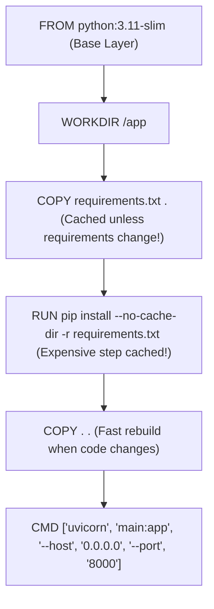

# 📹 Containerizing FastAPI with Docker: Production Dockerfile

<div className="video-card" style={{border: '1px solid #30363d', borderRadius: '8px', padding: '16px', marginBottom: '24px', background: 'rgba(56, 139, 253, 0.05)'}}>
  <div style={{display: 'flex', gap: '16px', flexWrap: 'wrap'}}>
    <div><strong>Instructor:</strong> Nitish Singh (CampusX)</div>
    <div><strong>Duration:</strong> 21m 45s</div>
    <div><strong>Course:</strong> Module 1 - Production Backend & Docker</div>
    <div><strong>Watch Link:</strong> <a href="https://www.youtube.com/watch?v=jlLs6hfAga4" target="_blank" rel="noopener noreferrer">YouTube Lecture ↗</a></div>
  </div>
</div>


## 📌 Executive Summary

Writing a `Dockerfile` that works is simple; writing a **production-ready, secure, lightweight Dockerfile** requires adhering to engineering standards:
1. **Leveraging Layer Caching:** Separate dependency installation from code copying so code changes rebuild in 2 seconds.
2. **Minimal Base Images:** Use `python:3.11-slim` rather than heavy full images.
3. **Non-Root Execution:** Prevent attackers from escalating container escapes to host root access.
4. **Proper `.dockerignore`:** Keep virtual environments, `.git`, and cache files out of your build context.

---

## 🏗️ Architecture: Docker Build Layer Caching



---

## 💻 Practical Code: Production Dockerfile & `.dockerignore`

### 1. `.dockerignore`
```text
__pycache__
*.pyc
*.pyo
*.pyd
.Python
env/
venv/
.venv/
.git
.gitignore
.dockerignore
.vscode
.idea
*.log
```

### 2. Production `Dockerfile`
```dockerfile
# Use minimal official Python runtime
FROM python:3.11-slim

# Set environment variables
ENV PYTHONDONTWRITEBYTECODE=1     PYTHONUNBUFFERED=1     PORT=8000

# Set working directory
WORKDIR /app

# Install system dependencies if required (e.g. gcc, curl)
RUN apt-get update && apt-get install -y --no-install-recommends     curl     && rm -rf /var/lib/apt/lists/*

# Copy only dependencies first to leverage Docker layer caching
COPY requirements.txt .

# Install Python dependencies
RUN pip install --no-cache-dir -r requirements.txt

# Create non-privileged user for security
RUN useradd -m -u 1001 appuser
USER appuser

# Copy application source code
COPY --chown=appuser:appuser . .

# Expose port
EXPOSE 8000

# Run Uvicorn in production mode
CMD ["uvicorn", "main:app", "--host", "0.0.0.0", "--port", "8000", "--workers", "4"]
```

---

## 💡 Production Best Practices & Tips

:::tip Use `0.0.0.0`, Never `127.0.0.1` inside Docker
Inside a container, `127.0.0.1` refers exclusively to the container's internal loopback interface. If Uvicorn binds to `127.0.0.1`, outside traffic forwarded from the host will not reach the app! Always bind to `0.0.0.0`.
:::

