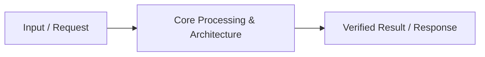

# 📹 FastAPI + Docker Tutorial for Beginners ｜ How to Dockerize a FastAPI API Application

<div className="video-card" style={{border: '1px solid #30363d', borderRadius: '8px', padding: '16px', marginBottom: '24px', background: 'rgba(56, 139, 253, 0.05)'}}>
  <div style={{display: 'flex', gap: '16px', flexWrap: 'wrap'}}>
    <div><strong>Instructor:</strong> Nitish Singh (CampusX)</div>
    <div><strong>Duration:</strong> 19m 22s</div>
    <div><strong>Playlist:</strong> FastAPI for ML & GenAI</div>
    <div><strong>Watch Link:</strong> <a href="https://www.youtube.com/watch?v=jlLs6hfAga4" target="_blank" rel="noopener noreferrer">YouTube Lecture ↗</a></div>
  </div>
</div>

## 📌 Executive Summary & Learning Objectives

This lecture covers **FastAPI + Docker Tutorial for Beginners ｜ How to Dockerize a FastAPI API Application**, focusing on production implementations, edge cases, and industry standards:
- Core intuition, architecture, and underlying mechanisms.
- Key differences between theoretical research implementations and scalable enterprise patterns.
- Concrete Python walkthroughs, error recovery, and performance optimization.

---

## 🏗️ Architecture & Conceptual Workflow



---

## 📖 Core Concepts & Technical Deep Dive

### 1. Architectural Foundations
In modern production AI engineering, **FastAPI + Docker Tutorial for Beginners ｜ How to Dockerize a FastAPI API Application** is essential for ensuring reliability, low latency, and deterministic outcomes. As AI systems evolve from naive prompt-in / completion-out scripts into distributed systems, engineers must handle:
- **State management & consistency:** Ensuring intermediate states and tool invocations are tracked.
- **Error boundaries & recovery:** Graceful degradation when external LLMs or vector stores encounter rate limits or network partitions.
- **Resource utilization & cost efficiency:** Caching common queries and reducing unnecessary foundation model token expenditure.

### 2. Operational Considerations
- **Latency Optimization:** Pre-computing embeddings, utilizing asynchronous non-blocking event loops, and streaming tokens via Server-Sent Events (SSE).
- **Security & Sandboxing:** Validating inputs before ingestion, sanitizing LLM outputs, and isolating tool execution environments.

---

## 💻 Production Implementation Walkthrough

```python
# Production Implementation Blueprint
def run_production_pipeline():
    print("Executing production pipeline...")

if __name__ == "__main__":
    run_production_pipeline()
```

---

## 💡 Production Best Practices & Tips

:::tip Production Deployment Guideline
When deploying FastAPI + Docker Tutorial for Beginners ｜ How to Dockerize a FastAPI API Application in enterprise environments, always configure automated retries with exponential backoff and telemetry tracing (such as OpenTelemetry or LangSmith).
:::

:::warning Common Failure Modes
Watch out for state contamination across concurrent requests. Ensure each session or user interaction uses an isolated thread ID or execution context.
:::

---

## 🎯 Key Takeaways & Quick Reference

| Dimension | Production Standard | Pitfall to Avoid |
| :--- | :--- | :--- |
| **Execution** | Async / Non-blocking with timeouts | Synchronous blocking calls in event loops |
| **Data Validation** | Strict Pydantic v2 schemas | Untyped dictionary access |
| **Monitoring** | Distributed tracing & latency percentiles | Relying only on standard console logs |

## ⏱️ Lecture Timeline & Key Topics

| Timestamp | Key Topic / Concept Discussed |
| :--- | :--- |
| **00:00:00** | Hi Guys, My name is Nitesh and you are... |
| **00:04:46** | one by one.  So... |
| **00:09:29** | from the Containers tab.  Ok?  So... |
| **00:14:10** | takes some time for... |
| **00:19:20** | in the next video.  Bye.... |


---

---

## 📜 Complete Lecture Transcript (English)

> **Language:** English | **Source:** `11 - FastAPI + Docker Tutorial for Beginners ｜ How to Dockerize a FastAPI API Application ｜ CampusX.en.srt` | **Total Segments:** 10 | **Word Count:** ~3,060 words

<details>
<summary><b>Click to expand full chronological transcript (10 timestamped intervals)</b></summary>

#### ⏱️ [00:00 ➔ 00:02]

Hi Guys, My name is Nitesh and you are welcome to my YouTube channel.  In this video also we will continue our fast API playlist. And before I start the video, I'd like to give you a quick recap of what we've been trying to do in the last couple of videos.  So, after covering the fundamentals of the Haunt API in the last couple of videos, I started building a project.  And in this project we decided that we would take an ML model and create a prediction API for that ML model. In our case, the ML model we are working with is an insurance premium prediction model.  Which basically means that if we provide the details of a user to this model. Like what is his age?  Does he smoke or not? Which city does he live in?  So this model will be able to easily tell us whether the insurance premium of that particular user will be high, medium or low. Ok?  Now in the last to last video we built this ML model and not only built it but in that video we also created a prediction API for this ML model.  So we created an endpoint there by calling a slash predictor with the help of the fast API. And any client could easily provide the user details by hitting this endpoint and in turn receive the predictions of the ML model. Ok ?  So we did this in the last two previous videos. After that, in the last video, I told you that the prediction end point that we have created is very simple and beginner friendly.  But there's some floss in it too.  Which basically means that you don't generally deploy such basic level APIs in the industry.  So I showed you a lot of changes to the line in the last video.

#### ⏱️ [00:02 ➔ 00:04]

Show a lot of improvements. Demonstrate applying multiple best practices. So that you can convert your beginner and simple API into a proper industry grade API. Ok?  So we did this in the last video.  Now in today's video, we're going to do two things.  Our first task will be to Dockerize this improved API of ours. With the help of dockers.  Ok?  So, we will build a Docker image. So that we can run this API not only on our machine but also anywhere. When we give this image to our company's tester, he will be able to run this API as it is on his machine.  If we take this image and put it on a service like AWS, then this prediction endpoint of our fast API will easily get deployed on AWS and start running. Ok?  So in that sense it will be very easy for you if you docker your application. So this is the first thing that we will do is we will build a Dockerized image of our application.  And the second thing that we will do is we will push this Dockerized image onto Docker hub. Basically you will upload it and once it is uploaded, you can share the link of that image with anyone in your organization or with your users. Ok?  So we are going to do these two things today. First, we will Dockerize our completed API and second, we will upload it to Docker Hub. Ok?  Now before starting the video, one very important thing is that you will need a little pre-visit to watch today's video end to end.  So here you should know the fundamentals of Docker. I'm not going to teach you Dockers in this video. Dockers have a wide variety of concepts.  I am not going to teach you that.  But the good thing is that just a few

#### ⏱️ [00:04 ➔ 00:06]

days ago I had uploaded a video on my channel in the name of Docker Crash Course. In this video of around 1.5 hours, I covered all the fundamentals of Docker and also demonstrated things practically.  So if you do n't know Docker then I would recommend that you pause this video right now and go and check out this video once.  Watch the entire end to end.  You will learn the fundamentals of Docker. Then you will have no problem watching today's video. I will provide you the link in the description of this video. Ok?  So now if you understand this whole thing , let's start the video.  So let's guys start our process where we will dockerize the API created in our fast API. Ok?  So I have written all the steps here and we will execute these steps one by one.  So first let's talk about the setup.  To do this whole thing you will need two things. First you will need to install Docker on your machine.  What you can do for this is go to Google and type Docker download and you will get this website. This is the official website of Docker.  Go here and download Docker Desktop for your machine.  Ok?  I have a Windows machine so I downloaded and installed Docker Desktop for Windows. Just like you install it in the regular way by clicking next next next. You have to do exactly the same thing here. Seconds what do you have to do?  This is a website hub.com which we call Docker hub. This is where we host our images. So you will have to create your account on this website also. Ok?  So in my case I have already created an account. I will simply login. You can see this is my account.  And here are all my old Docker images that I created in the past.  Ok?  So

#### ⏱️ [00:06 ➔ 00:08]

basically these are the two things you need. One, you need to have Docker Desktop installed on your machine. Second, you must have an account on Docker Hub.  Ok? Now our work starts from here.  Ok ?  So what is step number one?  That you have to go to your project folder and create a Docker file.  Ok?  So a Docker file is basically an instruction manual that guides Docker on how to build your Docker image step by step. Ok?  So I am not going to teach you in this video how to create a Docker image Docker file. Again, if you want to learn, you can go and watch the video given in the description. At the moment I have created a Docker image I am sorry I have created the Docker file. What I will do is that I will directly use that file. So what I will do is I will go to my project and create a new file here and we will name it Docker file.  You have to make sure the D is capital and here I will paste whatever code we copied from there.  Ok?  Now actually understanding the Docker file here is not a very difficult task.  You do things very step by step.  So that's step by step layers form your Docker image. First you choose a base image. It's basically an operating system that already has a version of Python running on it. After that you setup a working directory.  In our case we are calling our working directory app. After that we copy the requirements to our working directory and then install all the libraries named in it one by one. We then copy the code for the rest of our application.  Such as app.  Py or model dot predict in model .  It is Py.  We copy and paste all this code.

#### ⏱️ [00:08 ➔ 00:10]

After that we expose our port. Depends on what kind of application we are building.  Since we are building a fast API application, we are using port 8000.  And lastly, you write the command to run your API application here.  Where you wrote UVConnect App App Host.  Ok?  This one is bit too.  Without this your work will not be done.  Ok?  So here you have to tell that you have to accept any request that comes from any IPP address. Ok?  And this is our Docker file. I will save this.  Ok?  After that, what you have to do is go to your machine and start the Docker Desktop that you have installed.  So look, I can see Docker Desktop, I will open it.  So look guys our Docker Desktop is starting and Docker Desktop is starting.  Meaning, behind the scenes our Docker engine is starting. Whenever you build or run any Docker image. For both things you need Docker Engine. Ok? A so there is some issue.  I restart it once.  It is a bit heavy software so sometimes it can cause issues on your machine. If you have little RAM.  My machine is a bit old so I am also facing some issues because of that.  So let's wait.  So now it is working.  Ok?  Now here you will get to see different things.  But you will mostly need two things.  One will be from the Images tab and the second will be from the Containers tab.  Ok?  So in images you will be shown which Docker images are currently present on your machine. So right now I have this Docker image on my machine. I was testing before making the video.  So what I will do is I will delete this.  In fact, what will we do before deleting it?   We will go to the containers and if any container is running, we will delete it first.  See, right now there is no container on our machine and in images we will pick up this image and delete it.

#### ⏱️ [00:10 ➔ 00:12]

So at this point I have neither any images nor any containers in my Docker Desktop. Ok ?  I hope you know the difference between image and container. When you Dockerize your application, the result is a Docker image.  And when you execute that Docker image , try to run it, then the instance that is running is called a container.  Ok?  So right now there is no image, no container, but our Docker Desktop is running, which means our Docker Engine is running.  What do we do now?  We have to build a Docker image with the help of the Docker file.  And for this we will have to execute this particular command in our command prompt. Ok? What is this command?  We are running the Docker build command. And this is going to be the name of our Docker image. Ok?  In this, TWS 24 which you can see is my image above Docker hub, my username.  So if I go to this website and show it to you, here you will see this is my username and after that whatever is written before the slash is going to be the name of my image.  My repository name is going to be.  And after that, this dot in front is called build context, that is, where we want to build the Docker image.  So we'll copy this and we'll go and run this command in our terminal. Ok?  We pasted it.  I will hit enter and with this our Docker image will start getting created.  You can see. So now our Docker image has started getting created layer by layer. This step will take some time.  If you are doing this step for the first time. Ah, if you do it a second or third time, the process becomes much faster with the help of the caching that has happened in the previous steps. Like on my machine you can see that our Docker image has already been created.  The reason for this is that before shooting the video, I had run all these commands once on my machine and I had built the actual Docker image.

#### ⏱️ [00:12 ➔ 00:14]

So whatever files were generated in the previous steps, all those files were cached behind the scenes by Docker smartly and with its help it became very fast.  Second time I executed this process.  Ok? Anyway, what has happened at this point is that my Docker image has been created.  Now if you want to check whether your Docker image is built correctly or not, then what do you have to do?  You have to go to Docker Desktop and there you have to go to the images section and you can see your Docker image there. Ok?  So this is our Docker image.  Ok?  So once the Docker image is created, our next step is to push this image to Docker hub so that any of my users or my teammates can use it. What do you have to do first for that ?  You will need to execute the docker login command in your terminal.  So enter. Now look here if you run the docker login command for the first time then it will ask you for your username in my case tw24 and your password which is your password on Docker hub. Ok?  Since I executed this command a while ago and provided my credentials there. I did not need to provide this again.  Ok ?  I have authenticated.  Now our next step is to push the image that is currently existing on our machine to Docker with the help of this command.  Ok ?  What is the name of this command?  Docker push The name of your image.  So, we will simply run this command. Here, if you do not provide any tag name , then the default tag that is created is called latest.  Ok?  So you can see that now slowly our Docker image created layer by layer from my machine is getting uploaded to Docker hub.  Ok?  And as soon as this process is completed, I will show you that

#### ⏱️ [00:14 ➔ 00:16]

you will start seeing this image inside your account in Docker Hub.  Again this step might take some time because our Docker image is around 1GB.  So it takes some time for Docker to compress and upload it.  And you can see this command has been executed.  Now let us check our account on Docker hub.  So I will refresh this page.  And you can see guys here is our newly uploaded Docker image.  If I click on this then all the details around it will be shown to me. So you can see here is our Docker image which is tagged as latest right now and here you have the commands written to use this particular Docker image. Ok ?  So we have taken the next step where we have uploaded our Docker image on Docker hub.  Ok?  Now let us take a different perspective.  Now we operate as testers instead of developers. So let's assume that a developer in our organization has created an API, Dockerized it, and put it on Docker Hub. Now I'm a tester and my job is to test uh that API.  And what do I have to do for that?  First you will have to pull the image of that API from Docker hub and run it on your machine.  Ok? So what I will do is that first I go to Docker Desktop and delete this image which is already existing on my machine. Ok?  So at this point no Docker image exists on my machine or on the tester's machine.  And now what I want is that I want to pull the image from Docker to Docker hub. So for that we have been given a terminal inside Docker Desktop.  I will use this.

#### ⏱️ [00:16 ➔ 00:18]

And we simply have to execute the command by saying Docker pull. So if you click on latest here. A Let's click on tags once here. Here is the command we need to run. docker pull vist 24 this one.  So let me copy this. And here I simply paste it. And now I'll hit enter.  So guys you can see that after running this command we are getting some information and it seems that our Joost API application has now started running on our machine.  To test this, what we'll do is go to Chrome and type localhost con 8000 and we'll hit the home API.  And you can see here is our home API.  If we go to Slush Health, we're getting an API with health. Let's go to the docs.  Ok?  Here is our documentation.  Once the predicted end point is tested, we will do it. Write It Out Age 31 Weight 91 Height 1.72 Income 10 LPA Smoker True City Gurgaon Occupation Retired.  Let's click on execute.  And you can see guys our API is providing us the results correctly.  Vi means that as a tester I pulled the image from Docker hub on my machine and when I ran it, it is working properly.  Now what I can do is as a tester I can go and test this entire API very extensively.  Ok?  So in a nutshell, we achieved what we had set out to do in this video.

#### ⏱️ [00:18 ➔ 00:19]

We took our improved Fast API endpoint and converted it into a Docker image.  We pushed that image to Docker Hub and from there anyone can download that image to their machine and run it exactly like we were running it. Ok?  In fact what I will do is that I will share the link of this Docker image with you in the description of this video. And you guys also please try running it once on your machine.  Ok?  And this is the biggest reason behind why we use Docker, right so that your machine without any fuss, your API can run on anyone's machine without any fuss exactly like it was running on your machine. Ok?  So we completed this part.  There is only one video left in this playlist.  What we will do there is that we will deploy this image that we have created on AWS.  So that it becomes available on the entire internet and anyone can access it and use this endpoint. Ok?  So I hope you are seeing things unfold step by step and are understanding it.  And I really hope you're excited for the final video where we deploy it on AWS. If you enjoyed this video , please like it.  If you have not subscribed to this channel after watching this video , please do subscribe.  See you in the next video.  Bye.

</details>
