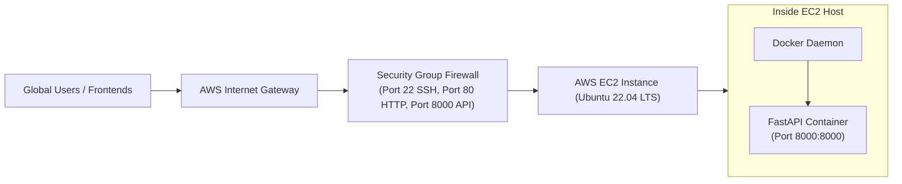

# 📹 Deploying Dockerized FastAPI on AWS EC2: Complete Cloud Setup

<div className="video-card" style={{border: '1px solid #30363d', borderRadius: '8px', padding: '16px', marginBottom: '24px', background: 'rgba(56, 139, 253, 0.05)'}}>
  <div style={{display: 'flex', gap: '16px', flexWrap: 'wrap'}}>
    <div><strong>Instructor:</strong> Nitish Singh (CampusX)</div>
    <div><strong>Duration:</strong> 34m 10s</div>
    <div><strong>Course:</strong> Module 1 - Production Backend & Docker</div>
    <div><strong>Watch Link:</strong> <a href="https://www.youtube.com/watch?v=X0lnToYN21k" target="_blank" rel="noopener noreferrer">YouTube Lecture ↗</a></div>
  </div>
</div>


## 📌 Executive Summary

To make your machine learning API available to global users, you must deploy it to a reliable cloud environment. **AWS EC2 (Elastic Compute Cloud)** provides scalable compute capacity in the cloud.

In this lesson, we take a containerized FastAPI application and deploy it onto an Ubuntu EC2 instance, configure security firewalls, and verify public access.

---

## 🏗️ Architecture: AWS Cloud Deployment



---

## 📖 Step-by-Step AWS Cloud Walkthrough

### Step 1: Launch EC2 Instance
1. Sign into the **AWS Management Console** and navigate to **EC2**.
2. Click **Launch Instance**.
3. Name your instance: `fastapi-ml-production`.
4. Choose AMI: **Ubuntu Server 24.04 LTS** (or 22.04 LTS).
5. Choose Instance Type: `t3.medium` (or `t3.micro` for free tier).
6. Create or select a **Key Pair** (`.pem` file) to enable SSH access.

### Step 2: Configure Security Group (Firewall)
Under **Network Settings**, add the following inbound rules:
- **SSH:** Port `22` (Source: `My IP` for security).
- **HTTP:** Port `80` (Source: `0.0.0.0/0` - Anywhere).
- **Custom TCP:** Port `8000` (Source: `0.0.0.0/0` - Anywhere).

### Step 3: Connect to EC2 via SSH
Open your local terminal and navigate to where your `.pem` key is stored:
```bash
chmod 400 my-key.pem
ssh -i my-key.pem ubuntu@YOUR_EC2_PUBLIC_IP
```

### Step 4: Install Docker on the EC2 Instance
Run the following script on your remote server:
```bash
# Update package index
sudo apt-get update
sudo apt-get install -y ca-certificates curl gnupg

# Add Docker's official GPG key and repo
sudo install -m 0755 -d /etc/apt/keyrings
curl -fsSL https://download.docker.com/linux/ubuntu/gpg | sudo gpg --dearmor -o /etc/apt/keyrings/docker.gpg
sudo chmod a+r /etc/apt/keyrings/docker.gpg

echo   "deb [arch=$(dpkg --print-architecture) signed-by=/etc/apt/keyrings/docker.gpg] https://download.docker.com/linux/ubuntu   $(. /etc/os-release && echo "$VERSION_CODENAME") stable" |   sudo tee /etc/apt/sources.list.d/docker.list > /dev/null

sudo apt-get update
sudo apt-get install -y docker-ce docker-ce-cli containerd.io

# Allow ubuntu user to run docker without sudo
sudo usermod -aG docker ubuntu
```

### Step 5: Run Your Application
```bash
# Clone your project repository
git clone https://github.com/your-username/fastapi-ml-app.git
cd fastapi-ml-app

# Build Docker image
sudo docker build -t fastapi-ml .

# Run container in detached mode
sudo docker run -d -p 8000:8000 --restart always --name ml-api fastapi-ml
```

### Step 6: Verify Live Deployment
Open your browser and navigate to:
```text
http://YOUR_EC2_PUBLIC_IP:8000/docs
```
You should see your interactive Swagger UI live on the public internet!

