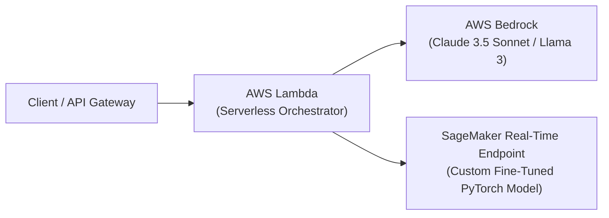

# 📹 How to Deploy a FastAPI API on AWS

<div className="video-card" style={{border: '1px solid #30363d', borderRadius: '8px', padding: '16px', marginBottom: '24px', background: 'rgba(56, 139, 253, 0.05)'}}>
  <div style={{display: 'flex', gap: '16px', flexWrap: 'wrap'}}>
    <div><strong>Instructor:</strong> Nitish Singh (CampusX)</div>
    <div><strong>Duration:</strong> 18m 58s</div>
    <div><strong>Playlist:</strong> FastAPI for ML & GenAI</div>
    <div><strong>Watch Link:</strong> <a href="https://www.youtube.com/watch?v=X0lnToYN21k" target="_blank" rel="noopener noreferrer">YouTube Lecture ↗</a></div>
  </div>
</div>

## 📌 Executive Summary & Learning Objectives

This lecture covers **How to Deploy a FastAPI API on AWS**, focusing on production implementations, edge cases, and industry standards:
- Core intuition, architecture, and underlying mechanisms.
- Key differences between theoretical research implementations and scalable enterprise patterns.
- Concrete Python walkthroughs, error recovery, and performance optimization.

---

## 🏗️ Architecture & Conceptual Workflow



---

## 📖 Core Concepts & Technical Deep Dive

### 1. Architectural Foundations
In modern production AI engineering, **How to Deploy a FastAPI API on AWS** is essential for ensuring reliability, low latency, and deterministic outcomes. As AI systems evolve from naive prompt-in / completion-out scripts into distributed systems, engineers must handle:
- **State management & consistency:** Ensuring intermediate states and tool invocations are tracked.
- **Error boundaries & recovery:** Graceful degradation when external LLMs or vector stores encounter rate limits or network partitions.
- **Resource utilization & cost efficiency:** Caching common queries and reducing unnecessary foundation model token expenditure.

### 2. Operational Considerations
- **Latency Optimization:** Pre-computing embeddings, utilizing asynchronous non-blocking event loops, and streaming tokens via Server-Sent Events (SSE).
- **Security & Sandboxing:** Validating inputs before ingestion, sanitizing LLM outputs, and isolating tool execution environments.

---

## 💻 Production Implementation Walkthrough

```python
import boto3
import json

# Initialize Amazon Bedrock Runtime Client
client = boto3.client(service_name="bedrock-runtime", region_name="us-east-1")

payload = {
    "anthropic_version": "bedrock-2023-05-31",
    "max_tokens": 1024,
    "messages": [
        {"role": "user", "content": "Explain serverless AI architecture on AWS."}
    ]
}

response = client.invoke_model(
    modelId="anthropic.claude-3-5-sonnet-20240620-v1:0",
    contentType="application/json",
    accept="application/json",
    body=json.dumps(payload)
)

result = json.loads(response["body"].read())
print(result["content"][0]["text"])
```

---

## 💡 Production Best Practices & Tips

:::tip Production Deployment Guideline
When deploying How to Deploy a FastAPI API on AWS in enterprise environments, always configure automated retries with exponential backoff and telemetry tracing (such as OpenTelemetry or LangSmith).
:::

:::warning Common Failure Modes
Watch out for state contamination across concurrent requests. Ensure each session or user interaction uses an isolated thread ID or execution context.
:::

---

## 🎯 Key Takeaways & Quick Reference

| Dimension | Production Standard | Pitfall to Avoid |
| :--- | :--- | :--- |
| **Execution** | Async / Non-blocking with timeouts | Synchronous blocking calls in event loops |
| **Data Validation** | Strict Pydantic v2 schemas | Untyped dictionary access |
| **Monitoring** | Distributed tracing & latency percentiles | Relying only on standard console logs |

## ⏱️ Lecture Timeline & Key Topics

| Timestamp | Key Topic / Concept Discussed |
| :--- | :--- |
| **00:00:00** | Hi Guys, My name is Nitesh and you are... |
| **00:04:31** | please make sure you create an account.... |
| **00:09:14** | you can configure your storage from here.  At... |
| **00:13:57** | Paste enter and you can see that our... |
| **00:18:56** | in the next video.  Maid.... |


---

---

## 📜 Complete Lecture Transcript (English)

> **Language:** English | **Source:** `12 - How to Deploy a FastAPI API on AWS ｜ Video 10 ｜ CampusX.en.srt` | **Total Segments:** 10 | **Word Count:** ~3,164 words

<details>
<summary><b>Click to expand full chronological transcript (10 timestamped intervals)</b></summary>

#### ⏱️ [00:00 ➔ 00:02]

Hi Guys, My name is Nitesh and you are welcome to my YouTube channel.  In this video also we will continue our API playlist. Ah in fact, this is going to be the last video in the API playlist.  And before we start the video, let me give you a quick recap of what we have done so far and what exactly we are going to do in today's video. So, if you've been following this playlist end to end , you'll know that in the last two or three videos we started building a project.  Where we are building an API for an ML model. Our ML model is insurance premium prediction.  First of all we built this model and then we created an API to serve this model.  In the API we created a slash predict bool endpoint. Where if you send the user details, then this API Palt communicates with our ML model and whatever result the ML model is giving, the API Palt gives it to the client.  Ok?  And we did all this work in Fast API. Right?  What did we do after that in the next video ?  We built this fast API and improved it a bit. Improving in the Sense We implemented some best practices.  So that you can use it at the industry level. Ok?  What did we do after that in the next video ?  This improved API was taken and Dockerized.  What I mean to say is that we converted this API into a Docker image and not only converted it but we also lifted that Docker image and pushed it to Docker hub. So that anyone can download that image on their machine and run it. Ok?  Now today we will do the final step of this project.  What are we going to do in today's video ?  In fact, I will show you this Docker image which is available on Docker Hub. Look, in the last video we took our Docker image and

#### ⏱️ [00:02 ➔ 00:04]

uploaded it to Docker Hub and anyone can pull it and run it on their machine.  So we're going to take this image and deploy it to AWS. Ok?  So let me show you how things will look after deploying.  I was testing this entire process myself once.  So I currently have my API deployed on AWS. And you can see this is the URL.  This is a public URL.  This is a public IP address and it has been provided to me by AWS. So here's if I go.  So look here's my home API.  Here is my health API. And I can also go to the docs.   I can also quickly show you that this whole thing is working properly by going to the docs. Try it out 1.72 10 Gurgaon Execute and you can see that we are getting the result which means deployed our website which is our API deployed is giving us the correct results.  Ok? And not only I just deployed. One more thing I've done, and I'll show you that in this video right now, is that we've also created a Streamlets application.  We have created a front end that is communicating with our deployed API.  Ok ?  So look here, if you fill all these values ​​and click on predict, then you will get output like this. What we had planned.  Ok?  So I will show you this front end also in the last.  So the basic idea is that in today's video we're going to learn about deployment on AWS, how you can take a fast API Docker Dockerized image and put it on AWS.  The only pre-visit requirement is that you should know a little bit about cloud fundamentals.

#### ⏱️ [00:04 ➔ 00:06]

You should know a little about doing some light work on AWS or its terminologies. We will not go into much depth.  The deployment we are using is a very basic level deployment. We will use EC2.  To deploy our torrentized image.  But trust me, if you want to make your application a little scalable then you will have to try some advanced deployments.  But again that is not the topic of our video today. Because this is a very beginner friendly playlist.  Ok?  Apart from this, you will need an account on AWS.  So please make sure you create an account. Otherwise you will not be able to do this work.  Ok? So or a that was the introduction.  I hope I was able to explain to you properly what is the agenda of our today's video.  Now if you understand everything then let's start with the video.  So come on guys let's start our work.  A: We will basically follow this document.  Here I have written all the steps in a very step by step manner.  If you execute these steps in order, you will be able to easily deploy your fast API application on AWS.  Ok ?  So what do you have to do first in step one ?  Although I have not written it here but step one should be that you have to create your aws account.  Ok?  So for this you have to go to aws. amazon.com and here you will have to create your account. Ok?  Just make sure that while creating an account here, you will be asked for your debit card or credit card information. Money will not be deducted but you will have to provide the information.  So please make sure you do that.  I have already done it.  I already have an account so I'll click Sign in to console and we'll be taken directly to our EC AWS dashboard.  Ok ?  Now from here you can access any AWS service.  But the service we are working with is EC2.  Ok? EC2 a stands for Elastic Compute

#### ⏱️ [00:06 ➔ 00:08]

Cloud.  And with its help you can basically deploy your application.  Basically it is giving you computers on rent. AWS is calling these what they call EC2. The best part about this computer is that you can increase or decrease the number of EC2 instances as per your requirement. Ok?  So we will just deploy our application on a single EC2 instance for now. So, what do you have to do?  You have to search EC2 from here and you will be taken to the EC2 dashboard. Ok?  Now what do you do from here ?  You have to click on instances.  So right now, if you see, in my dashboard, there is an EC two instance already running, whose name is my fast API server.  This is what I made a while ago before shooting the video. And I was showing you the output of this just a while ago.  This is where we have our ah Docker image deployed.  Ok? So what do we do?  We need to create a second instance.  So for that you will click on Launch Instances.  Here you will find a form sort of where you specify the settings for what type of EC2 server you want.  So first of all let me tell you the name of my EC2 server.  I'm naming it the Best API Server Two.  You can just have my my fast API server. Ok?  After that you are being asked which operating system would you like to install in the computer that you are renting ?  So I want to put Ubu.  So here comes the description.  You can read it once.  After that you are asked what kind of hardware do you need? So you don't have many options here. We will take T2 Micro which will have 1 GB memory and you can read the rest of the things here. The best part about choosing this one is that you can use it for free. Obviously there is a certain limit to it.  But if you use this EC2 instance within that limit, you will not have to pay any money.  Ok? Please make sure you do not change anything in this step.

#### ⏱️ [00:08 ➔ 00:10]

Some previous students had chosen some other settings from here like T2 Medium or T2 Large.  These are slightly larger machines. AWS will charge you for this EC2. Ok?  So we selected the T2 Micro. After that, here you are being told that you should have a key pair.  So with the help of keypair you can log in to your EC2 instance remotely.  Ok?   You can SSH.  Here either you can create a new one or you can use an existing one.  Ok?  So I already have one and its name is API of AWS.  I am using this. Ok?  So if you create a new one, it gets downloaded on your machine.   It is a dot PEM file.  It gets downloaded and you can use it to log in remotely.  However, in the flow we are going to use today, this pair will not be required.  But AWS forces you to.  So you will have to do this step.  Ok? After that you do not have to make any changes in the network settings.  For now, just make sure that you have ticked the check box for 'Allow SSH traffic from' and 'Anywhere' is written here. Ok?  This setting is required.  After that you can configure your storage from here.  At the moment I think 8GB is more than enough for my application.  So with these settings in place we will click on Launch Instance and behind the scenes AWS is spinning up an EC2 instance for us.  Ok?  Look at this, he said successfully initiated launch of instance. If you click on this, you will now see, here is our instance.  Ok ?  The instance state is running.  If you click on the instance ID, you will get all the details of your EC2 instance here.  Ok?  So we will use this EC2 instance to deploy our application.  Ok?  So, with that we have completed this first step.  Now the next thing you have to do is

#### ⏱️ [00:10 ➔ 00:12]

connect to this EC2 instance of yours. And you have to run some commands on the command prompt of that EC2 instance. What other commands do I need to run?  You have to use the same basic commands to install Docker, start Docker and then run all these commands like Docker pull, Docker run. Ok?  So what do you need to do first?  You will need to connect to your ec2 instance.  There are now two ways to connect. You can use some software like PuTTY in which you will connect using that dotpm file. Or you can connect directly to your console here. You can also connect by clicking on this.  Ok? Clicked on connect.  Now in a new window you will see a command prompt like UI and through this UI you will talk to your EC2 instance.  Ok ?  Look, we have connected.  Now what do you have to do here? You have to run all these commands from the line.  Ok? So the first command we'll run is sudo update.  With its help, we will update all the existing packages on our EC2 machine.  You can see it will not take much time.  Next what we will do is we will install Docker on our EC2 machine. So we are installing docker downloading and installing docker again we are done. Now what will we do in the next step ?  Will start Docker. over our EC2 machine.  Docker started. Ok?  You can try it here by typing sudo docker. And you can see here all the commands are visible to you Docker Wale Vi shows that Docker is working.  Ok?  Now here you do an additional step. What do you do?  You enable Docker. What does enabling mean? Suppose tomorrow your EC2 instance gets shut down due to some reason.  Then automatically Docker will also stop.  And then when that EC2 instance starts again, you will have to manually go and run the start command again. Now you don't know. You are sitting at home and relaxing. You seem to think your server is running correctly.

#### ⏱️ [00:12 ➔ 00:14]

Now if it suddenly closes and starts again then your application will close. That is why you do what you do?  You enable Docker. What happens by enabling this is that even if your server goes down by mistake, when it comes back up, the Docker service will start running automatically. You don't have to manually write that start command each and every time.  Ok?  So that is why we ran this command. Now with the help of this next command, we are granting permission to our EC2 instance to pull Docker images from Docker hub from an external server.  Ok? So this step is important.  I didn't do it last time and I was not able to pull the image. Ok?  Now after executing this particular command, you do not have to exit from the current connection.  So we are exiting and after exiting we have to close this window.  Ok?  Now whatever we installed is done and we have also got the permission to do the bridge.  So at this point we have done so many things in our flow.  Have connected.  All these commands have been run.  And what do we do now ?  We have to restart a new connection.  So for that again we will go to connect. So we created a new connection.  Let's check it once.  Is Docker still running?  Look, Docker is still running.  What do we do now?  Again some commands have to be run.  So the first command in this is that we have to pull a Docker image from this particular path.  This is exactly the same path that I showed you here on Docker hub.  So here I did paste and now see what you are doing ?  You are pulling your Docker image from Docker Hub and bringing it to your EC2 instance.  Ok?  And this step is very critical.  Obviously, the image cannot run until it is uploaded to your AC2 instance. Now there is only one last step left where we will run our Docker image. Paste enter and you can see that our

#### ⏱️ [00:14 ➔ 00:16]

UVCON server has started. Which means now we can access our application.  Ok? What do you need to do to access it now?  You need to go to your instance page.  There you will find an IPP address, Public IPP4 address.  You have to copy it and open it here and you have to access port 8000. But as soon as you access this port , you will realize two problems.  First you cannot do HTTPS. Because you have not taken SSL certificate etc. then you will have to operate on HTTP. Second, even after operating on HTTP, your website or application will not be visible to you.  The reason for this is that right now there is a problem that no external IP can talk to our server through port 8000. Because we have kept this path closed. We have to open this path. So, we'll go to security. From there we will go to security groups. Now what do we have to do in the security group ?  We need to define a rule that any external computer on another network can talk to our EC2 instance on port 8000.  So for that we will go to Edit Inbound Rules and there we will add a new rule.  And the new rule is custom TCP.  Here we will define our port as 8000.  And here we will say that if communication comes on 8000 from any IPP address then allow that communication.  Ok?  Save Rules saved.  Now we'll go over here and hit this.  And you can see our API is visible to us.  Ok?  This is the home one. Slush Health I'm sorry I spelled it wrong.  Is your health okay?  And similarly you can access docs. So are you able to access the docs as well?  Let's check it quickly once.  Try it out.   We

#### ⏱️ [00:16 ➔ 00:18]

keep everything exactly like this and execute it. And you can see you're getting a response.  Which means the API you deployed is working correctly. Ok?  Now one last thing, we have done all these things.  I also ran all these commands. Also checked the security group settings.  I also tried running the API.  Now let's just look at some of the front end code. So here is my front end code.  Now honestly I will not write this code again.  I showed you this complete code two videos ago. We are making changes to this same code.  The only change we need to make is this API URL, where we had previously written localhost, what will we do now?  Our AWS ones will fit the IPP address.  So, what do you have to do ?  You have to copy this IPP address and paste it here like this. Ok?  This is our IP address. I saved this.  And let's go to our Streamlet application.  And let's try it here. Again my bad there is a problem.  The URL we have defined is not correct.  A colon is placed after the slash.  Only cologne will come here.  Let's reload our website once again and go here and click. And you can see this is the result. So we Dockerized our API. After that we deployed it and using it now we are able to do things in the front end. Ok?  So I hope you understand the whole flow and with that I would like to I would like to conclude this API playlist.  I know there wasn't a huge playlist. We didn't cover everything.  But I have taught you everything that a machine learning engineer needs to start fast API along with tutorial of piddant and docker. If you want to learn fast API more deeply and

#### ⏱️ [00:18 ➔ 00:18]

if you want to understand deep concepts then we are already creating a paid course on fast API, half of it is already done, it will take one more month to make it and what I will do is after 1 month I will tell you about the entire course in the form of a video. If you are interested then you can purchase that course.  I will try to keep the fee very very nominal.  And in the future, if you are watching this playlist, then definitely watch the next video.  In the next video, after a month, I will tell you what we are going to include in that particular course. Ok?  So I really hope first of all these 10-12 videos that I have added to this playlist have been able to take you from beginner to intermediate level.  You also enjoyed this entire journey and if you liked this video then please like it and if you have not subscribed to the channel , please do subscribe.  See you in the next video.  Maid.

</details>
