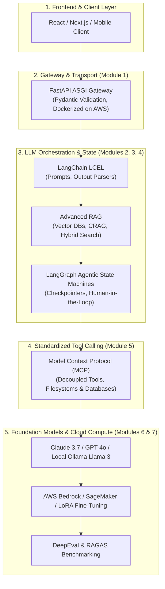

# 📹 What Next After FastAPI? Roadmap to Becoming an AI Engineer

  

    
<strong>Instructor:</strong> Nitish Singh (CampusX)

    
<strong>Duration:</strong> 15m 10s

    
<strong>Course:</strong> Module 1 - Production Backend & Docker

    
<strong>Watch Link:</strong> <a href="https://www.youtube.com/watch?v=X0lnToYN21k" target="_blank" rel="noopener noreferrer">YouTube Lecture ↗</a>

  

## 📌 Executive Summary

Congratulations on mastering **Module 1: Production Backend, Pydantic & Docker**!

In the modern 2026 AI landscape, being an AI Engineer requires more than just creating standalone APIs:
- **FastAPI** is the universal nervous system that hosts LLM agents, provides tools via REST endpoints, and exposes streaming token feeds to web frontends.
- But the intelligence itself now lives in **Retrieval-Augmented Generation (RAG)** pipelines, **cyclical state graphs (LangGraph)**, and **standardized tool execution protocols (MCP)**.

---

## 🏗️ Architecture: The Full 2026 AI Engineering Stack

---

## 🚀 The Next Steps in Your Curriculum

1. **[Module 2: LCEL, Local LLMs & Tool Calling](/docs/category/module-2-lcel-local-llms--tool-calling):**
   Transition from standard web APIs to chaining prompts, parsers, and runnables using LangChain Expression Language (LCEL), and run local LLMs with Ollama and Groq LPUs.
2. **[Module 3: Advanced RAG, Memory & Vector Search](/docs/category/module-3-advanced-rag--memory):**
   Master vector embeddings, ChromaDB/Pinecone, Corrective RAG (CRAG), and short/long-term episodic agent memory.
3. **[Module 4: Agentic AI, LangGraph & Multi-Agents](/docs/category/module-4-agentic-ai--langgraph):**
   Build persistent state machines, SQLite checkpointers, and multi-agent systems with LangGraph, CrewAI, and SmolAgents.
4. **[Module 5: Model Context Protocol & Claude Code](/docs/category/module-5-mcp--claude-code):**
   Implement Anthropic's open MCP standard to build modular agent tools, and master autonomous coding with Claude Code CLI.

---

---

## 📜 Complete Lecture Transcript (English)

> **Language:** English | **Source:** `13 - FastAPI Course Launch.en.srt` | **Total Segments:** 7 | **Word Count:** ~2,003 words

<b>Click to expand full chronological transcript (7 timestamped intervals)</b>

#### ⏱️ [00:00 ➔ 00:02]

Hi Guys, My name is Nitesh and welcome to my YouTube channel.  So around 3 months ago we started a playlist on this YouTube channel on the topic of the API.  There I told you why you should learn Fast API.   The reason I told you was that you are building a model using machine learning, deep learning or GenAI. So eventually you have to present that model to your users.  And one way to do this is to build an API around your machine learning model or deep learning model and then serve whatever predictions are coming through your model through your API.  Now there are many libraries available for creating APIs.  But as of today, the leading library in Python is Fast API.  And that is why it's like a default standard in the industry that if an API is to be built around AI models, it will be built in fast APIs only. And that is why as an aspirant who is looking to break into the data science industry. It's very important for you to learn the API.  And that's why we made that playlist.  In that playlist, we had put around 12 videos covering the fundamentals of I Guess and Fast API and also built a small project.  But after the completion of that playlist, I got this feedback from you guys that whatever we have covered till now in this playlist, we have understood it but we have to learn Fast API in a little more depth and there again I had promised you that if you give me one or two months, then within these one or two months I will bring an in-depth course for you on Fast API and in today's video I am going to do exactly that. I'm going to announce a new paid course on the topic of APIs. We have been building and creating this particular course for the last four months and

#### ⏱️ [00:02 ➔ 00:04]

last week, around 14 days ago, I guess our course was completed and then we planned to launch this course.  So my main goal in today's video is to first tell you in detail what topics we have covered in this course and then we will talk a little more around it.  Ok?  So what you see on the screen right now is the official Git repository of our API course and we have built it very well with a lot of love. We have arranged all the codes module wise. And we have also added a read me file here.  And what I will do is I will go through this read me file and tell you what the curriculum of our course is. Ok?  So we have divided this entire course into nine different modules. And now let me tell you one by one what we have covered in each module. So in the first module, we covered what APIs are.  Ok?  Even if you are a beginner, you don't know what APIs are. So this particular module will help you.  So here we have taught you in great detail about the definition of API , its working, different HTTP methods, status codes and best practices. Ok?  Once you've covered this particular module , we start focusing on the Fast API in Module Two. So here we have covered all the essentials of Coast API. It has been compared with a library like Flask. And then there are some more concepts that are essential in the process of learning the Heist API that we have covered here. Such as type hinting, async support and pydantic. Once you have the fundamentals of fast APIs, we teach you how to build basic APIs in Module Three.  Here we have taught how you can create routes.  How you can build request response models.  You can define query and path

#### ⏱️ [00:04 ➔ 00:06]

parameters and apply different types of validations. Once you learn how to create a basic API. After that, now we are driving a little deeper. In the fourth module, we will teach you how to integrate the FAST API with the database.  So here we will show the integration of Sequel with First API using a different ORMs and I got a lot of feedback at the time of the playlist that sir please teach us how to integrate First API with the database.  So we have covered that particular thing in detail here in Module Four.  Then in Module Five, we are going to jump into our main agenda. That is building APIs for machine learning models.  Here we will teach you how to use Fast API to build APIs that load and serve your ML models. After that, once you have covered all this, then we will go into some advanced concepts.  Like what is dependency injection? How to implement authentication? How to manage API keys. You will be taught the concept of middle wires and you will also be told how to do error handling in these module number seven I am sorry six.  Then once you build the APIs, it's important that you test them before deploying them. So in Module Seven we have told you the concept of testing and debugging.  Here you will learn to write unit tests. Learn to write integration tests with the help of the Pi Test module. Different debugging tips will be shared with you. You will also be told here how to use the Swagger UI of Aurest API for debugging.  After that comes a very important module where we will teach you performance optimization and monitoring.  So just building the API is not enough. Optimizing them for performance so that there are

#### ⏱️ [00:06 ➔ 00:08]

no latency related issues.  That is also very important.  So, here we will teach you a concept of how you can cache your API with the help of Redis.  Ok?  We'll also teach you monitoring concepts and how you can monitor the performance of your API with the help of tools such as Prometheus and Grafana.  Ok?  And finally, when you learn all this, we will show you how to make a capstone project by combining all the concepts. Where we will build a model for car price prediction and then build an API around it and we will learn multiple things in this entire project. Like how to apply authentication, how to apply caching, how to apply login , how to do monitoring, how to do dockerization?  And finally how to deploy this project.  So whatever concepts you have learnt till now, you will implement them practically in this particular capstone project.  Ok ?  If you talk about text, these are the things that you will be studying in this particular course.  Obviously, you will learn Python and learn fast APIs.  Ah apart from that you will learn JWT authentication. With its help we will do the authentication.  Pi Test will learn for testing and debugging. ScikitLearn for machine learning integration, Sequel for database integration, Docker for dockerization, Redis for caching, Prometheus and Grafana for monitoring, and finally, we will use a platform called RenderBoll for deployment. Okay, so this is going to be our text tag throughout this course. Here we have added a little detailing about what exactly you are going to do in the Capstone project, so you can go through it once. If we talk about pre-requests, you should know three things.  First you should know the fundamentals of Python. Obviously second you should know the concepts of get and get up. And thirdly, if you know a little bit about Docker, it will be helpful.  Even

#### ⏱️ [00:08 ➔ 00:10]

if you don't come, there is a 1 1/2 hour video on our channel.  If you watch that video, that will be enough.  Ok ?  So, that's a detailed overview of our API course.  Now let me quickly tell you how you can enroll in this course. So you have to visit our website.  Click on the Courses section. There, below in the paid courses, you will see the course called Cost API. As soon as you click on this, it is the landing page of our API course. The pricing we have currently set for this course is Rs 599.  But at this point we are running a discount.  You might also be able to see it here at the top. If you apply this discount, the course fee will be ₹399.  Ok? You will get a discount of ₹200 and you will have to pay ₹399 for this course.  Ok?  Rest of the registration process is very simple.  If you already have an account on our website then it is very easy.  Simply go and purchase it. Otherwise you have to register, create an account and then purchase the course.  Ok? Very simple.  Let's talk a couple of things about this course.  The first question that comes to mind from people is who is the instructor of this course?  So I would like to tell you clearly upfront. I have not created this particular course. I am not the instructor.  However, I have contributed a lot in designing this entire course and planning the curriculum. But the instructor of this course is Mispa.  A I hope you know him. He has created multiple courses with us in the past as well. In fact, a few days ago I launched a course on the topic of webscaping. We had launched that course on Udemy. That course was also created by Misba.  If you go and check on Yumi now, the rating of that course is above 4.3 and it is 4.3 because there were

#### ⏱️ [00:10 ➔ 00:12]

some video quality issues in that course which we have solved in this particular course.  So he is a very good instructor.  He also has a free course on our website on the topic of SageMaker.  So if you want to be sure about how they teach before purchasing this course, then you can do that free course and after that you can purchase this course. Ok?  Secondly, a question comes from your side that what will be the language in this course?  So our language is English.  Meaning Hindi plus sometimes English, that switch keeps happening. And this is the same language that we use in all our courses.  We use it on our YouTube channel.  Third, will doubt clearance be available in this course?  The answer is no.  The reason for this is very simple that this particular course is a low ticket value course.  We are not charging you too much. And that is why it is not possible to provide support for doubt clearance. But don't worry, I think the way we have designed and prepared the course.  There are very few chances of doubts arising. Ok?  And lastly what will be the validity of the course?  The validity of this course will be 3 years.  So if you purchase this course today, then this course will expire after 3 years.  Ah and if you ask me I think 3 years is more than enough. I don't think you'll need to relearn the fundamentals of FAST APIs after 3 years. It's a very practical thing.  You learn it once and then apply it to different projects.  And This Is How You Master a Technology Likest API.  Ok?  So I gave whatever information I had to give. I would like to give one last verdict from my side. Since I have been very involved in the creation process of this course. So I can tell you this much that if you are purchasing this course for ₹399 then you will never feel that your ₹399 has been wasted.  We have designed this course in such a

#### ⏱️ [00:12 ➔ 00:12]

way that it will give you at least 10x ROI.  Ok? Return on Investment is a course of around 25 hours.  So you can easily purchase this course. And this is my suggestion to you.  Ok?  And that's it for this video. See you in the next video.  Bye.

