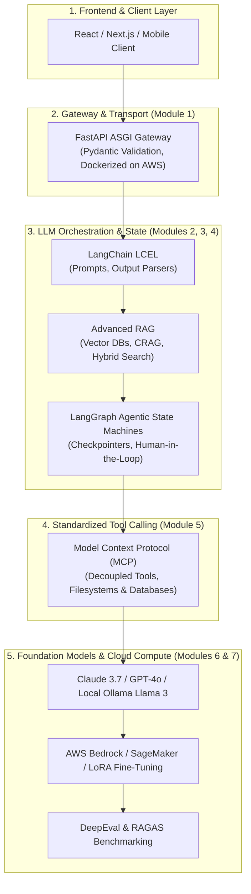

# 📹 What Next After FastAPI? Roadmap to Becoming an AI Engineer

  

    
<strong>Instructor:</strong> Nitish Singh (CampusX)

    
<strong>Duration:</strong> 15m 10s

    
<strong>Course:</strong> Module 1 - Production Backend & Docker

    
<strong>Watch Link:</strong> <a href="https://www.youtube.com/watch?v=X0lnToYN21k" target="_blank" rel="noopener noreferrer">YouTube Lecture ↗</a>

  

## 📌 Executive Summary

Congratulations on mastering **Module 1: Production Backend, Pydantic & Docker**!

In the modern 2026 AI landscape, being an AI Engineer requires more than just creating standalone APIs:
- **FastAPI** is the universal nervous system that hosts LLM agents, provides tools via REST endpoints, and exposes streaming token feeds to web frontends.
- But the intelligence itself now lives in **Retrieval-Augmented Generation (RAG)** pipelines, **cyclical state graphs (LangGraph)**, and **standardized tool execution protocols (MCP)**.

---

## 🏗️ Architecture: The Full 2026 AI Engineering Stack

---

## 🚀 The Next Steps in Your Curriculum

1. **[Module 2: LCEL, Local LLMs & Tool Calling](/docs/category/module-2-lcel-local-llms--tool-calling):**
   Transition from standard web APIs to chaining prompts, parsers, and runnables using LangChain Expression Language (LCEL), and run local LLMs with Ollama and Groq LPUs.
2. **[Module 3: Advanced RAG, Memory & Vector Search](/docs/category/module-3-advanced-rag--memory):**
   Master vector embeddings, ChromaDB/Pinecone, Corrective RAG (CRAG), and short/long-term episodic agent memory.
3. **[Module 4: Agentic AI, LangGraph & Multi-Agents](/docs/category/module-4-agentic-ai--langgraph):**
   Build persistent state machines, SQLite checkpointers, and multi-agent systems with LangGraph, CrewAI, and SmolAgents.
4. **[Module 5: Model Context Protocol & Claude Code](/docs/category/module-5-mcp--claude-code):**
   Implement Anthropic's open MCP standard to build modular agent tools, and master autonomous coding with Claude Code CLI.

