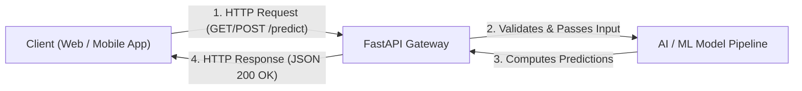

# What is an API? REST Architecture for AI Engineers

<div className="video-card" style={{border: '1px solid #30363d', borderRadius: '8px', padding: '16px', marginBottom: '24px', background: 'rgba(56, 139, 253, 0.05)'}}>
  <div style={{display: 'flex', gap: '16px', flexWrap: 'wrap', alignItems: 'center'}}>
    <div><strong>Curators:</strong> Nitish Singh (CampusX)</div>
    <div><strong>Module:</strong> Module 1: Production Backend & Containerization</div>
    <div><strong>Focus:</strong> Beginner to Production</div>
  </div>
</div>

## 🎯 What You'll Learn
- Understand the fundamental concept of an Application Programming Interface (API) using real-world analogies.
- Learn how client-server request and response cycles operate over HTTP.
- Understand why AI models require web APIs to be accessed by web, mobile, and third-party applications.

---

## 💡 Concept & Architecture

Imagine walking into a restaurant. You (the client) sit at a table looking at a menu of choices. The kitchen (the server/database) prepares the food. But you don't walk directly into the kitchen to cook or grab ingredients. Instead, a **waiter (the API)** takes your order, delivers it to the kitchen, and brings back your prepared meal.

In modern AI engineering:
- The **Client** is your user interface (React web app, mobile app, or chatbot UI).
- The **Server** is where your trained machine learning or LLM pipeline resides.
- The **API** is the structured interface that allows the frontend to send a prompt or image and receive back a prediction or generated text as clean JSON.

### System Architecture & Data Flow



---

## 💻 Step-by-Step Code Walkthrough

Below is the complete implementation broken down into digestible parts so you can understand every line.

### Part 1: Understanding a Raw HTTP Request and Response Structure

```python
# An HTTP Request sent from client to server:
# POST /api/v1/predict HTTP/1.1
# Host: ai-service.example.com
# Content-Type: application/json
# Content-Length: 42
#
# {"text": "Is this email spam or not?"}

# The corresponding HTTP Response sent back by the server:
# HTTP/1.1 200 OK
# Content-Type: application/json
#
# {"prediction": "spam", "confidence": 0.98}
```

#### 🔍 In-Depth Explanation:
This raw text illustrates how machines communicate over HTTP. The client specifies an action (POST), a path (/predict), headers defining metadata, and a JSON body. The server replies with a status code (200 OK) and the processed answer.

### Part 2: Simulating an API Call in Python Using the requests Library

```python
import requests

# Step 1: Define the target API URL
api_url = "https://jsonplaceholder.typicode.com/posts/1"

# Step 2: Send a GET request to the server
print("Sending request to server...")
response = requests.get(api_url)

# Step 3: Inspect the HTTP status code (200 means success)
print(f"Status Code: {response.status_code}")

# Step 4: Parse the JSON response into a Python dictionary
data = response.json()
print("Received Data:")
print(f"Title: {data['title']}")
```

#### 🔍 In-Depth Explanation:
Here, Python's `requests` library acts as the client. It queries a public demo API and parses the returned JSON payload into a native Python dictionary.

---

## ⚠️ Beginner Tips & Best Practices

:::tip Always Check Status Codes
Never assume an API call succeeded. Always check `response.status_code == 200` or call `response.raise_for_status()` to catch server errors gracefully.
:::

:::warning Do Not Expose Raw Models Directly
Never attempt to load deep learning models directly inside client applications like JavaScript or Android. Always place models behind a secure backend API.
:::

---

## 📝 Key Takeaways & Summary

- An API is a messenger that takes requests from a client and brings back responses from the server.
- REST APIs use standard HTTP verbs (GET, POST, PUT, DELETE) and exchange data formatted in JSON.
- For AI engineers, wrapping models in REST APIs makes them universally accessible from any programming language or device.

