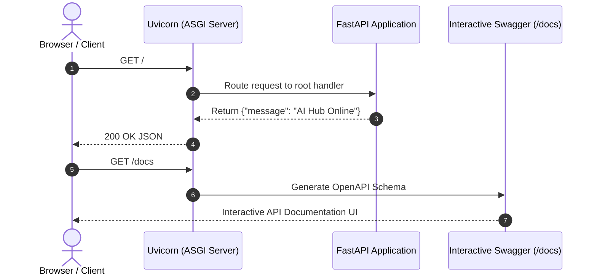

# FastAPI Setup & Building Your First Endpoint

<div className="video-card" style={{border: '1px solid #30363d', borderRadius: '8px', padding: '16px', marginBottom: '24px', background: 'rgba(56, 139, 253, 0.05)'}}>
  <div style={{display: 'flex', gap: '16px', flexWrap: 'wrap', alignItems: 'center'}}>
    <div><strong>Curators:</strong> Nitish Singh (CampusX)</div>
    <div><strong>Module:</strong> Module 1: Production Backend & Containerization</div>
    <div><strong>Focus:</strong> Beginner to Production</div>
  </div>
</div>

## 🎯 What You'll Learn
- Install FastAPI and the Uvicorn ASGI server in a clean Python virtual environment.
- Understand why FastAPI is significantly faster and better suited for AI applications than Flask or Django.
- Create, run, and test your first GET endpoint with interactive Swagger documentation.

---

## 💡 Concept & Architecture

FastAPI is a modern, high-performance web framework for building APIs with Python 3.8+ based on standard Python type hints. 

Why do AI engineers choose FastAPI over Flask?
1. **Blazing Speed:** Built on top of Starlette and Pydantic, FastAPI is one of the fastest Python frameworks available, matching NodeJS and Go speeds.
2. **Native Async Support:** AI model inference and database queries are I/O bound. FastAPI natively handles asynchronous request handling with `async/await`.
3. **Automatic Interactive Docs:** FastAPI automatically generates interactive documentation at `/docs` (Swagger UI) and `/redoc` without writing a single line of extra documentation code.

### System Architecture & Data Flow



---

## 💻 Step-by-Step Code Walkthrough

Below is the complete implementation broken down into digestible parts so you can understand every line.

### Part 1: Step 1: Installing FastAPI and Uvicorn

```python
# In your Linux bash terminal, create and activate a virtual environment:
# python3 -m venv venv
# source venv/bin/activate

# Install FastAPI and Uvicorn with standard dependencies
pip install fastapi "uvicorn[standard]"
```

#### 🔍 In-Depth Explanation:
This installs `fastapi` along with `uvicorn[standard]`, which includes high-speed C-based event loops (uvloop) and protocol parsers.

### Part 2: Step 2: Creating the FastAPI Application (main.py)

```python
from fastapi import FastAPI

# 1. Initialize the FastAPI application instance
# You can provide metadata like title, description, and version
app = FastAPI(
    title="2026 AI Service API",
    description="Production API for serving Machine Learning and LLM predictions",
    version="1.0.0"
)

# 2. Define a root endpoint using the @app.get decorator
@app.get("/")
def read_root():
    """Root health check endpoint returning basic status."""
    return {
        "status": "online",
        "service": "AI Engineering Platform",
        "version": "1.0.0"
    }

# 3. Define a simple health-check endpoint
@app.get("/health")
def health_check():
    """Kubernetes and Docker health-check probe endpoint."""
    return {"health": "healthy", "gpu_available": True}
```

#### 🔍 In-Depth Explanation:
The `@app.get('/')` decorator tells FastAPI that when a user sends an HTTP GET request to `/`, it should execute `read_root()` and automatically convert the returned Python dictionary into a JSON response.

### Part 3: Step 3: Running the Application with Uvicorn

```python
# Run the server from your terminal:
# uvicorn main:app --reload --host 0.0.0.0 --port 8000

# Parameter breakdown:
# - 'main:app': refers to the file main.py and the FastAPI instance 'app'
# - '--reload': automatically reloads code changes during development
# - '--host 0.0.0.0': binds to all network interfaces
# - '--port 8000': listens on port 8000
```

#### 🔍 In-Depth Explanation:
Starting Uvicorn launches the ASGI web server. You can visit `http://localhost:8000` to see your JSON response, and visit `http://localhost:8000/docs` to test endpoints directly in your browser.

---

## ⚠️ Beginner Tips & Best Practices

:::tip Use Interactive Docs for Instant Testing
Always test endpoints at `http://localhost:8000/docs`. You can click 'Try it out', provide inputs, and view the exact request and response headers.
:::

:::warning Remove --reload in Production
The `--reload` flag consumes extra CPU cycles watching the filesystem. Always omit `--reload` when deploying to production Docker containers.
:::

---

## 📝 Key Takeaways & Summary

- FastAPI uses Python type hints to deliver high performance and automated documentation.
- Uvicorn is an ASGI server that executes FastAPI applications concurrently.
- Interactive Swagger documentation is available out of the box at the `/docs` URL.

