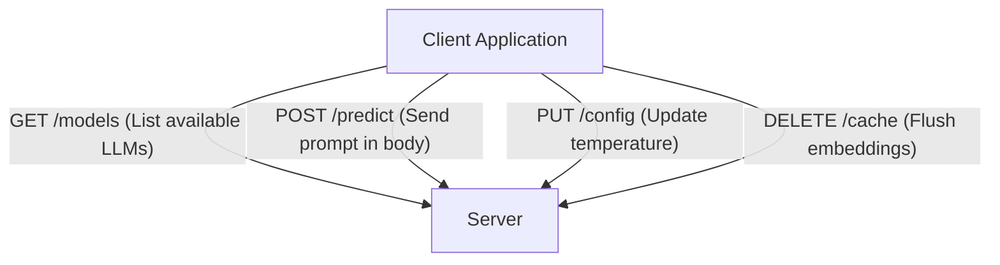

# HTTP Methods Explained: GET, POST, PUT, DELETE

<div className="video-card" style={{border: '1px solid #30363d', borderRadius: '8px', padding: '16px', marginBottom: '24px', background: 'rgba(56, 139, 253, 0.05)'}}>
  <div style={{display: 'flex', gap: '16px', flexWrap: 'wrap', alignItems: 'center'}}>
    <div><strong>Curators:</strong> Nitish Singh (CampusX)</div>
    <div><strong>Module:</strong> Module 1: Production Backend & Containerization</div>
    <div><strong>Focus:</strong> Beginner to Production</div>
  </div>
</div>

## 🎯 What You'll Learn
- Master the four core HTTP methods: GET, POST, PUT, and DELETE.
- Understand why AI model inference almost always uses POST instead of GET.
- Implement a full CRUD (Create, Read, Update, Delete) resource controller in FastAPI.

---

## 💡 Concept & Architecture

HTTP defines a set of request methods to indicate the desired action to be performed for a given resource:

| HTTP Verb | CRUD Action | Purpose in AI Engineering |
| :--- | :--- | :--- |
| **GET** | Read | Retrieve model metadata, check service health, fetch logs. |
| **POST** | Create / Infer | Submit prompts, send images for classification, trigger training jobs. |
| **PUT** | Update | Update model hyperparameters, replace user configuration. |
| **DELETE** | Delete | Purge cached embeddings, delete fine-tuning checkpoints. |

### Why is AI Prediction almost always POST?
While a prediction is 'reading' an answer, GET requests cannot securely send large payloads (like large text documents or image files). Furthermore, GET requests are cached by browsers and proxies, which can lead to stale AI responses.

### System Architecture & Data Flow



---

## 💻 Step-by-Step Code Walkthrough

Below is the complete implementation broken down into digestible parts so you can understand every line.

### Part 1: Step 1: Setting up an In-Memory AI Model Registry

```python
from fastapi import FastAPI, HTTPException

app = FastAPI(title="Model Registry API")

# Simulated database of deployed AI models
models_db = {
    1: {"name": "llama-3-8b", "type": "llm", "status": "ready"},
    2: {"name": "nomic-embed-text", "type": "embedding", "status": "ready"}
}
```

#### 🔍 In-Depth Explanation:
We initialize a FastAPI instance and a mock dictionary `models_db` to act as our data store for registering AI models.

### Part 2: Step 2: Implementing GET and POST Endpoints

```python
# GET: Retrieve all registered models
@app.get("/models")
def get_all_models():
    """Retrieve the list of all registered models."""
    return {"models": list(models_db.values())}

# POST: Register a new model
@app.post("/models", status_code=201)
def register_model(new_model: dict):
    """Register a new AI model in the registry."""
    new_id = max(models_db.keys(), default=0) + 1
    models_db[new_id] = new_model
    return {"message": "Model registered successfully", "id": new_id, "model": new_model}
```

#### 🔍 In-Depth Explanation:
The GET endpoint returns the existing dictionary values. The POST endpoint assigns a new ID, stores the model, and returns HTTP 201 (Created).

### Part 3: Step 3: Implementing PUT and DELETE Endpoints

```python
# PUT: Update an existing model
@app.put("/models/{model_id}")
def update_model(model_id: int, updated_model: dict):
    """Update an existing model's metadata."""
    if model_id not in models_db:
        raise HTTPException(status_code=404, detail="Model not found")
    models_db[model_id] = updated_model
    return {"message": "Model updated successfully", "model": updated_model}

# DELETE: Remove a model from the registry
@app.delete("/models/{model_id}")
def delete_model(model_id: int):
    """Delete a model from the registry."""
    if model_id not in models_db:
        raise HTTPException(status_code=404, detail="Model not found")
    removed = models_db.pop(model_id)
    return {"message": f"Model '{removed['name']}' deleted successfully"}
```

#### 🔍 In-Depth Explanation:
The PUT endpoint modifies the existing record, while DELETE purges it. Both check if the model exists and return a 404 Not Found error if it does not.

---

## ⚠️ Beginner Tips & Best Practices

:::tip Use Appropriate Status Codes
Return `201 Created` for POST creation requests, and `404 Not Found` when a requested resource ID does not exist.
:::

:::warning Never Put Sensitive API Keys in GET URLs
GET request query parameters are logged in server access logs and browser history. Always pass sensitive credentials or prompts via POST bodies or HTTP headers.
:::

---

## 📝 Key Takeaways & Summary

- GET retrieves data, POST creates data or triggers computation, PUT updates data, and DELETE removes data.
- AI prediction tasks utilize POST because input payloads (prompts, images) are large and should not be cached.
- FastAPI simplifies CRUD development with intuitive decorators like `@app.get`, `@app.post`, `@app.put`, and `@app.delete`.

