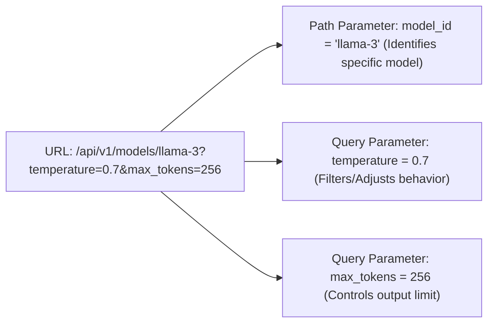

# Path & Query Parameters: Routing & Filtering

<div className="video-card" style={{border: '1px solid #30363d', borderRadius: '8px', padding: '16px', marginBottom: '24px', background: 'rgba(56, 139, 253, 0.05)'}}>
  <div style={{display: 'flex', gap: '16px', flexWrap: 'wrap', alignItems: 'center'}}>
    <div><strong>Curators:</strong> Nitish Singh (CampusX)</div>
    <div><strong>Module:</strong> Module 1: Production Backend & Containerization</div>
    <div><strong>Focus:</strong> Beginner to Production</div>
  </div>
</div>

## 🎯 What You'll Learn
- Differentiate between Path Parameters (locating resources) and Query Parameters (filtering/sorting).
- Leverage Python type hinting (`int`, `str`, `float`, `bool`) for automatic type conversion.
- Use FastAPI's `Path` and `Query` validators to enforce minimum values and string lengths.

---

## 💡 Concept & Architecture

When clients request information from an API, they often need to specify **which item** they want or **how** they want the results filtered:

1. **Path Parameters:** Part of the URL path itself. Used to identify a specific unique resource.
   - Example: `/models/llama-3` or `/users/42`
2. **Query Parameters:** Key-value pairs appended after a question mark `?` in the URL. Used to filter, sort, or paginate results.
   - Example: `/documents?limit=10&department=finance`

### System Architecture & Data Flow



---

## 💻 Step-by-Step Code Walkthrough

Below is the complete implementation broken down into digestible parts so you can understand every line.

### Part 1: Step 1: Implementing Path Parameters with Type Hints

```python
from fastapi import FastAPI, Path, Query
from typing import Optional

app = FastAPI(title="Parameters Deep Dive")

# Path Parameter: model_id must be an integer >= 1
@app.get("/models/{model_id}")
def get_model_by_id(
    model_id: int = Path(..., description="The unique integer ID of the model", ge=1)
):
    """Fetch metadata for a specific model ID."""
    return {
        "model_id": model_id,
        "status": "loaded in VRAM",
        "framework": "PyTorch"
    }
```

#### 🔍 In-Depth Explanation:
Here, `{model_id}` in the path is declared as an `int`. If a user calls `/models/abc`, FastAPI automatically returns a 422 Unprocessable Entity error without executing the function body.

### Part 2: Step 2: Implementing Query Parameters with Default Values and Validation

```python
# Query Parameters: filter results with defaults
@app.get("/predictions")
def list_predictions(
    limit: int = Query(default=10, ge=1, le=100, description="Number of items to return"),
    search: Optional[str] = Query(default=None, min_length=3, description="Search keyword"),
    active_only: bool = Query(default=True, description="Only return active predictions")
):
    """List model predictions with pagination and optional search filter."""
    return {
        "limit": limit,
        "search_query": search,
        "active_only": active_only,
        "results": [f"Sample Prediction {i}" for i in range(1, limit + 1)]
    }
```

#### 🔍 In-Depth Explanation:
Any function argument not in the path is interpreted as a query parameter. `default=10` makes `limit` optional. If the user calls `/predictions?limit=3`, only 3 items are generated.

---

## ⚠️ Beginner Tips & Best Practices

:::tip Use Type Hints for Automatic Casting
Notice that `active_only: bool` automatically parses `'true'`, `'1'`, `'yes'`, and `'True'` into Python's boolean `True`.
:::

:::warning Order of Routes Matters
If you define `@app.get('/models/{model_id}')` before `@app.get('/models/all')`, FastAPI will match 'all' as the parameter `model_id`. Always define static routes before dynamic path routes.
:::

---

## 📝 Key Takeaways & Summary

- Path parameters identify specific resources in the URL hierarchy.
- Query parameters provide optional filters, sorting, and pagination controls.
- FastAPI automatically validates types and generates interactive documentation for all parameters.

