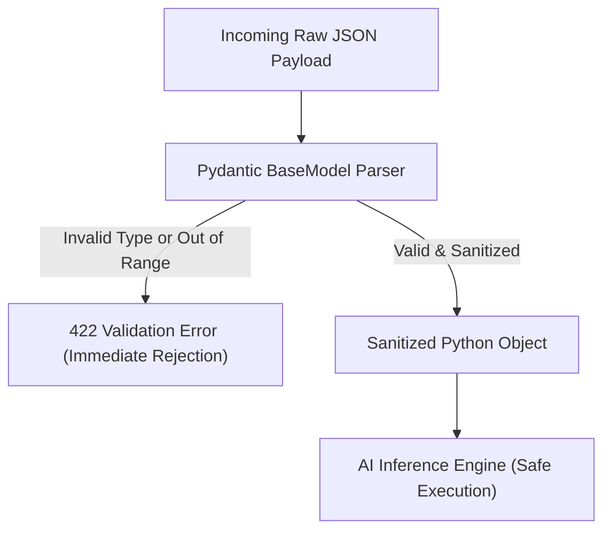

# Pydantic Crash Course: Data Validation & Schemas

<div className="video-card" style={{border: '1px solid #30363d', borderRadius: '8px', padding: '16px', marginBottom: '24px', background: 'rgba(56, 139, 253, 0.05)'}}>
  <div style={{display: 'flex', gap: '16px', flexWrap: 'wrap', alignItems: 'center'}}>
    <div><strong>Curators:</strong> Nitish Singh (CampusX)</div>
    <div><strong>Module:</strong> Module 1: Production Backend & Containerization</div>
    <div><strong>Focus:</strong> Beginner to Production</div>
  </div>
</div>

## 🎯 What You'll Learn
- Understand why input validation is essential to prevent ML model crashes and security vulnerabilities.
- Define Pydantic `BaseModel` schemas with strict field types and constraints using `Field`.
- Implement custom field validators using `@field_validator`.

---

## 💡 Concept & Architecture

Machine learning models are sensitive to input types and ranges. If a model expects a numerical feature between 0 and 100, passing a negative number, a string, or `None` will crash the inference process.

**Pydantic** is Python's most popular data parsing and validation library:
- It uses standard Python type annotations.
- If data is invalid, Pydantic immediately returns an error detailing exactly which field failed and why.
- It automatically coerces types where possible (e.g. string `"42"` to integer `42`).

### System Architecture & Data Flow



---

## 💻 Step-by-Step Code Walkthrough

Below is the complete implementation broken down into digestible parts so you can understand every line.

### Part 1: Step 1: Defining a Pydantic Model with Field Constraints

```python
from pydantic import BaseModel, Field, field_validator
from typing import List, Optional

# Define the input schema for an LLM generation request
class GenerationRequest(BaseModel):
    prompt: str = Field(..., min_length=5, max_length=1000, description="User input prompt")
    temperature: float = Field(default=0.7, ge=0.0, le=2.0, description="Sampling randomness")
    max_tokens: int = Field(default=256, ge=1, le=4096, description="Maximum tokens to generate")
    stop_sequences: Optional[List[str]] = Field(default=None, description="Optional stop triggers")

    # Custom validator: reject empty strings or whitespace-only prompts
    @field_validator("prompt")
    @classmethod
    def validate_non_empty(cls, value: str) -> str:
        if not value.strip():
            raise ValueError("Prompt cannot be blank or contain only whitespace.")
        return value.strip()
```

#### 🔍 In-Depth Explanation:
We inherit from `BaseModel`. `Field(...)` means the prompt is required. Constraints like `ge=0.0` and `le=2.0` guarantee temperature is within safe bounds.

### Part 2: Step 2: Using the Pydantic Model in a FastAPI Endpoint

```python
from fastapi import FastAPI

app = FastAPI(title="Pydantic Validation Example")

# The GenerationRequest model is passed as a type hint in the endpoint function
@app.post("/generate")
def generate_text(request: GenerationRequest):
    """Execute simulated text generation with validated inputs."""
    # Access validated attributes directly with dot notation
    user_prompt = request.prompt
    model_temp = request.temperature
    
    return {
        "status": "success",
        "received_prompt": user_prompt,
        "temperature": model_temp,
        "generated_text": f"AI response to: '{user_prompt}' generated with temp {model_temp}."
    }
```

#### 🔍 In-Depth Explanation:
FastAPI reads the JSON request body, passes it to `GenerationRequest`, validates all constraints, and provides a clean `request` object. If anything is wrong, FastAPI responds with HTTP 422 before your code runs.

---

## ⚠️ Beginner Tips & Best Practices

:::tip Use Field Descriptions for Documentation
The `description` parameter in `Field()` is automatically rendered in FastAPI's Swagger UI, giving consumers clear guidelines on how to format requests.
:::

:::warning Pydantic v1 vs v2 Syntax
In Pydantic v2 (FastAPI standard in 2026), use `@field_validator` instead of `@validator`, and `model_dump()` instead of `dict()`.
:::

---

## 📝 Key Takeaways & Summary

- Pydantic provides runtime data validation and serialization using standard Python type annotations.
- `Field()` allows setting default values, min/max limits, and documentation descriptions.
- Input validation shields AI models from invalid inputs, bad ranges, and unexpected types.

