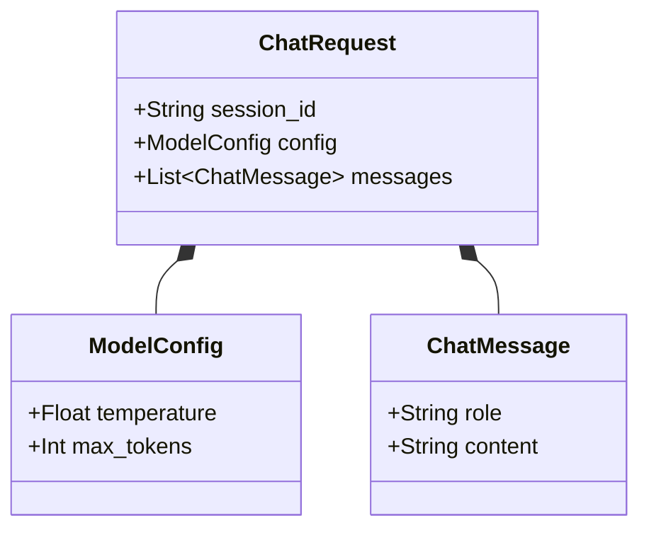

# Handling Request Bodies & Nested JSON Payloads

<div className="video-card" style={{border: '1px solid #30363d', borderRadius: '8px', padding: '16px', marginBottom: '24px', background: 'rgba(56, 139, 253, 0.05)'}}>
  <div style={{display: 'flex', gap: '16px', flexWrap: 'wrap', alignItems: 'center'}}>
    <div><strong>Curators:</strong> Nitish Singh (CampusX)</div>
    <div><strong>Module:</strong> Module 1: Production Backend & Containerization</div>
    <div><strong>Focus:</strong> Beginner to Production</div>
  </div>
</div>

## 🎯 What You'll Learn
- Construct nested Pydantic models to represent complex, hierarchical data.
- Handle lists of items within request bodies for batch prediction.
- Use `response_model` to filter and shape outgoing JSON data.

---

## 💡 Concept & Architecture

Real-world AI systems rarely accept flat key-value pairs. For example, a multimodal pipeline might require:
- User identity metadata (user ID, session token)
- Model generation settings (sampling parameters, system prompt)
- Input data (a list of chat messages or multiple text chunks for batch processing)

By nesting Pydantic models, you can represent complex tree structures while preserving validation at every level.

### System Architecture & Data Flow



---

## 💻 Step-by-Step Code Walkthrough

Below is the complete implementation broken down into digestible parts so you can understand every line.

### Part 1: Step 1: Defining Hierarchical Nested Schemas

```python
from pydantic import BaseModel, Field
from typing import List, Literal

# 1. Schema for an individual message in a conversation
class ChatMessage(BaseModel):
    role: Literal["user", "assistant", "system"] = Field(..., description="Role of the sender")
    content: str = Field(..., min_length=1, description="Message text")

# 2. Schema for model configuration settings
class InferenceConfig(BaseModel):
    temperature: float = Field(default=0.7, ge=0.0, le=1.0)
    top_p: float = Field(default=0.9, ge=0.0, le=1.0)

# 3. Master Request Schema nesting both models
class ChatCompletionRequest(BaseModel):
    conversation_id: str = Field(..., description="Unique thread identifier")
    config: InferenceConfig = Field(default_factory=InferenceConfig)
    messages: List[ChatMessage] = Field(..., min_items=1, description="List of chat history messages")
```

#### 🔍 In-Depth Explanation:
We use `Literal['user', 'assistant', 'system']` to restrict the `role` field to valid roles only. `ChatCompletionRequest` cleanly bundles the conversation ID, configuration, and a list of message objects.

### Part 2: Step 2: Defining Response Models and the Endpoint Handler

```python
from fastapi import FastAPI

app = FastAPI(title="Nested Chat API")

# Schema for the outgoing response
class ChatCompletionResponse(BaseModel):
    conversation_id: str
    reply: ChatMessage
    total_messages_processed: int

@app.post("/chat/completions", response_model=ChatCompletionResponse)
def complete_chat(request: ChatCompletionRequest):
    """Process multi-turn chat messages and return assistant response."""
    last_user_message = request.messages[-1].content
    
    # Formulate assistant reply
    reply_message = ChatMessage(
        role="assistant",
        content=f"Acknowledged: '{last_user_message}'. How else can I assist you?"
    )
    
    return ChatCompletionResponse(
        conversation_id=request.conversation_id,
        reply=reply_message,
        total_messages_processed=len(request.messages)
    )
```

#### 🔍 In-Depth Explanation:
The `response_model=ChatCompletionResponse` parameter ensures FastAPI validates and formats the outgoing response, stripping any unapproved private variables before sending data to the client.

---

## ⚠️ Beginner Tips & Best Practices

:::tip Use response_model for Security
Always define a `response_model` on endpoints that read from databases or internal states. It prevents accidental leaking of internal fields like passwords, hashes, or API secrets.
:::

:::warning Limit List Lengths
Always specify `max_items` on lists in Pydantic models (e.g. `messages: List[ChatMessage] = Field(..., max_items=50)`). This prevents denial-of-service attacks from huge request payloads.
:::

---

## 📝 Key Takeaways & Summary

- Nested Pydantic models represent hierarchical real-world structures cleanly.
- `response_model` enforces strict output formatting and prevents data leaks.
- Validation rules apply recursively down to every nested item in lists and child objects.

