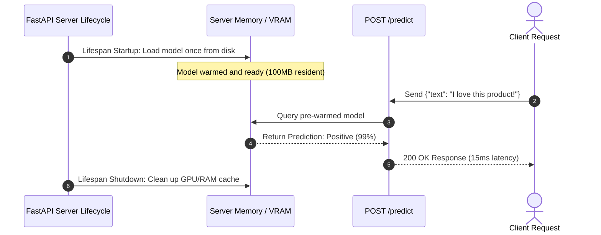

# Serving Machine Learning & AI Models with FastAPI

<div className="video-card" style={{border: '1px solid #30363d', borderRadius: '8px', padding: '16px', marginBottom: '24px', background: 'rgba(56, 139, 253, 0.05)'}}>
  <div style={{display: 'flex', gap: '16px', flexWrap: 'wrap', alignItems: 'center'}}>
    <div><strong>Curators:</strong> Nitish Singh (CampusX)</div>
    <div><strong>Module:</strong> Module 1: Production Backend & Containerization</div>
    <div><strong>Focus:</strong> Beginner to Production</div>
  </div>
</div>

## 🎯 What You'll Learn
- Understand why models should be loaded once at server startup, never inside the endpoint function.
- Use modern FastAPI `lifespan` context managers to manage model initialization and GPU memory release.
- Build an end-to-end sentiment classification prediction service.

---

## 💡 Concept & Architecture

A critical mistake beginners make when serving machine learning models:
```python
# ❌ INCORRECT (Anti-Pattern)
@app.post("/predict")
def predict(data: InputData):
    model = joblib.load("my_large_model.pkl")  # Loads 2GB model on EVERY request!
    return model.predict(data)
```
Loading a model from disk on every request introduces multi-second latency and will quickly crash server RAM under concurrent traffic.

The production approach:
- Load the model **once** into memory when the server boots.
- Keep the model resident in RAM/VRAM.
- Incoming requests reuse the pre-warmed model instance instantly.

### System Architecture & Data Flow



---

## 💻 Step-by-Step Code Walkthrough

Below is the complete implementation broken down into digestible parts so you can understand every line.

### Part 1: Step 1: Setting up Lifespan Context Manager for Model Loading

```python
from contextlib import asynccontextmanager
from fastapi import FastAPI
from pydantic import BaseModel, Field

# Global state dictionary to hold the resident model
ml_models = {}

# Lifespan context manager runs code before the server starts and after it shuts down
@asynccontextmanager
async def lifespan(app: FastAPI):
    print("[STARTUP] Loading Machine Learning model into memory...")
    # In a real app: ml_models["classifier"] = joblib.load("model.pkl")
    # Here we simulate a loaded model pipeline
    ml_models["classifier"] = {
        "name": "SentimentAnalyzer-v1",
        "vocabulary": {"love": 1, "great": 1, "terrible": -1, "bad": -1}
    }
    print("[STARTUP] Model loaded and warmed up.")
    
    yield  # Server handles incoming traffic while yielded
    
    print("[SHUTDOWN] Unloading model and releasing resources...")
    ml_models.clear()

app = FastAPI(title="AI Model Serving", lifespan=lifespan)
```

#### 🔍 In-Depth Explanation:
The `lifespan` function executes before requests are accepted. The model is loaded once into `ml_models`. When the server terminates, the code after `yield` runs to free memory.

### Part 2: Step 2: Defining Input/Output Schemas and the Prediction Endpoint

```python
class SentimentRequest(BaseModel):
    text: str = Field(..., min_length=2, max_length=500, description="Text to analyze")

class SentimentResponse(BaseModel):
    text: str
    sentiment: str
    confidence: float
    model_version: str

@app.post("/predict", response_model=SentimentResponse)
def predict_sentiment(payload: SentimentRequest):
    """Run inference against the pre-warmed sentiment model."""
    model = ml_models["classifier"]
    words = payload.text.lower().split()
    
    # Calculate simple sentiment score
    score = sum(model["vocabulary"].get(word, 0) for word in words)
    sentiment = "positive" if score > 0 else "negative" if score < 0 else "neutral"
    confidence = 0.95 if score != 0 else 0.50
    
    return SentimentResponse(
        text=payload.text,
        sentiment=sentiment,
        confidence=confidence,
        model_version=model["name"]
    )
```

#### 🔍 In-Depth Explanation:
The endpoint retrieves the already-loaded model from `ml_models` in microseconds, performs inference, and returns a verified `SentimentResponse`.

---

## ⚠️ Beginner Tips & Best Practices

:::tip Use GPU Cache Clearing on Shutdown
When working with PyTorch on CUDA, include `torch.cuda.empty_cache()` inside the shutdown phase of your lifespan handler to prevent memory leaks.
:::

:::warning Avoid CPU-Bound Blocking Calls in async def
If your model inference takes 500ms on CPU, using `async def` will block the event loop. Use regular `def` (which runs in an external thread pool) or `asyncio.to_thread`.
:::

---

## 📝 Key Takeaways & Summary

- Never load models inside endpoint functions; always load models once at server startup.
- FastAPI's `lifespan` context manager is the standard way to handle model initialization and teardown.
- Keeping models resident in memory drops request latency from seconds to milliseconds.

