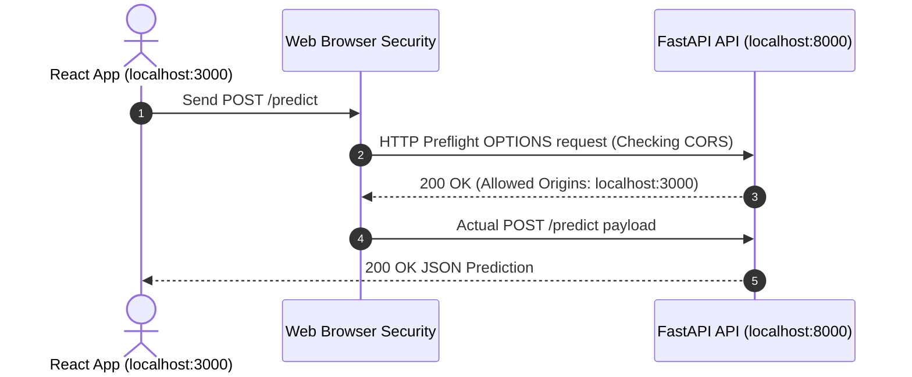

# Error Handling, Status Codes & CORS Configuration

<div className="video-card" style={{border: '1px solid #30363d', borderRadius: '8px', padding: '16px', marginBottom: '24px', background: 'rgba(56, 139, 253, 0.05)'}}>
  <div style={{display: 'flex', gap: '16px', flexWrap: 'wrap', alignItems: 'center'}}>
    <div><strong>Curators:</strong> Nitish Singh (CampusX)</div>
    <div><strong>Module:</strong> Module 1: Production Backend & Containerization</div>
    <div><strong>Focus:</strong> Beginner to Production</div>
  </div>
</div>

## 🎯 What You'll Learn
- Return standard HTTP status codes (200, 400, 401, 404, 500) using `HTTPException`.
- Understand Cross-Origin Resource Sharing (CORS) and why browsers block API calls from React/Vue.
- Configure `CORSMiddleware` to allow authorized frontend clients to interact with your AI backend.

---

## 💡 Concept & Architecture

In production AI engineering, two non-functional requirements are mandatory:
1. **Predictable Error Handling:** When something goes wrong (e.g. model rate-limit exceeded or invalid token), the API must return a structured error message with the appropriate HTTP status code.
2. **CORS (Cross-Origin Resource Sharing):** Web browsers enforce a security mechanism called the Same-Origin Policy. If your React app runs on `http://localhost:3000` and your FastAPI backend runs on `http://localhost:8000`, the browser will block requests unless FastAPI explicitly permits cross-origin traffic.

### System Architecture & Data Flow



---

## 💻 Step-by-Step Code Walkthrough

Below is the complete implementation broken down into digestible parts so you can understand every line.

### Part 1: Step 1: Adding CORSMiddleware to FastAPI

```python
from fastapi import FastAPI
from fastapi.middleware.cors import CORSMiddleware

app = FastAPI(title="Secure AI Backend with CORS")

# Define the list of allowed frontend origins
origins = [
    "http://localhost:3000",      # Local React / Next.js dev server
    "http://localhost:5173",      # Local Vite dev server
    "https://my-ai-platform.com",  # Production frontend domain
]

# Add CORS middleware to the application pipeline
app.add_middleware(
    CORSMiddleware,
    allow_origins=origins,            # Specific trusted domains
    allow_credentials=True,           # Support cookies/auth headers
    allow_methods=["GET", "POST", "OPTIONS"], # Allowed HTTP verbs
    allow_headers=["*"],             # Allow all headers
)
```

#### 🔍 In-Depth Explanation:
This middleware intercepts all incoming HTTP requests. If the request comes from an allowed origin, it adds `Access-Control-Allow-Origin` headers so the browser accepts the response.

### Part 2: Step 2: Graceful Error Handling with HTTPException

```python
from fastapi import HTTPException, status

@app.post("/api/v1/analyze")
def analyze_document(doc_id: str, api_key: str):
    """Analyze a document with strict security and error checks."""
    # 1. Check authentication
    if api_key != "secret-token-123":
        raise HTTPException(
            status_code=status.HTTP_401_UNAUTHORIZED,
            detail="Invalid or expired API token. Access denied."
        )
    
    # 2. Check resource existence
    valid_documents = {"doc-1", "doc-2"}
    if doc_id not in valid_documents:
        raise HTTPException(
            status_code=status.HTTP_404_NOT_FOUND,
            detail=f"Document '{doc_id}' does not exist in vector index."
        )
    
    return {"status": "success", "doc_id": doc_id, "summary": "Document content verified."}
```

#### 🔍 In-Depth Explanation:
Raising `HTTPException` terminates execution immediately and formats the error into clean JSON: `{'detail': '...'}` with the exact HTTP status code.

---

## ⚠️ Beginner Tips & Best Practices

:::tip Do Not Use allow_origins=['*'] in Production with Credentials
While wildcard `*` is convenient in development, modern browsers reject requests that have both `allow_origins=['*']` and `allow_credentials=True`.
:::

:::warning Always Catch Downstream AI Errors
If an external API like OpenAI fails with a timeout, wrap your call in `try...except` and raise an `HTTPException(status_code=503, detail='LLM Provider unavailable')` so your frontend knows how to retry.
:::

---

## 📝 Key Takeaways & Summary

- CORS middleware is required whenever your frontend and backend run on different domains or ports.
- `HTTPException` provides standardized JSON error responses with proper HTTP status codes.
- Proper error handling ensures frontends can show helpful feedback instead of generic network crashes.

