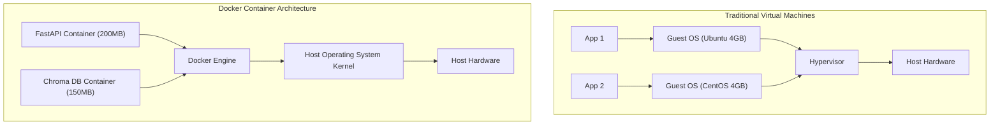

# Docker Crash Course for AI Engineers

<div className="video-card" style={{border: '1px solid #30363d', borderRadius: '8px', padding: '16px', marginBottom: '24px', background: 'rgba(56, 139, 253, 0.05)'}}>
  <div style={{display: 'flex', gap: '16px', flexWrap: 'wrap', alignItems: 'center'}}>
    <div><strong>Curators:</strong> Nitish Singh (CampusX)</div>
    <div><strong>Module:</strong> Module 1: Production Backend & Containerization</div>
    <div><strong>Focus:</strong> Beginner to Production</div>
  </div>
</div>

## 🎯 What You'll Learn
- Understand the difference between a Virtual Machine (VM) and a lightweight Docker Container.
- Master core Docker primitives: Images, Containers, Registries, and Dockerfiles.
- Learn essential Docker CLI commands for building, running, and inspecting containers.

---

## 💡 Concept & Architecture

Have you ever experienced this? A model runs perfectly on your laptop, but when deployed to a team server or the cloud, it fails with:
- `ModuleNotFoundError: No module named 'torch'`
- `CUDA version mismatch`
- Incompatible C++ compilers

**Docker** solves this by packaging your Python code, virtual environment, system libraries, and dependencies into an immutable, portable bundle called a **Container Image**.

### Containers vs Virtual Machines
- **Virtual Machines:** Each VM bundles a complete guest Operating System (several gigabytes), virtual hardware, and hypervisor overhead. Booting takes minutes.
- **Docker Containers:** Containers share the host Linux kernel and isolate processes using Linux namespaces and cgroups. They start in milliseconds and consume minimal RAM.

### System Architecture & Data Flow



---

## 💻 Step-by-Step Code Walkthrough

Below is the complete implementation broken down into digestible parts so you can understand every line.

### Part 1: Step 1: Understanding Essential Docker CLI Commands

```python
# 1. Pull an official lightweight Python image from Docker Hub
docker pull python:3.11-slim

# 2. List all downloaded images on your local machine
docker images

# 3. Run a temporary interactive bash shell inside a Python container
docker run -it --rm python:3.11-slim python3 -c "print('Hello from inside Docker!')"

# 4. View currently running containers
docker ps

# 5. Stop a running container
# docker stop <container_id>
```

#### 🔍 In-Depth Explanation:
These fundamental commands download base images from Docker Hub, inspect local images, and execute isolated Linux processes inside containers.

### Part 2: Step 2: Inspecting Container Resource Usage

```python
# Monitor real-time CPU, RAM, and network consumption of running containers
docker stats

# View logs generated by a containerized application
docker logs -f <container_name_or_id>
```

#### 🔍 In-Depth Explanation:
`docker stats` is vital for AI workloads to verify whether your model is exceeding container RAM limits (which triggers an out-of-memory OOM kill).

---

## ⚠️ Beginner Tips & Best Practices

:::tip Use -slim Base Images
Always prefer `python:3.11-slim` over full `python:3.11`. Full images are ~1GB, whereas slim images are ~150MB, saving bandwidth and build time.
:::

:::warning Containers are Ephemeral by Default
Any file written inside a container is erased when the container is deleted. Use Docker Volumes to persist downloaded model weights or database files.
:::

---

## 📝 Key Takeaways & Summary

- Docker packages code, runtime, and system dependencies into portable container images.
- Containers share the host kernel, making them significantly faster and lighter than virtual machines.
- Using Docker guarantees that code running locally behaves identically in cloud staging and production.

