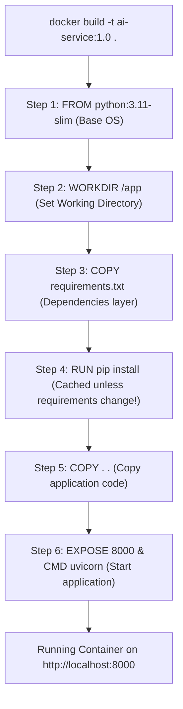

# Containerizing & Deploying FastAPI with Docker

<div className="video-card" style={{border: '1px solid #30363d', borderRadius: '8px', padding: '16px', marginBottom: '24px', background: 'rgba(56, 139, 253, 0.05)'}}>
  <div style={{display: 'flex', gap: '16px', flexWrap: 'wrap', alignItems: 'center'}}>
    <div><strong>Curators:</strong> Nitish Singh (CampusX)</div>
    <div><strong>Module:</strong> Module 1: Production Backend & Containerization</div>
    <div><strong>Focus:</strong> Beginner to Production</div>
  </div>
</div>

## 🎯 What You'll Learn
- Write a production-ready `Dockerfile` following best caching practices.
- Use `.dockerignore` to exclude virtual environments, cache files, and credentials.
- Build and run your containerized FastAPI application with proper port forwarding.

---

## 💡 Concept & Architecture

Containerizing an AI backend requires structuring your `Dockerfile` so that Docker's layer cache prevents reinstalling heavy dependencies (like NumPy, PyTorch, or LangChain) every time you edit a single line of application code.

The golden rule of Dockerfiles:
- Copy `requirements.txt` and install dependencies **first**.
- Copy application code **last**.
- Because source code changes frequently, but dependencies change rarely, Docker reuses cached dependency layers in under 2 seconds.

### System Architecture & Data Flow



---

## 💻 Step-by-Step Code Walkthrough

Below is the complete implementation broken down into digestible parts so you can understand every line.

### Part 1: Step 1: Creating the requirements.txt and .dockerignore Files

```python
# requirements.txt
fastapi>=0.115.0
uvicorn[standard]>=0.32.0
pydantic>=2.10.0
requests>=2.32.0

# .dockerignore (Crucial to prevent copying large local files)
__pycache__/
*.pyc
.git/
.env
venv/
.pytest_cache/
```

#### 🔍 In-Depth Explanation:
The `.dockerignore` file prevents copying your local virtual environment, git history, or secret `.env` files into the Docker image.

### Part 2: Step 2: Writing the Production Dockerfile

```python
# Use an official lightweight Python image
FROM python:3.11-slim

# Prevent Python from writing .pyc files and enable real-time log printing
ENV PYTHONDONTWRITEBYTECODE=1
ENV PYTHONUNBUFFERED=1

# Set the working directory inside the container
WORKDIR /app

# Step A: Install dependencies first to leverage Docker layer caching
COPY requirements.txt .
RUN pip install --no-cache-dir -r requirements.txt

# Step B: Copy application source code
COPY . .

# Expose port 8000 for documentation purposes
EXPOSE 8000

# Start Uvicorn bound to 0.0.0.0
CMD ["uvicorn", "main:app", "--host", "0.0.0.0", "--port", "8000"]
```

#### 🔍 In-Depth Explanation:
Notice the two-step copy pattern: `requirements.txt` is copied first and installed. `COPY . .` happens after. When you edit `main.py`, Docker starts the build directly at step B, completing in seconds.

### Part 3: Step 3: Building and Running the Container

```python
# 1. Build the Docker image tagged as 'ai-backend:v1'
docker build -t ai-backend:v1 .

# 2. Run the container in detached (-d) mode with port mapping (-p host:container)
docker run -d --name ai-api -p 8000:8000 ai-backend:v1

# 3. Test that the container is serving requests
curl http://localhost:8000/
# Output: {"status": "online", "service": "AI Engineering Platform"}

# 4. View running container logs
docker logs ai-api
```

#### 🔍 In-Depth Explanation:
`-p 8000:8000` maps port 8000 on your host computer to port 8000 inside the container. You can open your host browser and access `http://localhost:8000/docs` exactly as if it were running natively.

---

## ⚠️ Beginner Tips & Best Practices

:::tip Always Bind to 0.0.0.0
Inside a container, Uvicorn must listen on `--host 0.0.0.0`. If you use `127.0.0.1`, Uvicorn will only accept connections from inside the container itself, making it unreachable from your host machine.
:::

:::warning Use --no-cache-dir with pip
Always add `--no-cache-dir` when running `pip install` in Dockerfiles. Otherwise, pip saves downloaded wheel archives, inflating your image size by hundreds of megabytes.
:::

---

## 📝 Key Takeaways & Summary

- Layer caching speeds up Docker builds when dependency installation is separated from source code changes.
- A `.dockerignore` file prevents copying local virtual environments and secret keys into images.
- Port mapping (`-p host:container`) connects external network traffic to your containerized application.

