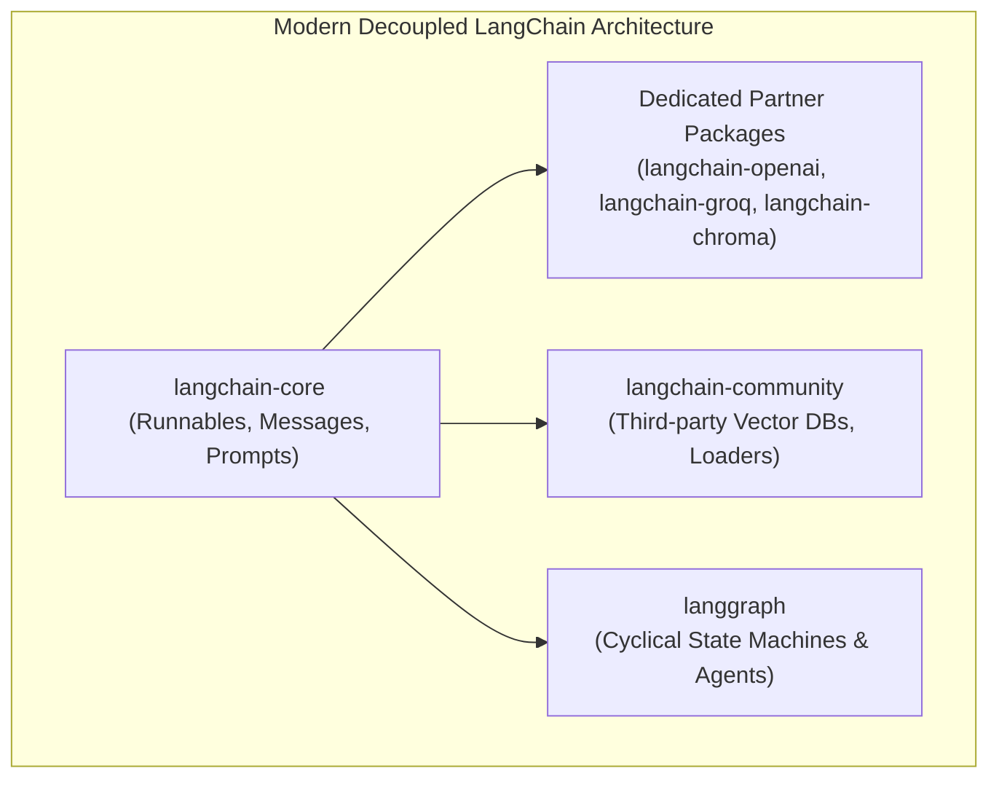

# LangChain Architecture & The Modern Ecosystem (v0.3+)

<div className="video-card" style={{border: '1px solid #30363d', borderRadius: '8px', padding: '16px', marginBottom: '24px', background: 'rgba(56, 139, 253, 0.05)'}}>
  <div style={{display: 'flex', gap: '16px', flexWrap: 'wrap', alignItems: 'center'}}>
    <div><strong>Curators:</strong> Unified Masterclass (CampusX & Krish Naik)</div>
    <div><strong>Module:</strong> Module 2: LangChain Mastery & Local LLMs</div>
    <div><strong>Focus:</strong> Beginner to Production</div>
  </div>
</div>

## 🎯 What You'll Learn
- Understand why modern LangChain decoupled into core, community, and partner packages.
- Install and configure modern LangChain packages without deprecated legacy dependencies.
- Execute your first invocation using the modern unified Runnable protocol.

---

## 💡 Concept & Architecture

LangChain is an open-source orchestration framework designed to simplify the development of applications powered by Large Language Models (LLMs). 

In earlier versions (v0.1), LangChain was a massive, monolithic package where changing one small dependency could break your entire virtual environment. 

In the modern v0.2/v0.3+ architecture (standard in 2026), LangChain is completely decoupled:
1. **`langchain-core`**: The ultra-lightweight foundation containing base interfaces, messages, and the Runnable protocol.
2. **Dedicated Partner Packages** (`langchain-openai`, `langchain-anthropic`, `langchain-groq`): Maintained directly with zero unnecessary bloat.
3. **`langchain-community`**: Third-party community connectors for vector stores and document loaders.
4. **`langgraph`**: The state machine layer for cyclical multi-agent workflows.

### System Architecture & Data Flow



---

## 💻 Step-by-Step Code Walkthrough

Below is the complete implementation broken down into digestible parts so you can understand every line.

### Part 1: Step 1: Installing the Decoupled Packages

```python
# In your virtual environment, install only what you need:
pip install langchain-core langchain-openai python-dotenv
```

#### 🔍 In-Depth Explanation:
By installing only `langchain-core` and `langchain-openai`, Docker image size drops from 1.5GB down to under 200MB.

### Part 2: Step 2: Initializing Environment and Invoking a Chat Model

```python
import os
from dotenv import load_dotenv
from langchain_openai import ChatOpenAI
from langchain_core.messages import HumanMessage, SystemMessage

# Step A: Load environment variables from .env file
load_dotenv()

# Step B: Initialize the Chat Model instance
# temperature=0.0 ensures deterministic, focused responses
llm = ChatOpenAI(
    model="gpt-4o-mini",
    temperature=0.0
)

# Step C: Formulate chat messages with explicit roles
messages = [
    SystemMessage(content="You are a senior AI Engineering mentor. Explain concepts simply."),
    HumanMessage(content="What is LangChain in 2 sentences?")
]

# Step D: Invoke the model synchronously
response = llm.invoke(messages)

# Step E: Print the text content of the returned AIMessage
print("Response from LLM:")
print(response.content)
```

#### 🔍 In-Depth Explanation:
We formulate standard messages: `SystemMessage` sets system guidelines, and `HumanMessage` represents user input. Calling `llm.invoke()` returns an `AIMessage` containing the generated text.

---

## ⚠️ Beginner Tips & Best Practices

:::tip Use Dedicated Partner Libraries
Always import models from `langchain_openai` or `langchain_anthropic` instead of importing from `langchain.chat_models`. Partner libraries receive bug fixes and feature updates instantly.
:::

:::warning Never Hardcode API Keys
Never write `api_key='sk-...'` in Python source code. Always use `load_dotenv()` or system environment variables to prevent leaking keys into version control.
:::

---

## 📝 Key Takeaways & Summary

- Modern LangChain is decoupled into lightweight core abstractions and dedicated partner packages.
- The `invoke()` method provides a uniform interface across all chat models and runnables.
- Message classes (`SystemMessage`, `HumanMessage`, `AIMessage`) maintain clean role separation.

