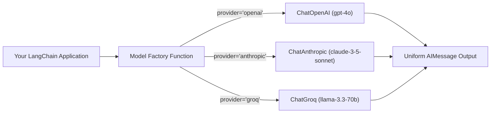

# Working with Chat Models: OpenAI, Anthropic, HuggingFace & Groq

<div className="video-card" style={{border: '1px solid #30363d', borderRadius: '8px', padding: '16px', marginBottom: '24px', background: 'rgba(56, 139, 253, 0.05)'}}>
  <div style={{display: 'flex', gap: '16px', flexWrap: 'wrap', alignItems: 'center'}}>
    <div><strong>Curators:</strong> Unified Masterclass (CampusX & Krish Naik)</div>
    <div><strong>Module:</strong> Module 2: LangChain Mastery & Local LLMs</div>
    <div><strong>Focus:</strong> Beginner to Production</div>
  </div>
</div>

## 🎯 What You'll Learn
- Understand the unified `BaseChatModel` abstraction that makes models interchangeable.
- Compare proprietary cloud models (GPT-4o, Claude 3.5 Sonnet) with ultra-fast inference LPUs (Groq Llama 3.3).
- Implement a dynamic model factory function to switch providers at runtime.

---

## 💡 Concept & Architecture

One of LangChain's greatest superpowers is **provider agnosticism**. If your application is written correctly using `BaseChatModel`, you can switch from OpenAI to Anthropic or Groq by changing a single configuration line, without rewriting any application logic.

### Provider Comparison for AI Engineers:
- **OpenAI (`langchain-openai`)**: Great all-rounder with industry-standard tool calling and JSON structured outputs.
- **Anthropic (`langchain-anthropic`)**: Industry-leading reasoning and long context comprehension (Claude 3.5 Sonnet).
- **Groq (`langchain-groq`)**: Ultra-high-speed inference on Language Processing Units (LPUs), delivering 500+ tokens per second on open-source Llama models at near-zero cost.
- **HuggingFace (`langchain-huggingface`)**: Local inference or serverless open-source models.

### System Architecture & Data Flow



---

## 💻 Step-by-Step Code Walkthrough

Below is the complete implementation broken down into digestible parts so you can understand every line.

### Part 1: Step 1: Installing Required Provider Packages

```python
pip install langchain-openai langchain-groq langchain-anthropic
```

#### 🔍 In-Depth Explanation:
This installs the official partner connectors for OpenAI, Groq, and Anthropic.

### Part 2: Step 2: Building a Universal Model Factory

```python
import os
from langchain_core.language_models.chat_models import BaseChatModel
from langchain_openai import ChatOpenAI
from langchain_groq import ChatGroq

def get_chat_model(provider: str = "groq") -> BaseChatModel:
    """Universal factory function returning a configured ChatModel instance."""
    if provider == "openai":
        return ChatOpenAI(
            model="gpt-4o-mini",
            temperature=0.1
        )
    elif provider == "groq":
        # Groq runs open-source models on specialized LPU hardware with extreme speed
        return ChatGroq(
            model="llama-3.3-70b-versatile",
            temperature=0.1
        )
    else:
        raise ValueError(f"Unsupported provider: {provider}")
```

#### 🔍 In-Depth Explanation:
This function abstracts model initialization. Both `ChatOpenAI` and `ChatGroq` inherit from `BaseChatModel`, guaranteeing identical method signatures like `.invoke()` and `.stream()`.

### Part 3: Step 3: Running Inference with Zero Code Changes

```python
# Initialize the model using our factory (defaults to high-speed Groq)
model = get_chat_model(provider="groq")

# Send a prompt
response = model.invoke("Give 3 golden rules for microservices architecture.")

print("Provider Response:")
print(response.content)
```

#### 🔍 In-Depth Explanation:
Because all models implement the Runnable interface, you can pass this `model` object to any downstream chain, prompt, or agent without changing a single line of code.

---

## ⚠️ Beginner Tips & Best Practices

:::tip Use Groq for Rapid Prototyping
Groq provides a generous free tier and generates responses at 500+ tokens/sec, making it ideal for testing and learning without waiting on slow generation.
:::

:::warning Context Limits Differ by Model
Always verify context window limits. For example, Claude 3.5 Sonnet supports 200k tokens, while smaller local models may support 8k or 32k tokens.
:::

---

## 📝 Key Takeaways & Summary

- LangChain's `BaseChatModel` standardizes communication across all AI vendors.
- A model factory pattern allows swapping providers based on cost, speed, or availability.
- Groq enables blazing-fast open-source model execution for real-time applications.

