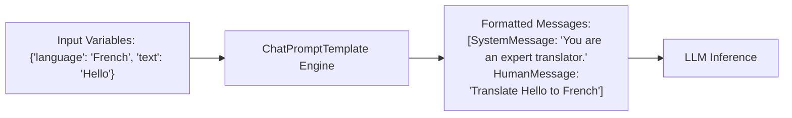

# Prompt Templates, ChatPrompts & Few-Shot Prompting

<div className="video-card" style={{border: '1px solid #30363d', borderRadius: '8px', padding: '16px', marginBottom: '24px', background: 'rgba(56, 139, 253, 0.05)'}}>
  <div style={{display: 'flex', gap: '16px', flexWrap: 'wrap', alignItems: 'center'}}>
    <div><strong>Curators:</strong> Nitish Singh (CampusX)</div>
    <div><strong>Module:</strong> Module 2: LangChain Mastery & Local LLMs</div>
    <div><strong>Focus:</strong> Beginner to Production</div>
  </div>
</div>

## 🎯 What You'll Learn
- Understand why hardcoding string prompts causes bugs and prevents reuse.
- Build dynamic `ChatPromptTemplate` instances with system, human, and placeholder roles.
- Implement Few-Shot prompting to guide model output format by example.

---

## 💡 Concept & Architecture

In Python, beginners often use standard f-strings to build prompts:
```python
# ❌ Fragile Approach
prompt = f"Translate '{user_text}' into {target_language}"
```
While simple, f-strings fail when handling multi-turn message histories, role definitions, escaping curly braces in code generation, or injecting few-shot training examples.

**Prompt Templates** in LangChain:
- Validate input variables before calling the LLM.
- Format multi-role chat conversations cleanly (`system`, `human`, `ai`).
- Can be saved, versioned, and shared across teams.

### System Architecture & Data Flow



---

## 💻 Step-by-Step Code Walkthrough

Below is the complete implementation broken down into digestible parts so you can understand every line.

### Part 1: Step 1: Creating a ChatPromptTemplate with System and Human Roles

```python
from langchain_core.prompts import ChatPromptTemplate

# Define a chat template with parameterized placeholders
prompt_template = ChatPromptTemplate.from_messages([
    ("system", "You are an expert software tutor. Explain {concept} for a {audience_level}."),
    ("human", "Can you explain {topic}?")
])

# Inspect required input variables
print("Required variables:", prompt_template.input_variables)

# Format the template into actual messages
formatted_messages = prompt_template.format_messages(
    concept="Distributed Systems",
    audience_level="complete beginner",
    topic="What is eventual consistency?"
)

for msg in formatted_messages:
    print(f"[{msg.__class__.__name__}]: {msg.content}")
```

#### 🔍 In-Depth Explanation:
We use tuples like `('system', '...')` and `('human', '...')`. The `format_messages()` method validates that all required variables are supplied and converts them into proper message objects.

### Part 2: Step 2: Implementing Few-Shot Prompting by Example

```python
from langchain_core.prompts import FewShotChatMessagePromptTemplate, ChatPromptTemplate

# 1. Provide example pairs (Few-Shot Demonstrations)
examples = [
    {"input": "The battery lasts only 2 hours.", "output": "Sentiment: Negative | Category: Battery Life"},
    {"input": "The camera takes stunning night photos!", "output": "Sentiment: Positive | Category: Camera Quality"},
]

# 2. Define how each individual example should be formatted
example_prompt = ChatPromptTemplate.from_messages([
    ("human", "{input}"),
    ("ai", "{output}")
])

# 3. Create the few-shot template container
few_shot_prompt = FewShotChatMessagePromptTemplate(
    example_prompt=example_prompt,
    examples=examples
)

# 4. Assemble the final master prompt
final_prompt = ChatPromptTemplate.from_messages([
    ("system", "Classify customer product reviews into sentiment and category."),
    few_shot_prompt,
    ("human", "{input}")
])

test_msg = final_prompt.format_messages(input="The screen cracked on the first day.")
print("Rendered Few-Shot Prompt Messages Count:", len(test_msg))
```

#### 🔍 In-Depth Explanation:
Few-shot prompting provides high-accuracy guidance by showing the model 2-3 concrete examples before asking it to solve the real task.

---

## ⚠️ Beginner Tips & Best Practices

:::tip Escaping Literal Braces
If your prompt template needs to include literal curly brackets (e.g. JSON syntax `{}`), escape them by doubling them: `{{'key': 'value'}}`.
:::

:::warning Don't Overload Few-Shot Examples
Keep few-shot examples to 2-4 high-quality samples. Adding too many examples consumes tokens and can bias the model against edge cases.
:::

---

## 📝 Key Takeaways & Summary

- `ChatPromptTemplate` structures multi-turn interactions with clean role separation.
- Templates validate input parameters, preventing missing variable errors.
- Few-shot prompting teaches LLMs exact output formatting by showing input/output examples.

