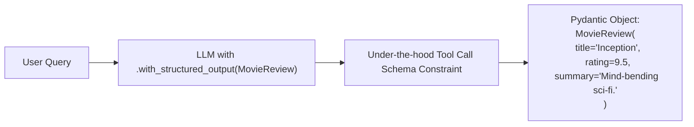

# Structured Outputs & Output Parsers (Pydantic, JSON, Str)

<div className="video-card" style={{border: '1px solid #30363d', borderRadius: '8px', padding: '16px', marginBottom: '24px', background: 'rgba(56, 139, 253, 0.05)'}}>
  <div style={{display: 'flex', gap: '16px', flexWrap: 'wrap', alignItems: 'center'}}>
    <div><strong>Curators:</strong> Nitish Singh (CampusX)</div>
    <div><strong>Module:</strong> Module 2: LangChain Mastery & Local LLMs</div>
    <div><strong>Focus:</strong> Beginner to Production</div>
  </div>
</div>

## 🎯 What You'll Learn
- Understand why parsing raw LLM text with regex is brittle and prone to failure.
- Master `model.with_structured_output(Schema)` for guaranteed schema adherence.
- Use standard output parsers (`StrOutputParser`, `JsonOutputParser`).

---

## 💡 Concept & Architecture

By default, language models generate free-form conversational text. If you ask an LLM: *'Extract the patient's age and diagnosis'*, it might reply:
> *'Sure! The patient is 42 years old and has acute bronchitis.'*

Parsing that unstructured response in Python requires complex regular expressions that break as soon as the model changes its wording.

Modern LLMs support **Structured Outputs** (via function/tool calling and grammar-constrained decoding). LangChain provides:
1. `model.with_structured_output(PydanticModel)`: Guarantees the output matches your exact Pydantic schema.
2. `StrOutputParser()`: Strips metadata and extracts only the plain string text.

### System Architecture & Data Flow



---

## 💻 Step-by-Step Code Walkthrough

Below is the complete implementation broken down into digestible parts so you can understand every line.

### Part 1: Step 1: Defining the Target Pydantic Schema

```python
from pydantic import BaseModel, Field
from typing import List

# Define the exact structured data contract we require from the LLM
class MovieReviewAnalysis(BaseModel):
    movie_title: str = Field(..., description="The name of the movie")
    sentiment: str = Field(..., description="Either Positive, Negative, or Mixed")
    rating_out_of_10: float = Field(..., ge=0.0, le=10.0, description="Numerical rating between 0 and 10")
    key_actors: List[str] = Field(default=[], description="List of mentioned actors")
    spoiler_detected: bool = Field(..., description="True if review reveals major plot twists")
```

#### 🔍 In-Depth Explanation:
This schema defines the exact structure and validation rules. The LLM is forced to populate every required field according to the data types.

### Part 2: Step 2: Binding the Schema to the Chat Model

```python
from langchain_openai import ChatOpenAI

llm = ChatOpenAI(model="gpt-4o-mini", temperature=0.0)

# Bind the Pydantic model to enforce structured output
structured_llm = llm.with_structured_output(MovieReviewAnalysis)

review_text = """
Christopher Nolan's Interstellar is an absolute cinematic masterpiece! 
Matthew McConaughey and Anne Hathaway give unforgettable performances. 
At the end, Cooper enters the 5-dimensional tesseract to save his daughter. 
Easily a 9.8 out of 10!
"""

# Invoke the model
result = structured_llm.invoke(f"Analyze this review:\n{review_text}")

# The result is an actual instance of MovieReviewAnalysis!
print("Type of result:", type(result))
print(f"Movie: {result.movie_title}")
print(f"Rating: {result.rating_out_of_10}")
print(f"Actors: {result.key_actors}")
print(f"Spoiler?: {result.spoiler_detected}")
```

#### 🔍 In-Depth Explanation:
`with_structured_output()` uses the model's native JSON Schema engine. The returned value is not a string, but a verified Python `MovieReviewAnalysis` object.

### Part 3: Step 3: Using StrOutputParser for Simple Text Cleanliness

```python
from langchain_core.output_parsers import StrOutputParser

# When you only need clean string text (stripping away message metadata)
parser = StrOutputParser()
chain = llm | parser

text_answer = chain.invoke("Give a 1-sentence definition of LCEL.")
print("Clean String Output:")
print(text_answer)
```

#### 🔍 In-Depth Explanation:
`StrOutputParser()` extracts `response.content` automatically, making it easy to pipe model text directly into web APIs or logs.

---

## ⚠️ Beginner Tips & Best Practices

:::tip Use Field Descriptions Generously
The LLM reads Pydantic `Field(description='...')` strings to understand what data to extract. Providing clear descriptions dramatically improves extraction accuracy.
:::

:::warning Set Temperature to 0.0 for Extraction
Always use `temperature=0.0` when extracting structured data to prevent creative deviations or hallucinated schema properties.
:::

---

## 📝 Key Takeaways & Summary

- `model.with_structured_output()` forces the LLM to return valid Pydantic objects.
- Pydantic schemas eliminate the need for brittle regex parsing.
- `StrOutputParser` extracts plain strings from raw `AIMessage` objects.

