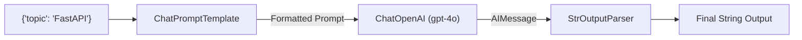

# LCEL: LangChain Expression Language & Modern Chains

<div className="video-card" style={{border: '1px solid #30363d', borderRadius: '8px', padding: '16px', marginBottom: '24px', background: 'rgba(56, 139, 253, 0.05)'}}>
  <div style={{display: 'flex', gap: '16px', flexWrap: 'wrap', alignItems: 'center'}}>
    <div><strong>Curators:</strong> Nitish Singh (CampusX)</div>
    <div><strong>Module:</strong> Module 2: LangChain Mastery & Local LLMs</div>
    <div><strong>Focus:</strong> Beginner to Production</div>
  </div>
</div>

## 🎯 What You'll Learn
- Understand why modern LangChain deprecated legacy chains (`LLMChain`, `SequentialChain`) in favor of LCEL.
- Compose pipelines declaratively using the Unix pipe (`|`) operator.
- Master the core Runnable interface: `invoke()`, `batch()`, and `stream()`.

---

## 💡 Concept & Architecture

In legacy LangChain (v0.0.x), building a pipeline required importing complex wrapper classes like `LLMChain`, `SimpleSequentialChain`, or `TransformChain`. These classes were opaque black boxes that made debugging difficult and didn't support streaming.

**LCEL (LangChain Expression Language)** replaced legacy chains with a clean, declarative syntax using the Unix pipe (`|`) operator:
```python
chain = prompt | model | parser
```

### The Universal Runnable Contract
Every LCEL component implements the exact same interface:
- `invoke(input)`: Run single input synchronously.
- `stream(input)`: Stream response chunks in real-time as they are generated.
- `batch([input1, input2])`: Run multiple inputs in parallel using thread pools.
- `ainvoke()`, `astream()`, `abatch()`: Native async counterparts.

### System Architecture & Data Flow



---

## 💻 Step-by-Step Code Walkthrough

Below is the complete implementation broken down into digestible parts so you can understand every line.

### Part 1: Step 1: Building a Declarative LCEL Pipeline

```python
from langchain_core.prompts import ChatPromptTemplate
from langchain_core.output_parsers import StrOutputParser
from langchain_openai import ChatOpenAI

# 1. Define Prompt Template
prompt = ChatPromptTemplate.from_template(
    "Explain the concept of {concept} in 2 sentences with an analogy."
)

# 2. Define Model
model = ChatOpenAI(model="gpt-4o-mini", temperature=0.2)

# 3. Define Parser
parser = StrOutputParser()

# 4. Assemble the LCEL Chain using the pipe operator (|)
chain = prompt | model | parser
```

#### 🔍 In-Depth Explanation:
The pipe operator (`|`) connects components together. The output of `prompt` is passed as input to `model`, and the output of `model` is passed to `parser`.

### Part 2: Step 2: Executing via invoke, stream, and batch

```python
# 1. Standard synchronous execution
result = chain.invoke({"concept": "Garbage Collection in Python"})
print("--- INVOKE RESULT ---")
print(result)

# 2. Real-time streaming token-by-token
print("\n--- STREAMING RESULT ---")
for chunk in chain.stream({"concept": "Docker Containers"}):
    print(chunk, end="", flush=True)
print()

# 3. Parallel batch processing across multiple inputs
print("\n--- BATCH EXECUTION ---")
batch_inputs = [
    {"concept": "Recursion"},
    {"concept": "Pointers"},
    {"concept": "Vector Embeddings"}
]
batch_results = chain.batch(batch_inputs)
for idx, res in enumerate(batch_results):
    print(f"[{batch_inputs[idx]['concept']}]: {res[:60]}...")
```

#### 🔍 In-Depth Explanation:
Because the chain is a Runnable, `stream()` yields tokens as they arrive from the server, and `batch()` automatically parallelizes calls across multiple threads.

---

## ⚠️ Beginner Tips & Best Practices

:::tip Use batch() for High Throughput
`chain.batch()` uses an internal thread pool to run requests concurrently, delivering 5x-10x higher throughput than sequential `for` loops.
:::

:::warning Avoid Legacy LLMChain Imports
If you see code using `from langchain.chains import LLMChain`, it is deprecated legacy code. Always use `prompt | model | parser`.
:::

---

## 📝 Key Takeaways & Summary

- LCEL uses the pipe operator (`|`) to assemble clean, readable pipelines.
- All LCEL runnables support `invoke`, `stream`, and `batch` out of the box.
- Streaming enables sub-100ms perceived latency in user interfaces.

