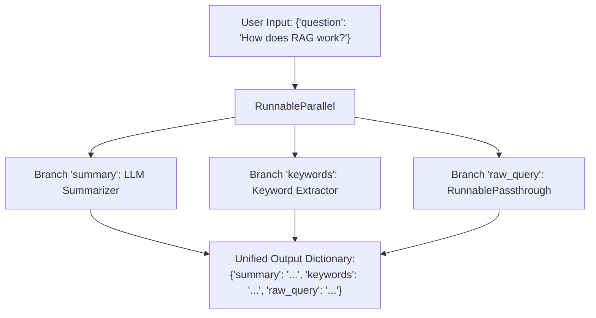

# Advanced Runnables: Passthrough, Parallel & Custom Lambdas

<div className="video-card" style={{border: '1px solid #30363d', borderRadius: '8px', padding: '16px', marginBottom: '24px', background: 'rgba(56, 139, 253, 0.05)'}}>
  <div style={{display: 'flex', gap: '16px', flexWrap: 'wrap', alignItems: 'center'}}>
    <div><strong>Curators:</strong> Nitish Singh (CampusX)</div>
    <div><strong>Module:</strong> Module 2: LangChain Mastery & Local LLMs</div>
    <div><strong>Focus:</strong> Beginner to Production</div>
  </div>
</div>

## 🎯 What You'll Learn
- Pass original user inputs downstream untouched using `RunnablePassthrough`.
- Execute parallel branches simultaneously using `RunnableParallel`.
- Inject arbitrary custom Python transformations into pipelines using `RunnableLambda`.

---

## 💡 Concept & Architecture

Real-world AI workflows are rarely linear. Often you need to:
1. Take a user question and run two tasks simultaneously (e.g. summarize it AND extract keywords).
2. Retrieve context from a vector database while passing the original question forward untouched.
3. Apply custom Python cleanup logic between chain steps.

LangChain provides dedicated runnable primitives:
- **`RunnablePassthrough`**: Passes input values through unchanged.
- **`RunnableParallel`**: Executes a dictionary of runnables in parallel and merges their outputs.
- **`RunnableLambda`**: Wraps any standard Python function into an LCEL-compatible runnable.

### System Architecture & Data Flow



---

## 💻 Step-by-Step Code Walkthrough

Below is the complete implementation broken down into digestible parts so you can understand every line.

### Part 1: Step 1: Transforming Custom Functions with RunnableLambda

```python
from langchain_core.runnables import RunnableLambda

# Custom Python function to count words and sanitize text
def sanitize_and_count(input_text: str) -> dict:
    cleaned = input_text.strip().lower()
    word_count = len(cleaned.split())
    return {"cleaned_text": cleaned, "word_count": word_count}

# Wrap into a RunnableLambda
cleaner = RunnableLambda(sanitize_and_count)

result = cleaner.invoke("   Hello World from LangChain RUNNABLES!  ")
print("RunnableLambda output:", result)
```

#### 🔍 In-Depth Explanation:
`RunnableLambda` allows you to insert standard Python functions into any pipe chain without breaking the Runnable contract.

### Part 2: Step 2: Executing Multi-Branch Parallel Workflows with RunnableParallel

```python
from langchain_core.prompts import ChatPromptTemplate
from langchain_core.output_parsers import StrOutputParser
from langchain_core.runnables import RunnableParallel, RunnablePassthrough
from langchain_openai import ChatOpenAI

model = ChatOpenAI(model="gpt-4o-mini", temperature=0.0)

# Branch A: Technical explanation
tech_prompt = ChatPromptTemplate.from_template("Explain {topic} in deep technical terms.")
tech_chain = tech_prompt | model | StrOutputParser()

# Branch B: Simple beginner analogy
analogy_prompt = ChatPromptTemplate.from_template("Explain {topic} like I am 10 years old.")
analogy_chain = analogy_prompt | model | StrOutputParser()

# Combine both branches to run concurrently
combined_chain = RunnableParallel({
    "technical_perspective": tech_chain,
    "beginner_analogy": analogy_chain,
    "original_topic": RunnablePassthrough()
})

# Invoke the multi-branch chain
results = combined_chain.invoke("Quantum Computing")

print("--- TECHNICAL PERSPECTIVE ---")
print(results["technical_perspective"][:120], "...")
print("\n--- BEGINNER ANALOGY ---")
print(results["beginner_analogy"][:120], "...")
print("\n--- ORIGINAL TOPIC ---")
print(results["original_topic"])
```

#### 🔍 In-Depth Explanation:
`RunnableParallel` executes both `tech_chain` and `analogy_chain` concurrently. `RunnablePassthrough` preserves the input string 'Quantum Computing' in the final dictionary.

---

## ⚠️ Beginner Tips & Best Practices

:::tip Use Dictionary Syntax as a Shortcut
In modern LCEL, you don't even need to write `RunnableParallel({'a': chainA})`. Simply passing a dictionary `{'a': chainA, 'b': chainB}` inside a pipe is automatically converted to `RunnableParallel`.
:::

:::warning Keep Lambda Functions Lightweight
Avoid running long-running network calls inside synchronous `RunnableLambda` functions. For I/O bound operations, define `async def` and use `RunnableLambda(func)` which supports `ainvoke()`.
:::

---

## 📝 Key Takeaways & Summary

- `RunnablePassthrough` sends input parameters forward without alteration.
- `RunnableParallel` runs multiple chains concurrently and collects their results into a dictionary.
- `RunnableLambda` turns standard Python functions into full-featured LCEL components.

