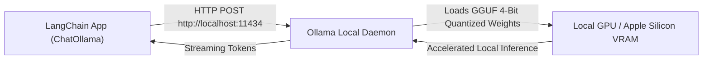

# Running Local Open-Source LLMs with Ollama & On-Device AI

<div className="video-card" style={{border: '1px solid #30363d', borderRadius: '8px', padding: '16px', marginBottom: '24px', background: 'rgba(56, 139, 253, 0.05)'}}>
  <div style={{display: 'flex', gap: '16px', flexWrap: 'wrap', alignItems: 'center'}}>
    <div><strong>Curators:</strong> Unified Masterclass (CampusX & Krish Naik)</div>
    <div><strong>Module:</strong> Module 2: LangChain Mastery & Local LLMs</div>
    <div><strong>Focus:</strong> Beginner to Production</div>
  </div>
</div>

## 🎯 What You'll Learn
- Install and run Ollama on local hardware with zero cloud API costs.
- Pull and run quantized models like Llama 3.2, Gemma 2, and DeepSeek-R1.
- Connect local models into LangChain using `ChatOllama` and `OllamaEmbeddings`.

---

## 💡 Concept & Architecture

Why run LLMs locally?
1. **Zero API Costs:** Experiment freely without paying per token.
2. **Absolute Data Privacy:** Ideal for healthcare, finance, or air-gapped environments where sensitive data cannot leave the building.
3. **Offline Reliability:** Build applications that run in airplanes, remote factories, or on-device laptops without an internet connection.

**Ollama** packages model weights, configurations, and GPU acceleration (CUDA, Metal, ROCm) into a simple CLI service that exposes a local OpenAI-compatible REST API on port `11434`.

### System Architecture & Data Flow



---

## 💻 Step-by-Step Code Walkthrough

Below is the complete implementation broken down into digestible parts so you can understand every line.

### Part 1: Step 1: Installing Ollama and Pulling Models

```python
# 1. Install Ollama on Linux:
# curl -fsSL https://ollama.com/install.sh | sh

# 2. Pull a lightweight high-performance open-source model:
ollama pull llama3.2:3b

# 3. Pull a local vector embedding model:
ollama pull nomic-embed-text

# 4. Verify running models:
ollama list
```

#### 🔍 In-Depth Explanation:
These CLI commands install Ollama and download 4-bit quantized GGUF weights. `llama3.2:3b` requires only ~2.5GB of RAM/VRAM.

### Part 2: Step 2: Connecting Ollama to LangChain with ChatOllama

```python
from langchain_ollama import ChatOllama
from langchain_core.prompts import ChatPromptTemplate
from langchain_core.output_parsers import StrOutputParser

# Initialize the local model running on localhost:11434
local_llm = ChatOllama(
    model="llama3.2:3b",
    temperature=0.1,
    base_url="http://localhost:11434"
)

# Build an LCEL chain
prompt = ChatPromptTemplate.from_template("Provide a 2-sentence summary of: {topic}")
chain = prompt | local_llm | StrOutputParser()

# Stream tokens directly from local GPU
print("Streaming from local Ollama model:")
for token in chain.stream({"topic": "Why Linux is preferred for AI development"}):
    print(token, end="", flush=True)
print()
```

#### 🔍 In-Depth Explanation:
`ChatOllama` communicates directly with your local Ollama daemon. The application runs with zero cloud API keys and zero internet traffic.

---

## ⚠️ Beginner Tips & Best Practices

:::tip Use langchain-ollama Instead of langchain-community
Modern LangChain provides the dedicated `langchain-ollama` partner package. Always install `pip install langchain-ollama` for full streaming and tool-calling support.
:::

:::warning Match Model Sizing to Your RAM
A 3B model requires 3GB RAM; an 8B model requires 8GB RAM; a 70B model requires 40GB+ RAM. Trying to load a model that exceeds available memory will cause severe swap thrashing.
:::

---

## 📝 Key Takeaways & Summary

- Ollama makes running open-source LLMs locally as easy as running Docker.
- `ChatOllama` integrates local models seamlessly into standard LangChain LCEL pipelines.
- Local execution provides total data confidentiality and zero token costs.

