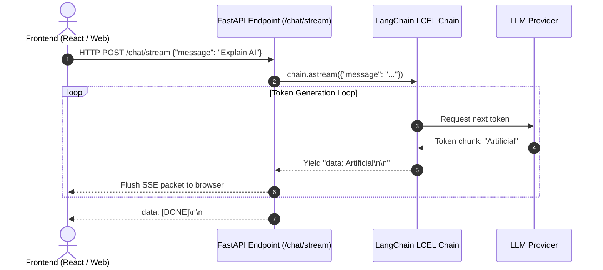

# Production Deployment of LangChain with FastAPI & Streaming

<div className="video-card" style={{border: '1px solid #30363d', borderRadius: '8px', padding: '16px', marginBottom: '24px', background: 'rgba(56, 139, 253, 0.05)'}}>
  <div style={{display: 'flex', gap: '16px', flexWrap: 'wrap', alignItems: 'center'}}>
    <div><strong>Curators:</strong> Krish Naik</div>
    <div><strong>Module:</strong> Module 2: LangChain Mastery & Local LLMs</div>
    <div><strong>Focus:</strong> Beginner to Production</div>
  </div>
</div>

## 🎯 What You'll Learn
- Understand why Server-Sent Events (SSE) are superior to WebSockets for LLM chat streaming.
- Implement asynchronous token streaming using `chain.astream()` inside a FastAPI `StreamingResponse`.
- Build an interactive web-ready chat streaming API.

---

## 💡 Concept & Architecture

Large Language Models generate text one token at a time. A 300-word response can take 4-8 seconds to finish generating. 

If your backend waits for the complete response before returning JSON:
- The user stares at a blank loading spinner for 6 seconds.
- The user perceives the system as sluggish and unresponsive.

By streaming tokens via **Server-Sent Events (`text/event-stream`)**, the first token appears on the user's screen in under 200 milliseconds (Time to First Token - TTFT), creating an engaging, fluid user experience.

### System Architecture & Data Flow



---

## 💻 Step-by-Step Code Walkthrough

Below is the complete implementation broken down into digestible parts so you can understand every line.

### Part 1: Step 1: Setting up the FastAPI App and Async Generator

```python
import json
from fastapi import FastAPI
from fastapi.responses import StreamingResponse
from pydantic import BaseModel, Field
from langchain_core.prompts import ChatPromptTemplate
from langchain_core.output_parsers import StrOutputParser
from langchain_openai import ChatOpenAI

app = FastAPI(title="Streaming AI Microservice")

# Define the request schema
class PromptRequest(BaseModel):
    message: str = Field(..., min_length=1, description="User chat message")

# Assemble the LCEL runnable
prompt = ChatPromptTemplate.from_messages([
    ("system", "You are a concise production AI assistant."),
    ("human", "{message}")
])
model = ChatOpenAI(model="gpt-4o-mini", temperature=0.2)
chain = prompt | model | StrOutputParser()
```

#### 🔍 In-Depth Explanation:
We configure the FastAPI app and define an LCEL chain. Notice that `chain` will be executed asynchronously using `chain.astream()`.

### Part 2: Step 2: Implementing the Server-Sent Events (SSE) Endpoint

```python
@app.post("/chat/stream")
async def stream_chat(req: PromptRequest):
    """Stream LLM tokens in real time using Server-Sent Events."""
    async def event_generator():
        # Step A: Iterate over tokens asynchronously as they are produced
        async for chunk in chain.astream({"message": req.message}):
            # SSE protocol format requires 'data: <payload>\n\n'
            payload = json.dumps({"token": chunk})
            yield f"data: {payload}\n\n"
        
        # Step B: Emit a completion sentinel
        yield "data: [DONE]\n\n"

    # Return StreamingResponse with text/event-stream media type
    return StreamingResponse(event_generator(), media_type="text/event-stream")
```

#### 🔍 In-Depth Explanation:
The `event_generator()` function is an asynchronous generator. Every token generated by `chain.astream()` is immediately formatted as an SSE event and flushed to the HTTP response stream.

---

## ⚠️ Beginner Tips & Best Practices

:::tip Always Use async def with StreamingResponse
Ensure your generator and endpoint use `async def` and `chain.astream()`. Using blocking `stream()` in a standard `def` will stall the Uvicorn worker thread.
:::

:::warning Handle Client Disconnections
If a user closes their browser tab midway through generation, wrap your generator in a `try...finally` block to cancel the upstream LLM call and avoid wasting tokens.
:::

---

## 📝 Key Takeaways & Summary

- Streaming tokens reduces Time to First Token (TTFT) from seconds to milliseconds.
- Server-Sent Events (SSE) provide an ultra-lightweight HTTP streaming protocol without WebSocket overhead.
- LangChain's `astream()` integrates directly with FastAPI's `StreamingResponse`.

