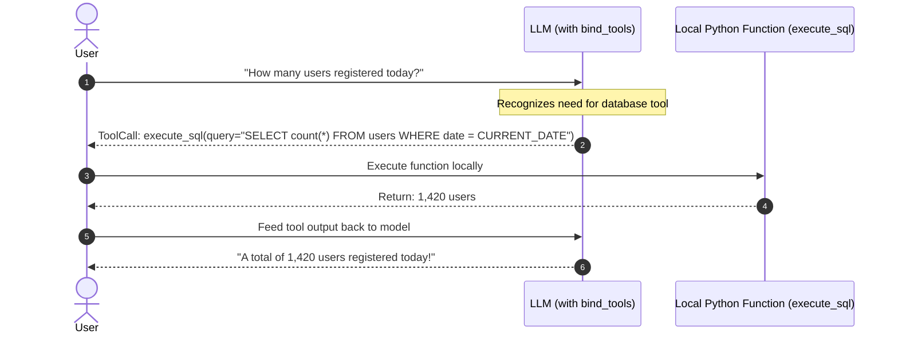

# Tools & Tool Calling in LangChain

<div className="video-card" style={{border: '1px solid #30363d', borderRadius: '8px', padding: '16px', marginBottom: '24px', background: 'rgba(56, 139, 253, 0.05)'}}>
  <div style={{display: 'flex', gap: '16px', flexWrap: 'wrap', alignItems: 'center'}}>
    <div><strong>Curators:</strong> Nitish Singh (CampusX)</div>
    <div><strong>Module:</strong> Module 2: LangChain Mastery & Local LLMs</div>
    <div><strong>Focus:</strong> Beginner to Production</div>
  </div>
</div>

## 🎯 What You'll Learn
- Understand how LLMs use tool calling to interact with databases, calculators, and external APIs.
- Define custom tools using the `@tool` decorator with strict type hints and docstrings.
- Bind tools to models using `model.bind_tools()` and inspect generated tool calls.

---

## 💡 Concept & Architecture

Large Language Models cannot do math accurately, cannot check current stock prices, and cannot query private databases. 

**Tool Calling (Function Calling)** bridges this gap:
1. You provide the model with a list of available Python functions along with their descriptions and argument schemas.
2. When the user asks a question that requires external knowledge (e.g. *'What is 3482 * 91?'* or *'Get weather in Tokyo'*), the model decides **not** to answer directly.
3. Instead, the model outputs a structured request: *'Please execute `multiply(a=3482, b=91)`'*.
4. Your application runs the function and feeds the output back to the model to formulate the final answer.

### System Architecture & Data Flow



---

## 💻 Step-by-Step Code Walkthrough

Below is the complete implementation broken down into digestible parts so you can understand every line.

### Part 1: Step 1: Defining Custom Tools with @tool

```python
from langchain_core.tools import tool

# The docstring and type hints are CRITICAL: the LLM reads them to know when and how to use the tool
@tool
def calculate_compound_interest(principal: float, annual_rate: float, years: int) -> float:
    """
    Calculate the future value of an investment using compound interest.
    
    Args:
        principal: The initial investment amount in dollars.
        annual_rate: Annual interest rate as a decimal (e.g., 0.07 for 7%).
        years: Number of years the money is invested.
    """
    amount = principal * ((1 + annual_rate) ** years)
    return round(amount, 2)

# Inspect the tool's automatically generated JSON schema
print("Tool Name:", calculate_compound_interest.name)
print("Tool Description:", calculate_compound_interest.description)
```

#### 🔍 In-Depth Explanation:
The `@tool` decorator converts the Python function into a structured tool object. It automatically extracts parameter names, types, and descriptions into an OpenAPI-compatible JSON schema.

### Part 2: Step 2: Binding Tools to a Chat Model

```python
from langchain_openai import ChatOpenAI

llm = ChatOpenAI(model="gpt-4o-mini", temperature=0.0)

# Bind the tool to the model
llm_with_tools = llm.bind_tools([calculate_compound_interest])

# Invoke the model with a query that requires the tool
response = llm_with_tools.invoke(
    "If I invest $10,000 at 8% annual return for 10 years, how much will I have?"
)

# Inspect the model's decision
print("Raw Content:", response.content)  # Usually empty because model made a tool call
print("Tool Calls Detected:", response.tool_calls)
```

#### 🔍 In-Depth Explanation:
The model detects that the user's inquiry requires financial math. Instead of guessing, `response.tool_calls` contains the exact tool name and extracted arguments: `{'name': 'calculate_compound_interest', 'args': {'principal': 10000, 'annual_rate': 0.08, 'years': 10}}`.

---

## ⚠️ Beginner Tips & Best Practices

:::tip Write Detailed Docstrings
The LLM decides whether to call a tool based entirely on the function docstring. Be specific about what the tool does, what each argument represents, and edge cases.
:::

:::warning Never Run Destructive Tools Unchecked
Never give an LLM unchecked access to destructive tools (like `delete_database` or `send_payment`) without human-in-the-loop approval confirmation.
:::

---

## 📝 Key Takeaways & Summary

- Tool calling allows LLMs to perform exact computation, access live APIs, and query databases.
- The `@tool` decorator automatically compiles Python docstrings and type hints into model schemas.
- `model.bind_tools()` equips the model with the ability to choose and trigger tools dynamically.

