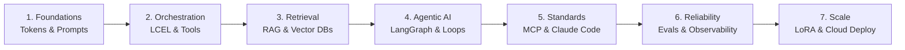

# 📹 GenAI Roadmap for Beginners

<div className="video-card" style={{border: '1px solid #30363d', borderRadius: '8px', padding: '16px', marginBottom: '24px', background: 'rgba(56, 139, 253, 0.05)'}}>
  <div style={{display: 'flex', gap: '16px', flexWrap: 'wrap'}}>
    <div><strong>Instructor:</strong> Nitish Singh (CampusX)</div>
    <div><strong>Duration:</strong> 3015</div>
    <div><strong>Course:</strong> Module 2: LCEL, Local LLMs & Tool Calling</div>
    <div><strong>Watch Link:</strong> <a href="https://www.youtube.com/watch?v=pSVk-5WemQ0" target="_blank" rel="noopener noreferrer">YouTube Lecture ↗</a></div>
  </div>
</div>

## 📌 Executive Summary

The transition from exploratory notebook scripts to enterprise-grade Generative AI engineering requires a structured systems architecture. Modern AI applications demand low-latency token streaming, strict schema validation, distributed vector search, and resilient fallback execution.

This lesson outlines the 2026 production roadmap: establishing the foundational lifecycle across prompt engineering, LCEL pipelines, local LLM deployment, retrieval-augmented generation, and automated evaluation.

---

## 🏗️ System Architecture & Execution Flow



---

## 📖 Core Concepts & Technical Deep Dive

### 1. The Production AI Engineering Lifecycle
Enterprise AI engineering differs fundamentally from traditional software engineering due to the non-deterministic nature of model outputs. Systems must be engineered with defensive boundaries:
- **Input Guardrails:** Validating and sanitizing prompt structure to block jailbreaks and injection attacks.
- **Contract Enforcement:** Wrapping probabilistic generations in strict Pydantic v2 schemas.
- **Failover Chains:** Configuring automated model cascades from primary high-reasoning providers to low-cost or local fallback engines.

### 2. The Core Technical Stack
- **Framework:** LangChain Expression Language (LCEL) for declarative streaming pipelines.
- **Local Runtimes:** Ollama and Groq LPUs for zero-latency local development and high-throughput inference.
- **Vector Storage:** Chroma, FAISS, AstraDB, and ObjectBox for high-dimensional semantic search.

### 3. Latency Metrics That Matter
- **TTFT (Time to First Token):** The critical metric for interactive user interfaces. Minimized via token streaming and prompt caching.
- **TPS (Tokens Per Second):** Inference throughput critical for background batch tasks and agentic multi-turn loops.

---

## 💻 Production Implementation

```python
from langchain_core.prompts import ChatPromptTemplate
from langchain_core.output_parsers import StrOutputParser
from langchain_community.chat_models import ChatOllama

# 1. Parameterized prompt
prompt = ChatPromptTemplate.from_messages([
    ("system", "You are an enterprise AI architect. Provide crisp engineering advice."),
    ("human", "{question}")
])

# 2. Local inference engine
llm = ChatOllama(model="llama3:8b", temperature=0.1)

# 3. Composable LCEL chain
pipeline = prompt | llm | StrOutputParser()

# 4. Stream tokens asynchronously
for token in pipeline.stream({"question": "What are the primary latency bottlenecks in RAG?"}):
    print(token, end="", flush=True)
```

---

## ⚙️ Production Gotchas & Best Practices

:::tip Provider Agnosticism
Always decouple business logic from proprietary APIs. Use `langchain-core` Runnables to allow dynamic model swapping between cloud providers (OpenAI, Anthropic) and local engines (Ollama).
:::

:::warning Freeform Output Vulnerabilities
Never parse raw LLM output strings directly with regex in downstream business logic. Always enforce schema validation with `with_structured_output()` or `PydanticOutputParser`.
:::

---

## 📊 Architectural Reference & Comparison

| Architecture Dimension | Prototype Approach | Enterprise Production Standard |
| :--- | :--- | :--- |
| **Model Hosting** | Single proprietary API | Multi-provider fallback + Local LLMs (Ollama) |
| **Data Contracts** | Unstructured markdown text | Pydantic v2 validated schemas |
| **Streaming** | Blocking `invoke()` calls | Real-time Server-Sent Events (SSE) `stream()` |
| **Testing** | Ad-hoc manual prompts | Automated CI/CD regression tests (DeepEval) |

---

## 📚 Key Takeaways & Enterprise Checklist

- [ ] **Architecture Verification:** Ensure your design addresses latency, decoupled interfaces, and strict data validation contracts.
- [ ] **Deterministic Testing:** Run unit tests and golden dataset evaluations before shipping changes to staging or production.
- [ ] **Security & Observability:** Enforce input/output guardrails, scrub sensitive credentials/PII, and capture distributed traces.
- [ ] **Scalability & Sizing:** Calibrate model parameters, context limits, and compute instance requirements against projected request concurrency.
