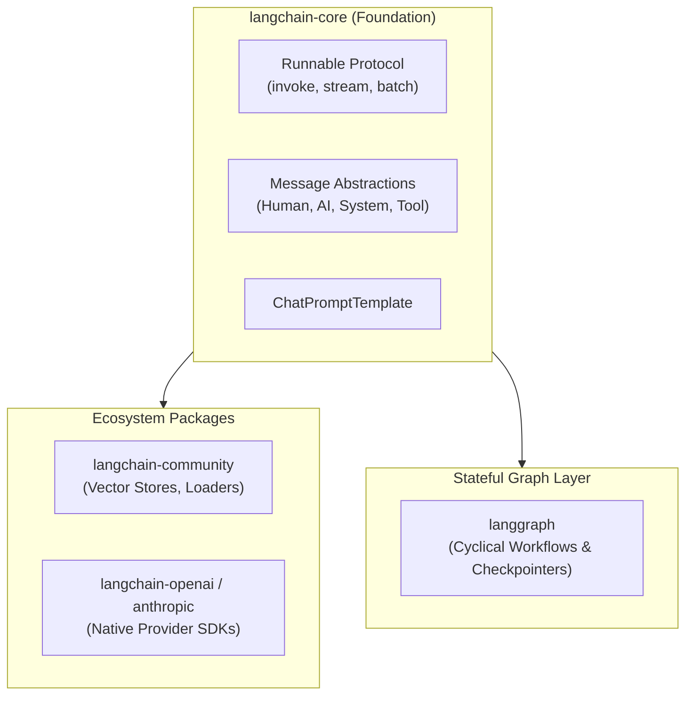

# 📹 LangChain Components

<div className="video-card" style={{border: '1px solid #30363d', borderRadius: '8px', padding: '16px', marginBottom: '24px', background: 'rgba(56, 139, 253, 0.05)'}}>
  <div style={{display: 'flex', gap: '16px', flexWrap: 'wrap'}}>
    <div><strong>Instructor:</strong> Nitish Singh (CampusX)</div>
    <div><strong>Duration:</strong> 3204</div>
    <div><strong>Course:</strong> Module 2: LCEL, Local LLMs & Tool Calling</div>
    <div><strong>Watch Link:</strong> <a href="https://www.youtube.com/watch?v=-xSJA8-o6Eg" target="_blank" rel="noopener noreferrer">YouTube Lecture ↗</a></div>
  </div>
</div>

## 📌 Executive Summary

LangChain provides the industry-standard orchestration layer for building composable Large Language Model applications. By decomposing workflows into Runnables, LangChain enables declarative pipeline assembly, automatic parallelization, and seamless tracing.

This lecture covers the modular architecture of LangChain v0.2/v0.3: `langchain-core`, `langchain-community`, partner provider packages, and the migration from legacy monolithic chains to LCEL.

---

## 🏗️ System Architecture & Execution Flow



---

## 📖 Core Concepts & Technical Deep Dive

### 1. The Decoupled Architecture
Modern LangChain separates concerns to minimize Docker image sizes and prevent dependency conflicts:
- `langchain-core`: Base abstractions, messages, and the Runnable protocol with minimal dependencies.
- `langchain-community`: Third-party tools, document loaders, and vector database connectors.
- Dedicated Partner Packages (`langchain-openai`, `langchain-chroma`, etc.): Direct wrappers around vendor SDKs.

### 2. The Universal Runnable Contract
Every component implements uniform synchronous and asynchronous interfaces: `invoke()`, `ainvoke()`, `stream()`, `astream()`, `batch()`, and `abatch()`.

### 3. Declarative Composition
The pipe (`|`) operator compiles components into an optimized execution graph with built-in telemetry, asynchronous scheduling, and type propagation.

---

## 💻 Production Implementation

```python
from langchain_core.prompts import ChatPromptTemplate
from langchain_core.output_parsers import StrOutputParser
from langchain_openai import ChatOpenAI

# Declarative assembly with Unix-pipe operator
prompt = ChatPromptTemplate.from_template("Generate a production Dockerfile for a {runtime} microservice.")
model = ChatOpenAI(model="gpt-4o-mini", temperature=0.0)
parser = StrOutputParser()

pipeline = prompt | model | parser
result = pipeline.invoke({"runtime": "FastAPI with Python 3.12"})
print(result)
```

---

## ⚙️ Production Gotchas & Best Practices

:::tip Slim Dependency Management
Only install the specific partner packages you require (`langchain-openai`, `langchain-community`) rather than heavy meta-packages, drastically cutting down CI/CD build times.
:::

:::warning Deprecated Imports
Avoid importing from `langchain.chains` or `langchain.llms`. Use modern `langchain_core.runnables` and dedicated provider libraries.
:::

---

## 📊 Architectural Reference & Comparison

| Package | Namespace | Purpose |
| :--- | :--- | :--- |
| `langchain-core` | `langchain_core.*` | Core abstractions, messages, prompts, runnables |
| `langchain-community`| `langchain_community.*` | 3rd party tools, vector DBs, document loaders |
| `langchain-openai` | `langchain_openai.*` | Native OpenAI Chat, Embeddings, DALL-E |
| `langgraph` | `langgraph.graph.*` | Stateful cyclical multi-agent workflows |

---

## 📚 Key Takeaways & Enterprise Checklist

- [ ] **Architecture Verification:** Ensure your design addresses latency, decoupled interfaces, and strict data validation contracts.
- [ ] **Deterministic Testing:** Run unit tests and golden dataset evaluations before shipping changes to staging or production.
- [ ] **Security & Observability:** Enforce input/output guardrails, scrub sensitive credentials/PII, and capture distributed traces.
- [ ] **Scalability & Sizing:** Calibrate model parameters, context limits, and compute instance requirements against projected request concurrency.
