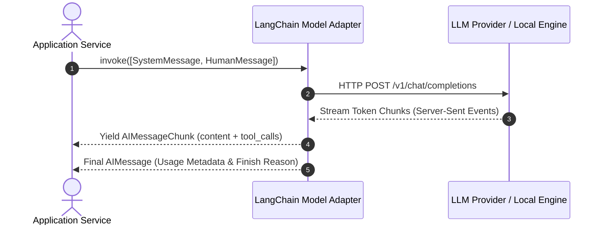

# 📹 LangChain Models ｜ Indepth Tutorial with Code Demo

<div className="video-card" style={{border: '1px solid #30363d', borderRadius: '8px', padding: '16px', marginBottom: '24px', background: 'rgba(56, 139, 253, 0.05)'}}>
  <div style={{display: 'flex', gap: '16px', flexWrap: 'wrap'}}>
    <div><strong>Instructor:</strong> Nitish Singh (CampusX)</div>
    <div><strong>Duration:</strong> 6123</div>
    <div><strong>Course:</strong> Module 2: LCEL, Local LLMs & Tool Calling</div>
    <div><strong>Watch Link:</strong> <a href="https://www.youtube.com/watch?v=HdcLE8JuMrA" target="_blank" rel="noopener noreferrer">YouTube Lecture ↗</a></div>
  </div>
</div>

## 📌 Executive Summary

Modern AI systems depend on standardized model wrappers that bridge disparate vendor APIs. Understanding the distinction between raw Completion LLMs (string-in, string-out) and Chat Models (messages-in, message-out) is vital for robust application design.

This guide details provider configuration, standardized message types (`HumanMessage`, `AIMessage`, `SystemMessage`), temperature calibration, and asynchronous streaming.

---

## 🏗️ System Architecture & Execution Flow



---

## 📖 Core Concepts & Technical Deep Dive

### 1. Chat Models vs Legacy Completion Models
- **Completion Models (`BaseLLM`):** Legacy raw text-in, text-out interfaces. Susceptible to formatting degradation.
- **Chat Models (`BaseChatModel`):** Message sequence interface supporting distinct system, human, AI, and tool roles with native function calling.

### 2. Message Semantics
- `SystemMessage`: Establishes behavioural guardrails and formatting constraints.
- `HumanMessage`: Represents user-submitted requests or prompts.
- `AIMessage`: Contains assistant response tokens and structured `tool_calls` payloads.
- `ToolMessage`: Returns tool output back to the model context matched with `tool_call_id`.

### 3. Operational Resilience
Setting `timeout`, `max_retries`, and exponential backoff parameters prevents thread exhaustion during provider network hiccups.

---

## 💻 Production Implementation

```python
from langchain_openai import ChatOpenAI
from langchain_core.messages import SystemMessage, HumanMessage

chat_model = ChatOpenAI(
    model="gpt-4o-mini",
    temperature=0.0,
    timeout=10.0,
    max_retries=3
)

messages = [
    SystemMessage(content="You are a data validation agent. Reply strictly in key-value pairs."),
    HumanMessage(content="Extract status: Server online at port 8080 with 2ms latency.")
]

response = chat_model.invoke(messages)
print(f"Content:\n{response.content}")
print(f"Token Usage:\n{response.response_metadata.get('token_usage')}")
```

---

## ⚙️ Production Gotchas & Best Practices

:::tip Real-Time Streaming
Use `stream()` or `astream()` for all conversational interfaces to drop perceived latency from several seconds to sub-200ms.
:::

:::warning Rate Limit Handling
Provider HTTP 429 errors crash unguarded services. Configure `max_retries` or wrap calls in `RunnableRetry`.
:::

---

## 📊 Architectural Reference & Comparison

| Provider Package | Target Model | Local / Remote | Streaming Support |
| :--- | :--- | :--- | :--- |
| `langchain-openai` | GPT-4o, GPT-4o-mini | Cloud API | Native SSE |
| `langchain-anthropic` | Claude 3.5 Sonnet / Haiku | Cloud API | Native SSE |
| `langchain-community` | Ollama (Llama 3, Mistral) | On-Prem / Local | Native Async |
| `langchain-groq` | Llama 3 on Groq LPU | Cloud Fast Engine | Sub-10ms TTFT |

---

## 📚 Key Takeaways & Enterprise Checklist

- [ ] **Architecture Verification:** Ensure your design addresses latency, decoupled interfaces, and strict data validation contracts.
- [ ] **Deterministic Testing:** Run unit tests and golden dataset evaluations before shipping changes to staging or production.
- [ ] **Security & Observability:** Enforce input/output guardrails, scrub sensitive credentials/PII, and capture distributed traces.
- [ ] **Scalability & Sizing:** Calibrate model parameters, context limits, and compute instance requirements against projected request concurrency.
