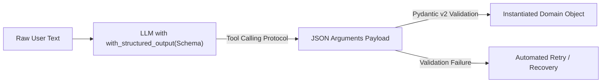

# 📹 Structured Output in LangChain

<div className="video-card" style={{border: '1px solid #30363d', borderRadius: '8px', padding: '16px', marginBottom: '24px', background: 'rgba(56, 139, 253, 0.05)'}}>
  <div style={{display: 'flex', gap: '16px', flexWrap: 'wrap'}}>
    <div><strong>Instructor:</strong> Nitish Singh (CampusX)</div>
    <div><strong>Duration:</strong> 4093</div>
    <div><strong>Course:</strong> Module 2: LCEL, Local LLMs & Tool Calling</div>
    <div><strong>Watch Link:</strong> <a href="https://www.youtube.com/watch?v=y5EmRr1O1h4" target="_blank" rel="noopener noreferrer">YouTube Lecture ↗</a></div>
  </div>
</div>

## 📌 Executive Summary

Extracting reliable, typed domain objects from probabilistic LLM completions is essential for enterprise integrations. LangChain's `.with_structured_output()` binds Pydantic v2 schemas directly to model tool-calling APIs to guarantee valid JSON responses.

This guide details schema definition with Pydantic's `Field(...)`, automatic type coercion, validation error handling, and robust data extraction.

---

## 🏗️ System Architecture & Execution Flow



---

## 📖 Core Concepts & Technical Deep Dive

### 1. Eliminating Regex Brittle Parsing
Legacy prompts asked models to "return only JSON", but unescaped characters or conversational preamble broke downstream services. `.with_structured_output()` uses native tool-calling:
- Compiles the Pydantic schema into an OpenAI/Anthropic tool declaration.
- Forces the model to generate arguments strictly conforming to the schema.
- Automatically instantiates and validates the Pydantic object.

### 2. Micro-Prompting with Field Descriptions
Field docstrings (`Field(description="...")`) guide the model during generation, instructing it how to normalize dates, enum values, and units.

### 3. Handling Ambiguity with Optional Types
Using `Optional[T] = None` allows models to omit missing attributes safely without triggering validation failures.

---

## 💻 Production Implementation

```python
from pydantic import BaseModel, Field
from typing import List, Optional
from langchain_openai import ChatOpenAI

class ServerAlert(BaseModel):
    service: str = Field(description="Affected microservice name")
    severity: str = Field(description="Alert level: low, medium, high, critical")
    error_codes: List[int] = Field(description="HTTP or database error codes detected")
    recommended_action: Optional[str] = Field(None, description="Suggested mitigation step")

llm = ChatOpenAI(model="gpt-4o-mini", temperature=0.0)
structured_llm = llm.with_structured_output(ServerAlert)

alert = structured_llm.invoke(
    "Critical: payment-gateway returned 502 and 504 errors due to timeout with Stripe webhook."
)

print(f"Service: {alert.service} | Severity: {alert.severity}")
print(f"Errors: {alert.error_codes} | Action: {alert.recommended_action}")
```

---

## ⚙️ Production Gotchas & Best Practices

:::tip Explanatory Field Docstrings
Always include clear `Field(description="...")` annotations. The model inspects these docstrings to resolve semantic edge cases during extraction.
:::

:::warning Deep Polymorphism
Avoid deeply nested union types or complex class hierarchies in extraction schemas; flat models yield significantly higher extraction accuracy.
:::

---

## 📊 Architectural Reference & Comparison

| Feature | Legacy JSON Mode | with_structured_output() |
| :--- | :--- | :--- |
| **Output Type** | Raw string requiring `json.loads` | Instantiated Pydantic v2 model |
| **Schema Guarantee** | Probabilistic adherence | Enforced via Tool Calling API |
| **Type Coercion** | Manual casting required | Automatic type coercion & validation |
| **Field Docstrings** | Ignored | Passed as parameter descriptions |

---

## 📚 Key Takeaways & Enterprise Checklist

- [ ] **Architecture Verification:** Ensure your design addresses latency, decoupled interfaces, and strict data validation contracts.
- [ ] **Deterministic Testing:** Run unit tests and golden dataset evaluations before shipping changes to staging or production.
- [ ] **Security & Observability:** Enforce input/output guardrails, scrub sensitive credentials/PII, and capture distributed traces.
- [ ] **Scalability & Sizing:** Calibrate model parameters, context limits, and compute instance requirements against projected request concurrency.
