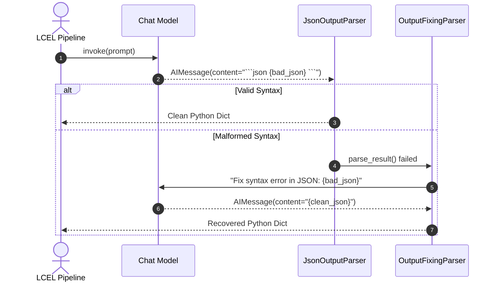

# 📹 Output Parsers in LangChain

<div className="video-card" style={{border: '1px solid #30363d', borderRadius: '8px', padding: '16px', marginBottom: '24px', background: 'rgba(56, 139, 253, 0.05)'}}>
  <div style={{display: 'flex', gap: '16px', flexWrap: 'wrap'}}>
    <div><strong>Instructor:</strong> Nitish Singh (CampusX)</div>
    <div><strong>Duration:</strong> 3193</div>
    <div><strong>Course:</strong> Module 2: LCEL, Local LLMs & Tool Calling</div>
    <div><strong>Watch Link:</strong> <a href="https://www.youtube.com/watch?v=Op6PbJZ5b2Q" target="_blank" rel="noopener noreferrer">YouTube Lecture ↗</a></div>
  </div>
</div>

## 📌 Executive Summary

Output parsers transform raw `AIMessage` objects produced by language models into structured downstream types. LangChain provides specialized parsers ranging from `StrOutputParser` to `JsonOutputParser` and `OutputFixingParser`.

This lesson covers parser execution in LCEL chains, streaming partial objects, and automated syntax error recovery.

---

## 🏗️ System Architecture & Execution Flow



---

## 📖 Core Concepts & Technical Deep Dive

### 1. The Output Parser Interface
Output parsers implement the `BaseOutputParser` interface:
- `parse(text: str)`: Transforms string output into target types.
- `parse_result(result: List[Generation])`: Extracts structured data directly from model generations.
- Streaming parsers implement `transform()` or `atransform()` to yield tokens incrementally.

### 2. Core Parser Variants
- **`StrOutputParser`:** Strips message wrappers and returns clean string content.
- **`JsonOutputParser`:** Extracts JSON objects while stripping markdown formatting fences.
- **`OutputFixingParser`:** Wraps an existing parser and invokes an LLM to repair malformed syntax automatically.

### 3. Format Instruction Injection
`PydanticOutputParser` provides `get_format_instructions()`, inserting explicit JSON structure constraints into the prompt.

---

## 💻 Production Implementation

```python
from langchain_core.output_parsers import JsonOutputParser, StrOutputParser
from langchain_core.prompts import PromptTemplate
from langchain_community.chat_models import ChatOllama
from pydantic import BaseModel, Field

class ServiceHealth(BaseModel):
    service: str = Field(description="Name of microservice")
    p99_ms: float = Field(description="P99 latency in milliseconds")
    status: str = Field(description="Status: HEALTHY or DEGRADED")

parser = JsonOutputParser(pydantic_object=ServiceHealth)

prompt = PromptTemplate(
    template="Analyze telemetry and extract health metrics.\n{format_instructions}\nLog: {log}\n",
    input_variables=["log"],
    partial_variables={"format_instructions": parser.get_format_instructions()}
)

llm = ChatOllama(model="llama3:8b", temperature=0.1)
chain = prompt | llm | parser

result = chain.invoke({"log": "order-service reported p99 latency of 185.2ms, operational within bounds."})
print(f"Parsed Result: {result}")
```

---

## ⚙️ Production Gotchas & Best Practices

:::tip UI Token Streaming
When generating user-facing conversational responses, end the chain with `StrOutputParser()` to enable seamless token streaming.
:::

:::warning Format Instruction Cost
`parser.get_format_instructions()` adds several hundred tokens to every prompt. For tool-calling capable models, prefer `.with_structured_output()`.
:::

---

## 📊 Architectural Reference & Comparison

| Parser | Input Format | Output Format | Streaming Friendly |
| :--- | :--- | :--- | :--- |
| `StrOutputParser` | `AIMessage` | `str` | Yes (token by token) |
| `JsonOutputParser` | `AIMessage` | `dict` | Partial dict chunks |
| `PydanticOutputParser` | `AIMessage` | Pydantic Instance | No (requires full text) |
| `OutputFixingParser` | Malformed text | Target Object | No (adds recovery LLM call) |

---

## 📚 Key Takeaways & Enterprise Checklist

- [ ] **Architecture Verification:** Ensure your design addresses latency, decoupled interfaces, and strict data validation contracts.
- [ ] **Deterministic Testing:** Run unit tests and golden dataset evaluations before shipping changes to staging or production.
- [ ] **Security & Observability:** Enforce input/output guardrails, scrub sensitive credentials/PII, and capture distributed traces.
- [ ] **Scalability & Sizing:** Calibrate model parameters, context limits, and compute instance requirements against projected request concurrency.
