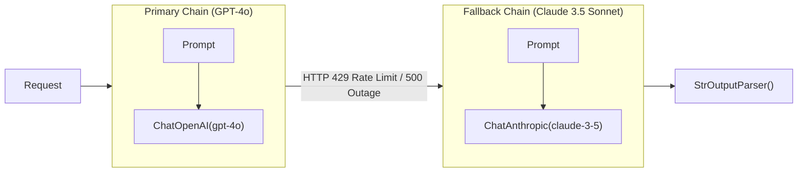

# 📹 Chains in LangChain

<div className="video-card" style={{border: '1px solid #30363d', borderRadius: '8px', padding: '16px', marginBottom: '24px', background: 'rgba(56, 139, 253, 0.05)'}}>
  <div style={{display: 'flex', gap: '16px', flexWrap: 'wrap'}}>
    <div><strong>Instructor:</strong> Nitish Singh (CampusX)</div>
    <div><strong>Duration:</strong> 3241</div>
    <div><strong>Course:</strong> Module 2: LCEL, Local LLMs & Tool Calling</div>
    <div><strong>Watch Link:</strong> <a href="https://www.youtube.com/watch?v=5hjrPILA3-8" target="_blank" rel="noopener noreferrer">YouTube Lecture ↗</a></div>
  </div>
</div>

## 📌 Executive Summary

Chains represent the core compositional pattern of LangChain. Moving away from legacy monolithic constructs (`LLMChain`, `SequentialChain`), modern architectures leverage declarative LCEL composition for streaming, batching, and automated fallback recovery.

This guide explores LCEL chain composition, fallback routing (`with_fallbacks`), runtime configuration parameterization, and automated retry policies.

---

## 🏗️ System Architecture & Execution Flow



---

## 📖 Core Concepts & Technical Deep Dive

### 1. Legacy Chains vs Modern LCEL
Legacy classes (`LLMChain`, `SimpleSequentialChain`) were rigid black boxes that obfuscated intermediate state. Modern LCEL chains:
- Provide transparent step-by-step telemetry in LangSmith.
- Support native token streaming and parallel execution out of the box.
- Standardize error handling and dynamic parameter binding.

### 2. Automated Provider Failover with with_fallbacks()
Production systems must survive vendor outages. By wrapping a primary LCEL runnable with `.with_fallbacks([secondary_chain])`, workflows recover seamlessly from rate limits (429) or internal server errors (500).

### 3. Configurable Alternatives at Runtime
The `configurable_alternatives()` method allows switching between models, prompt variants, or vector stores dynamically on a per-request basis using the execution config dictionary.

---

## 💻 Production Implementation

```python
from langchain_core.prompts import ChatPromptTemplate
from langchain_core.output_parsers import StrOutputParser
from langchain_openai import ChatOpenAI
from langchain_community.chat_models import ChatOllama

prompt = ChatPromptTemplate.from_template("Explain {concept} in 2 production bullet points.")

# Primary cloud model with strict timeout
primary_model = ChatOpenAI(model="gpt-4o", timeout=3.0)

# Resilient local fallback model
fallback_model = ChatOllama(model="llama3:8b")

# Assemble primary and fallback chains
primary_chain = prompt | primary_model | StrOutputParser()
fallback_chain = prompt | fallback_model | StrOutputParser()

# Bind fallback with automatic failover
resilient_chain = primary_chain.with_fallbacks([fallback_chain])

response = resilient_chain.invoke({"concept": "Database Sharding"})
print(response)
```

---

## ⚙️ Production Gotchas & Best Practices

:::tip Granular Timeout Settings
Always configure aggressive client-side timeouts (e.g. 3-5 seconds) on primary models when using fallbacks. This prevents requests from hanging when an external API degrades.
:::

:::warning Avoid Deep Legacy Nesting
Do not mix legacy `LLMChain` objects inside modern LCEL pipe sequences. Standardize completely on `Runnable` primitives.
:::

---

## 📊 Architectural Reference & Comparison

| Feature | Legacy Chains | Modern LCEL Chains |
| :--- | :--- | :--- |
| **Composition** | Nested class instantiation | Pipe operator `|` |
| **Streaming** | Ad-hoc callbacks | Native `.stream()` & `.astream()` |
| **Parallelism** | Manual threading | Native `RunnableParallel` |
| **Failover** | Custom try/except logic | Declarative `.with_fallbacks()` |

---

## 📚 Key Takeaways & Enterprise Checklist

- [ ] **Architecture Verification:** Ensure your design addresses latency, decoupled interfaces, and strict data validation contracts.
- [ ] **Deterministic Testing:** Run unit tests and golden dataset evaluations before shipping changes to staging or production.
- [ ] **Security & Observability:** Enforce input/output guardrails, scrub sensitive credentials/PII, and capture distributed traces.
- [ ] **Scalability & Sizing:** Calibrate model parameters, context limits, and compute instance requirements against projected request concurrency.
