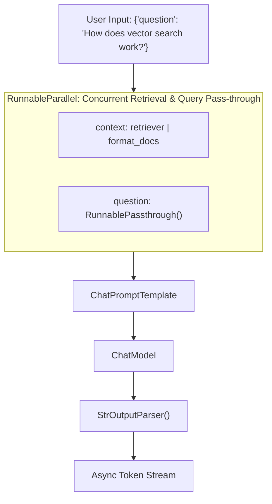

# 📹 Langchain Runnables - Part 2

<div className="video-card" style={{border: '1px solid #30363d', borderRadius: '8px', padding: '16px', marginBottom: '24px', background: 'rgba(56, 139, 253, 0.05)'}}>
  <div style={{display: 'flex', gap: '16px', flexWrap: 'wrap'}}>
    <div><strong>Instructor:</strong> Nitish Singh (CampusX)</div>
    <div><strong>Duration:</strong> 3266</div>
    <div><strong>Course:</strong> Module 2: LCEL, Local LLMs & Tool Calling</div>
    <div><strong>Watch Link:</strong> <a href="https://www.youtube.com/watch?v=47nc0n-e4_w" target="_blank" rel="noopener noreferrer">YouTube Lecture ↗</a></div>
  </div>
</div>

## 📌 Executive Summary

The LangChain Expression Language (LCEL) is grounded in the unified `Runnable` protocol. Every component—prompts, models, retrievers, output parsers, and custom functions—implements this common interface, enabling seamless composition with the Unix pipe (`|`) operator.

This guide explores the standard execution methods (`invoke`, `batch`, `stream`, and their async equivalents), parameter binding, and composition primitives (`RunnableParallel`, `RunnablePassthrough`, `RunnableLambda`, `RunnableBranch`).

---

## 🏗️ System Architecture & Execution Flow



---

## 📖 Core Concepts & Technical Deep Dive

### 1. The Core Runnable Contract
Every Runnable guarantees 6 fundamental execution methods:
- **Synchronous:** `invoke()`, `batch()`, `stream()`
- **Asynchronous:** `ainvoke()`, `abatch()`, `astream()`

### 2. Declarative Composition Primitives
- **`RunnablePassthrough`:** Passes input data unchanged or assigns new computed keys via `RunnablePassthrough.assign()`.
- **`RunnableParallel`:** Executes multiple runnables concurrently on the same input dictionary, drastically slashing I/O latency.
- **`RunnableLambda`:** Wraps arbitrary Python functions into first-class runnables with automatic error handling and tracing.
- **`RunnableBranch`:** Routes inputs dynamically based on conditional predicate functions.

### 3. Runtime Configuration & Fallbacks
Runnables accept an optional `config` dictionary containing `tags`, `metadata`, `callbacks`, and `configurable` overrides, allowing dynamic swapping of models and temperatures without rebuilding the chain.

---

## 💻 Production Implementation

```python
from langchain_core.runnables import (
    RunnableParallel,
    RunnablePassthrough,
    RunnableLambda
)
from langchain_core.prompts import ChatPromptTemplate
from langchain_core.output_parsers import StrOutputParser
from langchain_community.chat_models import ChatOllama

def calculate_word_count(text: str) -> int:
    return len(text.split())

count_runnable = RunnableLambda(calculate_word_count)

prompt = ChatPromptTemplate.from_template("Summarize the following topic in 2 sentences: {topic}")
llm = ChatOllama(model="llama3:8b", temperature=0.1)

summary_chain = prompt | llm | StrOutputParser()

full_pipeline = RunnableParallel(
    summary=summary_chain,
    original_topic=RunnablePassthrough(),
    word_count=RunnablePassthrough() | count_runnable
)

output = full_pipeline.invoke({"topic": "Distributed Consensus in Raft"})
print(f"Summary: {output['summary']}")
print(f"Word Count of Input: {output['word_count']}")
```

---

## ⚙️ Production Gotchas & Best Practices

:::tip Concurrency with RunnableParallel
Use `RunnableParallel` whenever multiple independent lookups occur (e.g. searching two vector stores and fetching a user profile from Redis). This runs them concurrently on thread pools.
:::

:::warning Non-Blocking Async Execution
When using `RunnableLambda` inside asynchronous pipelines (`ainvoke`), ensure your custom function is an `async def` if it performs network or disk I/O, preventing event loop blocking.
:::

---

## 📊 Architectural Reference & Comparison

| Primitive | Role | Typical Use Case |
| :--- | :--- | :--- |
| `RunnablePassthrough` | Transmits input unmodified | Forwarding query alongside retrieved documents |
| `RunnableParallel` | Concurrent execution map | Multi-retriever retrieval or multi-attribute generation |
| `RunnableLambda` | Custom function adapter | Data transformation, regex sanitization, logging |
| `RunnableBranch` | Conditional routing | Routing technical vs billing queries |

---

## 📚 Key Takeaways & Enterprise Checklist

- [ ] **Architecture Verification:** Ensure your design addresses latency, decoupled interfaces, and strict data validation contracts.
- [ ] **Deterministic Testing:** Run unit tests and golden dataset evaluations before shipping changes to staging or production.
- [ ] **Security & Observability:** Enforce input/output guardrails, scrub sensitive credentials/PII, and capture distributed traces.
- [ ] **Scalability & Sizing:** Calibrate model parameters, context limits, and compute instance requirements against projected request concurrency.
